```mermaid
graph LR
    MarkItDown_Core_Engine["MarkItDown Core Engine"]
    Document_Converters["Document Converters"]
    Stream_and_URI_Management["Stream and URI Management"]
    Conversion_Utilities["Conversion Utilities"]
    Error_Handling["Error Handling"]
    Application_Entry_Point["Application Entry Point"]
    Plugin_Management["Plugin Management"]
    Markitdown_Command_Processor_MCP_["Markitdown Command Processor (MCP)"]
    MarkItDown_Core_Engine -- "orchestrates conversion via" --> Document_Converters
    MarkItDown_Core_Engine -- "manages input with" --> Stream_and_URI_Management
    MarkItDown_Core_Engine -- "reports errors to" --> Error_Handling
    MarkItDown_Core_Engine -- "enables extensions through" --> Plugin_Management
    Document_Converters -- "processes data from" --> Stream_and_URI_Management
    Document_Converters -- "leverages for specific tasks" --> Conversion_Utilities
    Document_Converters -- "signals conversion issues to" --> Error_Handling
    Stream_and_URI_Management -- "provides input data to" --> MarkItDown_Core_Engine
    Stream_and_URI_Management -- "provides input data to" --> Document_Converters
    Conversion_Utilities -- "provides helper functions to" --> Document_Converters
    Error_Handling -- "handles errors from" --> MarkItDown_Core_Engine
    Error_Handling -- "handles errors from" --> Document_Converters
    Application_Entry_Point -- "initiates conversion" --> MarkItDown_Core_Engine
    Application_Entry_Point -- "reports application errors to" --> Error_Handling
    Plugin_Management -- "registers converters with" --> MarkItDown_Core_Engine
    Markitdown_Command_Processor_MCP_ -- "drives document conversion via" --> MarkItDown_Core_Engine
    click MarkItDown_Core_Engine href "https://github.com/CodeBoarding/GeneratedOnBoardings/blob/main/markitdown/MarkItDown Core Engine.md" "Details"
    click Document_Converters href "https://github.com/CodeBoarding/GeneratedOnBoardings/blob/main/markitdown/Document Converters.md" "Details"
    click Stream_and_URI_Management href "https://github.com/CodeBoarding/GeneratedOnBoardings/blob/main/markitdown/Stream and URI Management.md" "Details"
    click Conversion_Utilities href "https://github.com/CodeBoarding/GeneratedOnBoardings/blob/main/markitdown/Conversion Utilities.md" "Details"
    click Error_Handling href "https://github.com/CodeBoarding/GeneratedOnBoardings/blob/main/markitdown/Error Handling.md" "Details"
    click Application_Entry_Point href "https://github.com/CodeBoarding/GeneratedOnBoardings/blob/main/markitdown/Application Entry Point.md" "Details"
    click Plugin_Management href "https://github.com/CodeBoarding/GeneratedOnBoardings/blob/main/markitdown/Plugin Management.md" "Details"
    click Markitdown_Command_Processor_MCP_ href "https://github.com/CodeBoarding/GeneratedOnBoardings/blob/main/markitdown/Markitdown Command Processor (MCP).md" "Details"
```

## Component Details

The MarkItDown system is a comprehensive document conversion tool designed to transform various document formats into a standardized Markdown representation. Its main flow involves a central Core Engine that orchestrates the conversion process by identifying the input stream's characteristics, selecting the appropriate Document Converter, and leveraging a suite of Conversion Utilities for specific tasks. The system is extensible through a Plugin Management component, allowing for custom converters. An Application Entry Point provides the command-line interface, and a robust Error Handling mechanism ensures graceful failure reporting. The Markitdown Command Processor (MCP) acts as an external application leveraging the core functionalities.

### MarkItDown Core Engine
The central component responsible for initializing the conversion system, registering built-in and plugin converters, and orchestrating the document conversion process from various sources (local files, streams, URIs, responses). It dispatches conversion tasks to appropriate converters based on priority and stream information.

**Related Classes/Methods**:

- <a href="https://github.com/microsoft/markitdown/blob/master/packages/markitdown/src/markitdown/_markitdown.py#L93-L771" target="_blank" rel="noopener noreferrer">`markitdown.packages.markitdown.src.markitdown._markitdown.MarkItDown` (93:771)</a>
- <a href="https://github.com/microsoft/markitdown/blob/master/packages/markitdown/src/markitdown/_markitdown.py#L97-L130" target="_blank" rel="noopener noreferrer">`markitdown.packages.markitdown.src.markitdown._markitdown.MarkItDown:__init__` (97:130)</a>
- <a href="https://github.com/microsoft/markitdown/blob/master/packages/markitdown/src/markitdown/_markitdown.py#L132-L221" target="_blank" rel="noopener noreferrer">`markitdown.packages.markitdown.src.markitdown._markitdown.MarkItDown:enable_builtins` (132:221)</a>
- <a href="https://github.com/microsoft/markitdown/blob/master/packages/markitdown/src/markitdown/_markitdown.py#L223-L241" target="_blank" rel="noopener noreferrer">`markitdown.packages.markitdown.src.markitdown._markitdown.MarkItDown:enable_plugins` (223:241)</a>
- <a href="https://github.com/microsoft/markitdown/blob/master/packages/markitdown/src/markitdown/_markitdown.py#L243-L291" target="_blank" rel="noopener noreferrer">`markitdown.packages.markitdown.src.markitdown._markitdown.MarkItDown:convert` (243:291)</a>
- <a href="https://github.com/microsoft/markitdown/blob/master/packages/markitdown/src/markitdown/_markitdown.py#L293-L328" target="_blank" rel="noopener noreferrer">`markitdown.packages.markitdown.src.markitdown._markitdown.MarkItDown:convert_local` (293:328)</a>
- <a href="https://github.com/microsoft/markitdown/blob/master/packages/markitdown/src/markitdown/_markitdown.py#L330-L375" target="_blank" rel="noopener noreferrer">`markitdown.packages.markitdown.src.markitdown._markitdown.MarkItDown:convert_stream` (330:375)</a>
- <a href="https://github.com/microsoft/markitdown/blob/master/packages/markitdown/src/markitdown/_markitdown.py#L396-L455" target="_blank" rel="noopener noreferrer">`markitdown.packages.markitdown.src.markitdown._markitdown.MarkItDown:convert_uri` (396:455)</a>
- <a href="https://github.com/microsoft/markitdown/blob/master/packages/markitdown/src/markitdown/_markitdown.py#L457-L527" target="_blank" rel="noopener noreferrer">`markitdown.packages.markitdown.src.markitdown._markitdown.MarkItDown:convert_response` (457:527)</a>
- <a href="https://github.com/microsoft/markitdown/blob/master/packages/markitdown/src/markitdown/_markitdown.py#L529-L619" target="_blank" rel="noopener noreferrer">`markitdown.packages.markitdown.src.markitdown._markitdown.MarkItDown:_convert` (529:619)</a>
- <a href="https://github.com/microsoft/markitdown/blob/master/packages/markitdown/src/markitdown/_markitdown.py#L629-L659" target="_blank" rel="noopener noreferrer">`markitdown.packages.markitdown.src.markitdown._markitdown.MarkItDown:register_converter` (629:659)</a>
- <a href="https://github.com/microsoft/markitdown/blob/master/packages/markitdown/src/markitdown/_markitdown.py#L661-L760" target="_blank" rel="noopener noreferrer">`markitdown.packages.markitdown.src.markitdown._markitdown.MarkItDown:_get_stream_info_guesses` (661:760)</a>
- <a href="https://github.com/microsoft/markitdown/blob/master/packages/markitdown/src/markitdown/_markitdown.py#L762-L771" target="_blank" rel="noopener noreferrer">`markitdown.packages.markitdown.src.markitdown._markitdown.MarkItDown._normalize_charset` (762:771)</a>
- <a href="https://github.com/microsoft/markitdown/blob/master/packages/markitdown/src/markitdown/_markitdown.py#L86-L90" target="_blank" rel="noopener noreferrer">`markitdown.packages.markitdown.src.markitdown._markitdown.ConverterRegistration` (86:90)</a>

### Document Converters
A collection of specialized modules, each designed to convert a specific document format (e.g., HTML, PDF, DOCX, XLSX, images, audio, plain text, ZIP archives) into a standardized Markdown format. These adapters implement the `DocumentConverter` interface.

**Related Classes/Methods**:

- <a href="https://github.com/microsoft/markitdown/blob/master/packages/markitdown/src/markitdown/converters/_plain_text_converter.py#L33-L71" target="_blank" rel="noopener noreferrer">`markitdown.packages.markitdown.src.markitdown.converters._plain_text_converter.PlainTextConverter` (33:71)</a>
- <a href="https://github.com/microsoft/markitdown/blob/master/packages/markitdown/src/markitdown/converters/_zip_converter.py#L22-L116" target="_blank" rel="noopener noreferrer">`markitdown.packages.markitdown.src.markitdown.converters._zip_converter.ZipConverter` (22:116)</a>
- <a href="https://github.com/microsoft/markitdown/blob/master/packages/markitdown/src/markitdown/converters/_html_converter.py#L20-L90" target="_blank" rel="noopener noreferrer">`markitdown.packages.markitdown.src.markitdown.converters._html_converter.HtmlConverter` (20:90)</a>
- <a href="https://github.com/microsoft/markitdown/blob/master/packages/markitdown/src/markitdown/converters/_rss_converter.py#L29-L192" target="_blank" rel="noopener noreferrer">`markitdown.packages.markitdown.src.markitdown.converters._rss_converter.RssConverter` (29:192)</a>
- <a href="https://github.com/microsoft/markitdown/blob/master/packages/markitdown/src/markitdown/converters/_wikipedia_converter.py#L20-L87" target="_blank" rel="noopener noreferrer">`markitdown.packages.markitdown.src.markitdown.converters._wikipedia_converter.WikipediaConverter` (20:87)</a>
- <a href="https://github.com/microsoft/markitdown/blob/master/packages/markitdown/src/markitdown/converters/_youtube_converter.py#L37-L238" target="_blank" rel="noopener noreferrer">`markitdown.packages.markitdown.src.markitdown.converters._youtube_converter.YouTubeConverter` (37:238)</a>
- <a href="https://github.com/microsoft/markitdown/blob/master/packages/markitdown/src/markitdown/converters/_bing_serp_converter.py#L23-L120" target="_blank" rel="noopener noreferrer">`markitdown.packages.markitdown.src.markitdown.converters._bing_serp_converter.BingSerpConverter` (23:120)</a>
- <a href="https://github.com/microsoft/markitdown/blob/master/packages/markitdown/src/markitdown/converters/_docx_converter.py#L28-L80" target="_blank" rel="noopener noreferrer">`markitdown.packages.markitdown.src.markitdown.converters._docx_converter.DocxConverter` (28:80)</a>
- <a href="https://github.com/microsoft/markitdown/blob/master/packages/markitdown/src/markitdown/converters/_xlsx_converter.py#L36-L95" target="_blank" rel="noopener noreferrer">`markitdown.packages.markitdown.src.markitdown.converters._xlsx_converter.XlsxConverter` (36:95)</a>
- <a href="https://github.com/microsoft/markitdown/blob/master/packages/markitdown/src/markitdown/converters/_xlsx_converter.py#L98-L157" target="_blank" rel="noopener noreferrer">`markitdown.packages.markitdown.src.markitdown.converters._xlsx_converter.XlsConverter` (98:157)</a>
- <a href="https://github.com/microsoft/markitdown/blob/master/packages/markitdown/src/markitdown/converters/_pptx_converter.py#L34-L252" target="_blank" rel="noopener noreferrer">`markitdown.packages.markitdown.src.markitdown.converters._pptx_converter.PptxConverter` (34:252)</a>
- <a href="https://github.com/microsoft/markitdown/blob/master/packages/markitdown/src/markitdown/converters/_audio_converter.py#L23-L101" target="_blank" rel="noopener noreferrer">`markitdown.packages.markitdown.src.markitdown.converters._audio_converter.AudioConverter` (23:101)</a>
- <a href="https://github.com/microsoft/markitdown/blob/master/packages/markitdown/src/markitdown/converters/_image_converter.py#L16-L138" target="_blank" rel="noopener noreferrer">`markitdown.packages.markitdown.src.markitdown.converters._image_converter.ImageConverter` (16:138)</a>
- <a href="https://github.com/microsoft/markitdown/blob/master/packages/markitdown/src/markitdown/converters/_ipynb_converter.py#L15-L96" target="_blank" rel="noopener noreferrer">`markitdown.packages.markitdown.src.markitdown.converters._ipynb_converter.IpynbConverter` (15:96)</a>
- <a href="https://github.com/microsoft/markitdown/blob/master/packages/markitdown/src/markitdown/converters/_pdf_converter.py#L31-L77" target="_blank" rel="noopener noreferrer">`markitdown.packages.markitdown.src.markitdown.converters._pdf_converter.PdfConverter` (31:77)</a>
- <a href="https://github.com/microsoft/markitdown/blob/master/packages/markitdown/src/markitdown/converters/_outlook_msg_converter.py#L24-L149" target="_blank" rel="noopener noreferrer">`markitdown.packages.markitdown.src.markitdown.converters._outlook_msg_converter.OutlookMsgConverter` (24:149)</a>
- <a href="https://github.com/microsoft/markitdown/blob/master/packages/markitdown/src/markitdown/converters/_epub_converter.py#L26-L146" target="_blank" rel="noopener noreferrer">`markitdown.packages.markitdown.src.markitdown.converters._epub_converter.EpubConverter` (26:146)</a>
- <a href="https://github.com/microsoft/markitdown/blob/master/packages/markitdown/src/markitdown/converters/_csv_converter.py#L15-L77" target="_blank" rel="noopener noreferrer">`markitdown.packages.markitdown.src.markitdown.converters._csv_converter.CsvConverter` (15:77)</a>
- <a href="https://github.com/microsoft/markitdown/blob/master/packages/markitdown/src/markitdown/converters/_doc_intel_converter.py#L125-L249" target="_blank" rel="noopener noreferrer">`markitdown.packages.markitdown.src.markitdown.converters._doc_intel_converter.DocumentIntelligenceConverter` (125:249)</a>
- <a href="https://github.com/microsoft/markitdown/blob/master/packages/markitdown/src/markitdown/_base_converter.py#L42-L105" target="_blank" rel="noopener noreferrer">`markitdown.packages.markitdown.src.markitdown._base_converter.DocumentConverter` (42:105)</a>
- <a href="https://github.com/microsoft/markitdown/blob/master/packages/markitdown/src/markitdown/_base_converter.py#L5-L39" target="_blank" rel="noopener noreferrer">`markitdown.packages.markitdown.src.markitdown._base_converter.DocumentConverterResult` (5:39)</a>

### Stream and URI Management
Manages and infers stream-related metadata (content type, file extension, encoding) and handles the parsing and retrieval of content from various Uniform Resource Identifiers (URIs) and binary streams. It uses external libraries like `magika` for file type identification.

**Related Classes/Methods**:

- <a href="https://github.com/microsoft/markitdown/blob/master/packages/markitdown/src/markitdown/_stream_info.py#L6-L32" target="_blank" rel="noopener noreferrer">`markitdown.packages.markitdown.src.markitdown._stream_info.StreamInfo` (6:32)</a>
- <a href="https://github.com/microsoft/markitdown/blob/master/packages/markitdown/src/markitdown/_stream_info.py#L20-L32" target="_blank" rel="noopener noreferrer">`markitdown.packages.markitdown.src.markitdown._stream_info.StreamInfo:copy_and_update` (20:32)</a>
- <a href="https://github.com/microsoft/markitdown/blob/master/packages/markitdown/src/markitdown/_uri_utils.py#L8-L16" target="_blank" rel="noopener noreferrer">`markitdown.packages.markitdown.src.markitdown._uri_utils.file_uri_to_path` (8:16)</a>
- <a href="https://github.com/microsoft/markitdown/blob/master/packages/markitdown/src/markitdown/_uri_utils.py#L19-L52" target="_blank" rel="noopener noreferrer">`markitdown.packages.markitdown.src.markitdown._uri_utils.parse_data_uri` (19:52)</a>

### Conversion Utilities
Provides a set of common helper functions and modules used across different document converters or by the core engine for specific, complex conversion sub-tasks, such as HTML to Markdown transformation, mathematical equation processing in DOCX, metadata extraction, audio transcription, and LLM-based captioning.

**Related Classes/Methods**:

- <a href="https://github.com/microsoft/markitdown/blob/master/packages/markitdown/src/markitdown/converters/_markdownify.py#L8-L111" target="_blank" rel="noopener noreferrer">`markitdown.packages.markitdown.src.markitdown.converters._markdownify._CustomMarkdownify` (8:111)</a>
- <a href="https://github.com/microsoft/markitdown/blob/master/packages/markitdown/src/markitdown/converters/_markdownify.py#L110-L111" target="_blank" rel="noopener noreferrer">`markitdown.packages.markitdown.src.markitdown.converters._markdownify._CustomMarkdownify.convert_soup` (110:111)</a>
- <a href="https://github.com/microsoft/markitdown/blob/master/packages/markitdown/src/markitdown/converter_utils/docx/pre_process.py#L118-L156" target="_blank" rel="noopener noreferrer">`markitdown.packages.markitdown.src.markitdown.converter_utils.docx.pre_process.pre_process_docx` (118:156)</a>
- <a href="https://github.com/microsoft/markitdown/blob/master/packages/markitdown/src/markitdown/converter_utils/docx/pre_process.py#L33-L49" target="_blank" rel="noopener noreferrer">`markitdown.packages.markitdown.src.markitdown.converter_utils.docx.pre_process._convert_omath_to_latex` (33:49)</a>
- <a href="https://github.com/microsoft/markitdown/blob/master/packages/markitdown/src/markitdown/converter_utils/docx/math/omml.py#L170-L400" target="_blank" rel="noopener noreferrer">`markitdown.packages.markitdown.src.markitdown.converter_utils.docx.math.omml.oMath2Latex` (170:400)</a>
- <a href="https://github.com/microsoft/markitdown/blob/master/packages/markitdown/src/markitdown/converters/_exiftool.py#L7-L30" target="_blank" rel="noopener noreferrer">`markitdown.packages.markitdown.src.markitdown.converters._exiftool.exiftool_metadata` (7:30)</a>
- <a href="https://github.com/microsoft/markitdown/blob/master/packages/markitdown/src/markitdown/converters/_transcribe_audio.py#L23-L49" target="_blank" rel="noopener noreferrer">`markitdown.packages.markitdown.src.markitdown.converters._transcribe_audio.transcribe_audio` (23:49)</a>
- <a href="https://github.com/microsoft/markitdown/blob/master/packages/markitdown/src/markitdown/converters/_llm_caption.py#L7-L50" target="_blank" rel="noopener noreferrer">`markitdown.packages.markitdown.src.markitdown.converters._llm_caption.llm_caption` (7:50)</a>
- <a href="https://github.com/microsoft/markitdown/blob/master/packages/markitdown/src/markitdown/converter_utils/docx/pre_process.py#L52-L71" target="_blank" rel="noopener noreferrer">`markitdown.packages.markitdown.src.markitdown.converter_utils.docx.pre_process._get_omath_tag_replacement` (52:71)</a>
- <a href="https://github.com/microsoft/markitdown/blob/master/packages/markitdown/src/markitdown/converter_utils/docx/pre_process.py#L74-L96" target="_blank" rel="noopener noreferrer">`markitdown.packages.markitdown.src.markitdown.converter_utils.docx.pre_process._replace_equations` (74:96)</a>
- <a href="https://github.com/microsoft/markitdown/blob/master/packages/markitdown/src/markitdown/converter_utils/docx/pre_process.py#L99-L115" target="_blank" rel="noopener noreferrer">`markitdown.packages.markitdown.src.markitdown.converter_utils.docx.pre_process._pre_process_math` (99:115)</a>
- <a href="https://github.com/microsoft/markitdown/blob/master/packages/markitdown/src/markitdown/converter_utils/docx/math/omml.py#L75-L124" target="_blank" rel="noopener noreferrer">`markitdown.packages.markitdown.src.markitdown.converter_utils.docx.math.omml.Tag2Method` (75:124)</a>
- <a href="https://github.com/microsoft/markitdown/blob/master/packages/markitdown/src/markitdown/converter_utils/docx/math/omml.py#L127-L167" target="_blank" rel="noopener noreferrer">`markitdown.packages.markitdown.src.markitdown.converter_utils.docx.math.omml.Pr` (127:167)</a>
- <a href="https://github.com/microsoft/markitdown/blob/master/packages/markitdown/src/markitdown/converter_utils/docx/math/omml.py#L43-L46" target="_blank" rel="noopener noreferrer">`markitdown.packages.markitdown.src.markitdown.converter_utils.docx.math.omml.load` (43:46)</a>
- <a href="https://github.com/microsoft/markitdown/blob/master/packages/markitdown/src/markitdown/converter_utils/docx/math/omml.py#L49-L52" target="_blank" rel="noopener noreferrer">`markitdown.packages.markitdown.src.markitdown.converter_utils.docx.math.omml.load_string` (49:52)</a>
- <a href="https://github.com/microsoft/markitdown/blob/master/packages/markitdown/src/markitdown/converter_utils/docx/math/omml.py#L68-L72" target="_blank" rel="noopener noreferrer">`markitdown.packages.markitdown.src.markitdown.converter_utils.docx.math.omml.get_val` (68:72)</a>
- <a href="https://github.com/microsoft/markitdown/blob/master/packages/markitdown/src/markitdown/converter_utils/docx/math/omml.py#L55-L65" target="_blank" rel="noopener noreferrer">`markitdown.packages.markitdown.src.markitdown.converter_utils.docx.math.omml.escape_latex` (55:65)</a>

### Error Handling
Provides a structured mechanism for defining, raising, and managing exceptions that occur during the document conversion process, such as missing dependencies, unsupported formats, or general conversion failures, ensuring robust error reporting.

**Related Classes/Methods**:

- <a href="https://github.com/microsoft/markitdown/blob/master/packages/markitdown/src/markitdown/_exceptions.py#L42-L49" target="_blank" rel="noopener noreferrer">`markitdown.packages.markitdown.src.markitdown._exceptions.FailedConversionAttempt` (42:49)</a>
- <a href="https://github.com/microsoft/markitdown/blob/master/packages/markitdown/src/markitdown/_exceptions.py#L52-L76" target="_blank" rel="noopener noreferrer">`markitdown.packages.markitdown.src.markitdown._exceptions.FileConversionException` (52:76)</a>
- <a href="https://github.com/microsoft/markitdown/blob/master/packages/markitdown/src/markitdown/_exceptions.py#L34-L39" target="_blank" rel="noopener noreferrer">`markitdown.packages.markitdown.src.markitdown._exceptions.UnsupportedFormatException` (34:39)</a>
- <a href="https://github.com/microsoft/markitdown/blob/master/packages/markitdown/src/markitdown/_exceptions.py#L19-L31" target="_blank" rel="noopener noreferrer">`markitdown.packages.markitdown.src.markitdown._exceptions.MissingDependencyException` (19:31)</a>

### Application Entry Point
The primary execution point for the `markitdown` command-line application, responsible for parsing arguments, initiating the document conversion process via the MarkItDown Core Engine, and managing output to the console or files.

**Related Classes/Methods**:

- <a href="https://github.com/microsoft/markitdown/blob/master/packages/markitdown/src/markitdown/__main__.py#L13-L200" target="_blank" rel="noopener noreferrer">`markitdown.packages.markitdown.src.markitdown.__main__.main` (13:200)</a>
- <a href="https://github.com/microsoft/markitdown/blob/master/packages/markitdown/src/markitdown/__main__.py#L217-L219" target="_blank" rel="noopener noreferrer">`markitdown.packages.markitdown.src.markitdown.__main__._exit_with_error` (217:219)</a>
- <a href="https://github.com/microsoft/markitdown/blob/master/packages/markitdown/src/markitdown/__main__.py#L203-L214" target="_blank" rel="noopener noreferrer">`markitdown.packages.markitdown.src.markitdown.__main__._handle_output` (203:214)</a>

### Plugin Management
Manages the discovery, loading, and registration of external plugins, allowing the MarkItDown system to be extended with custom document converters and functionalities beyond its built-in capabilities.

**Related Classes/Methods**:

- <a href="https://github.com/microsoft/markitdown/blob/master/packages/markitdown/src/markitdown/_markitdown.py#L65-L82" target="_blank" rel="noopener noreferrer">`markitdown.packages.markitdown.src.markitdown._markitdown._load_plugins` (65:82)</a>
- <a href="https://github.com/microsoft/markitdown/blob/master/packages/markitdown-sample-plugin/src/markitdown_sample_plugin/_plugin.py#L25-L31" target="_blank" rel="noopener noreferrer">`markitdown.packages.markitdown-sample-plugin.src.markitdown_sample_plugin._plugin.register_converters` (25:31)</a>
- <a href="https://github.com/microsoft/markitdown/blob/master/packages/markitdown-sample-plugin/src/markitdown_sample_plugin/_plugin.py#L34-L71" target="_blank" rel="noopener noreferrer">`markitdown.packages.markitdown-sample-plugin.src.markitdown_sample_plugin._plugin.RtfConverter` (34:71)</a>

### Markitdown Command Processor (MCP)
A separate command-line application that acts as a wrapper or specific integration point for the MarkItDown core engine, providing its own set of commands and functionalities for document conversion, potentially with additional features or workflows.

**Related Classes/Methods**:

- <a href="https://github.com/microsoft/markitdown/blob/master/packages/markitdown-mcp/src/markitdown_mcp/__main__.py#L21-L23" target="_blank" rel="noopener noreferrer">`markitdown.packages.markitdown-mcp.src.markitdown_mcp.__main__.convert_to_markdown` (21:23)</a>
- <a href="https://github.com/microsoft/markitdown/blob/master/packages/markitdown-mcp/src/markitdown_mcp/__main__.py#L82-L123" target="_blank" rel="noopener noreferrer">`markitdown.packages.markitdown-mcp.src.markitdown_mcp.__main__.main` (82:123)</a>
- <a href="https://github.com/microsoft/markitdown/blob/master/packages/markitdown-mcp/src/markitdown_mcp/__main__.py#L26-L31" target="_blank" rel="noopener noreferrer">`markitdown.packages.markitdown-mcp.src.markitdown_mcp.__main__.check_plugins_enabled` (26:31)</a>

### [FAQ](https://github.com/CodeBoarding/GeneratedOnBoardings/tree/main?tab=readme-ov-file#faq)