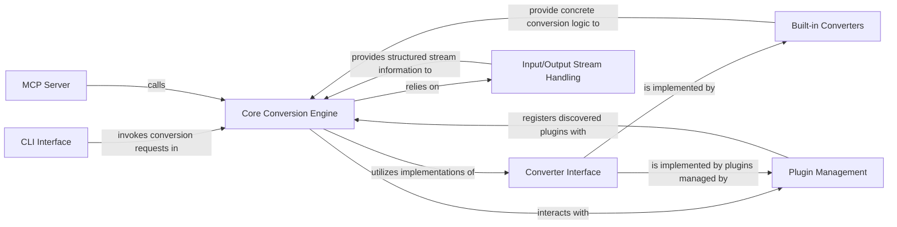

## Details

The feedback is valid and relevant, primarily addressing the conciseness of component relationships and the completeness of source code references. It does not necessitate architectural changes but requires a refinement of the analysis.

### CLI Interface
Provides the command-line entry point for user interaction and orchestrates the conversion process.

**Related Classes/Methods**:

- <a href="https://github.com/microsoft/markitdown/blob/main/packages/markitdown/src/markitdown/__main__.py" target="_blank" rel="noopener noreferrer">`markitdown.__main__` (1:1)</a>

### Core Conversion Engine
The central orchestrator, managing converter registration, selection, and the overall conversion workflow.

**Related Classes/Methods**:

- <a href="https://github.com/microsoft/markitdown/blob/main/packages/markitdown/src/markitdown/_markitdown.py" target="_blank" rel="noopener noreferrer">`markitdown._markitdown` (1:1)</a>

### Converter Interface
Defines the standard contract (accepts, convert) that all document converters must implement, enabling the plugin architecture.

**Related Classes/Methods**:

- <a href="https://github.com/microsoft/markitdown/blob/main/packages/markitdown/src/markitdown/_base_converter.py" target="_blank" rel="noopener noreferrer">`markitdown._base_converter` (1:1)</a>

### Built-in Converters
A collection of concrete implementations of the Converter Interface for various standard document types.

**Related Classes/Methods**:

- <a href="https://github.com/microsoft/markitdown/blob/main/packages/markitdown/src/markitdown/converters/_docx_converter.py" target="_blank" rel="noopener noreferrer">`markitdown.converters._docx_converter` (1:1)</a>

### Plugin Management
Facilitates the discovery, loading, and registration of external converter plugins, ensuring system extensibility.

**Related Classes/Methods**:

- <a href="https://github.com/microsoft/markitdown/blob/main/packages/markitdown/src/markitdown/_markitdown.py" target="_blank" rel="noopener noreferrer">`markitdown._markitdown:_load_plugins` (1:1)</a>
- <a href="https://github.com/microsoft/markitdown/blob/main/packages/markitdown/src/markitdown/_markitdown.py" target="_blank" rel="noopener noreferrer">`markitdown._markitdown:enable_plugins` (1:1)</a>

### MCP Server
Provides a backend HTTP API for the markitdown conversion functionality, enabling remote access. This is likely an external component that integrates with the Core Conversion Engine.

**Related Classes/Methods**: _None_

### Input/Output Stream Handling
Manages the processing and preparation of diverse input types (files, streams, URIs) for conversion.

**Related Classes/Methods**:

- <a href="https://github.com/microsoft/markitdown/blob/main/packages/markitdown/src/markitdown/_stream_info.py" target="_blank" rel="noopener noreferrer">`markitdown._stream_info` (1:1)</a>
- <a href="https://github.com/microsoft/markitdown/blob/main/packages/markitdown/src/markitdown/_markitdown.py" target="_blank" rel="noopener noreferrer">`markitdown._markitdown` (1:1)</a>

### [FAQ](https://github.com/CodeBoarding/GeneratedOnBoardings/tree/main?tab=readme-ov-file#faq)