```mermaid
graph LR
    Entry_Points_CLI_API_["Entry Points (CLI & API)"]
    Core_Conversion_Engine["Core Conversion Engine"]
    Document_Converters_Base_Built_in_["Document Converters (Base & Built-in)"]
    OpenAI_LLM_Integration["OpenAI LLM Integration"]
    Azure_Document_Intelligence_Integration["Azure Document Intelligence Integration"]
    Plugin_Management["Plugin Management"]
    Unclassified["Unclassified"]
    Entry_Points_CLI_API_ -- "Initiates Conversion" --> Core_Conversion_Engine
    Core_Conversion_Engine -- "Returns Result" --> Entry_Points_CLI_API_
    Core_Conversion_Engine -- "Delegates Conversion" --> Document_Converters_Base_Built_in_
    Core_Conversion_Engine -- "Manages Converters" --> Document_Converters_Base_Built_in_
    Core_Conversion_Engine -- "Invokes Plugin Loading" --> Plugin_Management
    Document_Converters_Base_Built_in_ -- "Utilizes" --> OpenAI_LLM_Integration
    Document_Converters_Base_Built_in_ -- "Utilizes" --> Azure_Document_Intelligence_Integration
    Plugin_Management -- "Registers Custom Converters" --> Document_Converters_Base_Built_in_
```

## Details

The `markitdown` project provides a flexible document conversion utility, primarily converting various file formats into Markdown. Its architecture is centered around the `MarkItDown` class, which acts as the Core Conversion Engine. This engine is exposed through Entry Points (CLI & API), allowing users to initiate conversions from files or streams. The Core Conversion Engine dynamically manages a collection of Document Converters (Base & Built-in), which are responsible for the actual transformation of specific document types (e.g., PDF, DOCX, HTML) into Markdown. The system is extensible through Plugin Management, enabling the registration of custom converters. Specialized integrations, such as Azure Document Intelligence Integration for advanced document parsing and OpenAI LLM Integration for natural language processing tasks, enhance the conversion capabilities by providing additional data extraction and content refinement functionalities, often leveraged by the document converters.

### Entry Points (CLI & API)
Provides the primary interfaces for users and other applications to interact with `markitdown`, initiating document conversion processes and receiving results.

**Related Classes/Methods**:

- <a href="https://github.com/microsoft/markitdown/blob/main/packages/markitdown/src/markitdown/__main__.py#L13-L200" target="_blank" rel="noopener noreferrer">`markitdown.__main__.main`:13-200</a>
- <a href="https://github.com/microsoft/markitdown/blob/main/packages/markitdown/src/markitdown/_markitdown.py#L93-L776" target="_blank" rel="noopener noreferrer">`markitdown._markitdown.MarkItDown`:93-776</a>

### Core Conversion Engine
The central orchestrator of the document conversion pipeline. It identifies document types, selects appropriate converters based on priority, manages the flow of data, and coordinates with other components.

**Related Classes/Methods**:

- <a href="https://github.com/microsoft/markitdown/blob/main/packages/markitdown/src/markitdown/_markitdown.py#L245-L293" target="_blank" rel="noopener noreferrer">`markitdown._markitdown.MarkItDown.convert`:245-293</a>
- <a href="https://github.com/microsoft/markitdown/blob/main/packages/markitdown/src/markitdown/_markitdown.py#L284-L289" target="_blank" rel="noopener noreferrer">`markitdown._markitdown.MarkItDown.convert_stream`:284-289</a>

### Document Converters (Base & Built-in)
A modular system defining the abstract interface (`DocumentConverter`) for all conversion logic and providing concrete implementations for various common document types (e.g., PDF, DOCX, HTML, CSV, Images, Audio). These components handle the specific transformation of input formats into Markdown.

**Related Classes/Methods**:

- <a href="https://github.com/microsoft/markitdown/blob/main/packages/markitdown/src/markitdown/_base_converter.py#L42-L105" target="_blank" rel="noopener noreferrer">`markitdown._base_converter.DocumentConverter`:42-105</a>
- <a href="https://github.com/microsoft/markitdown/blob/main/packages/markitdown/src/markitdown/converters/_pdf_converter.py" target="_blank" rel="noopener noreferrer">`markitdown.converters.PdfConverter`</a>
- <a href="https://github.com/microsoft/markitdown/blob/main/packages/markitdown/src/markitdown/converters/_docx_converter.py" target="_blank" rel="noopener noreferrer">`markitdown.converters.DocxConverter`</a>
- <a href="https://github.com/microsoft/markitdown/blob/main/packages/markitdown/src/markitdown/converters/_html_converter.py" target="_blank" rel="noopener noreferrer">`markitdown.converters.HtmlConverter`</a>
- <a href="https://github.com/microsoft/markitdown/blob/main/packages/markitdown/src/markitdown/converters/_csv_converter.py" target="_blank" rel="noopener noreferrer">`markitdown.converters.CsvConverter`</a>
- <a href="https://github.com/microsoft/markitdown/blob/main/packages/markitdown/src/markitdown/converters/_image_converter.py" target="_blank" rel="noopener noreferrer">`markitdown.converters.ImageConverter`</a>
- <a href="https://github.com/microsoft/markitdown/blob/main/packages/markitdown/src/markitdown/converters/_audio_converter.py" target="_blank" rel="noopener noreferrer">`markitdown.converters.AudioConverter`</a>

### OpenAI LLM Integration
Handles communication with OpenAI's GPT-4o for advanced natural language processing tasks such as summarization, content refinement, and captioning, typically invoked by document converters or the core engine.

**Related Classes/Methods**:

- <a href="https://github.com/microsoft/markitdown/blob/main/packages/markitdown/src/markitdown/_markitdown.py" target="_blank" rel="noopener noreferrer">`markitdown._markitdown.MarkItDown._llm_client`</a>

### Azure Document Intelligence Integration
Manages interactions with Azure Document Intelligence for robust document parsing, OCR, and structured data extraction from complex document types. This is implemented as a specialized document converter.

**Related Classes/Methods**:

- <a href="https://github.com/microsoft/markitdown/blob/main/packages/markitdown/src/markitdown/converters/_doc_intel_converter.py" target="_blank" rel="noopener noreferrer">`markitdown.converters.DocumentIntelligenceConverter`</a>

### Plugin Management
Facilitates the extensibility of `markitdown` by managing the discovery, loading, and registration of third-party or custom plugins, which can introduce additional `DocumentConverter` implementations.

**Related Classes/Methods**:

- <a href="https://github.com/microsoft/markitdown/blob/main/packages/markitdown/src/markitdown/_markitdown.py#L65-L82" target="_blank" rel="noopener noreferrer">`markitdown._markitdown._load_plugins`:65-82</a>
- <a href="https://github.com/microsoft/markitdown/blob/main/packages/markitdown/src/markitdown/_markitdown.py" target="_blank" rel="noopener noreferrer">`markitdown._markitdown.MarkItDown.enable_plugins`</a>

### Unclassified
Component for all unclassified files and utility functions (Utility functions/External Libraries/Dependencies)

**Related Classes/Methods**: _None_

### [FAQ](https://github.com/CodeBoarding/GeneratedOnBoardings/tree/main?tab=readme-ov-file#faq)