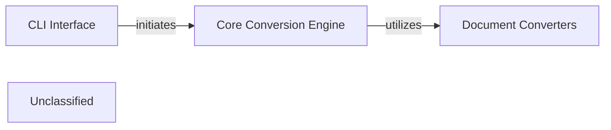

## Details

The `markitdown` project is structured around a Core Conversion Engine (`markitdown._markitdown.MarkItDown`) that orchestrates the conversion of various document formats into Markdown. Users interact with the system primarily through a CLI Interface (`markitdown.__main__.main`), which parses input and delegates conversion tasks to the Core Conversion Engine. The engine, in turn, leverages a pluggable system of Document Converters, each specialized in handling a particular file type (e.g., PDF, DOCX, HTML, images, audio, YouTube links). These converters extend a `BaseConverter` (`markitdown._base_converter.BaseConverter`) and are registered with the Core Conversion Engine. Some specialized converters, like `DocumentIntelligenceConverter`, may internally interact with external AI/ML services to facilitate the conversion process.

### CLI Interface
Provides the command-line entry point for users to interact with the `markitdown` conversion service, handling argument parsing and initiating the conversion workflow.

**Related Classes/Methods**:

- <a href="https://github.com/microsoft/markitdown/blob/mainpackages/markitdown/src/markitdown/__main__.py#L13-L200" target="_blank" rel="noopener noreferrer">`markitdown.__main__.main`:13-200</a>

### Core Conversion Engine
Manages the overall document conversion workflow, coordinating input parsing, content processing, and markdown rendering. It acts as the central control unit, registering and dispatching to appropriate converters.

**Related Classes/Methods**:

- <a href="https://github.com/microsoft/markitdown/blob/mainpackages/markitdown/src/markitdown/_markitdown.py#L93-L776" target="_blank" rel="noopener noreferrer">`markitdown._markitdown.MarkItDown`:93-776</a>
- <a href="https://github.com/microsoft/markitdown/blob/mainpackages/markitdown/src/markitdown/_markitdown.py#L196-L198" target="_blank" rel="noopener noreferrer">`markitdown._markitdown.MarkItDown.convert`:196-198</a>
- <a href="https://github.com/microsoft/markitdown/blob/mainpackages/markitdown/src/markitdown/_markitdown.py#L440-L467" target="_blank" rel="noopener noreferrer">`markitdown._markitdown.MarkItDown.register_converter`:440-467</a>

### Document Converters
Defines the extensible architecture for handling various input document formats (e.g., PDF, DOCX, PPTX, XLSX, Audio, YouTube). Specific converters implement the logic for each format.

**Related Classes/Methods**:

- <a href="https://github.com/microsoft/markitdown/blob/mainpackages/markitdown/src/markitdown/_base_converter.py" target="_blank" rel="noopener noreferrer">`markitdown._base_converter.BaseConverter`</a>
- <a href="https://github.com/microsoft/markitdown/blob/mainpackages/markitdown/src/markitdown/converters/_pdf_converter.py#L31-L77" target="_blank" rel="noopener noreferrer">`markitdown.converters._pdf_converter.PdfConverter`:31-77</a>
- <a href="https://github.com/microsoft/markitdown/blob/mainpackages/markitdown/src/markitdown/converters/_docx_converter.py#L38-L90" target="_blank" rel="noopener noreferrer">`markitdown.converters._docx_converter.DocxConverter`:38-90</a>
- <a href="https://github.com/microsoft/markitdown/blob/mainpackages/markitdown/src/markitdown/converters/_doc_intel_converter.py#L130-L254" target="_blank" rel="noopener noreferrer">`markitdown.converters._doc_intel_converter.DocumentIntelligenceConverter`:130-254</a>
- <a href="https://github.com/microsoft/markitdown/blob/mainpackages/markitdown/src/markitdown/converters/_html_converter.py#L20-L89" target="_blank" rel="noopener noreferrer">`markitdown.converters._html_converter.HtmlConverter`:20-89</a>
- <a href="https://github.com/microsoft/markitdown/blob/mainpackages/markitdown/src/markitdown/converters/_image_converter.py#L16-L81" target="_blank" rel="noopener noreferrer">`markitdown.converters._image_converter.ImageConverter`:16-81</a>
- <a href="https://github.com/microsoft/markitdown/blob/mainpackages/markitdown/src/markitdown/converters/_audio_converter.py#L23-L101" target="_blank" rel="noopener noreferrer">`markitdown.converters._audio_converter.AudioConverter`:23-101</a>
- <a href="https://github.com/microsoft/markitdown/blob/mainpackages/markitdown/src/markitdown/converters/_youtube_converter.py#L37-L238" target="_blank" rel="noopener noreferrer">`markitdown.converters._youtube_converter.YouTubeConverter`:37-238</a>

### Unclassified
Component for all unclassified files and utility functions (Utility functions/External Libraries/Dependencies)

**Related Classes/Methods**: _None_

### [FAQ](https://github.com/CodeBoarding/GeneratedOnBoardings/tree/main?tab=readme-ov-file#faq)