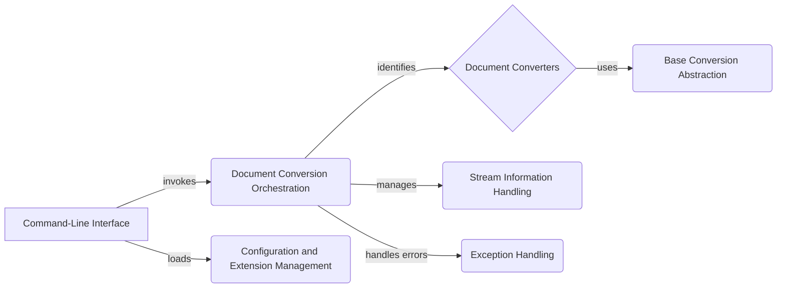

Okay, I will generate an onboarding document for the `markitdown` project based on the provided information.

**Project Description**

MarkItDown is a versatile document conversion tool that transforms various file formats, such as HTML, PDF, DOCX, and others, into Markdown. It provides a command-line interface for users to easily convert documents, supports configuration and extensions for customization, and offers a consistent abstraction for different document converters.

**Flow Diagram (Mermaid)**

**Component Descriptions**

*   **Command-Line Interface:** This component serves as the entry point for users, allowing them to interact with the MarkItDown tool through command-line arguments. It parses user input, triggers the document conversion process, and displays the results or any error messages.

*   **Document Conversion Orchestration:** This component is the central coordinator of the conversion process. It receives the input document and determines the appropriate converter to use based on the file type. It also manages stream information, such as filename and MIME type, and orchestrates the overall conversion workflow.

*   **Document Converters:** This component comprises a collection of individual converters, each responsible for converting a specific document format (e.g., HTML, PDF, DOCX) into Markdown. Each converter implements the `Base Conversion Abstraction` interface to ensure a consistent conversion process.

*   **Stream Information Handling:** This component manages information about the input stream, such as the filename, MIME type, and charset. This information is crucial for the document converters to correctly process the input and produce accurate Markdown output.

*   **Base Conversion Abstraction:** This component defines the abstract base class (`DocumentConverter`) and result (`DocumentConverterResult`) for all document converters. It provides a consistent interface for conversion, ensuring that all converters adhere to a standard structure and behavior.

*   **Configuration and Extension Management:** This component handles the loading and management of configuration settings, allowing users to customize the conversion process. It also manages extensions, which can be loaded and applied to further modify the conversion behavior.

*   **Exception Handling:** This component defines custom exceptions for different error scenarios that may occur during the conversion process. These exceptions provide detailed information about the cause of the error, facilitating debugging and troubleshooting.