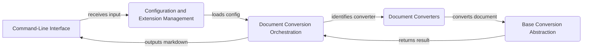

Okay, I will generate an onboarding document for the `markitdown` project based on the provided component analysis.

**1. Project Description**

MarkItDown is a versatile document conversion tool that transforms various file formats, such as HTML, PDF, DOCX, and others, into Markdown. It provides a command-line interface for easy use and supports configuration and extensions for customized conversions. The project is designed to be extensible, allowing developers to add new document converters and modify the conversion process.

**2. Flow Diagram (Mermaid)**

**3. Component Descriptions**

*   **Command-Line Interface:** This component serves as the entry point for users, accepting commands and arguments to initiate the document conversion process. It parses user input and passes the necessary information to other components.

*   **Configuration and Extension Management:** This component handles the loading of configuration settings and extensions, allowing users to customize the conversion process. It ensures that the appropriate settings and extensions are applied before the conversion begins.

*   **Document Conversion Orchestration:** This component manages the overall conversion process. It receives the input document and determines the appropriate converter to use based on the file type. It also handles stream information and orchestrates the conversion workflow.

*   **Document Converters:** This component contains a collection of individual converters, each responsible for converting a specific document type to Markdown. These converters implement the conversion logic for their respective file formats.

*   **Base Conversion Abstraction:** This component defines the abstract base class for all document converters, providing a consistent interface and structure. It ensures that all converters adhere to a common standard, simplifying the conversion process and promoting code reuse.