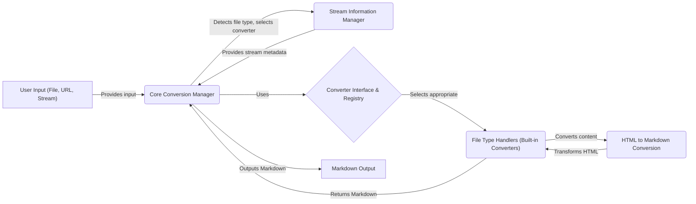

Okay, I will generate an onboarding document for the `markitdown` project based on the provided component analysis.

**1. Project Description**

MarkItDown is a versatile tool designed to convert various file formats into Markdown. It supports a wide range of input types, including local files, URLs, streams, and responses. The core functionality involves detecting the file type, selecting the appropriate converter (either built-in or a plugin), and transforming the content into Markdown. This allows users to easily convert documents, web pages, and other content into a readable and easily editable Markdown format.

**2. Data Flow Diagram**

**3. Component Descriptions**

*   **User Input (File, URL, Stream):** This is the entry point of the system, representing the various ways a user can provide content to be converted. It sends the input to the `Core Conversion Manager`.
*   **Core Conversion Manager:** This component is the heart of the application. It receives input from the user, uses the `Stream Information Manager` to determine the file type, selects the appropriate converter from the `Converter Interface & Registry`, and orchestrates the conversion process. Finally, it outputs the resulting Markdown.
*   **Stream Information Manager:** This component extracts and manages metadata about the input stream, such as MIME type and file extension. It provides this information back to the `Core Conversion Manager` to aid in file type detection and converter selection.
*   **Converter Interface & Registry:** This component defines the interface for all converters and manages their registration. The `Core Conversion Manager` uses it to dynamically select the appropriate converter based on the file type. It selects the appropriate `File Type Handlers (Built-in Converters)`.
*   **File Type Handlers (Built-in Converters):** This component encompasses all the built-in converters for various file formats. Each converter is responsible for extracting content from its specific file type and converting it into Markdown format. Some converters use the `HTML to Markdown Conversion` component.
*   **HTML to Markdown Conversion:** This component specifically handles the conversion of HTML content to Markdown. It's used by several converters (e.g., DOCX, HTML) within the `File Type Handlers (Built-in Converters)` to transform HTML-formatted content into Markdown.
*   **Markdown Output:** This is the final stage, where the converted Markdown content is presented to the user. It receives the Markdown from the `Core Conversion Manager`.
