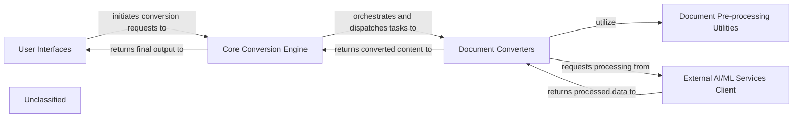

## Details

The MarkItDown system is designed as a modular document conversion platform, centered around a Core Conversion Engine that orchestrates the transformation of various document formats into Markdown. User Interfaces provide the entry points for conversion requests, which are then managed by the Core Conversion Engine. This engine dispatches tasks to specialized Document Converters, which handle specific input formats. These converters can leverage Document Pre-processing Utilities for complex format preparation and interact with External AI/ML Services Client for advanced content understanding. The processed and converted content flows back through the Core Conversion Engine before being returned to the User Interfaces. This architecture ensures clear separation of concerns, extensibility through pluggable converters, and efficient handling of diverse document conversion workflows.

### User Interfaces
Provides the primary interaction points for users, including command-line execution and a microservice API for document conversion.

**Related Classes/Methods**:

- <a href="https://github.com/microsoft/markitdown/blob/main/packages/markitdown/src/markitdown/__main__.py" target="_blank" rel="noopener noreferrer">`packages/markitdown/src/markitdown/__main__.py`</a>
- <a href="https://github.com/microsoft/markitdown/blob/main/packages/markitdown-mcp/src/markitdown_mcp/__main__.py" target="_blank" rel="noopener noreferrer">`packages/markitdown-mcp/src/markitdown_mcp/__main__.py`</a>

### Core Conversion Engine
The central orchestrator of the MarkItDown system, responsible for managing the overall conversion process, dispatching tasks, and integrating plugin-provided converters.

**Related Classes/Methods**:

- <a href="https://github.com/microsoft/markitdown/blob/main/packages/markitdown/src/markitdown/_markitdown.py" target="_blank" rel="noopener noreferrer">`packages/markitdown/src/markitdown/_markitdown.py`</a>

### Document Converters
A collection of specialized modules, each designed to transform a specific input document format (e.g., PDF, DOCX, HTML, Images) into Markdown. This component includes both built-in and dynamically loaded plugin converters.

**Related Classes/Methods**:

- <a href="https://github.com/microsoft/markitdown/blob/main/packages/markitdown/src/markitdown/converters/" target="_blank" rel="noopener noreferrer">`packages/markitdown/src/markitdown/converters/`</a>
- <a href="https://github.com/microsoft/markitdown/blob/main/packages/markitdown-sample-plugin/src/markitdown_sample_plugin/_plugin.py" target="_blank" rel="noopener noreferrer">`packages/markitdown-sample-plugin/src/markitdown_sample_plugin/_plugin.py`</a>

### External AI/ML Services Client
Manages standardized interactions with external cloud-based AI and Machine Learning services (e.g., Azure Document Intelligence, OpenAI LLMs) for advanced document understanding and content generation.

**Related Classes/Methods**:

- <a href="https://github.com/microsoft/markitdown/blob/main/packages/markitdown/src/markitdown/converters/_doc_intel_converter.py" target="_blank" rel="noopener noreferrer">`packages/markitdown/src/markitdown/converters/_doc_intel_converter.py`</a>
- <a href="https://github.com/microsoft/markitdown/blob/main/packages/markitdown/src/markitdown/converters/_image_converter.py" target="_blank" rel="noopener noreferrer">`packages/markitdown/src/markitdown/converters/_image_converter.py`</a>

### Document Pre-processing Utilities
Contains helper functions and modules for preparing complex document formats (e.g., DOCX) by performing tasks like OMMl to LaTeX conversion, ensuring data is suitable for subsequent conversion steps.

**Related Classes/Methods**:

- <a href="https://github.com/microsoft/markitdown/blob/main/packages/markitdown/src/markitdown/converter_utils/docx/pre_process.py" target="_blank" rel="noopener noreferrer">`packages/markitdown/src/markitdown/converter_utils/docx/pre_process.py`</a>
- <a href="https://github.com/microsoft/markitdown/blob/main/packages/markitdown/src/markitdown/converter_utils/docx/math/omml.py" target="_blank" rel="noopener noreferrer">`packages/markitdown/src/markitdown/converter_utils/docx/math/omml.py`</a>

### Unclassified
Component for all unclassified files and utility functions (Utility functions/External Libraries/Dependencies)

**Related Classes/Methods**: _None_

### [FAQ](https://github.com/CodeBoarding/GeneratedOnBoardings/tree/main?tab=readme-ov-file#faq)