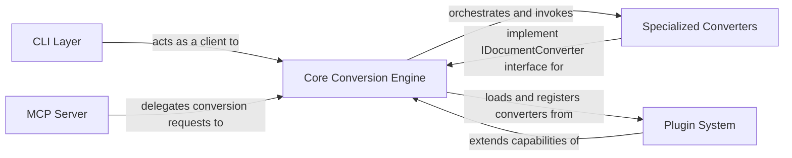

## Details

The MarkItDown architecture is built around a central `Core Conversion Engine` that serves as the primary interface for all document conversion operations, embodying a Facade pattern. This engine dynamically dispatches conversion tasks to various `Specialized Converters`, each responsible for handling a specific document format and adhering to a common `IDocumentConverter` interface, reflecting a Strategy pattern. The system's modularity and extensibility are significantly enhanced by a `Plugin System`, enabling the dynamic discovery and registration of new converters, thereby extending the core capabilities without modifying the main codebase. User interaction is facilitated through two main entry points: a `CLI Layer` for direct command-line execution and an `MCP Server` that exposes the conversion functionality as a web service, primarily for integration with external AI/ML systems like LLMs. This design ensures a clear separation of concerns, high extensibility, and multiple avenues for interaction, making MarkItDown a robust and adaptable document processing solution.

### Core Conversion Engine
Provides a unified, high-level interface for document conversion, managing the lifecycle and invocation of various converters. It acts as a facade, orchestrating the conversion process and handling input stream information.

**Related Classes/Methods**:

- `packages.markitdown.src.markitdown._markitdown` (1:1)

### Specialized Converters
Encapsulate the logic for converting specific file formats (e.g., PDF, DOCX, HTML) or data sources into Markdown. Each converter implements the IDocumentConverter interface and may integrate with external services.

**Related Classes/Methods**:

- `packages.markitdown.src.markitdown.converters._pptx_converter` (1:1)
- `packages.markitdown.src.markitdown.converters._doc_intel_converter` (1:1)

### Plugin System
Provides an extensible framework for dynamically integrating custom converters as plugins, extending the core conversion capabilities without modifying the main codebase.

**Related Classes/Methods**:

- `packages.markitdown-sample-plugin.src.markitdown_sample_plugin._plugin` (1:1)

### CLI Layer
Offers a user-friendly command-line interface for direct interaction with the MarkItDown conversion capabilities, parsing arguments and presenting output.

**Related Classes/Methods**:

- `packages.markitdown.src.markitdown.__main__` (1:1)

### MCP Server
Exposes the MarkItDown conversion functionality as a web service, enabling integration with external systems, particularly Large Language Models (LLMs), via a defined protocol.

**Related Classes/Methods**:

- `packages.markitdown-mcp.src.markitdown_mcp.__main__` (1:1)

### [FAQ](https://github.com/CodeBoarding/GeneratedOnBoardings/tree/main?tab=readme-ov-file#faq)