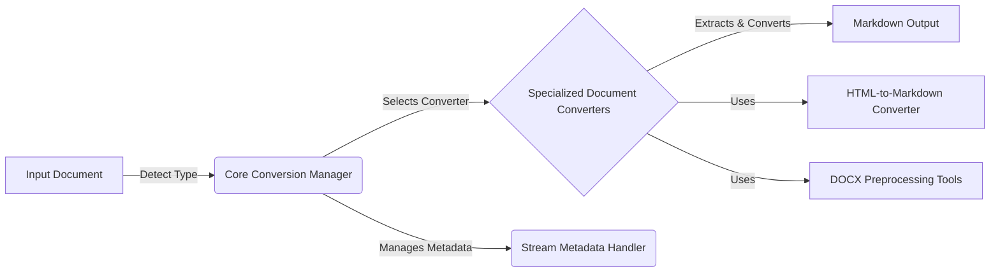

# MarkItDown: High-Level Data Flow Overview

MarkItDown is a versatile document conversion tool that transforms various file formats into Markdown. It supports a wide range of input types, including HTML, DOCX, PDF, and more, leveraging a plugin-based architecture for extensibility. The core functionality involves detecting the input file type, selecting the appropriate converter, extracting the content, and formatting it into Markdown.

## Component Descriptions:

**A. Input Document:** Represents the document to be converted. It can be a local file, a remote URL, or a stream of data. The type of the document is detected to determine the appropriate conversion strategy.

**B. Core Conversion Manager:** This is the central orchestrator of the conversion process. It receives the input document, detects its type, selects the appropriate converter from the available specialized converters, manages stream metadata, and initiates the conversion. It relates to `Input Document` by detecting its type, to `Specialized Document Converters` by selecting the right converter, and to `Stream Metadata Handler` by managing the metadata.

**C. Specialized Document Converters:** This component encompasses a collection of individual converters, each responsible for handling a specific document type (e.g., DOCX, PDF, HTML). These converters extract the content from the input document and transform it into Markdown format. It relates to `Core Conversion Manager` by being selected and invoked, to `Markdown Output` by producing the final result, to `HTML-to-Markdown Converter` and `DOCX Preprocessing Tools` by using them for specific conversion tasks.

**D. Markdown Output:** Represents the final Markdown-formatted content generated by the conversion process. This output can be saved to a file, displayed in a user interface, or further processed by other applications.

**E. Stream Metadata Handler:** This component manages metadata associated with the input stream, such as file type, encoding, and URL. It provides a consistent way to access and modify stream information throughout the conversion process. It relates to `Core Conversion Manager` by providing and managing the metadata.

**F. HTML-to-Markdown Converter:** This specialized converter handles the conversion of HTML content to Markdown format. It is used by the HTML converter and potentially other converters that need to process HTML content. It relates to `Specialized Document Converters` by being used by them.

**G. DOCX Preprocessing Tools:** This component provides utilities for preprocessing DOCX files, including handling equations and other complex formatting elements. It is used by the DOCX converter to prepare the document for conversion. It relates to `Specialized Document Converters` by being used by them.