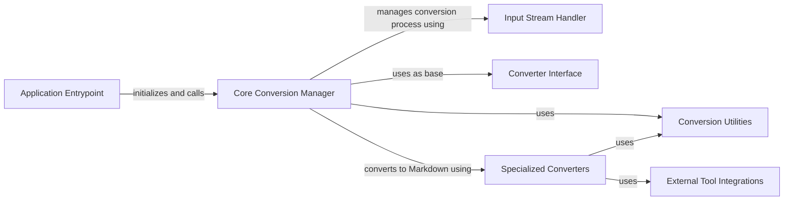

## Component Details

### Application Entrypoint
This component serves as the main entry point for the application. It's responsible for parsing command-line arguments, initializing the core converter, and managing the overall execution flow. It orchestrates the interaction between different components to perform the markdown conversion.
- **Related Classes/Methods**: `markitdown.__main__`

### Core Conversion Manager
The central component responsible for managing the conversion process. It handles converter registration, determines the input type (file, URI, stream), selects the appropriate converter, and orchestrates the conversion workflow. It acts as a facade, simplifying the conversion process for the Application Entrypoint.
- **Related Classes/Methods**: `markitdown._markitdown.MarkItDown`

### Input Stream Handler
This component is responsible for extracting and managing information about the input stream, such as file type, encoding, and other metadata. It provides this metadata to the Core Conversion Manager to facilitate converter selection and proper handling of the input data.
- **Related Classes/Methods**: `markitdown._stream_info.StreamInfo`

### Converter Interface
Defines the base class for all converters, providing a common interface for conversion operations. It ensures that all converters adhere to a consistent structure, allowing the Core Conversion Manager to interact with them uniformly. This promotes extensibility and maintainability of the conversion process.
- **Related Classes/Methods**: `markitdown._base_converter`

### Specialized Converters
This component encompasses a collection of specialized converters, each responsible for handling a specific file type (e.g., HTML, DOCX, PDF, audio, image). These converters implement the conversion logic for their respective file types, transforming the input into Markdown format. They are the workers that perform the actual conversion, guided by the Core Conversion Manager.
- **Related Classes/Methods**: `markitdown.converters._html_converter.HtmlConverter`, `markitdown.converters._plain_text_converter.PlainTextConverter`, `markitdown.converters._image_converter.ImageConverter`, `markitdown.converters._audio_converter.AudioConverter`, `markitdown.converters._docx_converter.DocxConverter`, `markitdown.converters._pdf_converter.PdfConverter`, `markitdown.converters._pptx_converter.PptxConverter`, `markitdown.converters._xlsx_converter.XlsxConverter`, `markitdown.converters._rss_converter.RssConverter`, `markitdown.converters._youtube_converter.YouTubeConverter`

### External Tool Integrations
This component represents the integration of external tools and libraries used by the Specialized Converters to perform specific tasks. These tools provide specialized functionalities such as HTML to Markdown conversion (Markdownify), metadata extraction (Exiftool), and audio transcription (Transcribe Audio), enhancing the capabilities of the Specialized Converters.
- **Related Classes/Methods**: `markitdown.converters._markdownify`, `markitdown.converters._exiftool`, `markitdown.converters._transcribe_audio`

### Conversion Utilities
This component provides utility functions and modules used by various converters, such as pre-processing steps for specific file formats (e.g., DOCX). These utilities offer reusable functionalities that simplify the implementation and maintenance of the Specialized Converters.
- **Related Classes/Methods**: `markitdown.converter_utils.docx.pre_process`, `markitdown.converter_utils.docx.math.omml`