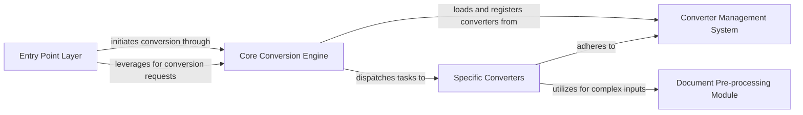

## Details

The `markitdown` architecture is designed for modularity and extensibility, centered around a Core Conversion Engine. User requests, whether from the Entry Point Layer (CLI or API), are directed to this engine. The Core Conversion Engine then consults the Converter Management System to identify and load the appropriate Specific Converters based on the input document type, leveraging a plugin system for extensibility. Before the final transformation, complex inputs may be routed through the Document Pre-processing Module to prepare the content. This structured approach ensures efficient and adaptable document transformation into Markdown, supporting a wide array of input formats.

### Entry Point Layer
Provides the external interfaces for interacting with the `markitdown` system, including command-line execution and a programmatic API.

**Related Classes/Methods**:

- <a href="https://github.com/microsoft/markitdown/blob/main/packages/markitdown/src/markitdown/__main__.py" target="_blank" rel="noopener noreferrer">`markitdown.__main__.main`</a>
- <a href="https://github.com/microsoft/markitdown/blob/main/packages/markitdown-mcp/src/markitdown_mcp/__main__.py" target="_blank" rel="noopener noreferrer">`markitdown_mcp.__main__.main`</a>

### Core Conversion Engine
The central orchestrator responsible for managing the conversion workflow, dispatching tasks, and coordinating between various components.

**Related Classes/Methods**:

- <a href="https://github.com/microsoft/markitdown/blob/main/packages/markitdown/src/markitdown/_markitdown.py" target="_blank" rel="noopener noreferrer">`markitdown._markitdown.Markitdown`</a>
- <a href="https://github.com/microsoft/markitdown/blob/main/packages/markitdown/src/markitdown/_markitdown.py" target="_blank" rel="noopener noreferrer">`markitdown._markitdown.convert`</a>

### Converter Management System
Handles the discovery, registration, and selection of appropriate converters, encompassing both built-in and dynamically loaded plugin converters.

**Related Classes/Methods**:

- <a href="https://github.com/microsoft/markitdown/blob/main/packages/markitdown/src/markitdown/_markitdown.py" target="_blank" rel="noopener noreferrer">`markitdown._markitdown.Markitdown.register_converter`</a>
- <a href="https://github.com/microsoft/markitdown/blob/main/packages/markitdown/src/markitdown/_markitdown.py" target="_blank" rel="noopener noreferrer">`markitdown._markitdown.Markitdown.enable_plugins`</a>
- <a href="https://github.com/microsoft/markitdown/blob/main/packages/markitdown/src/markitdown/_markitdown.py" target="_blank" rel="noopener noreferrer">`markitdown._markitdown.Markitdown._load_plugins`</a>
- <a href="https://github.com/microsoft/markitdown/blob/main/packages/markitdown/src/markitdown/_base_converter.py" target="_blank" rel="noopener noreferrer">`markitdown._base_converter.BaseConverter`</a>

### Specific Converters
A collection of modules, each specialized in transforming a particular input format (e.g., DOCX, PDF, HTML, Image) into the target Markdown format.

**Related Classes/Methods**:

- <a href="https://github.com/microsoft/markitdown/blob/main/packages/markitdown/src/markitdown/converters/_docx_converter.py" target="_blank" rel="noopener noreferrer">`markitdown.converters._docx_converter.DocxConverter`</a>

### Document Pre-processing Module
Contains specialized utilities for preparing complex document types, such as handling mathematical equations or extracting specific content, before the main conversion logic is applied.

**Related Classes/Methods**:

- <a href="https://github.com/microsoft/markitdown/blob/main/packages/markitdown/src/markitdown/converter_utils/docx/pre_process.py" target="_blank" rel="noopener noreferrer">`markitdown.converter_utils.docx.pre_process.pre_process_docx`</a>

### [FAQ](https://github.com/CodeBoarding/GeneratedOnBoardings/tree/main?tab=readme-ov-file#faq)