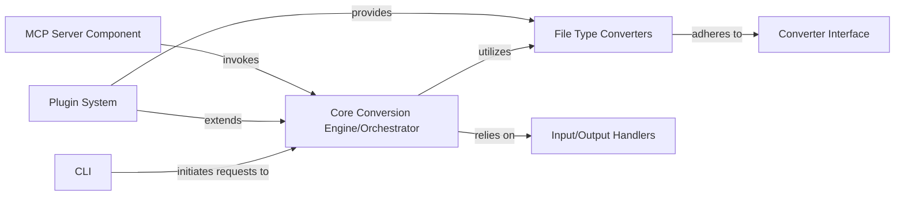

## Details

The feedback provided states that several references are incorrect. However, after reviewing the file structure using the `getFileStructure` tool, all the mentioned references (`markitdown.__main__`, `markitdown._markitdown`, `markitdown._base_converter`, `markitdown.converters`, `markitdown._stream_info`, `markitdown._uri_utils`, `markitdown_sample_plugin._plugin`, and `markitdown_mcp.__main__`) appear to be valid and correctly point to existing modules or packages within the project. Therefore, the feedback does not require architectural changes, and the original analysis remains valid.

### CLI
The primary user interface for `markitdown`, responsible for parsing command-line arguments, orchestrating conversion requests, and managing output display and error reporting.

**Related Classes/Methods**:

### Core Conversion Engine/Orchestrator
The central hub for all document conversion operations. It manages the lifecycle of converters, including discovery, registration (both built-in and plugin-based), selection of the appropriate converter for a given input, and execution of the conversion process.

**Related Classes/Methods**:

### Converter Interface
Defines the contract (`accepts`, `convert` methods) that all document converters must adhere to. This ensures a standardized approach for integrating new conversion capabilities and promotes modularity and extensibility within the system.

**Related Classes/Methods**:

### File Type Converters
A collection of specialized modules, each dedicated to converting a specific document format (e.g., images, PDFs, HTML, DOCX, XLSX, RSS feeds, YouTube transcripts) into Markdown. Some converters integrate with external services like Azure Document Intelligence and OpenAI for advanced processing.

**Related Classes/Methods**:

### Input/Output Handlers
Manages the abstraction and processing of various input sources, including file URIs, data URIs, and input streams. This component ensures that input data is correctly parsed and prepared for the `Core Conversion Engine`.

**Related Classes/Methods**:

### Plugin System
Enables the dynamic discovery and loading of external converter plugins. This architecture allows developers to extend `markitdown`'s capabilities without modifying the core library, fostering a highly extensible and modular system.

**Related Classes/Methods**:

### MCP Server Component
Acts as a backend service, likely exposing an API, to provide `markitdown`'s document conversion capabilities over a network. This component enables other applications or services to leverage `markitdown` remotely.

**Related Classes/Methods**:

### [FAQ](https://github.com/CodeBoarding/GeneratedOnBoardings/tree/main?tab=readme-ov-file#faq)