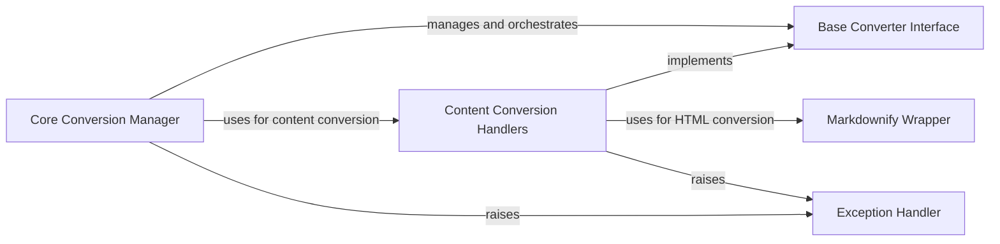

## Component Details

### Core Conversion Manager
The Core Conversion Manager is the central orchestrator of the markitdown library. It handles the intake of various input types, including local files, streams, and URIs, and delegates the conversion process to registered converters. It manages stream information, normalizes character sets, and serves as the primary entry point for all conversion tasks.
- **Related Classes/Methods**: `repos.markitdown.packages.markitdown.src.markitdown._markitdown.MarkItDown`, `repos.markitdown.packages.markitdown.src.markitdown._markitdown.ConverterRegistration`, `repos.markitdown.packages.markitdown.src.markitdown._stream_info.StreamInfo`, `repos.markitdown.packages.markitdown.src.markitdown._uri_utils`

### Base Converter Interface
The Base Converter Interface defines the abstract base class for all specific converters within the markitdown library. It establishes a common interface and structure, ensuring consistency across different conversion types. It also defines the structure of the conversion result, including content, title, and other metadata, providing a standardized format for all converters to adhere to.
- **Related Classes/Methods**: `repos.markitdown.packages.markitdown.src.markitdown._base_converter.DocumentConverterResult`, `repos.markitdown.packages.markitdown.src.markitdown._base_converter`

### Content Conversion Handlers
Content Conversion Handlers are a collection of components dedicated to converting various content types into Markdown. This includes handlers for HTML, plain text, documents (Office, PDFs), ebooks, multimedia (images, audio, YouTube), and web feeds (RSS). Each handler is responsible for extracting and transforming content from its specific format into a Markdown representation, often leveraging external libraries or APIs for format-specific processing.
- **Related Classes/Methods**: `repos.markitdown.packages.markitdown.src.markitdown.converters._html_converter.HtmlConverter`, `repos.markitdown.packages.markitdown.src.markitdown.converters._plain_text_converter.PlainTextConverter`, `repos.markitdown.packages.markitdown.src.markitdown.converters._doc_intel_converter.DocumentIntelligenceConverter`, `repos.markitdown.packages.markitdown.src.markitdown.converters._docx_converter.DocxConverter`, `repos.markitdown.packages.markitdown.src.markitdown.converters._pptx_converter.PptxConverter`, `repos.markitdown.packages.markitdown.src.markitdown.converters._xlsx_converter.XlsxConverter`, `repos.markitdown.packages.markitdown.src.markitdown.converters._epub_converter.EpubConverter`, `repos.markitdown.packages.markitdown.src.markitdown.converters._pdf_converter.PdfConverter`, `repos.markitdown.packages.markitdown.src.markitdown.converters._image_converter.ImageConverter`, `repos.markitdown.packages.markitdown.src.markitdown.converters._audio_converter.AudioConverter`, `repos.markitdown.packages.markitdown.src.markitdown.converters._youtube_converter.YouTubeConverter`, `repos.markitdown.packages.markitdown.src.markitdown.converters._rss_converter.RssConverter`, `repos.markitdown.packages.markitdown.src.markitdown.converters._ipynb_converter.IpynbConverter`

### Markdownify Wrapper
The Markdownify Wrapper component encapsulates the Markdownify library, providing custom conversion rules and configurations specifically tailored for HTML to Markdown conversion within the markitdown project. This allows for fine-grained control over the conversion process, ensuring that the output Markdown adheres to specific formatting and styling requirements.
- **Related Classes/Methods**: `repos.markitdown.packages.markitdown.src.markitdown.converters._markdownify._CustomMarkdownify`

### Exception Handler
The Exception Handler component defines custom exceptions used within the markitdown library. This allows for more specific and informative error handling throughout the conversion process.
- **Related Classes/Methods**: `repos.markitdown.packages.markitdown.src.markitdown._exceptions`