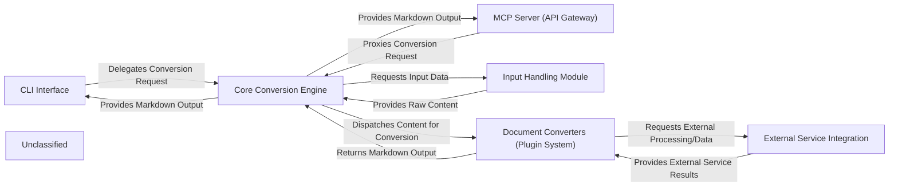

## Details

The Markitdown project is designed around a modular architecture, facilitating the conversion of diverse document types into Markdown. The system offers two primary entry points: a `CLI Interface` for direct user interaction and an `MCP Server (API Gateway)` for programmatic access via a RESTful API. Both interfaces delegate conversion requests to the `Core Conversion Engine`. This engine acts as the central orchestrator, responsible for managing the overall conversion workflow. It interacts with the `Input Handling Module` to abstract and prepare raw input data from various sources, such as local files, URIs, or streams. Once the input is prepared, the `Core Conversion Engine` dispatches the content to the appropriate `Document Converters (Plugin System)`. This plugin-based system allows for extensibility, with each converter specializing in a particular document or data type. Some converters within the `Document Converters (Plugin System)` may require interaction with external services, which is managed by the `External Service Integration` component. This component handles communication with third-party APIs for tasks like YouTube transcription or Azure Document Intelligence. Finally, the `Core Conversion Engine` receives the Markdown output from the converters and provides it back to the initiating `CLI Interface` or `MCP Server (API Gateway)`. This clear separation of concerns ensures a flexible, maintainable, and extensible architecture for document conversion.

### CLI Interface
The command-line entry point for users to interact with Markitdown, parsing arguments and initiating conversions.

**Related Classes/Methods**:

- <a href="https://github.com/microsoft/markitdown//blobpackages/markitdown/src/markitdown/__main__.py#L13-L200" target="_blank" rel="noopener noreferrer">`markitdown.__main__.main`:13-200</a>

### MCP Server (API Gateway)
A separate service exposing Markitdown's conversion capabilities via a RESTful API, acting as an API gateway.

**Related Classes/Methods**:

- <a href="https://github.com/microsoft/markitdown//blobpackages/markitdown-mcp/src/markitdown_mcp/__main__.py#L82-L123" target="_blank" rel="noopener noreferrer">`markitdown_mcp.__main__.main`:82-123</a>

### Core Conversion Engine
The central orchestrator managing the overall conversion workflow, identifying converters, and handling plugin registration.

**Related Classes/Methods**:

- <a href="https://github.com/microsoft/markitdown//blobpackages/markitdown/src/markitdown/_markitdown.py#L93-L776" target="_blank" rel="noopener noreferrer">`markitdown._markitdown.MarkItDown`:93-776</a>

### Input Handling Module
Responsible for abstracting and preparing raw input data from diverse sources (local files, URIs, streams) for the conversion process.

**Related Classes/Methods**:

- <a href="https://github.com/microsoft/markitdown//blobpackages/markitdown/src/markitdown/_markitdown.py" target="_blank" rel="noopener noreferrer">`markitdown._markitdown.MarkItDown.convert_stream`</a>
- <a href="https://github.com/microsoft/markitdown//blobpackages/markitdown/src/markitdown/_markitdown.py" target="_blank" rel="noopener noreferrer">`markitdown._markitdown.MarkItDown.convert_local`</a>
- <a href="https://github.com/microsoft/markitdown//blobpackages/markitdown/src/markitdown/_markitdown.py" target="_blank" rel="noopener noreferrer">`markitdown._markitdown.MarkItDown.convert_uri`</a>
- <a href="https://github.com/microsoft/markitdown//blobpackages/markitdown/src/markitdown/_uri_utils.py" target="_blank" rel="noopener noreferrer">`markitdown._uri_utils`</a>
- <a href="https://github.com/microsoft/markitdown//blobpackages/markitdown/src/markitdown/_stream_info.py" target="_blank" rel="noopener noreferrer">`markitdown._stream_info`</a>

### Document Converters (Plugin System)
A collection of specialized, pluggable modules, each converting a specific document or data type into Markdown, embodying the system's extensibility.

**Related Classes/Methods**:

- <a href="https://github.com/microsoft/markitdown//blobpackages/markitdown/src/markitdown/_base_converter.py#L42-L105" target="_blank" rel="noopener noreferrer">`markitdown._base_converter.DocumentConverter`:42-105</a>

### External Service Integration
Manages all interactions with external APIs and services (e.g., YouTube, Azure Document Intelligence, audio transcription) to fetch or process content.

**Related Classes/Methods**:

- <a href="https://github.com/microsoft/markitdown//blobpackages/markitdown/src/markitdown/converters/_youtube_converter.py" target="_blank" rel="noopener noreferrer">`markitdown.converters.YouTubeConverter`</a>
- <a href="https://github.com/microsoft/markitdown//blobpackages/markitdown/src/markitdown/converters/_doc_intel_converter.py" target="_blank" rel="noopener noreferrer">`markitdown.converters.DocumentIntelligenceConverter`</a>
- <a href="https://github.com/microsoft/markitdown//blobpackages/markitdown/src/markitdown/converters/_transcribe_audio.py#L23-L49" target="_blank" rel="noopener noreferrer">`markitdown.converters._transcribe_audio.transcribe_audio`:23-49</a>

### Unclassified
Component for all unclassified files and utility functions (Utility functions/External Libraries/Dependencies)

**Related Classes/Methods**: _None_

### [FAQ](https://github.com/CodeBoarding/GeneratedOnBoardings/tree/main?tab=readme-ov-file#faq)