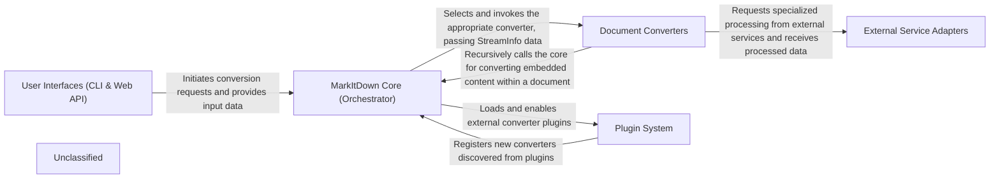

## Details

The `markitdown` project is structured around a central `MarkItDown Core` orchestrator that manages document conversion workflows. User interactions, whether via a `CLI` or a conceptual `Web API`, initiate conversion requests. The core dynamically selects and invokes specialized `Document Converters` based on the input document type. These converters can leverage `External Service Adapters` for advanced processing, such as AI-powered analysis. The system's extensibility is facilitated by a `Plugin System`, allowing for the integration of new converters and functionalities.

### User Interfaces (CLI & Web API)
Provides the primary interaction points for users, including a command-line interface for initiating document conversion.

**Related Classes/Methods**:

- <a href="https://github.com/microsoft/markitdown/blob/main/packages/markitdown/src/markitdown/__main__.py" target="_blank" rel="noopener noreferrer">`markitdown.__main__`</a>

### MarkItDown Core (Orchestrator)
The central engine responsible for managing the overall conversion workflow, registering converters, determining input types, and executing the conversion process. It also handles plugin integration.

**Related Classes/Methods**:

- <a href="https://github.com/microsoft/markitdown/blob/main/packages/markitdown/src/markitdown/_markitdown.py#L93-L776" target="_blank" rel="noopener noreferrer">`markitdown._markitdown.Markitdown`:93-776</a>

### Document Converters
A collection of specialized modules, each designed to transform a specific document or data format (e.g., HTML, PPTX, EPUB, images) into Markdown. These converters encapsulate the format-specific parsing and conversion logic.

**Related Classes/Methods**:

- <a href="https://github.com/microsoft/markitdown/blob/main/packages/markitdown/src/markitdown/converters/" target="_blank" rel="noopener noreferrer">`markitdown.converters`</a>

### External Service Adapters
Modules that provide standardized interfaces for interacting with external APIs and services, such as Azure Document Intelligence for advanced analysis or Large Language Models (LLMs) for image descriptions, enhancing the conversion capabilities.

**Related Classes/Methods**:

- <a href="https://github.com/microsoft/markitdown/blob/main/packages/markitdown/src/markitdown/converters/_doc_intel_converter.py#L130-L254" target="_blank" rel="noopener noreferrer">`markitdown.converters._doc_intel_converter.DocumentIntelligenceConverter`:130-254</a>

### Plugin System
Manages the discovery, loading, and integration of external converter plugins, allowing for dynamic extension of `markitdown`'s capabilities with new document types or functionalities.

**Related Classes/Methods**:

- <a href="https://github.com/microsoft/markitdown/blob/main/packages/markitdown/src/markitdown/_markitdown.py" target="_blank" rel="noopener noreferrer">`markitdown._markitdown.Markitdown:enable_plugins`</a>
- <a href="https://github.com/microsoft/markitdown/blob/main/packages/markitdown/src/markitdown/_markitdown.py" target="_blank" rel="noopener noreferrer">`markitdown._markitdown.Markitdown:_load_plugins`</a>

### Unclassified
Component for all unclassified files and utility functions (Utility functions/External Libraries/Dependencies)

**Related Classes/Methods**: _None_

### [FAQ](https://github.com/CodeBoarding/GeneratedOnBoardings/tree/main?tab=readme-ov-file#faq)