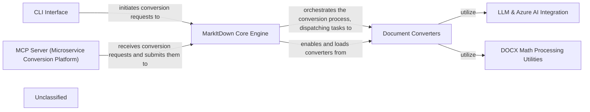

## Details

The MarkItDown project is structured around a core engine that facilitates the conversion of various document formats into Markdown. It offers both a command-line interface for direct user interaction and a microservice platform for distributed conversion tasks. The core engine dynamically registers and utilizes a suite of document converters, including specialized modules for handling different file types (e.g., PPTX, DOCX, PDF) and integrating with external services like LLMs and Azure Document Intelligence for enhanced content processing. A dedicated utility component handles complex pre-processing, such as converting mathematical equations in DOCX files. This modular design allows for extensibility through a plugin system, enabling the integration of third-party converters.

### CLI Interface
The primary command-line entry point for users to interact with MarkItDown, initiating document conversion processes.

**Related Classes/Methods**:

- <a href="https://github.com/microsoft/markitdown/blob/mainpackages/markitdown/src/markitdown/__main__.py#L13-L200" target="_blank" rel="noopener noreferrer">`markitdown.__main__.main`:13-200</a>

### MarkItDown Core Engine
The central orchestrator of the MarkItDown system, managing converter registration, plugin loading, and dispatching conversion tasks.

**Related Classes/Methods**:

- <a href="https://github.com/microsoft/markitdown/blob/mainpackages/markitdown/src/markitdown/_markitdown.py#L93-L776" target="_blank" rel="noopener noreferrer">`markitdown._markitdown.MarkItDown`:93-776</a>

### Document Converters
A collection of modules (both built-in and external plugins) designed to convert various document formats (e.g., PPTX, DOCX, PDF, HTML, Image) into Markdown.

**Related Classes/Methods**:

- <a href="https://github.com/microsoft/markitdown/blob/mainpackages/markitdown/src/markitdown/converters/_pptx_converter.py#L34-L264" target="_blank" rel="noopener noreferrer">`markitdown.converters._pptx_converter.PptxConverter`:34-264</a>
- <a href="https://github.com/microsoft/markitdown/blob/mainpackages/markitdown/src/markitdown/converters/_docx_converter.py#L31-L83" target="_blank" rel="noopener noreferrer">`markitdown.converters._docx_converter.DocxConverter`:31-83</a>
- <a href="https://github.com/microsoft/markitdown/blob/mainpackages/markitdown/src/markitdown/converters/_pdf_converter.py#L31-L77" target="_blank" rel="noopener noreferrer">`markitdown.converters._pdf_converter.PdfConverter`:31-77</a>
- <a href="https://github.com/microsoft/markitdown/blob/mainpackages/markitdown-sample-plugin/src/markitdown_sample_plugin/_plugin.py#L34-L71" target="_blank" rel="noopener noreferrer">`markitdown_sample_plugin._plugin.RtfConverter`:34-71</a>

### LLM & Azure AI Integration
Provides functionality to interact with Large Language Models for tasks such as generating descriptions or summaries, and leverages Azure Document Intelligence for advanced document analysis.

**Related Classes/Methods**:

- <a href="https://github.com/microsoft/markitdown/blob/mainpackages/markitdown/src/markitdown/converters/_llm_caption.py#L7-L50" target="_blank" rel="noopener noreferrer">`markitdown.converters._llm_caption.llm_caption`:7-50</a>
- <a href="https://github.com/microsoft/markitdown/blob/mainpackages/markitdown/src/markitdown/converters/_doc_intel_converter.py#L130-L254" target="_blank" rel="noopener noreferrer">`markitdown.converters._doc_intel_converter.DocumentIntelligenceConverter`:130-254</a>

### DOCX Math Processing Utilities
Specialized utilities for pre-processing DOCX files, particularly for handling embedded mathematical equations by converting Office Math Markup Language (OMML) to LaTeX syntax.

**Related Classes/Methods**:

- <a href="https://github.com/microsoft/markitdown/blob/mainpackages/markitdown/src/markitdown/converter_utils/docx/pre_process.py#L118-L156" target="_blank" rel="noopener noreferrer">`markitdown.converter_utils.docx.pre_process.pre_process_docx`:118-156</a>

### MCP Server (Microservice Conversion Platform)
A separate microservice providing an API endpoint for document conversion, enabling MarkItDown functionality in a distributed or serverless environment.

**Related Classes/Methods**:

- <a href="https://github.com/microsoft/markitdown/blob/mainpackages/markitdown-mcp/src/markitdown_mcp/__main__.py#L82-L123" target="_blank" rel="noopener noreferrer">`markitdown_mcp.__main__.main`:82-123</a>

### Unclassified
Component for all unclassified files and utility functions (Utility functions/External Libraries/Dependencies)

**Related Classes/Methods**: _None_

### [FAQ](https://github.com/CodeBoarding/GeneratedOnBoardings/tree/main?tab=readme-ov-file#faq)