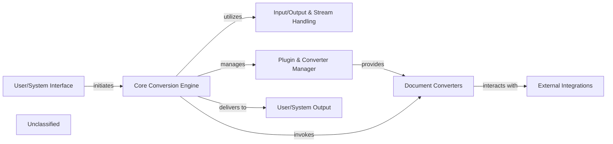

## Details

The MarkItDown system is designed to convert various document formats into a unified Markdown representation, facilitating integration with LLMs and other text-based applications. Its architecture is modular, emphasizing clear separation of concerns for extensibility and maintainability.

### User/System Interface
The primary entry point for users, encompassing both command-line and optional HTTP API interactions. It receives user commands or API requests and forwards them to the core conversion logic.

**Related Classes/Methods**:

- <a href="https://github.com/microsoft/markitdown/blob/main/packages/markitdown/src/markitdown/__main__.py" target="_blank" rel="noopener noreferrer">`markitdown.__main__`</a>
- <a href="https://github.com/microsoft/markitdown/blob/main/packages/markitdown-mcp/src/markitdown_mcp/__main__.py" target="_blank" rel="noopener noreferrer">`markitdown_mcp.__main__`</a>

### Core Conversion Engine
The central orchestrator (MarkItDown facade) responsible for managing the conversion workflow, selecting appropriate converters, and coordinating data flow.

**Related Classes/Methods**:

- <a href="https://github.com/microsoft/markitdown/blob/main/packages/markitdown/src/markitdown/_markitdown.py#L93-L776" target="_blank" rel="noopener noreferrer">`markitdown._markitdown.MarkItDown`:93-776</a>
- <a href="https://github.com/microsoft/markitdown/blob/main/packages/markitdown/src/markitdown/_markitdown.py" target="_blank" rel="noopener noreferrer">`markitdown._markitdown.MarkItDown:convert`</a>

### Input/Output & Stream Handling
Manages the abstraction of input sources (local files, URIs, streams, HTTP responses) and identifies document types to prepare data for conversion.

**Related Classes/Methods**:

- <a href="https://github.com/microsoft/markitdown/blob/main/packages/markitdown/src/markitdown/_markitdown.py#L295-L330" target="_blank" rel="noopener noreferrer">`markitdown._markitdown.convert_local`:295-330</a>
- <a href="https://github.com/microsoft/markitdown/blob/main/packages/markitdown/src/markitdown/_markitdown.py#L398-L457" target="_blank" rel="noopener noreferrer">`markitdown._markitdown.convert_uri`:398-457</a>
- <a href="https://github.com/microsoft/markitdown/blob/main/packages/markitdown/src/markitdown/_markitdown.py#L332-L377" target="_blank" rel="noopener noreferrer">`markitdown._markitdown.convert_stream`:332-377</a>
- <a href="https://github.com/microsoft/markitdown/blob/main/packages/markitdown/src/markitdown/_markitdown.py#L459-L529" target="_blank" rel="noopener noreferrer">`markitdown._markitdown.convert_response`:459-529</a>
- <a href="https://github.com/microsoft/markitdown/blob/main/packages/markitdown/src/markitdown/_markitdown.py#L666-L765" target="_blank" rel="noopener noreferrer">`markitdown._markitdown._get_stream_info_guesses`:666-765</a>

### Plugin & Converter Manager
Handles the discovery, loading, and registration of both built-in and external document converters, enabling the system's extensibility.

**Related Classes/Methods**:

- <a href="https://github.com/microsoft/markitdown/blob/main/packages/markitdown/src/markitdown/_markitdown.py#L133-L223" target="_blank" rel="noopener noreferrer">`markitdown._markitdown.enable_builtins`:133-223</a>
- <a href="https://github.com/microsoft/markitdown/blob/main/packages/markitdown/src/markitdown/_markitdown.py#L225-L243" target="_blank" rel="noopener noreferrer">`markitdown._markitdown.enable_plugins`:225-243</a>
- <a href="https://github.com/microsoft/markitdown/blob/main/packages/markitdown/src/markitdown/_markitdown.py#L634-L664" target="_blank" rel="noopener noreferrer">`markitdown._markitdown.register_converter`:634-664</a>

### Document Converters
A collection of specialized modules, each designed to transform a specific document format (e.g., PDF, DOCX, HTML, Image, Audio) into a unified Markdown representation.

**Related Classes/Methods**:

- <a href="https://github.com/microsoft/markitdown/blob/main/packages/markitdown/src/markitdown/converters/_image_converter.py" target="_blank" rel="noopener noreferrer">`markitdown.converters._image_converter`</a>
- <a href="https://github.com/microsoft/markitdown/blob/main/packages/markitdown/src/markitdown/converters/_outlook_msg_converter.py" target="_blank" rel="noopener noreferrer">`markitdown.converters._outlook_msg_converter`</a>
- <a href="https://github.com/microsoft/markitdown/blob/main/packages/markitdown/src/markitdown/converters/_audio_converter.py" target="_blank" rel="noopener noreferrer">`markitdown.converters._audio_converter`</a>
- <a href="https://github.com/microsoft/markitdown/blob/main/packages/markitdown/src/markitdown/converters/_xlsx_converter.py" target="_blank" rel="noopener noreferrer">`markitdown.converters._xlsx_converter`</a>

### External Integrations
Modules that interface with external AI services (e.g., Azure Document Intelligence), third-party APIs (e.g., YouTube), or utility tools (e.g., ExifTool) to enhance conversion or extract specific content/metadata.

**Related Classes/Methods**:

- <a href="https://github.com/microsoft/markitdown/blob/main/packages/markitdown/src/markitdown/converters/_doc_intel_converter.py" target="_blank" rel="noopener noreferrer">`markitdown.converters._doc_intel_converter`</a>
- <a href="https://github.com/microsoft/markitdown/blob/main/packages/markitdown/src/markitdown/converters/_youtube_converter.py" target="_blank" rel="noopener noreferrer">`markitdown.converters._youtube_converter`</a>
- <a href="https://github.com/microsoft/markitdown/blob/main/packages/markitdown/src/markitdown/converters/_exiftool.py" target="_blank" rel="noopener noreferrer">`markitdown.converters._exiftool`</a>

### User/System Output
Represents the final destination for the generated Markdown content, which can be displayed to the user, saved to a file, or returned as an API response.

**Related Classes/Methods**:

- <a href="https://github.com/microsoft/markitdown/blob/main/packages/markitdown/src/markitdown/_markitdown.py" target="_blank" rel="noopener noreferrer">`markitdown._markitdown.MarkItDown:_convert`</a>

### Unclassified
Component for all unclassified files and utility functions (Utility functions/External Libraries/Dependencies)

**Related Classes/Methods**: _None_

### [FAQ](https://github.com/CodeBoarding/GeneratedOnBoardings/tree/main?tab=readme-ov-file#faq)