```mermaid
graph LR
    CLI_Handler["CLI Handler"]
    Core_Conversion_Orchestrator["Core Conversion Orchestrator"]
    Plugin_Manager["Plugin Manager"]
    Input_Stream_Analyzer["Input Stream Analyzer"]
    Document_Converters_Adapter_Layer_["Document Converters (Adapter Layer)"]
    External_Service_Integrators["External Service Integrators"]
    Unclassified["Unclassified"]
    CLI_Handler -- "initiates conversion requests to" --> Core_Conversion_Orchestrator
    Core_Conversion_Orchestrator -- "loads and registers converters from" --> Plugin_Manager
    Core_Conversion_Orchestrator -- "requests input metadata from" --> Input_Stream_Analyzer
    Core_Conversion_Orchestrator -- "dispatches conversion tasks to" --> Document_Converters_Adapter_Layer_
    Document_Converters_Adapter_Layer_ -- "returns converted content to" --> Core_Conversion_Orchestrator
    Document_Converters_Adapter_Layer_ -- "delegates complex tasks to" --> External_Service_Integrators
    click CLI_Handler href "https://github.com/CodeBoarding/GeneratedOnBoardings/blob/main/markitdown/CLI_Handler.md" "Details"
    click Core_Conversion_Orchestrator href "https://github.com/CodeBoarding/GeneratedOnBoardings/blob/main/markitdown/Core_Conversion_Orchestrator.md" "Details"
    click Plugin_Manager href "https://github.com/CodeBoarding/GeneratedOnBoardings/blob/main/markitdown/Plugin_Manager.md" "Details"
    click Input_Stream_Analyzer href "https://github.com/CodeBoarding/GeneratedOnBoardings/blob/main/markitdown/Input_Stream_Analyzer.md" "Details"
    click Document_Converters_Adapter_Layer_ href "https://github.com/CodeBoarding/GeneratedOnBoardings/blob/main/markitdown/Document_Converters_Adapter_Layer_.md" "Details"
    click External_Service_Integrators href "https://github.com/CodeBoarding/GeneratedOnBoardings/blob/main/markitdown/External_Service_Integrators.md" "Details"
```

## Details

The `markitdown` architecture is designed as a highly modular and extensible utility for converting diverse document formats into Markdown. It operates on a pipeline-oriented processing model, orchestrated by a central `Core Conversion Orchestrator`. User interaction is managed by the `CLI Handler`, which feeds input to the orchestrator. An `Input Stream Analyzer` intelligently identifies document types, guiding the orchestrator to select the appropriate `Document Converters (Adapter Layer)`. This layer, comprising format-specific adapters, handles the actual conversion, optionally leveraging `External Service Integrators` for advanced processing with cloud services like Azure Document Intelligence or LLMs. The system's flexibility is further enhanced by a `Plugin Manager`, enabling dynamic extension of conversion capabilities. This structure ensures clear component boundaries, facilitating maintainability, and allowing for easy integration of new document formats or processing steps, making it ideal for visual representation as a data flow diagram.

### CLI Handler [[Expand]](./CLI_Handler.md)
The primary command-line interface for `markitdown`, responsible for parsing user commands and arguments, then initiating the document conversion workflow.

**Related Classes/Methods**:

- <a href="https://github.com/microsoft/markitdown/blob/main/packages/markitdown/src/markitdown/__main__.py#L13-L200" target="_blank" rel="noopener noreferrer">`packages.markitdown.src.markitdown.__main__.main`:13-200</a>

### Core Conversion Orchestrator [[Expand]](./Core_Conversion_Orchestrator.md)
The central component managing the entire document conversion process, including converter registration, input type detection, and dispatching tasks to appropriate converters. It also holds global configurations.

**Related Classes/Methods**:

- <a href="https://github.com/microsoft/markitdown/blob/main/packages/markitdown/src/markitdown/_markitdown.py#L93-L776" target="_blank" rel="noopener noreferrer">`packages.markitdown.src.markitdown._markitdown.MarkItDown`:93-776</a>
- <a href="https://github.com/microsoft/markitdown/blob/main/packages/markitdown/src/markitdown/_markitdown.py#L245-L293" target="_blank" rel="noopener noreferrer">`packages.markitdown.src.markitdown._markitdown.convert`:245-293</a>

### Plugin Manager [[Expand]](./Plugin_Manager.md)
Handles the discovery, loading, and integration of external document converters and processing plugins, extending the library's capabilities without modifying the core.

**Related Classes/Methods**:

- <a href="https://github.com/microsoft/markitdown/blob/main/packages/markitdown/src/markitdown/_markitdown.py" target="_blank" rel="noopener noreferrer">`packages.markitdown.src.markitdown._markitdown.MarkItDown.enable_plugins`</a>

### Input Stream Analyzer [[Expand]](./Input_Stream_Analyzer.md)
Intelligently analyzes incoming document streams to determine their type, encoding, and other crucial metadata, guiding the Core Conversion Orchestrator in selecting the most suitable converter.

**Related Classes/Methods**:

- <a href="https://github.com/microsoft/markitdown/blob/main/packages/markitdown/src/markitdown/_stream_info.py#L5-L32" target="_blank" rel="noopener noreferrer">`packages.markitdown.src.markitdown._stream_info.StreamInfo`:5-32</a>
- <a href="https://github.com/microsoft/markitdown/blob/main/packages/markitdown/src/markitdown/_markitdown.py#L666-L765" target="_blank" rel="noopener noreferrer">`packages.markitdown.src.markitdown._markitdown._get_stream_info_guesses`:666-765</a>

### Document Converters (Adapter Layer) [[Expand]](./Document_Converters_Adapter_Layer_.md)
A collection of specialized modules, each acting as an adapter to convert a specific document format (e.g., PDF, DOCX, HTML, YouTube) into a standardized Markdown output. This layer also encompasses format-specific pre-processing utilities.

**Related Classes/Methods**:

- <a href="https://github.com/microsoft/markitdown/blob/main/packages/markitdown/src/markitdown/converters/_docx_converter.py#L38-L90" target="_blank" rel="noopener noreferrer">`packages.markitdown.src.markitdown.converters._docx_converter.DocxConverter`:38-90</a>
- <a href="https://github.com/microsoft/markitdown/blob/main/packages/markitdown/src/markitdown/converter_utils/docx/pre_process.py#L118-L156" target="_blank" rel="noopener noreferrer">`packages.markitdown.src.markitdown.converter_utils.docx.pre_process.pre_process_docx`:118-156</a>

### External Service Integrators [[Expand]](./External_Service_Integrators.md)
Encapsulates the logic for interacting with external cloud-based services (e.g., Azure Document Intelligence, Large Language Models) to enhance or offload complex document processing tasks like advanced OCR, layout analysis, or content summarization.

**Related Classes/Methods**:

- <a href="https://github.com/microsoft/markitdown/blob/main/packages/markitdown/src/markitdown/converters/_doc_intel_converter.py#L130-L254" target="_blank" rel="noopener noreferrer">`packages.markitdown.src.markitdown.converters._doc_intel_converter.DocumentIntelligenceConverter`:130-254</a>

### Unclassified
Component for all unclassified files and utility functions (Utility functions/External Libraries/Dependencies)

**Related Classes/Methods**: _None_

### [FAQ](https://github.com/CodeBoarding/GeneratedOnBoardings/tree/main?tab=readme-ov-file#faq)