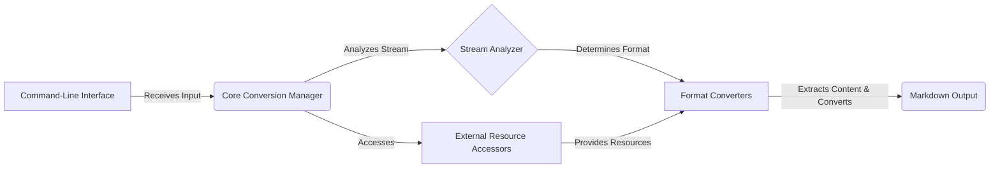

# MarkItDown: High-Level Data Flow Overview

MarkItDown is a versatile tool designed to convert various file formats into Markdown. It supports a wide range of document types, including DOCX, PDF, HTML, and more, leveraging external tools and libraries to extract content and transform it into a human-readable Markdown format.

## Component Descriptions:

**A. Command-Line Interface:** This component serves as the entry point for users, handling command-line arguments and initiating the conversion process. It receives user input, such as the file to be converted and any specified options, and passes this information to the Core Conversion Manager. *Related files*: `repos.markitdown.packages.markitdown.src.markitdown.__main__.main`, `repos.markitdown.packages.markitdown.src.markitdown.__main__._exit_with_error`, `repos.markitdown.packages.markitdown.src.markitdown.__main__._handle_output`.

**B. Core Conversion Manager:** This component orchestrates the entire conversion process. It receives the input from the CLI, uses the Stream Analyzer to determine the file type, selects the appropriate converter from the Format Converters, and manages the overall flow. It also interacts with External Resource Accessors to utilize external tools if needed. *Related files*: `repos.markitdown.packages.markitdown.src.markitdown._markitdown.MarkItDown`, `repos.markitdown.packages.markitdown.src.markitdown._markitdown.MarkItDown.__init__`, `repos.markitdown.packages.markitdown.src.markitdown._markitdown.MarkItDown.convert`.

**C. Stream Analyzer:** This component analyzes the input stream to determine its format and encoding. It provides crucial information to the Core Conversion Manager, enabling it to select the correct converter. It receives the stream from the Core Conversion Manager and determines the format. *Related files*: `repos.markitdown.packages.markitdown.src.markitdown._stream_info.StreamInfo`, `repos.markitdown.packages.markitdown.src.markitdown._markitdown.MarkItDown._get_stream_info_guesses`.

**D. Format Converters:** This component contains a collection of individual converters, each responsible for handling a specific file format. They receive the file from the Core Conversion Manager, extract the content, convert it to Markdown, and pass the Markdown output to the final output stage. It uses resources from the External Resource Accessors if needed. *Related files*: `repos.markitdown.packages.markitdown.src.markitdown.converters._docx_converter.DocxConverter`, `repos.markitdown.packages.markitdown.src.markitdown.converters._pdf_converter.PdfConverter`, `repos.markitdown.packages.markitdown.src.markitdown.converters._html_converter.HtmlConverter`.

**E. Markdown Output:** This component represents the final output of the conversion process. It receives the converted Markdown from the Format Converters and presents it to the user, either by writing it to a file or displaying it on the console. *Related files*: `repos.markitdown.packages.markitdown.src.markitdown.__main__._handle_output`.

**F. External Resource Accessors:** This component provides access to external tools and resources required by the Format Converters. It provides resources to the Format Converters. *Related files*: `repos.markitdown.packages.markitdown.src.markitdown.converters._exiftool.exiftool_metadata`, `repos.markitdown.packages.markitdown.src.markitdown.converters._transcribe_audio.transcribe_audio`.