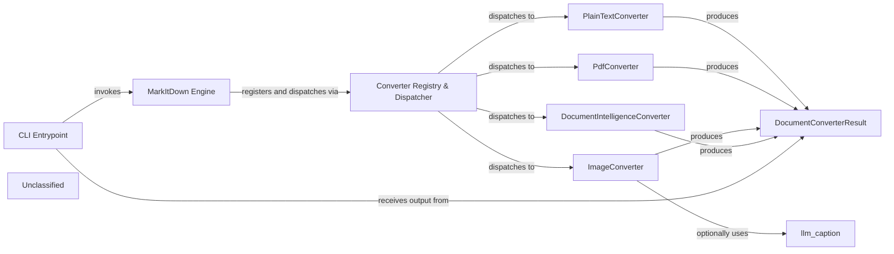

## Details

MarkItDown is a thin, command‑line‑driven document‑to‑markdown engine. The `main()` entry‑point parses user options, builds a `StreamInfo` hint object and instantiates the `MarkItDown` façade. The façade registers a prioritized list of converter objects (plain‑text, PDF, image, Azure Document‑Intelligence, etc.) in a registry. When a conversion request arrives, the registry walks the list, asks each converter whether it accepts the supplied stream, and dispatches to the first matching converter. Converters perform the core transformation and may invoke optional AI enrichment helpers – an OpenAI‑style LLM for image captioning (`llm_caption`) or Azure Document‑Intelligence for OCR‑rich documents. The resulting markdown is returned to the CLI, which writes it to stdout or a user‑specified file. This layered design (CLI → Engine → Registry → Converters → Optional AI) yields a clear, modular data‑flow that maps directly onto a compact flow‑graph with distinct visual boundaries for each architectural component.

### CLI Entrypoint
Entry point that parses command‑line arguments, builds StreamInfo, creates MarkItDown engine, invokes conversion, and writes markdown output.

**Related Classes/Methods**:

- <a href="https://github.com/microsoft/markitdown/blob/main/packages/markitdown/src/markitdown/__main__.py#L13-L200" target="_blank" rel="noopener noreferrer">`markitdown.__main__.main`:13-200</a>

### MarkItDown Engine
Facade that holds the converter registry, registers built‑in converters (and optional plugins) on construction.

**Related Classes/Methods**:

- <a href="https://github.com/microsoft/markitdown/blob/main/packages/markitdown/src/markitdown/_markitdown.py#L93-L776" target="_blank" rel="noopener noreferrer">`markitdown._markitdown.MarkItDown`:93-776</a>

### Converter Registry & Dispatcher
Ordered list of ConverterRegistration objects; dispatches conversion request to the first converter that accepts the stream.

**Related Classes/Methods**:

- <a href="https://github.com/microsoft/markitdown/blob/main/packages/markitdown/src/markitdown/_markitdown.py#L85-L90" target="_blank" rel="noopener noreferrer">`markitdown._markitdown.ConverterRegistration`:85-90</a>

### PlainTextConverter
Handles plain‑text, JSON, and markdown files; implements accepts() and convert().

**Related Classes/Methods**:

- <a href="https://github.com/microsoft/markitdown/blob/main/packages/markitdown/src/markitdown/converters/_plain_text_converter.py#L33-L71" target="_blank" rel="noopener noreferrer">`markitdown.converters._plain_text_converter.PlainTextConverter`:33-71</a>

### PdfConverter
Handles PDF files; implements accepts() and convert().

**Related Classes/Methods**:

- <a href="https://github.com/microsoft/markitdown/blob/main/packages/markitdown/src/markitdown/converters/_pdf_converter.py#L31-L77" target="_blank" rel="noopener noreferrer">`markitdown.converters._pdf_converter.PdfConverter`:31-77</a>

### ImageConverter
Handles JPEG/PNG images; may add EXIF metadata and optional LLM caption.

**Related Classes/Methods**:

- <a href="https://github.com/microsoft/markitdown/blob/main/packages/markitdown/src/markitdown/converters/_image_converter.py#L16-L138" target="_blank" rel="noopener noreferrer">`markitdown.converters._image_converter.ImageConverter`:16-138</a>

### DocumentIntelligenceConverter
Uses Azure Document‑Intelligence service for OCR and layout extraction; also a converter.

**Related Classes/Methods**:

- <a href="https://github.com/microsoft/markitdown/blob/main/packages/markitdown/src/markitdown/converters/_doc_intel_converter.py#L130-L254" target="_blank" rel="noopener noreferrer">`markitdown.converters._doc_intel_converter.DocumentIntelligenceConverter`:130-254</a>

### llm_caption
Helper that generates a natural‑language caption for an image via an OpenAI‑compatible LLM.

**Related Classes/Methods**:

- <a href="https://github.com/microsoft/markitdown/blob/main/packages/markitdown/src/markitdown/converters/_llm_caption.py#L7-L50" target="_blank" rel="noopener noreferrer">`markitdown.converters._llm_caption.llm_caption`:7-50</a>

### DocumentConverterResult
Result object containing generated markdown and related metadata.

**Related Classes/Methods**: _None_

### Unclassified
Component for all unclassified files and utility functions (Utility functions/External Libraries/Dependencies)

**Related Classes/Methods**: _None_

### [FAQ](https://github.com/CodeBoarding/GeneratedOnBoardings/tree/main?tab=readme-ov-file#faq)