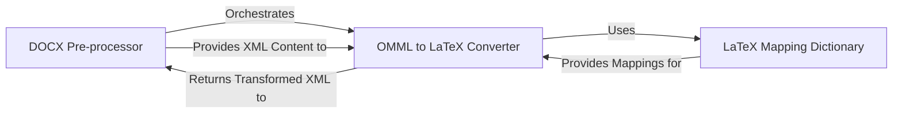

## Component Details

This subsystem is crucial for preparing DOCX files by transforming their internal structure, specifically converting Office Math Markup Language (OMML) to LaTeX, before external HTML conversion. It ensures that mathematical equations are accurately rendered in the final output.

### DOCX Pre-processor
This component is the orchestrator of the DOCX pre-processing pipeline. It handles the in-memory unzipping of the input DOCX file, identifies and extracts specific XML files (`word/document.xml`, `word/footnotes.xml`, `word/endnotes.xml`) that require transformation. It then delegates the content transformation, particularly for mathematical expressions, to the `OMML to LaTeX Converter`. Finally, it re-zips all the processed and unprocessed files back into a new, modified DOCX file in memory.

**Related Classes/Methods**:

- <a href="https://github.com/microsoft/markitdown/blob/master/packages/markitdown/src/markitdown/converter_utils/docx/pre_process.py#L0-L0" target="_blank" rel="noopener noreferrer">`markitdown.converter_utils.docx.pre_process` (0:0)</a>

### OMML to LaTeX Converter
This specialized component is responsible for parsing and transforming Office Math Markup Language (OMML) elements found within the DOCX's internal XML files into standard LaTeX format. It utilizes XML parsing capabilities (likely `ElementTree` or `BeautifulSoup` as seen in the source) and relies heavily on a predefined set of mapping rules provided by the `LaTeX Mapping Dictionary` to perform accurate conversions.

**Related Classes/Methods**:

- <a href="https://github.com/microsoft/markitdown/blob/master/packages/markitdown/src/markitdown/converter_utils/docx/math/omml.py#L0-L0" target="_blank" rel="noopener noreferrer">`markitdown.converter_utils.docx.math.omml` (0:0)</a>

### LaTeX Mapping Dictionary
This component serves as a comprehensive data repository containing the mapping rules and constants necessary for converting various OMML elements, Unicode characters, and mathematical symbols into their corresponding LaTeX representations. It defines the `CHARS`, `CHR`, `CHR_BO`, and `T` dictionaries, which are crucial for the `OMML to LaTeX Converter` to perform accurate transformations.

**Related Classes/Methods**:

- <a href="https://github.com/microsoft/markitdown/blob/master/packages/markitdown/src/markitdown/converter_utils/docx/math/latex_dict.py#L0-L0" target="_blank" rel="noopener noreferrer">`markitdown.converter_utils.docx.math.latex_dict` (0:0)</a>

### [FAQ](https://github.com/CodeBoarding/GeneratedOnBoardings/tree/main?tab=readme-ov-file#faq)