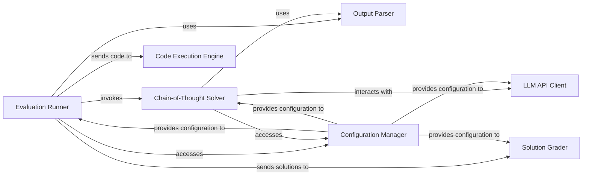

## Details

The `Core Evaluation Engine` subsystem is the central orchestrator of the evaluation workflow, managing problem loading, initiating LLM queries, coordinating output processing, and implementing advanced prompting strategies.

### Evaluation Runner
Manages the overall evaluation lifecycle for a given problem. It coordinates the sequence of operations, including invoking the solver, handling code execution, and directing results to the grader and parser.

**Related Classes/Methods**:

- <a href="https://github.com/eth-sri/matharena/blob/main/src/matharena/runner.py" target="_blank" rel="noopener noreferrer">`Evaluation Runner`</a>

### Chain-of-Thought Solver
Implements the core logic for generating solutions to mathematical problems, specifically leveraging advanced prompting techniques like Chain-of-Thought reasoning by interacting with LLMs.

**Related Classes/Methods**:

- <a href="https://github.com/eth-sri/matharena/blob/main/src/matharena/cot_solver.py" target="_blank" rel="noopener noreferrer">`Chain-of-Thought Solver`</a>

### LLM API Client
Handles interactions with various LLMs, sending prompts and receiving responses. It acts as the interface to external language models.

**Related Classes/Methods**:

- <a href="https://github.com/eth-sri/matharena/blob/main/src/matharena/api.py" target="_blank" rel="noopener noreferrer">`LLM API Client`</a>

### Code Execution Engine
Verifies computational steps by executing code snippets generated by or derived from LLM outputs, ensuring the correctness of intermediate or final solutions.

**Related Classes/Methods**:

- <a href="https://github.com/eth-sri/matharena/blob/main/src/matharena/code_execution.py" target="_blank" rel="noopener noreferrer">`Code Execution Engine`</a>

### Solution Grader
Assesses the correctness and quality of solutions generated by the LLM, often comparing them against ground truth or predefined criteria.

**Related Classes/Methods**:

- <a href="https://github.com/eth-sri/matharena/blob/main/src/matharena/grader.py" target="_blank" rel="noopener noreferrer">`Solution Grader`</a>

### Output Parser
Structures and processes raw LLM outputs into a usable, standardized format, making them amenable for further analysis, grading, or display.

**Related Classes/Methods**:

- <a href="https://github.com/eth-sri/matharena/blob/main/src/matharena/parser.py" target="_blank" rel="noopener noreferrer">`Output Parser`</a>

### Configuration Manager
Centralizes and provides operational parameters, model-specific settings, and API keys to various components, ensuring consistent and flexible system behavior.

**Related Classes/Methods**:

- <a href="https://github.com/eth-sri/matharena/blob/main/src/matharena/configs.py" target="_blank" rel="noopener noreferrer">`Configuration Manager`</a>

### [FAQ](https://github.com/CodeBoarding/GeneratedOnBoardings/tree/main?tab=readme-ov-file#faq)