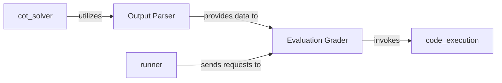

## Details

The `matharena` project focuses on evaluating solutions, likely from Large Language Models (LLMs), for mathematical problems. The `runner` component acts as the orchestrator, initiating the evaluation process. It sends requests to the `Evaluation Grader`, which is central to assessing solution quality. The `Evaluation Grader` relies on the `Output Parser` to receive structured data, and it can invoke the `code_execution` component to verify solutions by running code. Additionally, a `cot_solver` component exists, which likely generates solutions using a Chain-of-Thought approach and utilizes the `Output Parser` to process its own outputs.

### Output Parser
This component is responsible for extracting, normalizing, and validating answers from diverse LLM output formats. It transforms unstructured text (e.g., LLM outputs, problem statements, intermediate reasoning steps) into structured, normalized, and validated data suitable for evaluation, ensuring data consistency across various inputs.

**Related Classes/Methods**:

- <a href="https://github.com/eth-sri/matharena/blob/main/src/matharena/parser.py" target="_blank" rel="noopener noreferrer">`matharena.parser`</a>

### Evaluation Grader
This component performs automated scoring against ground truth or predefined criteria. It assesses the correctness and quality of solutions generated by LLMs or other solvers, applying predefined scoring logic, comparing against ground truth, and potentially executing code snippets for verification.

**Related Classes/Methods**:

- <a href="https://github.com/eth-sri/matharena/blob/main/src/matharena/grader.py" target="_blank" rel="noopener noreferrer">`matharena.grader`</a>

### runner
This component orchestrates the overall execution flow within the `matharena` project. It is responsible for initiating and managing the sequence of operations, such as sending requests to the `Evaluation Grader` to process tasks or evaluate solutions.

**Related Classes/Methods**:

- <a href="https://github.com/eth-sri/matharena/blob/main/src/matharena/runner.py" target="_blank" rel="noopener noreferrer">`matharena.runner`</a>

### code_execution
This component provides a secure and isolated environment for executing code snippets. It is primarily invoked by the `Evaluation Grader` to verify the correctness of generated solutions or to run specific tests as part of the grading process.

**Related Classes/Methods**:

- <a href="https://github.com/eth-sri/matharena/blob/main/src/matharena/code_execution.py" target="_blank" rel="noopener noreferrer">`matharena.code_execution`</a>

### cot_solver
This component implements a Chain-of-Thought (CoT) problem-solving strategy. It is designed to generate step-by-step reasoning to arrive at a solution, often utilizing the `Output Parser` to interpret and structure intermediate thoughts or final answers from an LLM.

**Related Classes/Methods**:

- <a href="https://github.com/eth-sri/matharena/blob/main/src/matharena/cot_solver.py" target="_blank" rel="noopener noreferrer">`matharena.cot_solver`</a>

### [FAQ](https://github.com/CodeBoarding/GeneratedOnBoardings/tree/main?tab=readme-ov-file#faq)