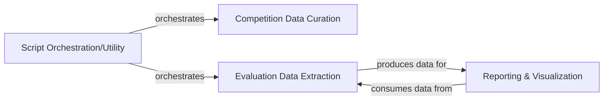

## Details

The `scripts` subsystem in `matharena` primarily manages the lifecycle of data related to LLM competitions. It begins with `Competition Data Curation`, which is responsible for parsing and preparing raw competition data for an external evaluation system. After the LLMs are run by this external system, `Evaluation Data Extraction` processes the raw outputs, extracting structured metrics and scores. Finally, `Reporting & Visualization` consumes this processed data to generate insightful reports and visualizations of LLM performance. All these data-centric operations are orchestrated and initiated by the `Script Orchestration/Utility` component, which acts as the central control point for the entire data pipeline within this subsystem.

### Competition Data Curation
Responsible for parsing raw competition data (e.g., judge outputs) and preparing it for upload and use within the evaluation platform. This includes transforming data into a usable format and managing its ingestion.

**Related Classes/Methods**:

- <a href="https://github.com/eth-sri/matharena/blob/main/scripts/curation/judge_parser.py" target="_blank" rel="noopener noreferrer">`scripts.curation.judge_parser`</a>
- <a href="https://github.com/eth-sri/matharena/blob/main/scripts/curation/upload_competition.py" target="_blank" rel="noopener noreferrer">`scripts.curation.upload_competition`</a>

### Evaluation Data Extraction
Focuses on processing the raw outputs from LLM evaluations. This component extracts structured information, such as scores, specific answer types, or other metrics, from the evaluation results to prepare them for analysis.

**Related Classes/Methods**:

- <a href="https://github.com/eth-sri/matharena/blob/main/scripts/extraction/leaderboard.py" target="_blank" rel="noopener noreferrer">`scripts.extraction.leaderboard`</a>
- <a href="https://github.com/eth-sri/matharena/blob/main/scripts/extraction/type_scoring.py" target="_blank" rel="noopener noreferrer">`scripts.extraction.type_scoring`</a>
- <a href="https://github.com/eth-sri/matharena/blob/main/scripts/extraction/comparison.py" target="_blank" rel="noopener noreferrer">`scripts.extraction.comparison`</a>

### Reporting & Visualization
Generates various reports, statistics, and potentially visualizations based on the processed evaluation data. This component provides insights into LLM performance, comparisons between models, and overall competition results.

**Related Classes/Methods**:

- <a href="https://github.com/eth-sri/matharena/blob/main/scripts/extraction/leaderboard.py" target="_blank" rel="noopener noreferrer">`scripts.extraction.leaderboard`</a>
- <a href="https://github.com/eth-sri/matharena/blob/main/scripts/extraction/type_scoring.py" target="_blank" rel="noopener noreferrer">`scripts.extraction.type_scoring`</a>
- <a href="https://github.com/eth-sri/matharena/blob/main/scripts/extraction/comparison.py" target="_blank" rel="noopener noreferrer">`scripts.extraction.comparison`</a>

### Script Orchestration/Utility
Serves as the main entry point or a utility orchestrator for various data-related operations within the `scripts` suite. It coordinates the execution of curation, extraction, and reporting tasks.

**Related Classes/Methods**:

- <a href="https://github.com/eth-sri/matharena/blob/main/scripts/app.py" target="_blank" rel="noopener noreferrer">`scripts.app`</a>

### [FAQ](https://github.com/CodeBoarding/GeneratedOnBoardings/tree/main?tab=readme-ov-file#faq)