```mermaid
graph LR
    LLM_Integration_Layer["LLM Integration Layer"]
    Code_Execution_Engine["Code Execution Engine"]
    LLM_Interaction_Logic["LLM Interaction Logic"]
    Output_Parsing_and_Validation["Output Parsing and Validation"]
    Configuration_Management["Configuration Management"]
    Evaluation_Engine_Grader["Evaluation Engine - Grader"]
    Configuration_Management -- "provides configurations to" --> LLM_Integration_Layer
    LLM_Interaction_Logic -- "sends prompts/requests to" --> LLM_Integration_Layer
    LLM_Integration_Layer -- "returns raw responses to" --> LLM_Interaction_Logic
    LLM_Interaction_Logic -- "passes raw output to" --> Output_Parsing_and_Validation
    Output_Parsing_and_Validation -- "provides code snippets to" --> Code_Execution_Engine
    Output_Parsing_and_Validation -- "provides parsed answers to" --> Evaluation_Engine_Grader
    Code_Execution_Engine -- "sends execution results to" --> Evaluation_Engine_Grader
```

## Details

The LLM Interaction & Execution subsystem is a critical part of the matharena project, providing the core capabilities for communicating with Large Language Models and safely executing generated code.

### LLM Integration Layer
Manages communication and interaction with various external Large Language Model (LLM) APIs (e.g., OpenAI, Anthropic, Google). It abstracts the specifics of different LLM providers, providing a unified interface for sending prompts and receiving raw responses.

**Related Classes/Methods**:

- <a href="https://github.com/eth-sri/matharena/blob/main/src/matharena/api.py" target="_blank" rel="noopener noreferrer">`LLM Integration Layer`</a>

### Code Execution Engine
Provides a secure environment for executing code snippets that are generated by LLMs or extracted during the parsing phase. This is crucial for verifying executable solutions and ensuring safe execution.

**Related Classes/Methods**:

- <a href="https://github.com/eth-sri/matharena/blob/main/src/matharena/code_execution.py" target="_blank" rel="noopener noreferrer">`Code Execution Engine`</a>

### LLM Interaction Logic
Implements the core logic for solving mathematical problems, often using Chain-of-Thought (CoT) prompting, by interacting with LLMs.

**Related Classes/Methods**:

- <a href="https://github.com/eth-sri/matharena/blob/main/src/matharena/cot_solver.py" target="_blank" rel="noopener noreferrer">`LLM Interaction Logic`</a>

### Output Parsing and Validation
Extracts structured information (answers, code) from raw LLM outputs, preparing it for further processing or execution.

**Related Classes/Methods**:

- <a href="https://github.com/eth-sri/matharena/blob/main/src/matharena/parser.py" target="_blank" rel="noopener noreferrer">`Output Parsing and Validation`</a>

### Configuration Management
Centralizes and provides configuration settings necessary for the operation of various components, including LLM API keys, model parameters, and execution environment settings.

**Related Classes/Methods**:

- <a href="https://github.com/eth-sri/matharena/blob/main/src/matharena/configs.py" target="_blank" rel="noopener noreferrer">`Configuration Management`</a>

### Evaluation Engine - Grader
Evaluates the correctness of solutions against ground truth, including results from code execution and parsed answers.

**Related Classes/Methods**:

- <a href="https://github.com/eth-sri/matharena/blob/main/src/matharena/grader.py" target="_blank" rel="noopener noreferrer">`Evaluation Engine - Grader`</a>

### [FAQ](https://github.com/CodeBoarding/GeneratedOnBoardings/tree/main?tab=readme-ov-file#faq)