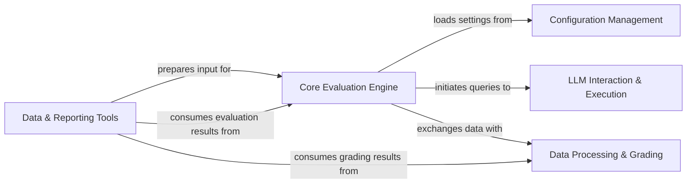

## Details

The MathArena project is designed to evaluate Large Language Models (LLMs) on mathematical problems. The core flow involves loading configurations, running evaluation tasks, interacting with LLMs, processing their outputs, and generating reports.

### Configuration Management
Manages the loading, parsing, and validation of all system configurations, including LLM model parameters, competition details, and evaluation settings.

**Related Classes/Methods**:

- <a href="https://github.com/eth-sri/matharena/blob/main/src/matharena/configs.py" target="_blank" rel="noopener noreferrer">`src/matharena/configs.py`</a>

### LLM Interaction & Execution [[Expand]](./LLM_Interaction_Execution.md)
Provides a unified interface for interacting with various Large Language Model APIs and offers a secure sandbox for executing LLM-generated code.

**Related Classes/Methods**:

- <a href="https://github.com/eth-sri/matharena/blob/main/src/matharena/api.py" target="_blank" rel="noopener noreferrer">`src/matharena/api.py`</a>
- <a href="https://github.com/eth-sri/matharena/blob/main/src/matharena/code_execution.py" target="_blank" rel="noopener noreferrer">`src.matharena.code_execution.py`</a>

### Core Evaluation Engine [[Expand]](./Core_Evaluation_Engine.md)
The central orchestrator of the evaluation workflow, managing problem loading, initiating LLM queries, coordinating output processing, and implementing advanced prompting strategies like Chain-of-Thought.

**Related Classes/Methods**:

- <a href="https://github.com/eth-sri/matharena/blob/main/src/matharena/runner.py" target="_blank" rel="noopener noreferrer">`src/matharena/runner.py`</a>
- <a href="https://github.com/eth-sri/matharena/blob/main/src/matharena/cot_solver.py" target="_blank" rel="noopener noreferrer">`src/matharena/cot_solver.py`</a>

### Data Processing & Grading [[Expand]](./Data_Processing_Grading.md)
Extracts, normalizes, and validates answers from diverse LLM output formats, then performs automated scoring against ground truth or predefined criteria.

**Related Classes/Methods**:

- <a href="https://github.com/eth-sri/matharena/blob/main/src/matharena/parser.py" target="_blank" rel="noopener noreferrer">`src/matharena/parser.py`</a>
- <a href="https://github.com/eth-sri/matharena/blob/main/src/matharena/grader.py" target="_blank" rel="noopener noreferrer">`src/matharena/grader.py`</a>

### Data & Reporting Tools [[Expand]](./Data_Reporting_Tools.md)
A suite of scripts and utilities for preparing and managing competition data, as well as for post-evaluation analysis, statistical reporting, and visualization of results.

**Related Classes/Methods**:

- <a href="https://github.com/eth-sri/matharena/blob/main/scripts/curation/judge_parser.py" target="_blank" rel="noopener noreferrer">`scripts/curation/judge_parser.py`</a>
- <a href="https://github.com/eth-sri/matharena/blob/main/scripts/curation/upload_competition.py" target="_blank" rel="noopener noreferrer">`scripts/curation/upload_competition.py`</a>
- <a href="https://github.com/eth-sri/matharena/blob/main/scripts/app.py" target="_blank" rel="noopener noreferrer">`scripts/app.py`</a>
- <a href="https://github.com/eth-sri/matharena/blob/main/scripts/extraction/leaderboard.py" target="_blank" rel="noopener noreferrer">`scripts/extraction/leaderboard.py`</a>
- <a href="https://github.com/eth-sri/matharena/blob/main/scripts/extraction/type_scoring.py" target="_blank" rel="noopener noreferrer">`scripts/extraction/type_scoring.py`</a>
- <a href="https://github.com/eth-sri/matharena/blob/main/scripts/extraction/comparison.py" target="_blank" rel="noopener noreferrer">`scripts/extraction/comparison.py`</a>

### [FAQ](https://github.com/CodeBoarding/GeneratedOnBoardings/tree/main?tab=readme-ov-file#faq)