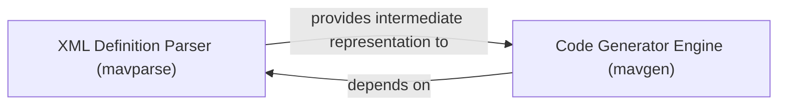

## Details

The MAVLink code generation subsystem primarily consists of two core components: the `XML Definition Parser (mavparse)` and the `Code Generator Engine (mavgen)`. The `mavparse` component is responsible for ingesting raw MAVLink XML definition files, validating their structure, and transforming them into a standardized, internal data representation. This structured output then serves as the essential input for the `mavgen` component. The `mavgen` component, in turn, consumes this intermediate representation and, based on user-specified parameters such as target programming language and MAVLink protocol version, generates the final MAVLink communication source code. This clear separation of concerns ensures that parsing and validation are distinct from the code generation logic, allowing for modularity and maintainability. The `mavgen` component is critically dependent on `mavparse` to receive the pre-processed XML definitions, forming a sequential data flow where parsing precedes and enables code generation.

### XML Definition Parser (mavparse)
This component is responsible for reading, parsing, and validating MAVLink XML definition files. It transforms the raw XML data into a structured, internal representation suitable for subsequent code generation. It acts as the initial stage of the code generation pipeline, ensuring the input XML is well-formed and semantically correct.

**Related Classes/Methods**:

- <a href="https://github.com/mavlink/mavlink/blob/master/" target="_blank" rel="noopener noreferrer">`pymavlink.generator.mavparse`</a>

### Code Generator Engine (mavgen)
This component takes the parsed message definitions provided by the XML Definition Parser (mavparse) and, based on a specified target language (e.g., C, Python), generates the necessary source code files. This includes message structures, serialization/deserialization functions, and utility methods required for MAVLink communication. It embodies the core logic for transforming the abstract protocol definition into concrete, executable code.

**Related Classes/Methods**:

- <a href="https://github.com/mavlink/mavlink/blob/master/" target="_blank" rel="noopener noreferrer">`pymavlink.generator.mavgen`</a>

### [FAQ](https://github.com/CodeBoarding/GeneratedOnBoardings/tree/main?tab=readme-ov-file#faq)