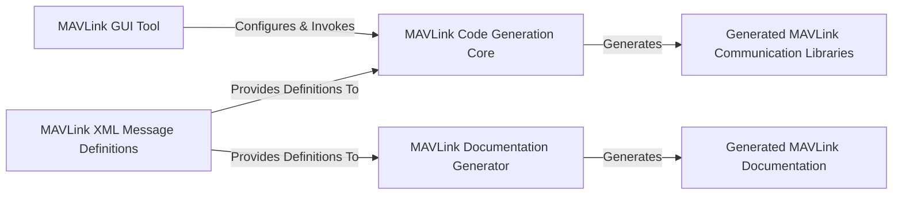

## Details

The MAVLink project operates on a robust definition-driven architecture, centralizing around MAVLink XML Message Definitions as the single source of truth for all MAVLink protocol specifications. These XML definitions serve as the primary input for two distinct generation processes. The MAVLink Code Generation Core consumes these definitions to produce Generated MAVLink Communication Libraries in various programming languages, enabling seamless MAVLink integration into diverse applications. This code generation process is user-configurable and initiated via the MAVLink GUI Tool. Concurrently, the MAVLink Documentation Generator also utilizes the same XML definitions to create comprehensive Generated MAVLink Documentation, ensuring up-to-date and accurate protocol documentation. This architecture ensures consistency across code implementations and documentation, all derived from a unified set of message definitions.

### MAVLink XML Message Definitions
The foundational input for the MAVLink system, comprising XML files that formally define all MAVLink messages, enums, and commands.

**Related Classes/Methods**:

- <a href="https://github.com/mavlink/mavlink/blob/master/message_definitions/v1.0/common.xml" target="_blank" rel="noopener noreferrer">`message_definitions/v1.0/common.xml`</a>

### MAVLink Code Generation Core [[Expand]](./MAVLink_Code_Generation_Core.md)
The central Python library responsible for parsing MAVLink XML definitions and transforming them into language-specific source code.

**Related Classes/Methods**:

- <a href="https://github.com/mavlink/mavlink/blob/master/" target="_blank" rel="noopener noreferrer">`pymavlink.generator.mavgen`</a>
- <a href="https://github.com/mavlink/mavlink/blob/master/" target="_blank" rel="noopener noreferrer">`pymavlink.generator.mavparse`</a>

### MAVLink GUI Tool
A Python-based graphical user interface that provides a user-friendly way to configure and invoke the MAVLink Code Generation Core.

**Related Classes/Methods**:

- <a href="https://github.com/mavlink/mavlink/blob/master/mavgenerate.py#L36-L170" target="_blank" rel="noopener noreferrer">`mavgenerate.Application`:36-170</a>
- <a href="https://github.com/mavlink/mavlink/blob/master/mavgenerate.py" target="_blank" rel="noopener noreferrer">`mavgenerate.py`</a>

### Generated MAVLink Communication Libraries
The direct output of the code generation process, consisting of language-specific source files (e.g., C/C++ headers, Python modules) that provide the API for MAVLink message handling.

**Related Classes/Methods**: _None_

### MAVLink Documentation Generator
A Python utility that processes the MAVLink XML Definitions to produce human-readable documentation, typically in Markdown format.

**Related Classes/Methods**:

- <a href="https://github.com/mavlink/mavlink/blob/master/doc/mavlink_xml_to_markdown.py" target="_blank" rel="noopener noreferrer">`doc.mavlink_xml_to_markdown`</a>
- <a href="https://github.com/mavlink/mavlink/blob/master/doc/mavlink_xml_to_markdown.py" target="_blank" rel="noopener noreferrer">`doc/mavlink_xml_to_markdown.py`</a>

### Generated MAVLink Documentation
The output of the documentation generation process, typically Markdown files containing detailed descriptions of MAVLink messages and commands.

**Related Classes/Methods**: _None_

### [FAQ](https://github.com/CodeBoarding/GeneratedOnBoardings/tree/main?tab=readme-ov-file#faq)