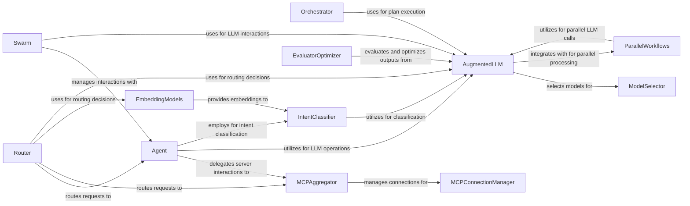

## Component Details

The AI Workflow Orchestration component is a core part of the `mcp-agent` project, designed to manage and execute complex AI-driven tasks. It encompasses functionalities for orchestrating multi-step plans, intelligently routing requests, classifying user intents, enabling parallel LLM execution, managing multi-agent collaborations, and evaluating/optimizing LLM outputs. This component acts as a central hub, coordinating various AI capabilities to achieve sophisticated workflow automation.

### Orchestrator
The Orchestrator component is responsible for executing complex multi-step plans involving interactions with agents and LLMs. It breaks down a plan into individual steps, executes each step, and formats the results. It leverages AugmentedLLM for generating responses and interacting with agents.

**Related Classes/Methods**:

- <a href="https://github.com/lastmile-ai/mcp-agent/blob/master/src/mcp_agent/workflows/orchestrator/orchestrator.py#L63-L122" target="_blank" rel="noopener noreferrer">`mcp-agent.src.mcp_agent.workflows.orchestrator.orchestrator.Orchestrator:__init__` (63:122)</a>
- <a href="https://github.com/lastmile-ai/mcp-agent/blob/master/src/mcp_agent/workflows/orchestrator/orchestrator.py#L124-L185" target="_blank" rel="noopener noreferrer">`mcp-agent.src.mcp_agent.workflows.orchestrator.orchestrator.Orchestrator:generate` (124:185)</a>
- <a href="https://github.com/lastmile-ai/mcp-agent/blob/master/src/mcp_agent/workflows/orchestrator/orchestrator.py#L187-L213" target="_blank" rel="noopener noreferrer">`mcp-agent.src.mcp_agent.workflows.orchestrator.orchestrator.Orchestrator:generate_str` (187:213)</a>
- <a href="https://github.com/lastmile-ai/mcp-agent/blob/master/src/mcp_agent/workflows/orchestrator/orchestrator.py#L215-L258" target="_blank" rel="noopener noreferrer">`mcp-agent.src.mcp_agent.workflows.orchestrator.orchestrator.Orchestrator:generate_structured` (215:258)</a>
- <a href="https://github.com/lastmile-ai/mcp-agent/blob/master/src/mcp_agent/workflows/orchestrator/orchestrator.py#L260-L404" target="_blank" rel="noopener noreferrer">`mcp-agent.src.mcp_agent.workflows.orchestrator.orchestrator.Orchestrator:execute` (260:404)</a>
- <a href="https://github.com/lastmile-ai/mcp-agent/blob/master/src/mcp_agent/workflows/orchestrator/orchestrator.py#L406-L489" target="_blank" rel="noopener noreferrer">`mcp-agent.src.mcp_agent.workflows.orchestrator.orchestrator.Orchestrator:_execute_step` (406:489)</a>
- <a href="https://github.com/lastmile-ai/mcp-agent/blob/master/src/mcp_agent/workflows/orchestrator/orchestrator.py#L491-L520" target="_blank" rel="noopener noreferrer">`mcp-agent.src.mcp_agent.workflows.orchestrator.orchestrator.Orchestrator:_get_full_plan` (491:520)</a>
- <a href="https://github.com/lastmile-ai/mcp-agent/blob/master/src/mcp_agent/workflows/orchestrator/orchestrator.py#L522-L548" target="_blank" rel="noopener noreferrer">`mcp-agent.src.mcp_agent.workflows.orchestrator.orchestrator.Orchestrator:_get_next_step` (522:548)</a>
- <a href="https://github.com/lastmile-ai/mcp-agent/blob/master/src/mcp_agent/workflows/orchestrator/orchestrator.py#L563-L586" target="_blank" rel="noopener noreferrer">`mcp-agent.src.mcp_agent.workflows.orchestrator.orchestrator.Orchestrator:_format_agent_info` (563:586)</a>
- <a href="https://github.com/lastmile-ai/mcp-agent/blob/master/src/mcp_agent/workflows/orchestrator/orchestrator_models.py#L126-L135" target="_blank" rel="noopener noreferrer">`mcp-agent.src.mcp_agent.workflows.orchestrator.orchestrator_models:format_step_result` (126:135)</a>
- <a href="https://github.com/lastmile-ai/mcp-agent/blob/master/src/mcp_agent/workflows/orchestrator/orchestrator_models.py#L138-L154" target="_blank" rel="noopener noreferrer">`mcp-agent.src.mcp_agent.workflows.orchestrator.orchestrator_models:format_plan_result` (138:154)</a>

### Router
The Router component is responsible for intelligently directing requests to appropriate agents, servers, or functions. It provides different routing strategies, including embedding-based and LLM-based approaches, to ensure requests are handled by the most suitable destination.

**Related Classes/Methods**:

- <a href="https://github.com/lastmile-ai/mcp-agent/blob/master/src/mcp_agent/workflows/router/router_embedding.py#L51-L68" target="_blank" rel="noopener noreferrer">`mcp-agent.src.mcp_agent.workflows.router.router_embedding.EmbeddingRouter:__init__` (51:68)</a>
- <a href="https://github.com/lastmile-ai/mcp-agent/blob/master/src/mcp_agent/workflows/router/router_embedding.py#L71-L91" target="_blank" rel="noopener noreferrer">`mcp-agent.src.mcp_agent.workflows.router.router_embedding.EmbeddingRouter:create` (71:91)</a>
- <a href="https://github.com/lastmile-ai/mcp-agent/blob/master/src/mcp_agent/workflows/router/router_embedding.py#L93-L130" target="_blank" rel="noopener noreferrer">`mcp-agent.src.mcp_agent.workflows.router.router_embedding.EmbeddingRouter:initialize` (93:130)</a>
- <a href="https://github.com/lastmile-ai/mcp-agent/blob/master/src/mcp_agent/workflows/router/router_embedding.py#L132-L139" target="_blank" rel="noopener noreferrer">`mcp-agent.src.mcp_agent.workflows.router.router_embedding.EmbeddingRouter:route` (132:139)</a>
- <a href="https://github.com/lastmile-ai/mcp-agent/blob/master/src/mcp_agent/workflows/router/router_embedding.py#L141-L155" target="_blank" rel="noopener noreferrer">`mcp-agent.src.mcp_agent.workflows.router.router_embedding.EmbeddingRouter:route_to_server` (141:155)</a>
- <a href="https://github.com/lastmile-ai/mcp-agent/blob/master/src/mcp_agent/workflows/router/router_embedding.py#L157-L171" target="_blank" rel="noopener noreferrer">`mcp-agent.src.mcp_agent.workflows.router.router_embedding.EmbeddingRouter:route_to_agent` (157:171)</a>
- <a href="https://github.com/lastmile-ai/mcp-agent/blob/master/src/mcp_agent/workflows/router/router_embedding.py#L173-L187" target="_blank" rel="noopener noreferrer">`mcp-agent.src.mcp_agent.workflows.router.router_embedding.EmbeddingRouter:route_to_function` (173:187)</a>
- <a href="https://github.com/lastmile-ai/mcp-agent/blob/master/src/mcp_agent/workflows/router/router_embedding.py#L189-L231" target="_blank" rel="noopener noreferrer">`mcp-agent.src.mcp_agent.workflows.router.router_embedding.EmbeddingRouter:_route_with_embedding` (189:231)</a>
- <a href="https://github.com/lastmile-ai/mcp-agent/blob/master/src/mcp_agent/workflows/router/router_llm_anthropic.py#L23-L47" target="_blank" rel="noopener noreferrer">`mcp-agent.src.mcp_agent.workflows.router.router_llm_anthropic.AnthropicLLMRouter:__init__` (23:47)</a>
- <a href="https://github.com/lastmile-ai/mcp-agent/blob/master/src/mcp_agent/workflows/router/router_llm_anthropic.py#L50-L70" target="_blank" rel="noopener noreferrer">`mcp-agent.src.mcp_agent.workflows.router.router_llm_anthropic.AnthropicLLMRouter:create` (50:70)</a>
- <a href="https://github.com/lastmile-ai/mcp-agent/blob/master/src/mcp_agent/workflows/router/router_base.py#L93-L125" target="_blank" rel="noopener noreferrer">`mcp-agent.src.mcp_agent.workflows.router.router_base.Router:__init__` (93:125)</a>
- <a href="https://github.com/lastmile-ai/mcp-agent/blob/master/src/mcp_agent/workflows/router/router_base.py#L163-L191" target="_blank" rel="noopener noreferrer">`mcp-agent.src.mcp_agent.workflows.router.router_base.Router:initialize` (163:191)</a>
- <a href="https://github.com/lastmile-ai/mcp-agent/blob/master/src/mcp_agent/workflows/router/router_base.py#L193-L203" target="_blank" rel="noopener noreferrer">`mcp-agent.src.mcp_agent.workflows.router.router_base.Router:get_server_category` (193:203)</a>
- <a href="https://github.com/lastmile-ai/mcp-agent/blob/master/src/mcp_agent/workflows/router/router_base.py#L205-L218" target="_blank" rel="noopener noreferrer">`mcp-agent.src.mcp_agent.workflows.router.router_base.Router:get_agent_category` (205:218)</a>
- <a href="https://github.com/lastmile-ai/mcp-agent/blob/master/src/mcp_agent/workflows/router/router_base.py#L220-L227" target="_blank" rel="noopener noreferrer">`mcp-agent.src.mcp_agent.workflows.router.router_base.Router:get_function_category` (220:227)</a>
- <a href="https://github.com/lastmile-ai/mcp-agent/blob/master/src/mcp_agent/workflows/router/router_base.py#L229-L244" target="_blank" rel="noopener noreferrer">`mcp-agent.src.mcp_agent.workflows.router.router_base.Router:format_category` (229:244)</a>
- <a href="https://github.com/lastmile-ai/mcp-agent/blob/master/src/mcp_agent/workflows/router/router_base.py#L258-L262" target="_blank" rel="noopener noreferrer">`mcp-agent.src.mcp_agent.workflows.router.router_base.Router:_format_server_category` (258:262)</a>
- <a href="https://github.com/lastmile-ai/mcp-agent/blob/master/src/mcp_agent/workflows/router/router_embedding_cohere.py#L18-L36" target="_blank" rel="noopener noreferrer">`mcp-agent.src.mcp_agent.workflows.router.router_embedding_cohere.CohereEmbeddingRouter:__init__` (18:36)</a>
- <a href="https://github.com/lastmile-ai/mcp-agent/blob/master/src/mcp_agent/workflows/router/router_embedding_cohere.py#L39-L59" target="_blank" rel="noopener noreferrer">`mcp-agent.src.mcp_agent.workflows.router.router_embedding_cohere.CohereEmbeddingRouter:create` (39:59)</a>
- <a href="https://github.com/lastmile-ai/mcp-agent/blob/master/src/mcp_agent/workflows/router/router_llm_openai.py#L23-L47" target="_blank" rel="noopener noreferrer">`mcp-agent.src.mcp_agent.workflows.router.router_llm_openai.OpenAILLMRouter:__init__` (23:47)</a>
- <a href="https://github.com/lastmile-ai/mcp-agent/blob/master/src/mcp_agent/workflows/router/router_llm_openai.py#L50-L70" target="_blank" rel="noopener noreferrer">`mcp-agent.src.mcp_agent.workflows.router.router_llm_openai.OpenAILLMRouter:create` (50:70)</a>
- <a href="https://github.com/lastmile-ai/mcp-agent/blob/master/src/mcp_agent/workflows/router/router_llm.py#L87-L106" target="_blank" rel="noopener noreferrer">`mcp-agent.src.mcp_agent.workflows.router.router_llm.LLMRouter:__init__` (87:106)</a>
- <a href="https://github.com/lastmile-ai/mcp-agent/blob/master/src/mcp_agent/workflows/router/router_llm.py#L109-L131" target="_blank" rel="noopener noreferrer">`mcp-agent.src.mcp_agent.workflows.router.router_llm.LLMRouter:create` (109:131)</a>
- <a href="https://github.com/lastmile-ai/mcp-agent/blob/master/src/mcp_agent/workflows/router/router_llm.py#L133-L145" target="_blank" rel="noopener noreferrer">`mcp-agent.src.mcp_agent.workflows.router.router_llm.LLMRouter:route` (133:145)</a>
- <a href="https://github.com/lastmile-ai/mcp-agent/blob/master/src/mcp_agent/workflows/router/router_llm.py#L147-L167" target="_blank" rel="noopener noreferrer">`mcp-agent.src.mcp_agent.workflows.router.router_llm.LLMRouter:route_to_server` (147:167)</a>
- <a href="https://github.com/lastmile-ai/mcp-agent/blob/master/src/mcp_agent/workflows/router/router_llm.py#L169-L189" target="_blank" rel="noopener noreferrer">`mcp-agent.src.mcp_agent.workflows.router.router_llm.LLMRouter:route_to_agent` (169:189)</a>
- <a href="https://github.com/lastmile-ai/mcp-agent/blob/master/src/mcp_agent/workflows/router/router_llm.py#L191-L211" target="_blank" rel="noopener noreferrer">`mcp-agent.src.mcp_agent.workflows.router.router_llm.LLMRouter:route_to_function` (191:211)</a>
- <a href="https://github.com/lastmile-ai/mcp-agent/blob/master/src/mcp_agent/workflows/router/router_llm.py#L213-L302" target="_blank" rel="noopener noreferrer">`mcp-agent.src.mcp_agent.workflows.router.router_llm.LLMRouter:_route_with_llm` (213:302)</a>
- <a href="https://github.com/lastmile-ai/mcp-agent/blob/master/src/mcp_agent/workflows/router/router_llm.py#L347-L374" target="_blank" rel="noopener noreferrer">`mcp-agent.src.mcp_agent.workflows.router.router_llm.LLMRouter:_generate_context` (347:374)</a>
- <a href="https://github.com/lastmile-ai/mcp-agent/blob/master/src/mcp_agent/workflows/router/router_embedding_openai.py#L18-L36" target="_blank" rel="noopener noreferrer">`mcp-agent.src.mcp_agent.workflows.router.router_embedding_openai.OpenAIEmbeddingRouter:__init__` (18:36)</a>
- <a href="https://github.com/lastmile-ai/mcp-agent/blob/master/src/mcp_agent/workflows/router/router_embedding_openai.py#L39-L59" target="_blank" rel="noopener noreferrer">`mcp-agent.src.mcp_agent.workflows.router.router_embedding_openai.OpenAIEmbeddingRouter:create` (39:59)</a>

### IntentClassifier
The IntentClassifier component is responsible for classifying user intents based on input. It provides a base interface for different classification strategies, including embedding-based and LLM-based approaches. It initializes and uses underlying models to determine the most likely intent.

**Related Classes/Methods**:

- <a href="https://github.com/lastmile-ai/mcp-agent/blob/master/src/mcp_agent/workflows/intent_classifier/intent_classifier_embedding_cohere.py#L18-L28" target="_blank" rel="noopener noreferrer">`mcp-agent.src.mcp_agent.workflows.intent_classifier.intent_classifier_embedding_cohere.CohereEmbeddingIntentClassifier:__init__` (18:28)</a>
- <a href="https://github.com/lastmile-ai/mcp-agent/blob/master/src/mcp_agent/workflows/intent_classifier/intent_classifier_embedding_cohere.py#L31-L45" target="_blank" rel="noopener noreferrer">`mcp-agent.src.mcp_agent.workflows.intent_classifier.intent_classifier_embedding_cohere.CohereEmbeddingIntentClassifier:create` (31:45)</a>
- <a href="https://github.com/lastmile-ai/mcp-agent/blob/master/src/mcp_agent/workflows/intent_classifier/intent_classifier_llm.py#L73-L83" target="_blank" rel="noopener noreferrer">`mcp-agent.src.mcp_agent.workflows.intent_classifier.intent_classifier_llm.LLMIntentClassifier:__init__` (73:83)</a>
- <a href="https://github.com/lastmile-ai/mcp-agent/blob/master/src/mcp_agent/workflows/intent_classifier/intent_classifier_llm.py#L86-L102" target="_blank" rel="noopener noreferrer">`mcp-agent.src.mcp_agent.workflows.intent_classifier.intent_classifier_llm.LLMIntentClassifier:create` (86:102)</a>
- <a href="https://github.com/lastmile-ai/mcp-agent/blob/master/src/mcp_agent/workflows/intent_classifier/intent_classifier_llm.py#L104-L189" target="_blank" rel="noopener noreferrer">`mcp-agent.src.mcp_agent.workflows.intent_classifier.intent_classifier_llm.LLMIntentClassifier:classify` (104:189)</a>
- <a href="https://github.com/lastmile-ai/mcp-agent/blob/master/src/mcp_agent/workflows/intent_classifier/intent_classifier_embedding_openai.py#L18-L28" target="_blank" rel="noopener noreferrer">`mcp-agent.src.mcp_agent.workflows.intent_classifier.intent_classifier_embedding_openai.OpenAIEmbeddingIntentClassifier:__init__` (18:28)</a>
- <a href="https://github.com/lastmile-ai/mcp-agent/blob/master/src/mcp_agent/workflows/intent_classifier/intent_classifier_embedding_openai.py#L31-L45" target="_blank" rel="noopener noreferrer">`mcp-agent.src.mcp_agent.workflows.intent_classifier.intent_classifier_embedding_openai.OpenAIEmbeddingIntentClassifier:create` (31:45)</a>
- <a href="https://github.com/lastmile-ai/mcp-agent/blob/master/src/mcp_agent/workflows/intent_classifier/intent_classifier_llm_openai.py#L24-L43" target="_blank" rel="noopener noreferrer">`mcp-agent.src.mcp_agent.workflows.intent_classifier.intent_classifier_llm_openai.OpenAILLMIntentClassifier:__init__` (24:43)</a>
- <a href="https://github.com/lastmile-ai/mcp-agent/blob/master/src/mcp_agent/workflows/intent_classifier/intent_classifier_llm_openai.py#L46-L66" target="_blank" rel="noopener noreferrer">`mcp-agent.src.mcp_agent.workflows.intent_classifier.intent_classifier_llm_openai.OpenAILLMIntentClassifier:create` (46:66)</a>
- <a href="https://github.com/lastmile-ai/mcp-agent/blob/master/src/mcp_agent/workflows/intent_classifier/intent_classifier_embedding.py#L45-L54" target="_blank" rel="noopener noreferrer">`mcp-agent.src.mcp_agent.workflows.intent_classifier.intent_classifier_embedding.EmbeddingIntentClassifier:__init__` (45:54)</a>
- <a href="https://github.com/lastmile-ai/mcp-agent/blob/master/src/mcp_agent/workflows/intent_classifier/intent_classifier_embedding.py#L57-L71" target="_blank" rel="noopener noreferrer">`mcp-agent.src.mcp_agent.workflows.intent_classifier.intent_classifier_embedding.EmbeddingIntentClassifier:create` (57:71)</a>
- <a href="https://github.com/lastmile-ai/mcp-agent/blob/master/src/mcp_agent/workflows/intent_classifier/intent_classifier_embedding.py#L73-L97" target="_blank" rel="noopener noreferrer">`mcp-agent.src.mcp_agent.workflows.intent_classifier.intent_classifier_embedding.EmbeddingIntentClassifier:initialize` (73:97)</a>
- <a href="https://github.com/lastmile-ai/mcp-agent/blob/master/src/mcp_agent/workflows/intent_classifier/intent_classifier_embedding.py#L99-L178" target="_blank" rel="noopener noreferrer">`mcp-agent.src.mcp_agent.workflows.intent_classifier.intent_classifier_embedding.EmbeddingIntentClassifier:classify` (99:178)</a>
- <a href="https://github.com/lastmile-ai/mcp-agent/blob/master/src/mcp_agent/workflows/intent_classifier/intent_classifier_llm_anthropic.py#L24-L43" target="_blank" rel="noopener noreferrer">`mcp-agent.src.mcp_agent.workflows.intent_classifier.intent_classifier_llm_anthropic.AnthropicLLMIntentClassifier:__init__` (24:43)</a>
- <a href="https://github.com/lastmile-ai/mcp-agent/blob/master/src/mcp_agent/workflows/intent_classifier/intent_classifier_llm_anthropic.py#L46-L66" target="_blank" rel="noopener noreferrer">`mcp-agent.src.mcp_agent.workflows.intent_classifier.intent_classifier_llm_anthropic.AnthropicLLMIntentClassifier:create` (46:66)</a>
- <a href="https://github.com/lastmile-ai/mcp-agent/blob/master/src/mcp_agent/workflows/intent_classifier/intent_classifier_base.py#L59-L67" target="_blank" rel="noopener noreferrer">`mcp-agent.src.mcp_agent.workflows.intent_classifier.intent_classifier_base.IntentClassifier:__init__` (59:67)</a>

### ParallelWorkflows
The ParallelWorkflows component provides mechanisms for executing LLM operations in parallel and aggregating their results. It includes FanIn for combining multiple LLM outputs and FanOut for distributing a single input to multiple LLMs, enabling more complex and efficient LLM-based workflows.

**Related Classes/Methods**:

- <a href="https://github.com/lastmile-ai/mcp-agent/blob/master/src/mcp_agent/workflows/parallel/fan_out.py#L32-L59" target="_blank" rel="noopener noreferrer">`mcp-agent.src.mcp_agent.workflows.parallel.fan_out.FanOut:__init__` (32:59)</a>
- <a href="https://github.com/lastmile-ai/mcp-agent/blob/master/src/mcp_agent/workflows/parallel/fan_out.py#L61-L115" target="_blank" rel="noopener noreferrer">`mcp-agent.src.mcp_agent.workflows.parallel.fan_out.FanOut:generate` (61:115)</a>
- <a href="https://github.com/lastmile-ai/mcp-agent/blob/master/src/mcp_agent/workflows/parallel/fan_out.py#L117-L170" target="_blank" rel="noopener noreferrer">`mcp-agent.src.mcp_agent.workflows.parallel.fan_out.FanOut:generate_str` (117:170)</a>
- <a href="https://github.com/lastmile-ai/mcp-agent/blob/master/src/mcp_agent/workflows/parallel/fan_out.py#L172-L225" target="_blank" rel="noopener noreferrer">`mcp-agent.src.mcp_agent.workflows.parallel.fan_out.FanOut:generate_structured` (172:225)</a>
- <a href="https://github.com/lastmile-ai/mcp-agent/blob/master/src/mcp_agent/workflows/parallel/parallel_llm.py#L53-L99" target="_blank" rel="noopener noreferrer">`mcp-agent.src.mcp_agent.workflows.parallel.parallel_llm.ParallelLLM:__init__` (53:99)</a>
- <a href="https://github.com/lastmile-ai/mcp-agent/blob/master/src/mcp_agent/workflows/parallel/parallel_llm.py#L101-L166" target="_blank" rel="noopener noreferrer">`mcp-agent.src.mcp_agent.workflows.parallel.parallel_llm.ParallelLLM:generate` (101:166)</a>
- <a href="https://github.com/lastmile-ai/mcp-agent/blob/master/src/mcp_agent/workflows/parallel/parallel_llm.py#L168-L216" target="_blank" rel="noopener noreferrer">`mcp-agent.src.mcp_agent.workflows.parallel.parallel_llm.ParallelLLM:generate_str` (168:216)</a>
- <a href="https://github.com/lastmile-ai/mcp-agent/blob/master/src/mcp_agent/workflows/parallel/parallel_llm.py#L218-L280" target="_blank" rel="noopener noreferrer">`mcp-agent.src.mcp_agent.workflows.parallel.parallel_llm.ParallelLLM:generate_structured` (218:280)</a>
- <a href="https://github.com/lastmile-ai/mcp-agent/blob/master/src/mcp_agent/workflows/parallel/fan_in.py#L42-L61" target="_blank" rel="noopener noreferrer">`mcp-agent.src.mcp_agent.workflows.parallel.fan_in.FanIn:__init__` (42:61)</a>
- <a href="https://github.com/lastmile-ai/mcp-agent/blob/master/src/mcp_agent/workflows/parallel/fan_in.py#L63-L107" target="_blank" rel="noopener noreferrer">`mcp-agent.src.mcp_agent.workflows.parallel.fan_in.FanIn:generate` (63:107)</a>
- <a href="https://github.com/lastmile-ai/mcp-agent/blob/master/src/mcp_agent/workflows/parallel/fan_in.py#L109-L144" target="_blank" rel="noopener noreferrer">`mcp-agent.src.mcp_agent.workflows.parallel.fan_in.FanIn:generate_str` (109:144)</a>
- <a href="https://github.com/lastmile-ai/mcp-agent/blob/master/src/mcp_agent/workflows/parallel/fan_in.py#L146-L198" target="_blank" rel="noopener noreferrer">`mcp-agent.src.mcp_agent.workflows.parallel.fan_in.FanIn:generate_structured` (146:198)</a>
- <a href="https://github.com/lastmile-ai/mcp-agent/blob/master/src/mcp_agent/workflows/parallel/fan_in.py#L200-L280" target="_blank" rel="noopener noreferrer">`mcp-agent.src.mcp_agent.workflows.parallel.fan_in.FanIn:aggregate_messages` (200:280)</a>

### Swarm
The Swarm component facilitates collaborative multi-agent interactions. It enables agents to work together on complex tasks, managing the communication and coordination between them.

**Related Classes/Methods**:

- <a href="https://github.com/lastmile-ai/mcp-agent/blob/master/src/mcp_agent/workflows/swarm/swarm.py#L50-L58" target="_blank" rel="noopener noreferrer">`mcp-agent.src.mcp_agent.workflows.swarm.swarm:create_agent_resource` (50:58)</a>
- <a href="https://github.com/lastmile-ai/mcp-agent/blob/master/src/mcp_agent/workflows/swarm/swarm.py#L61-L71" target="_blank" rel="noopener noreferrer">`mcp-agent.src.mcp_agent.workflows.swarm.swarm:create_agent_function_result_resource` (61:71)</a>
- <a href="https://github.com/lastmile-ai/mcp-agent/blob/master/src/mcp_agent/workflows/swarm/swarm.py#L113-L144" target="_blank" rel="noopener noreferrer">`mcp-agent.src.mcp_agent.workflows.swarm.swarm.SwarmAgent:call_tool` (113:144)</a>
- <a href="https://github.com/lastmile-ai/mcp-agent/blob/master/src/mcp_agent/workflows/swarm/swarm.py#L170-L178" target="_blank" rel="noopener noreferrer">`mcp-agent.src.mcp_agent.workflows.swarm.swarm:create_transfer_to_agent_tool` (170:178)</a>
- <a href="https://github.com/lastmile-ai/mcp-agent/blob/master/src/mcp_agent/workflows/swarm/swarm.py#L198-L216" target="_blank" rel="noopener noreferrer">`mcp-agent.src.mcp_agent.workflows.swarm.swarm.Swarm:__init__` (198:216)</a>
- <a href="https://github.com/lastmile-ai/mcp-agent/blob/master/src/mcp_agent/workflows/swarm/swarm.py#L227-L249" target="_blank" rel="noopener noreferrer">`mcp-agent.src.mcp_agent.workflows.swarm.swarm.Swarm:pre_tool_call` (227:249)</a>
- <a href="https://github.com/lastmile-ai/mcp-agent/blob/master/src/mcp_agent/workflows/swarm/swarm.py#L251-L277" target="_blank" rel="noopener noreferrer">`mcp-agent.src.mcp_agent.workflows.swarm.swarm.Swarm:post_tool_call` (251:277)</a>
- <a href="https://github.com/lastmile-ai/mcp-agent/blob/master/src/mcp_agent/workflows/swarm/swarm.py#L319-L320" target="_blank" rel="noopener noreferrer">`mcp-agent.src.mcp_agent.workflows.swarm.swarm.DoneAgent:__init__` (319:320)</a>
- <a href="https://github.com/lastmile-ai/mcp-agent/blob/master/src/mcp_agent/workflows/swarm/swarm_openai.py#L14-L41" target="_blank" rel="noopener noreferrer">`mcp-agent.src.mcp_agent.workflows.swarm.swarm_openai.OpenAISwarm:generate` (14:41)</a>
- <a href="https://github.com/lastmile-ai/mcp-agent/blob/master/src/mcp_agent/workflows/swarm/swarm_anthropic.py#L15-L42" target="_blank" rel="noopener noreferrer">`mcp-agent.src.mcp_agent.workflows.swarm.swarm_anthropic.AnthropicSwarm:generate` (15:42)</a>

### EvaluatorOptimizer
The EvaluatorOptimizer component is responsible for evaluating and optimizing LLM outputs. It provides mechanisms to assess the quality of generated content and suggest improvements, contributing to the overall effectiveness of AI workflows.

**Related Classes/Methods**:

- <a href="https://github.com/lastmile-ai/mcp-agent/blob/master/src/mcp_agent/workflows/evaluator_optimizer/evaluator_optimizer.py#L69-L155" target="_blank" rel="noopener noreferrer">`mcp-agent.src.mcp_agent.workflows.evaluator_optimizer.evaluator_optimizer.EvaluatorOptimizerLLM:__init__` (69:155)</a>
- <a href="https://github.com/lastmile-ai/mcp-agent/blob/master/src/mcp_agent/workflows/evaluator_optimizer/evaluator_optimizer.py#L157-L355" target="_blank" rel="noopener noreferrer">`mcp-agent.src.mcp_agent.workflows.evaluator_optimizer.evaluator_optimizer.EvaluatorOptimizerLLM:generate` (157:355)</a>
- <a href="https://github.com/lastmile-ai/mcp-agent/blob/master/src/mcp_agent/workflows/evaluator_optimizer/evaluator_optimizer.py#L357-L380" target="_blank" rel="noopener noreferrer">`mcp-agent.src.mcp_agent.workflows.evaluator_optimizer.evaluator_optimizer.EvaluatorOptimizerLLM:generate_str` (357:380)</a>
- <a href="https://github.com/lastmile-ai/mcp-agent/blob/master/src/mcp_agent/workflows/evaluator_optimizer/evaluator_optimizer.py#L382-L423" target="_blank" rel="noopener noreferrer">`mcp-agent.src.mcp_agent.workflows.evaluator_optimizer.evaluator_optimizer.EvaluatorOptimizerLLM:generate_structured` (382:423)</a>

### AugmentedLLM
The AugmentedLLM component provides an augmented interface for interacting with various Large Language Models (LLMs). It handles common LLM operations like generating text, structured output, and integrating with external tools. It also incorporates tracing and logging for observability and uses a ModelSelector to choose the best LLM for a given task.

**Related Classes/Methods**:

- <a href="https://github.com/lastmile-ai/mcp-agent/blob/master/src/mcp_agent/workflows/llm/augmented_llm.py#L222-L275" target="_blank" rel="noopener noreferrer">`mcp-agent.src.mcp_agent.workflows.llm.augmented_llm.AugmentedLLM:__init__` (222:275)</a>
- <a href="https://github.com/lastmile-ai/mcp-agent/blob/master/src/mcp_agent/workflows/llm/augmented_llm.py#L574-L595" target="_blank" rel="noopener noreferrer">`mcp-agent.src.mcp_agent.workflows.llm.augmented_llm.AugmentedLLM:_annotate_span_for_generation_message` (574:595)</a>
- <a href="https://github.com/lastmile-ai/mcp-agent/blob/master/src/mcp_agent/workflows/llm/augmented_llm.py#L529-L572" target="_blank" rel="noopener noreferrer">`mcp-agent.src.mcp_agent.workflows.llm.augmented_llm.AugmentedLLM:annotate_span_with_request_params` (529:572)</a>
- <a href="https://github.com/lastmile-ai/mcp-agent/blob/master/src/mcp_agent/workflows/llm/augmented_llm.py#L423-L501" target="_blank" rel="noopener noreferrer">`mcp-agent.src.mcp_agent.workflows.llm.augmented_llm.AugmentedLLM:call_tool` (423:501)</a>
- <a href="https://github.com/lastmile-ai/mcp-agent/blob/master/src/mcp_agent/workflows/llm/augmented_llm.py#L406-L409" target="_blank" rel="noopener noreferrer">`mcp-agent.src.mcp_agent.workflows.llm.augmented_llm.AugmentedLLM:get_last_message_str` (406:409)</a>
- <a href="https://github.com/lastmile-ai/mcp-agent/blob/master/src/mcp_agent/workflows/llm/augmented_llm.py#L345-L366" target="_blank" rel="noopener noreferrer">`mcp-agent.src.mcp_agent.workflows.llm.augmented_llm.AugmentedLLM:get_request_params` (345:366)</a>
- <a href="https://github.com/lastmile-ai/mcp-agent/blob/master/src/mcp_agent/workflows/llm/augmented_llm.py#L302-L343" target="_blank" rel="noopener noreferrer">`mcp-agent.src.mcp_agent.workflows.llm.augmented_llm.AugmentedLLM:select_model` (302:343)</a>

### Agent
The Agent component serves as the primary interface for interacting with the MCP system. It manages the lifecycle of an agent, including initialization and shutdown, and provides methods for attaching LLMs, calling tools, retrieving capabilities, and managing server sessions. It delegates requests to the MCPAggregator for actual server interactions.

**Related Classes/Methods**:

- <a href="https://github.com/lastmile-ai/mcp-agent/blob/master/src/mcp_agent/agents/agent.py#L273-L275" target="_blank" rel="noopener noreferrer">`mcp-agent.src.mcp_agent.agents.agent.Agent:__aenter__` (273:275)</a>
- <a href="https://github.com/lastmile-ai/mcp-agent/blob/master/src/mcp_agent/agents/agent.py#L277-L278" target="_blank" rel="noopener noreferrer">`mcp-agent.src.mcp_agent.agents.agent.Agent:__aexit__` (277:278)</a>
- <a href="https://github.com/lastmile-ai/mcp-agent/blob/master/src/mcp_agent/agents/agent.py#L148-L181" target="_blank" rel="noopener noreferrer">`mcp-agent.src.mcp_agent.agents.agent.Agent:attach_llm` (148:181)</a>
- <a href="https://github.com/lastmile-ai/mcp-agent/blob/master/src/mcp_agent/agents/agent.py#L647-L716" target="_blank" rel="noopener noreferrer">`mcp-agent.src.mcp_agent.agents.agent.Agent:call_tool` (647:716)</a>
- <a href="https://github.com/lastmile-ai/mcp-agent/blob/master/src/mcp_agent/agents/agent.py#L266-L271" target="_blank" rel="noopener noreferrer">`mcp-agent.src.mcp_agent.agents.agent.Agent:close` (266:271)</a>
- <a href="https://github.com/lastmile-ai/mcp-agent/blob/master/src/mcp_agent/agents/agent.py#L280-L334" target="_blank" rel="noopener noreferrer">`mcp-agent.src.mcp_agent.agents.agent.Agent:get_capabilities` (280:334)</a>
- <a href="https://github.com/lastmile-ai/mcp-agent/blob/master/src/mcp_agent/agents/agent.py#L502-L545" target="_blank" rel="noopener noreferrer">`mcp-agent.src.mcp_agent.agents.agent.Agent:get_prompt` (502:545)</a>
- <a href="https://github.com/lastmile-ai/mcp-agent/blob/master/src/mcp_agent/agents/agent.py#L336-L357" target="_blank" rel="noopener noreferrer">`mcp-agent.src.mcp_agent.agents.agent.Agent:get_server_session` (336:357)</a>
- <a href="https://github.com/lastmile-ai/mcp-agent/blob/master/src/mcp_agent/agents/agent.py#L183-L234" target="_blank" rel="noopener noreferrer">`mcp-agent.src.mcp_agent.agents.agent.Agent:initialize` (183:234)</a>
- <a href="https://github.com/lastmile-ai/mcp-agent/blob/master/src/mcp_agent/agents/agent.py#L458-L500" target="_blank" rel="noopener noreferrer">`mcp-agent.src.mcp_agent.agents.agent.Agent:list_prompts` (458:500)</a>
- <a href="https://github.com/lastmile-ai/mcp-agent/blob/master/src/mcp_agent/agents/agent.py#L359-L456" target="_blank" rel="noopener noreferrer">`mcp-agent.src.mcp_agent.agents.agent.Agent:list_tools` (359:456)</a>
- <a href="https://github.com/lastmile-ai/mcp-agent/blob/master/src/mcp_agent/agents/agent.py#L128-L146" target="_blank" rel="noopener noreferrer">`mcp-agent.src.mcp_agent.agents.agent.Agent:model_post_init` (128:146)</a>
- <a href="https://github.com/lastmile-ai/mcp-agent/blob/master/src/mcp_agent/agents/agent.py#L547-L645" target="_blank" rel="noopener noreferrer">`mcp-agent.src.mcp_agent.agents.agent.Agent:request_human_input` (547:645)</a>
- <a href="https://github.com/lastmile-ai/mcp-agent/blob/master/src/mcp_agent/agents/agent.py#L236-L264" target="_blank" rel="noopener noreferrer">`mcp-agent.src.mcp_agent.agents.agent.Agent:shutdown` (236:264)</a>
- <a href="https://github.com/lastmile-ai/mcp-agent/blob/master/src/mcp_agent/agents/agent.py#L850-L1000" target="_blank" rel="noopener noreferrer">`mcp-agent.src.mcp_agent.agents.agent.AgentTasks` (850:1000)</a>

### MCPAggregator
The MCPAggregator component is responsible for managing interactions with multiple MCP servers. It handles the loading and refreshing of server capabilities (tools and prompts), and acts as a central point for calling tools and retrieving prompts from various connected servers. It uses the MCPConnectionManager to establish and manage server connections.

**Related Classes/Methods**:

- <a href="https://github.com/lastmile-ai/mcp-agent/blob/master/src/mcp_agent/mcp/mcp_aggregator.py#L80-L82" target="_blank" rel="noopener noreferrer">`mcp-agent.src.mcp_agent.mcp.mcp_aggregator.MCPAggregator:__aenter__` (80:82)</a>
- <a href="https://github.com/lastmile-ai/mcp-agent/blob/master/src/mcp_agent/mcp/mcp_aggregator.py#L84-L85" target="_blank" rel="noopener noreferrer">`mcp-agent.src.mcp_agent.mcp.mcp_aggregator.MCPAggregator:__aexit__` (84:85)</a>
- <a href="https://github.com/lastmile-ai/mcp-agent/blob/master/src/mcp_agent/mcp/mcp_aggregator.py#L87-L125" target="_blank" rel="noopener noreferrer">`mcp-agent.src.mcp_agent.mcp.mcp_aggregator.MCPAggregator:__init__` (87:125)</a>
- `mcp-agent.src.mcp_agent.mcp.mcp_aggregator.MCPAggregator:_fetch_capabilities` (full file reference)
- `mcp-agent.src.mcp_agent.mcp.mcp_aggregator.MCPAggregator:_fetch_prompts` (full file reference)
- `mcp-agent.src.mcp_agent.mcp.mcp_aggregator.MCPAggregator:_fetch_tools` (full file reference)
- <a href="https://github.com/lastmile-ai/mcp-agent/blob/master/src/mcp_agent/mcp/mcp_aggregator.py#L955-L1000" target="_blank" rel="noopener noreferrer">`mcp-agent.src.mcp_agent.mcp.mcp_aggregator.MCPAggregator:_parse_capability_name` (955:1000)</a>
- `mcp-agent.src.mcp_agent.mcp.mcp_aggregator.MCPAggregator:_start_server` (full file reference)
- `mcp-agent.src.mcp_agent.mcp.mcp_aggregator.MCPAggregator.call_tool._annotate_span_for_result` (full file reference)
- `mcp-agent.src.mcp_agent.mcp.mcp_aggregator.MCPAggregator.call_tool.try_call_tool` (full file reference)
- `mcp-agent.src.mcp_agent.mcp.mcp_aggregator.MCPAggregator.get_capabilities._annotate_span_for_capabilities` (full file reference)
- `mcp-agent.src.mcp_agent.mcp.mcp_aggregator.MCPAggregator.get_prompt.try_get_prompt` (full file reference)
- <a href="https://github.com/lastmile-ai/mcp-agent/blob/master/src/mcp_agent/mcp/mcp_aggregator.py#L303-L376" target="_blank" rel="noopener noreferrer">`mcp-agent.src.mcp_agent.mcp.mcp_aggregator.MCPAggregator.load_server` (303:376)</a>
- <a href="https://github.com/lastmile-ai/mcp-agent/blob/master/src/mcp_agent/mcp/mcp_aggregator.py#L378-L433" target="_blank" rel="noopener noreferrer">`mcp-agent.src.mcp_agent.mcp.mcp_aggregator.MCPAggregator.load_servers` (378:433)</a>
- <a href="https://github.com/lastmile-ai/mcp-agent/blob/master/src/mcp_agent/mcp/mcp_aggregator.py#L603-L743" target="_blank" rel="noopener noreferrer">`mcp-agent.src.mcp_agent.mcp.mcp_aggregator.MCPAggregator:call_tool` (603:743)</a>
- <a href="https://github.com/lastmile-ai/mcp-agent/blob/master/src/mcp_agent/mcp/mcp_aggregator.py#L175-L256" target="_blank" rel="noopener noreferrer">`mcp-agent.src.mcp_agent.mcp.mcp_aggregator.MCPAggregator:close` (175:256)</a>
- <a href="https://github.com/lastmile-ai/mcp-agent/blob/master/src/mcp_agent/mcp/mcp_aggregator.py#L259-L301" target="_blank" rel="noopener noreferrer">`mcp-agent.src.mcp_agent.mcp.mcp_aggregator.MCPAggregator:create` (259:301)</a>
- <a href="https://github.com/lastmile-ai/mcp-agent/blob/master/src/mcp_agent/mcp/mcp_aggregator.py#L463-L530" target="_blank" rel="noopener noreferrer">`mcp-agent.src.mcp_agent.mcp.mcp_aggregator.MCPAggregator:get_capabilities` (463:530)</a>
- <a href="https://github.com/lastmile-ai/mcp-agent/blob/master/src/mcp_agent/mcp/mcp_aggregator.py#L803-L953" target="_blank" rel="noopener noreferrer">`mcp-agent.src.mcp_agent.mcp.mcp_aggregator.MCPAggregator:get_prompt` (803:953)</a>
- <a href="https://github.com/lastmile-ai/mcp-agent/blob/master/src/mcp_agent/mcp/mcp_aggregator.py#L435-L461" target="_blank" rel="noopener noreferrer">`mcp-agent.src.mcp_agent.mcp.mcp_aggregator.MCPAggregator:get_server` (435:461)</a>
- <a href="https://github.com/lastmile-ai/mcp-agent/blob/master/src/mcp_agent/mcp/mcp_aggregator.py#L127-L173" target="_blank" rel="noopener noreferrer">`mcp-agent.src.mcp_agent.mcp.mcp_aggregator.MCPAggregator:initialize` (127:173)</a>
- <a href="https://github.com/lastmile-ai/mcp-agent/blob/master/src/mcp_agent/mcp/mcp_aggregator.py#L745-L801" target="_blank" rel="noopener noreferrer">`mcp-agent.src.mcp_agent.mcp.mcp_aggregator.MCPAggregator:list_prompts` (745:801)</a>
- <a href="https://github.com/lastmile-ai/mcp-agent/blob/master/src/mcp_agent/mcp/mcp_aggregator.py#L545-L557" target="_blank" rel="noopener noreferrer">`mcp-agent.src.mcp_agent.mcp.mcp_aggregator.MCPAggregator:list_servers` (545:557)</a>
- <a href="https://github.com/lastmile-ai/mcp-agent/blob/master/src/mcp_agent/mcp/mcp_aggregator.py#L559-L601" target="_blank" rel="noopener noreferrer">`mcp-agent.src.mcp_agent.mcp.mcp_aggregator.MCPAggregator:list_tools` (559:601)</a>
- <a href="https://github.com/lastmile-ai/mcp-agent/blob/master/src/mcp_agent/mcp/mcp_aggregator.py#L532-L543" target="_blank" rel="noopener noreferrer">`mcp-agent.src.mcp_agent.mcp.mcp_aggregator.MCPAggregator:refresh` (532:543)</a>
- `mcp-agent.src.mcp_agent.mcp.mcp_aggregator.MCPCompoundServer:__init__` (full file reference)
- `mcp-agent.src.mcp_agent.mcp.mcp_aggregator.MCPCompoundServer:_call_tool` (full file reference)
- `mcp-agent.src.mcp_agent.mcp.mcp_aggregator.MCPCompoundServer:_get_prompt` (full file reference)
- `mcp-agent.src.mcp_agent.mcp.mcp_aggregator.MCPCompoundServer:_list_prompts` (full file reference)
- `mcp-agent.src.mcp_agent.mcp.mcp_aggregator.MCPCompoundServer:_list_tools` (full file reference)

### MCPConnectionManager
The MCPConnectionManager is responsible for establishing and managing connections to individual MCP servers. It provides methods to retrieve server instances and their capabilities, handling potential initialization errors. It ensures that server connections are properly disconnected when no longer needed.

**Related Classes/Methods**:

- <a href="https://github.com/lastmile-ai/mcp-agent/blob/master/src/mcp_agent/mcp/mcp_connection_manager.py#L242-L267" target="_blank" rel="noopener noreferrer">`mcp-agent.src.mcp_agent.mcp.mcp_connection_manager.MCPConnectionManager:__aexit__` (242:267)</a>
- <a href="https://github.com/lastmile-ai/mcp-agent/blob/master/src/mcp_agent/mcp/mcp_connection_manager.py#L222-L231" target="_blank" rel="noopener noreferrer">`mcp-agent.src.mcp_agent.mcp.mcp_connection_manager.MCPConnectionManager:__init__` (222:231)</a>
- <a href="https://github.com/lastmile-ai/mcp-agent/blob/master/src/mcp_agent/mcp/mcp_connection_manager.py#L381-L425" target="_blank" rel="noopener noreferrer">`mcp-agent.src.mcp_agent.mcp.mcp_connection_manager.MCPConnectionManager:get_server` (381:425)</a>
- <a href="https://github.com/lastmile-ai/mcp-agent/blob/master/src/mcp_agent/mcp/mcp_connection_manager.py#L427-L439" target="_blank" rel="noopener noreferrer">`mcp-agent.src.mcp_agent.mcp.mcp_connection_manager.MCPConnectionManager:get_server_capabilities` (427:439)</a>
- <a href="https://github.com/lastmile-ai/mcp-agent/blob/master/src/mcp_agent/mcp/mcp_connection_manager.py#L269-L379" target="_blank" rel="noopener noreferrer">`mcp-agent.src.mcp_agent.mcp.mcp_connection_manager.MCPConnectionManager:launch_server` (269:379)</a>

### ModelSelector
The ModelSelector component is responsible for intelligently selecting the best LLM model based on various criteria such as cost, intelligence, and speed. It maintains a registry of available models and their characteristics, allowing the AugmentedLLM to dynamically choose the most suitable model for a given request.

**Related Classes/Methods**:

- <a href="https://github.com/lastmile-ai/mcp-agent/blob/master/src/mcp_agent/workflows/llm/llm_selector.py#L107-L129" target="_blank" rel="noopener noreferrer">`mcp-agent.src.mcp_agent.workflows.llm.llm_selector.ModelSelector:__init__` (107:129)</a>
- <a href="https://github.com/lastmile-ai/mcp-agent/blob/master/src/mcp_agent/workflows/llm/llm_selector.py#L260-L268" target="_blank" rel="noopener noreferrer">`mcp-agent.src.mcp_agent.workflows.llm.llm_selector.ModelSelector:_calculate_cost_score` (260:268)</a>
- <a href="https://github.com/lastmile-ai/mcp-agent/blob/master/src/mcp_agent/workflows/llm/llm_selector.py#L319-L346" target="_blank" rel="noopener noreferrer">`mcp-agent.src.mcp_agent.workflows.llm.llm_selector.ModelSelector:_calculate_max_scores` (319:346)</a>
- <a href="https://github.com/lastmile-ai/mcp-agent/blob/master/src/mcp_agent/workflows/llm/llm_selector.py#L224-L239" target="_blank" rel="noopener noreferrer">`mcp-agent.src.mcp_agent.workflows.llm.llm_selector.ModelSelector:_check_model_hint` (224:239)</a>
- <a href="https://github.com/lastmile-ai/mcp-agent/blob/master/src/mcp_agent/workflows/llm/llm_selector.py#L131-L209" target="_blank" rel="noopener noreferrer">`mcp-agent.src.mcp_agent.workflows.llm.llm_selector.ModelSelector:select_best_model` (131:209)</a>

### EmbeddingModels
The EmbeddingModels component provides interfaces and implementations for generating embeddings from text. These embeddings are used by other components, such as the EmbeddingIntentClassifier, for tasks like similarity comparison and classification. It includes specific implementations for different embedding providers like Cohere and OpenAI.

**Related Classes/Methods**:

- <a href="https://github.com/lastmile-ai/mcp-agent/blob/master/src/mcp_agent/workflows/embedding/embedding_cohere.py#L22-L41" target="_blank" rel="noopener noreferrer">`mcp-agent.src.mcp_agent.workflows.embedding.embedding_cohere.CohereEmbeddingModel:__init__` (22:41)</a>
- <a href="https://github.com/lastmile-ai/mcp-agent/blob/master/src/mcp_agent/workflows/embedding/embedding_cohere.py#L43-L69" target="_blank" rel="noopener noreferrer">`mcp-agent.src.mcp_agent.workflows.embedding.embedding_cohere.CohereEmbeddingModel:embed` (43:69)</a>
- <a href="https://github.com/lastmile-ai/mcp-agent/blob/master/src/mcp_agent/workflows/embedding/embedding_openai.py#L22-L32" target="_blank" rel="noopener noreferrer">`mcp-agent.src.mcp_agent.workflows.embedding.embedding_openai.OpenAIEmbeddingModel:__init__` (22:32)</a>
- <a href="https://github.com/lastmile-ai/mcp-agent/blob/master/src/mcp_agent/workflows/embedding/embedding_openai.py#L34-L67" target="_blank" rel="noopener noreferrer">`mcp-agent.src.mcp_agent.workflows.embedding.embedding_openai.OpenAIEmbeddingModel:embed` (34:67)</a>

### [FAQ](https://github.com/CodeBoarding/GeneratedOnBoardings/tree/main?tab=readme-ov-file#faq)