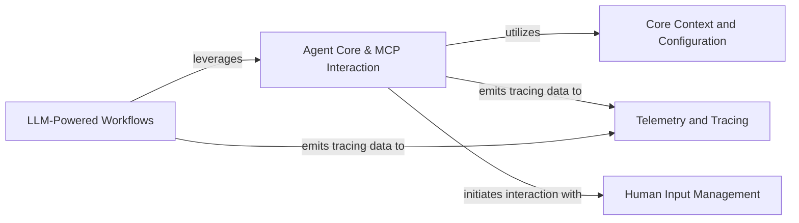

## Component Details

This graph illustrates the core components of the `mcp-agent` system, focusing on the central `Agent Core & MCP Interaction` component which manages agent lifecycle, capability discovery, and communication within the MCP ecosystem. It highlights how `LLM-Powered Workflows` leverage the agent core, and how foundational services like `Core Context and Configuration`, `Telemetry and Tracing`, and `Human Input Management` support the overall system operations. The main flow involves agents utilizing core services and interacting with external MCP servers to execute complex, LLM-driven tasks, with comprehensive tracing for observability.

### Agent Core & MCP Interaction
This component forms the central intelligence and interaction hub of the `mcp-agent`. It manages the lifecycle of an agent, including initialization, shutdown, and the discovery and invocation of capabilities (tools and prompts). Crucially, it integrates augmented LLM functionalities directly, allowing the agent to leverage various LLM providers for complex workflows. It also orchestrates communication within the MCP ecosystem by managing client sessions, server registration, connection management, and aggregating capabilities from diverse MCP servers, providing a unified interface for tool and prompt access.

**Related Classes/Methods**:

- <a href="https://github.com/lastmile-ai/mcp-agent/blob/master/src/mcp_agent/agents/agent.py#L128-L146" target="_blank" rel="noopener noreferrer">`mcp_agent.agents.agent.Agent:model_post_init` (128:146)</a>
- <a href="https://github.com/lastmile-ai/mcp-agent/blob/master/src/mcp_agent/agents/agent.py#L148-L181" target="_blank" rel="noopener noreferrer">`mcp_agent.agents.agent.Agent:attach_llm` (148:181)</a>
- <a href="https://github.com/lastmile-ai/mcp-agent/blob/master/src/mcp_agent/agents/agent.py#L183-L234" target="_blank" rel="noopener noreferrer">`mcp_agent.agents.agent.Agent:initialize` (183:234)</a>
- <a href="https://github.com/lastmile-ai/mcp-agent/blob/master/src/mcp_agent/agents/agent.py#L236-L264" target="_blank" rel="noopener noreferrer">`mcp_agent.agents.agent.Agent:shutdown` (236:264)</a>
- <a href="https://github.com/lastmile-ai/mcp-agent/blob/master/src/mcp_agent/agents/agent.py#L266-L271" target="_blank" rel="noopener noreferrer">`mcp_agent.agents.agent.Agent:close` (266:271)</a>
- <a href="https://github.com/lastmile-ai/mcp-agent/blob/master/src/mcp_agent/agents/agent.py#L273-L275" target="_blank" rel="noopener noreferrer">`mcp_agent.agents.agent.Agent:__aenter__` (273:275)</a>
- <a href="https://github.com/lastmile-ai/mcp-agent/blob/master/src/mcp_agent/agents/agent.py#L277-L278" target="_blank" rel="noopener noreferrer">`mcp_agent.agents.agent.Agent:__aexit__` (277:278)</a>
- <a href="https://github.com/lastmile-ai/mcp-agent/blob/master/src/mcp_agent/agents/agent.py#L280-L334" target="_blank" rel="noopener noreferrer">`mcp_agent.agents.agent.Agent:get_capabilities` (280:334)</a>
- <a href="https://github.com/lastmile-ai/mcp-agent/blob/master/src/mcp_agent/agents/agent.py#L336-L357" target="_blank" rel="noopener noreferrer">`mcp_agent.agents.agent.Agent:get_server_session` (336:357)</a>
- <a href="https://github.com/lastmile-ai/mcp-agent/blob/master/src/mcp_agent/agents/agent.py#L359-L456" target="_blank" rel="noopener noreferrer">`mcp_agent.agents.agent.Agent:list_tools` (359:456)</a>
- <a href="https://github.com/lastmile-ai/mcp-agent/blob/master/src/mcp_agent/agents/agent.py#L458-L500" target="_blank" rel="noopener noreferrer">`mcp_agent.agents.agent.Agent:list_prompts` (458:500)</a>
- <a href="https://github.com/lastmile-ai/mcp-agent/blob/master/src/mcp_agent/agents/agent.py#L502-L545" target="_blank" rel="noopener noreferrer">`mcp_agent.agents.agent.Agent:get_prompt` (502:545)</a>
- <a href="https://github.com/lastmile-ai/mcp-agent/blob/master/src/mcp_agent/agents/agent.py#L547-L645" target="_blank" rel="noopener noreferrer">`mcp_agent.agents.agent.Agent:request_human_input` (547:645)</a>
- <a href="https://github.com/lastmile-ai/mcp-agent/blob/master/src/mcp_agent/agents/agent.py#L647-L716" target="_blank" rel="noopener noreferrer">`mcp_agent.agents.agent.Agent:call_tool` (647:716)</a>
- <a href="https://github.com/lastmile-ai/mcp-agent/blob/master/src/mcp_agent/agents/agent.py#L718-L750" target="_blank" rel="noopener noreferrer">`mcp_agent.agents.agent.Agent:_call_human_input_tool` (718:750)</a>
- <a href="https://github.com/lastmile-ai/mcp-agent/blob/master/src/mcp_agent/agents/agent.py#L866-L902" target="_blank" rel="noopener noreferrer">`mcp_agent.agents.agent.AgentTasks:initialize_aggregator_task` (866:902)</a>
- `mcp_agent.agents.agent.AgentTasks:get_server_session` (full file reference)
- <a href="https://github.com/lastmile-ai/mcp-agent/blob/master/src/mcp_agent/mcp/mcp_agent_client_session.py#L79-L113" target="_blank" rel="noopener noreferrer">`mcp_agent.mcp.mcp_agent_client_session.MCPAgentClientSession:__init__` (79:113)</a>
- <a href="https://github.com/lastmile-ai/mcp-agent/blob/master/src/mcp_agent/mcp/mcp_agent_client_session.py#L139-L215" target="_blank" rel="noopener noreferrer">`mcp_agent.mcp.mcp_agent_client_session.MCPAgentClientSession:send_request` (139:215)</a>
- <a href="https://github.com/lastmile-ai/mcp-agent/blob/master/src/mcp_agent/mcp/mcp_agent_client_session.py#L217-L259" target="_blank" rel="noopener noreferrer">`mcp_agent.mcp.mcp_agent_client_session.MCPAgentClientSession:send_notification` (217:259)</a>
- <a href="https://github.com/lastmile-ai/mcp-agent/blob/master/src/mcp_agent/mcp/mcp_agent_client_session.py#L281-L316" target="_blank" rel="noopener noreferrer">`mcp_agent.mcp.mcp_agent_client_session.MCPAgentClientSession:send_progress_notification` (281:316)</a>
- <a href="https://github.com/lastmile-ai/mcp-agent/blob/master/src/mcp_agent/mcp/mcp_server_registry.py#L65-L79" target="_blank" rel="noopener noreferrer">`mcp_agent.mcp.mcp_server_registry.ServerRegistry:__init__` (65:79)</a>
- <a href="https://github.com/lastmile-ai/mcp-agent/blob/master/src/mcp_agent/mcp/mcp_server_registry.py#L81-L95" target="_blank" rel="noopener noreferrer">`mcp_agent.mcp.mcp_server_registry.ServerRegistry:load_registry_from_file` (81:95)</a>
- <a href="https://github.com/lastmile-ai/mcp-agent/blob/master/src/mcp_agent/mcp/mcp_server_registry.py#L277-L330" target="_blank" rel="noopener noreferrer">`mcp_agent.mcp.mcp_server_registry.ServerRegistry:initialize_server` (277:330)</a>
- <a href="https://github.com/lastmile-ai/mcp-agent/blob/master/src/mcp_agent/mcp/mcp_connection_manager.py#L222-L231" target="_blank" rel="noopener noreferrer">`mcp_agent.mcp.mcp_connection_manager.MCPConnectionManager:__init__` (222:231)</a>
- <a href="https://github.com/lastmile-ai/mcp-agent/blob/master/src/mcp_agent/mcp/mcp_connection_manager.py#L242-L267" target="_blank" rel="noopener noreferrer">`mcp_agent.mcp.mcp_connection_manager.MCPConnectionManager:__aexit__` (242:267)</a>
- <a href="https://github.com/lastmile-ai/mcp-agent/blob/master/src/mcp_agent/mcp/mcp_connection_manager.py#L269-L379" target="_blank" rel="noopener noreferrer">`mcp_agent.mcp.mcp_connection_manager.MCPConnectionManager:launch_server` (269:379)</a>
- <a href="https://github.com/lastmile-ai/mcp-agent/blob/master/src/mcp_agent/mcp/mcp_connection_manager.py#L381-L425" target="_blank" rel="noopener noreferrer">`mcp_agent.mcp.mcp_connection_manager.MCPConnectionManager:get_server` (381:425)</a>
- <a href="https://github.com/lastmile-ai/mcp-agent/blob/master/src/mcp_agent/mcp/mcp_connection_manager.py#L427-L439" target="_blank" rel="noopener noreferrer">`mcp_agent.mcp.mcp_connection_manager.MCPConnectionManager:get_server_capabilities` (427:439)</a>
- <a href="https://github.com/lastmile-ai/mcp-agent/blob/master/src/mcp_agent/mcp/mcp_aggregator.py#L80-L82" target="_blank" rel="noopener noreferrer">`mcp_agent.mcp.mcp_aggregator.MCPAggregator:__aenter__` (80:82)</a>
- <a href="https://github.com/lastmile-ai/mcp-agent/blob/master/src/mcp_agent/mcp/mcp_aggregator.py#L84-L85" target="_blank" rel="noopener noreferrer">`mcp_agent.mcp.mcp_aggregator.MCPAggregator:__aexit__` (84:85)</a>
- <a href="https://github.com/lastmile-ai/mcp-agent/blob/master/src/mcp_agent/mcp/mcp_aggregator.py#L87-L125" target="_blank" rel="noopener noreferrer">`mcp_agent.mcp.mcp_aggregator.MCPAggregator:__init__` (87:125)</a>
- <a href="https://github.com/lastmile-ai/mcp-agent/blob/master/src/mcp_agent/mcp/mcp_aggregator.py#L127-L173" target="_blank" rel="noopener noreferrer">`mcp_agent.mcp.mcp_aggregator.MCPAggregator:initialize` (127:173)</a>
- <a href="https://github.com/lastmile-ai/mcp-agent/blob/master/src/mcp_agent/mcp/mcp_aggregator.py#L175-L256" target="_blank" rel="noopener noreferrer">`mcp_agent.mcp.mcp_aggregator.MCPAggregator:close` (175:256)</a>
- <a href="https://github.com/lastmile-ai/mcp-agent/blob/master/src/mcp_agent/mcp/mcp_aggregator.py#L259-L301" target="_blank" rel="noopener noreferrer">`mcp_agent.mcp.mcp_aggregator.MCPAggregator:create` (259:301)</a>
- <a href="https://github.com/lastmile-ai/mcp-agent/blob/master/src/mcp_agent/mcp/mcp_aggregator.py#L303-L376" target="_blank" rel="noopener noreferrer">`mcp_agent.mcp.mcp_aggregator.MCPAggregator:load_server` (303:376)</a>
- <a href="https://github.com/lastmile-ai/mcp-agent/blob/master/src/mcp_agent/mcp/mcp_aggregator.py#L378-L433" target="_blank" rel="noopener noreferrer">`mcp_agent.mcp.mcp_aggregator.MCPAggregator:load_servers` (378:433)</a>
- <a href="https://github.com/lastmile-ai/mcp-agent/blob/master/src/mcp_agent/mcp/mcp_aggregator.py#L435-L461" target="_blank" rel="noopener noreferrer">`mcp_agent.mcp.mcp_aggregator.MCPAggregator:get_server` (435:461)</a>
- <a href="https://github.com/lastmile-ai/mcp-agent/blob/master/src/mcp_agent/mcp/mcp_aggregator.py#L463-L530" target="_blank" rel="noopener noreferrer">`mcp_agent.mcp.mcp_aggregator.MCPAggregator:get_capabilities` (463:530)</a>
- <a href="https://github.com/lastmile-ai/mcp-agent/blob/master/src/mcp_agent/mcp/mcp_aggregator.py#L532-L543" target="_blank" rel="noopener noreferrer">`mcp_agent.mcp.mcp_aggregator.MCPAggregator:refresh` (532:543)</a>
- <a href="https://github.com/lastmile-ai/mcp-agent/blob/master/src/mcp_agent/mcp/mcp_aggregator.py#L545-L557" target="_blank" rel="noopener noreferrer">`mcp_agent.mcp.mcp_aggregator.MCPAggregator:list_servers` (545:557)</a>
- <a href="https://github.com/lastmile-ai/mcp-agent/blob/master/src/mcp_agent/mcp/mcp_aggregator.py#L559-L601" target="_blank" rel="noopener noreferrer">`mcp_agent.mcp.mcp_aggregator.MCPAggregator:list_tools` (559:601)</a>
- <a href="https://github.com/lastmile-ai/mcp-agent/blob/master/src/mcp_agent/mcp/mcp_aggregator.py#L603-L743" target="_blank" rel="noopener noreferrer">`mcp_agent.mcp.mcp_aggregator.MCPAggregator:call_tool` (603:743)</a>
- <a href="https://github.com/lastmile-ai/mcp-agent/blob/master/src/mcp_agent/mcp/mcp_aggregator.py#L745-L801" target="_blank" rel="noopener noreferrer">`mcp_agent.mcp.mcp_aggregator.MCPAggregator:list_prompts` (745:801)</a>
- <a href="https://github.com/lastmile-ai/mcp-agent/blob/master/src/mcp_agent/mcp/mcp_aggregator.py#L803-L953" target="_blank" rel="noopener noreferrer">`mcp_agent.mcp.mcp_aggregator.MCPAggregator:get_prompt` (803:953)</a>
- <a href="https://github.com/lastmile-ai/mcp-agent/blob/master/src/mcp_agent/mcp/mcp_aggregator.py#L955-L1000" target="_blank" rel="noopener noreferrer">`mcp_agent.mcp.mcp_aggregator.MCPAggregator:_parse_capability_name` (955:1000)</a>
- `mcp_agent.mcp.mcp_aggregator.MCPAggregator:_start_server` (full file reference)
- `mcp_agent.mcp.mcp_aggregator.MCPAggregator:_fetch_tools` (full file reference)
- `mcp_agent.mcp.mcp_aggregator.MCPAggregator:_fetch_prompts` (full file reference)
- `mcp_agent.mcp.mcp_aggregator.MCPAggregator:_fetch_capabilities` (full file reference)
- `mcp_agent.mcp.mcp_aggregator.MCPCompoundServer:__init__` (full file reference)
- `mcp_agent.mcp.mcp_aggregator.MCPCompoundServer:_list_tools` (full file reference)
- `mcp_agent.mcp.mcp_aggregator.MCPCompoundServer:_call_tool` (full file reference)
- `mcp_agent.mcp.mcp_aggregator.MCPCompoundServer:_list_prompts` (full file reference)
- `mcp_agent.mcp.mcp_aggregator.MCPCompoundServer:_get_prompt` (full file reference)
- <a href="https://github.com/lastmile-ai/mcp-agent/blob/master/src/mcp_agent/workflows/llm/augmented_llm.py#L208-L661" target="_blank" rel="noopener noreferrer">`mcp_agent.workflows.llm.augmented_llm.AugmentedLLM` (208:661)</a>

### LLM-Powered Workflows
This component encompasses various advanced workflows that leverage the augmented LLM capabilities provided by the Agent Core. These workflows include orchestration, evaluation, and swarm intelligence, enabling the agent to perform complex, multi-step tasks and collaborate with other agents.

**Related Classes/Methods**:

- <a href="https://github.com/lastmile-ai/mcp-agent/blob/master/src/mcp_agent/workflows/orchestrator/orchestrator.py#L46-L586" target="_blank" rel="noopener noreferrer">`mcp_agent.workflows.orchestrator.orchestrator.Orchestrator` (46:586)</a>
- <a href="https://github.com/lastmile-ai/mcp-agent/blob/master/src/mcp_agent/workflows/evaluator_optimizer/evaluator_optimizer.py#L48-L469" target="_blank" rel="noopener noreferrer">`mcp_agent.workflows.evaluator_optimizer.evaluator_optimizer.EvaluatorOptimizerLLM` (48:469)</a>
- <a href="https://github.com/lastmile-ai/mcp-agent/blob/master/src/mcp_agent/workflows/swarm/swarm.py#L74-L144" target="_blank" rel="noopener noreferrer">`mcp_agent.workflows.swarm.swarm.SwarmAgent` (74:144)</a>

### Core Context and Configuration
Responsible for initializing and managing the global operational context of the mcp-agent. This includes loading settings, configuring executors, workflow registries, telemetry, and logging, providing essential services to other components.

**Related Classes/Methods**:

- `mcp_agent.core.context` (full file reference)
- <a href="https://github.com/lastmile-ai/mcp-agent/blob/master/src/mcp_agent/core/context.py#L218-L241" target="_blank" rel="noopener noreferrer">`mcp_agent.core.context.get_current_context` (218:241)</a>
- <a href="https://github.com/lastmile-ai/mcp-agent/blob/master/src/mcp_agent/config.py#L438-L502" target="_blank" rel="noopener noreferrer">`mcp_agent.config.get_settings` (438:502)</a>

### Telemetry and Tracing
Provides functionalities for tracing and recording attributes across the agent's operations. It's crucial for observability, debugging, and performance monitoring.

**Related Classes/Methods**:

- <a href="https://github.com/lastmile-ai/mcp-agent/blob/master/src/mcp_agent/tracing/telemetry.py#L159-L163" target="_blank" rel="noopener noreferrer">`mcp_agent.tracing.telemetry.get_tracer` (159:163)</a>
- <a href="https://github.com/lastmile-ai/mcp-agent/blob/master/src/mcp_agent/tracing/telemetry.py#L140-L144" target="_blank" rel="noopener noreferrer">`mcp_agent.tracing.telemetry.record_attributes` (140:144)</a>

### Human Input Management
Manages the process of requesting and handling human input within the agent's operations, facilitating interactive workflows.

**Related Classes/Methods**:

- <a href="https://github.com/lastmile-ai/mcp-agent/blob/master/src/mcp_agent/human_input/types.py#L7-L26" target="_blank" rel="noopener noreferrer">`mcp_agent.human_input.types.HumanInputRequest` (7:26)</a>

### [FAQ](https://github.com/CodeBoarding/GeneratedOnBoardings/tree/main?tab=readme-ov-file#faq)