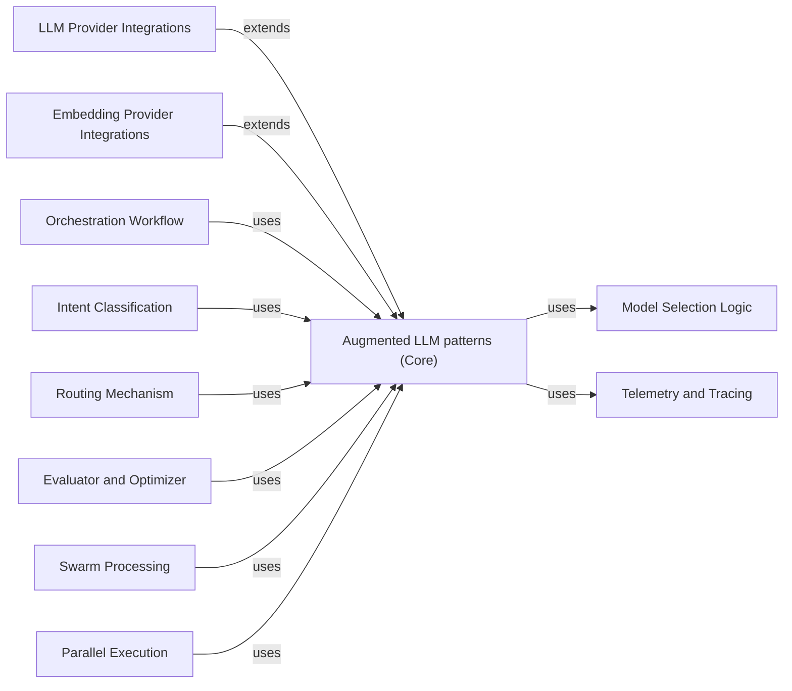

## Component Details

This graph illustrates the architecture of the Augmented LLM patterns subsystem, which provides a unified interface for interacting with various Large Language Models and embedding models from different providers, handling message conversion, model selection, structured output generation, and augmenting LLM capabilities with tool calling and tracing, as well as generating vector embeddings from text.

### Augmented LLM patterns (Core)
Provides a unified interface for interacting with various Large Language Models (LLMs) and embedding models. It handles common functionalities like message conversion, structured output generation, tool calling, and tracing.

**Related Classes/Methods**:

- <a href="https://github.com/lastmile-ai/mcp-agent/blob/master/src/mcp_agent/workflows/llm/augmented_llm.py#L208-L661" target="_blank" rel="noopener noreferrer">`mcp-agent.src.mcp_agent.workflows.llm.augmented_llm.AugmentedLLM` (208:661)</a>
- <a href="https://github.com/lastmile-ai/mcp-agent/blob/master/src/mcp_agent/workflows/llm/augmented_llm.py#L222-L275" target="_blank" rel="noopener noreferrer">`mcp-agent.src.mcp_agent.workflows.llm.augmented_llm.AugmentedLLM:__init__` (222:275)</a>
- <a href="https://github.com/lastmile-ai/mcp-agent/blob/master/src/mcp_agent/workflows/llm/augmented_llm.py#L302-L343" target="_blank" rel="noopener noreferrer">`mcp-agent.src.mcp_agent.workflows.llm.augmented_llm.AugmentedLLM:select_model` (302:343)</a>
- <a href="https://github.com/lastmile-ai/mcp-agent/blob/master/src/mcp_agent/workflows/llm/augmented_llm.py#L345-L366" target="_blank" rel="noopener noreferrer">`mcp-agent.src.mcp_agent.workflows.llm.augmented_llm.AugmentedLLM:get_request_params` (345:366)</a>
- <a href="https://github.com/lastmile-ai/mcp-agent/blob/master/src/mcp_agent/workflows/llm/augmented_llm.py#L406-L409" target="_blank" rel="noopener noreferrer">`mcp-agent.src.mcp_agent.workflows.llm.augmented_llm.AugmentedLLM:get_last_message_str` (406:409)</a>
- <a href="https://github.com/lastmile-ai/mcp-agent/blob/master/src/mcp_agent/workflows/llm/augmented_llm.py#L423-L501" target="_blank" rel="noopener noreferrer">`mcp-agent.src.mcp_agent.workflows.llm.augmented_llm.AugmentedLLM:call_tool` (423:501)</a>
- <a href="https://github.com/lastmile-ai/mcp-agent/blob/master/src/mcp_agent/workflows/llm/augmented_llm.py#L529-L572" target="_blank" rel="noopener noreferrer">`mcp-agent.src.mcp_agent.workflows.llm.augmented_llm.AugmentedLLM:annotate_span_with_request_params` (529:572)</a>
- <a href="https://github.com/lastmile-ai/mcp-agent/blob/master/src/mcp_agent/workflows/llm/augmented_llm.py#L574-L595" target="_blank" rel="noopener noreferrer">`mcp-agent.src.mcp_agent.workflows.llm.augmented_llm.AugmentedLLM:_annotate_span_for_generation_message` (574:595)</a>
- <a href="https://github.com/lastmile-ai/mcp-agent/blob/master/src/mcp_agent/workflows/embedding/embedding_base.py#L14-L32" target="_blank" rel="noopener noreferrer">`mcp_agent.workflows.embedding.embedding_base.EmbeddingModel` (14:32)</a>

### LLM Provider Integrations
Concrete implementations for interacting with specific LLM providers (OpenAI, Anthropic, Azure, Google, Ollama, Bedrock). These components extend the core LLM integration by handling provider-specific API calls, message formatting, and tool execution.

**Related Classes/Methods**:

- `mcp-agent.src.mcp_agent.workflows.llm.augmented_llm_openai.OpenAIAugmentedLLM` (full file reference)
- `mcp-agent.src.mcp_agent.workflows.llm.augmented_llm_openai.OpenAIAugmentedLLM:__init__` (full file reference)
- `mcp-agent.src.mcp_agent.workflows.llm.augmented_llm_openai.OpenAIAugmentedLLM:generate` (full file reference)
- `mcp-agent.src.mcp_agent.workflows.llm.augmented_llm_openai.OpenAIAugmentedLLM:generate_str` (full file reference)
- `mcp-agent.src.mcp_agent.workflows.llm.augmented_llm_openai.OpenAIAugmentedLLM:generate_structured` (full file reference)
- `mcp-agent.src.mcp_agent.workflows.llm.augmented_llm_openai.OpenAIAugmentedLLM:execute_tool_call` (full file reference)
- `mcp-agent.src.mcp_agent.workflows.llm.augmented_llm_openai.OpenAIAugmentedLLM:_annotate_span_for_completion_request` (full file reference)
- `mcp-agent.src.mcp_agent.workflows.llm.augmented_llm_openai.OpenAIAugmentedLLM:_annotate_span_for_completion_response` (full file reference)
- `mcp-agent.src.mcp_agent.workflows.llm.augmented_llm_openai.OpenAIAugmentedLLM:_extract_chat_completion_attributes_for_tracing` (full file reference)
- `mcp-agent.src.mcp_agent.workflows.llm.augmented_llm_openai.OpenAICompletionTasks:request_completion_task` (full file reference)
- `mcp-agent.src.mcp_agent.workflows.llm.augmented_llm_openai.OpenAICompletionTasks:request_structured_completion_task` (full file reference)
- `mcp-agent.src.mcp_agent.workflows.llm.augmented_llm_openai.MCPOpenAITypeConverter:from_mcp_message_param` (full file reference)
- `mcp-agent.src.mcp_agent.workflows.llm.augmented_llm_openai.MCPOpenAITypeConverter:to_mcp_message_param` (full file reference)
- `mcp-agent.src.mcp_agent.workflows.llm.augmented_llm_openai:openai_content_to_mcp_content` (full file reference)
- <a href="https://github.com/lastmile-ai/mcp-agent/blob/master/src/mcp_agent/workflows/llm/augmented_llm_ollama.py#L17-L79" target="_blank" rel="noopener noreferrer">`mcp-agent.src.mcp_agent.workflows.llm.augmented_llm_ollama.OllamaAugmentedLLM` (17:79)</a>
- <a href="https://github.com/lastmile-ai/mcp-agent/blob/master/src/mcp_agent/workflows/llm/augmented_llm_ollama.py#L24-L34" target="_blank" rel="noopener noreferrer">`mcp-agent.src.mcp_agent.workflows.llm.augmented_llm_ollama.OllamaAugmentedLLM:__init__` (24:34)</a>
- <a href="https://github.com/lastmile-ai/mcp-agent/blob/master/src/mcp_agent/workflows/llm/augmented_llm_ollama.py#L36-L79" target="_blank" rel="noopener noreferrer">`mcp-agent.src.mcp_agent.workflows.llm.augmented_llm_ollama.OllamaAugmentedLLM:generate_structured` (36:79)</a>
- <a href="https://github.com/lastmile-ai/mcp-agent/blob/master/src/mcp_agent/workflows/llm/augmented_llm_ollama.py#L85-L121" target="_blank" rel="noopener noreferrer">`mcp-agent.src.mcp_agent.workflows.llm.augmented_llm_ollama.OllamaCompletionTasks:request_structured_completion_task` (85:121)</a>
- `mcp-agent.src.mcp_agent.workflows.llm.augmented_llm_anthropic.AnthropicAugmentedLLM` (full file reference)
- `mcp-agent.src.mcp_agent.workflows.llm.augmented_llm_anthropic.AnthropicAugmentedLLM:__init__` (full file reference)
- `mcp-agent.src.mcp_agent.workflows.llm.augmented_llm_anthropic.AnthropicAugmentedLLM:generate` (full file reference)
- `mcp-agent.src.mcp_agent.workflows.llm.augmented_llm_anthropic.AnthropicAugmentedLLM:generate_str` (full file reference)
- `mcp-agent.src.mcp_agent.workflows.llm.augmented_llm_anthropic.AnthropicAugmentedLLM:generate_structured` (full file reference)
- `mcp-agent.src.mcp_agent.workflows.llm.augmented_llm_anthropic.AnthropicAugmentedLLM:_annotate_span_for_completion_request` (full file reference)
- `mcp-agent.src.mcp_agent.workflows.llm.augmented_llm_anthropic.AnthropicAugmentedLLM:_annotate_span_for_completion_response` (full file reference)
- `mcp-agent.src.mcp_agent.workflows.llm.augmented_llm_anthropic.AnthropicCompletionTasks:request_completion_task` (full file reference)
- `mcp-agent.src.mcp_agent.workflows.llm.augmented_llm_anthropic.AnthropicCompletionTasks:request_structured_completion_task` (full file reference)
- `mcp-agent.src.mcp_agent.workflows.llm.augmented_llm_anthropic.AnthropicMCPTypeConverter:from_mcp_message_result` (full file reference)
- `mcp-agent.src.mcp_agent.workflows.llm.augmented_llm_anthropic.AnthropicMCPTypeConverter:to_mcp_message_result` (full file reference)
- `mcp-agent.src.mcp_agent.workflows.llm.augmented_llm_anthropic.AnthropicMCPTypeConverter:from_mcp_message_param` (full file reference)
- `mcp-agent.src.mcp_agent.workflows.llm.augmented_llm_anthropic.AnthropicMCPTypeConverter:to_mcp_message_param` (full file reference)
- `mcp-agent.src.mcp_agent.workflows.llm.augmented_llm_anthropic.AnthropicMCPTypeConverter:from_mcp_tool_result` (full file reference)
- `mcp-agent.src.mcp_agent.workflows.llm.augmented_llm_anthropic:anthropic_content_to_mcp_content` (full file reference)
- <a href="https://github.com/lastmile-ai/mcp-agent/blob/master/src/mcp_agent/workflows/llm/augmented_llm_azure.py#L82-L492" target="_blank" rel="noopener noreferrer">`mcp-agent.src.mcp_agent.workflows.llm.augmented_llm_azure.AzureAugmentedLLM` (82:492)</a>
- <a href="https://github.com/lastmile-ai/mcp-agent/blob/master/src/mcp_agent/workflows/llm/augmented_llm_azure.py#L88-L124" target="_blank" rel="noopener noreferrer">`mcp-agent.src.mcp_agent.workflows.llm.augmented_llm_azure.AzureAugmentedLLM:__init__` (88:124)</a>
- <a href="https://github.com/lastmile-ai/mcp-agent/blob/master/src/mcp_agent/workflows/llm/augmented_llm_azure.py#L126-L287" target="_blank" rel="noopener noreferrer">`mcp-agent.src.mcp_agent.workflows.llm.augmented_llm_azure.AzureAugmentedLLM:generate` (126:287)</a>
- <a href="https://github.com/lastmile-ai/mcp-agent/blob/master/src/mcp_agent/workflows/llm/augmented_llm_azure.py#L289-L320" target="_blank" rel="noopener noreferrer">`mcp-agent.src.mcp_agent.workflows.llm.augmented_llm_azure.AzureAugmentedLLM:generate_str` (289:320)</a>
- <a href="https://github.com/lastmile-ai/mcp-agent/blob/master/src/mcp_agent/workflows/llm/augmented_llm_azure.py#L322-L343" target="_blank" rel="noopener noreferrer">`mcp-agent.src.mcp_agent.workflows.llm.augmented_llm_azure.AzureAugmentedLLM:generate_structured` (322:343)</a>
- <a href="https://github.com/lastmile-ai/mcp-agent/blob/master/src/mcp_agent/workflows/llm/augmented_llm_azure.py#L356-L404" target="_blank" rel="noopener noreferrer">`mcp-agent.src.mcp_agent.workflows.llm.augmented_llm_azure.AzureAugmentedLLM:execute_tool_call` (356:404)</a>
- <a href="https://github.com/lastmile-ai/mcp-agent/blob/master/src/mcp_agent/workflows/llm/augmented_llm_azure.py#L455-L476" target="_blank" rel="noopener noreferrer">`mcp-agent.src.mcp_agent.workflows.llm.augmented_llm_azure.AzureAugmentedLLM:_annotate_span_for_completion_response` (455:476)</a>
- <a href="https://github.com/lastmile-ai/mcp-agent/blob/master/src/mcp_agent/workflows/llm/augmented_llm_azure.py#L553-L569" target="_blank" rel="noopener noreferrer">`mcp-agent.src.mcp_agent.workflows.llm.augmented_llm_azure.MCPAzureTypeConverter:from_mcp_message_param` (553:569)</a>
- <a href="https://github.com/lastmile-ai/mcp-agent/blob/master/src/mcp_agent/workflows/llm/augmented_llm_azure.py#L572-L615" target="_blank" rel="noopener noreferrer">`mcp-agent.src.mcp_agent.workflows.llm.augmented_llm_azure.MCPAzureTypeConverter:to_mcp_message_param` (572:615)</a>
- <a href="https://github.com/lastmile-ai/mcp-agent/blob/master/src/mcp_agent/workflows/llm/augmented_llm_azure.py#L668-L692" target="_blank" rel="noopener noreferrer">`mcp-agent.src.mcp_agent.workflows.llm.augmented_llm_azure:azure_content_to_mcp_content` (668:692)</a>
- <a href="https://github.com/lastmile-ai/mcp-agent/blob/master/src/mcp_agent/workflows/llm/augmented_llm_google.py#L34-L310" target="_blank" rel="noopener noreferrer">`mcp-agent.src.mcp_agent.workflows.llm.augmented_llm_google.GoogleAugmentedLLM` (34:310)</a>
- <a href="https://github.com/lastmile-ai/mcp-agent/blob/master/src/mcp_agent/workflows/llm/augmented_llm_google.py#L45-L72" target="_blank" rel="noopener noreferrer">`mcp-agent.src.mcp_agent.workflows.llm.augmented_llm_google.GoogleAugmentedLLM:__init__` (45:72)</a>
- <a href="https://github.com/lastmile-ai/mcp-agent/blob/master/src/mcp_agent/workflows/llm/augmented_llm_google.py#L74-L199" target="_blank" rel="noopener noreferrer">`mcp-agent.src.mcp_agent.workflows.llm.augmented_llm_google.GoogleAugmentedLLM:generate` (74:199)</a>
- <a href="https://github.com/lastmile-ai/mcp-agent/blob/master/src/mcp_agent/workflows/llm/augmented_llm_google.py#L201-L227" target="_blank" rel="noopener noreferrer">`mcp-agent.src.mcp_agent.workflows.llm.augmented_llm_google.GoogleAugmentedLLM:generate_str` (201:227)</a>
- <a href="https://github.com/lastmile-ai/mcp-agent/blob/master/src/mcp_agent/workflows/llm/augmented_llm_google.py#L229-L268" target="_blank" rel="noopener noreferrer">`mcp-agent.src.mcp_agent.workflows.llm.augmented_llm_google.GoogleAugmentedLLM:generate_structured` (229:268)</a>
- <a href="https://github.com/lastmile-ai/mcp-agent/blob/master/src/mcp_agent/workflows/llm/augmented_llm_google.py#L275-L300" target="_blank" rel="noopener noreferrer">`mcp-agent.src.mcp_agent.workflows.llm.augmented_llm_google.GoogleAugmentedLLM:execute_tool_call` (275:300)</a>
- <a href="https://github.com/lastmile-ai/mcp-agent/blob/master/src/mcp_agent/workflows/llm/augmented_llm_google.py#L352-L391" target="_blank" rel="noopener noreferrer">`mcp-agent.src.mcp_agent.workflows.llm.augmented_llm_google.GoogleCompletionTasks:request_structured_completion_task` (352:391)</a>
- <a href="https://github.com/lastmile-ai/mcp-agent/blob/master/src/mcp_agent/workflows/llm/augmented_llm_google.py#L421-L433" target="_blank" rel="noopener noreferrer">`mcp-agent.src.mcp_agent.workflows.llm.augmented_llm_google.GoogleMCPTypeConverter:from_mcp_message_param` (421:433)</a>
- <a href="https://github.com/lastmile-ai/mcp-agent/blob/master/src/mcp_agent/workflows/llm/augmented_llm_google.py#L436-L451" target="_blank" rel="noopener noreferrer">`mcp-agent.src.mcp_agent.workflows.llm.augmented_llm_google.GoogleMCPTypeConverter:to_mcp_message_result` (436:451)</a>
- <a href="https://github.com/lastmile-ai/mcp-agent/blob/master/src/mcp_agent/workflows/llm/augmented_llm_google.py#L454-L487" target="_blank" rel="noopener noreferrer">`mcp-agent.src.mcp_agent.workflows.llm.augmented_llm_google.GoogleMCPTypeConverter:to_mcp_message_param` (454:487)</a>
- <a href="https://github.com/lastmile-ai/mcp-agent/blob/master/src/mcp_agent/workflows/llm/augmented_llm_google.py#L490-L509" target="_blank" rel="noopener noreferrer">`mcp-agent.src.mcp_agent.workflows.llm.augmented_llm_google.GoogleMCPTypeConverter:from_mcp_tool_result` (490:509)</a>
- <a href="https://github.com/lastmile-ai/mcp-agent/blob/master/src/mcp_agent/workflows/llm/augmented_llm_google.py#L512-L648" target="_blank" rel="noopener noreferrer">`mcp-agent.src.mcp_agent.workflows.llm.augmented_llm_google:transform_mcp_tool_schema` (512:648)</a>
- <a href="https://github.com/lastmile-ai/mcp-agent/blob/master/src/mcp_agent/workflows/llm/augmented_llm_google.py#L681-L722" target="_blank" rel="noopener noreferrer">`mcp-agent.src.mcp_agent.workflows.llm.augmented_llm_google:google_parts_to_mcp_content` (681:722)</a>
- <a href="https://github.com/lastmile-ai/mcp-agent/blob/master/src/mcp_agent/workflows/llm/augmented_llm_bedrock.py#L48-L353" target="_blank" rel="noopener noreferrer">`mcp-agent.src.mcp_agent.workflows.llm.augmented_llm_bedrock.BedrockAugmentedLLM` (48:353)</a>
- <a href="https://github.com/lastmile-ai/mcp-agent/blob/master/src/mcp_agent/workflows/llm/augmented_llm_bedrock.py#L54-L88" target="_blank" rel="noopener noreferrer">`mcp-agent.src.mcp_agent.workflows.llm.augmented_llm_bedrock.BedrockAugmentedLLM:__init__` (54:88)</a>
- <a href="https://github.com/lastmile-ai/mcp-agent/blob/master/src/mcp_agent/workflows/llm/augmented_llm_bedrock.py#L90-L256" target="_blank" rel="noopener noreferrer">`mcp-agent.src.mcp_agent.workflows.llm.augmented_llm_bedrock.BedrockAugmentedLLM:generate` (90:256)</a>
- <a href="https://github.com/lastmile-ai/mcp-agent/blob/master/src/mcp_agent/workflows/llm/augmented_llm_bedrock.py#L258-L288" target="_blank" rel="noopener noreferrer">`mcp-agent.src.mcp_agent.workflows.llm.augmented_llm_bedrock.BedrockAugmentedLLM:generate_str` (258:288)</a>
- <a href="https://github.com/lastmile-ai/mcp-agent/blob/master/src/mcp_agent/workflows/llm/augmented_llm_bedrock.py#L290-L329" target="_blank" rel="noopener noreferrer">`mcp-agent.src.mcp_agent.workflows.llm.augmented_llm_bedrock.BedrockAugmentedLLM:generate_structured` (290:329)</a>
- <a href="https://github.com/lastmile-ai/mcp-agent/blob/master/src/mcp_agent/workflows/llm/augmented_llm_bedrock.py#L351-L353" target="_blank" rel="noopener noreferrer">`mcp-agent.src.mcp_agent.workflows.llm.augmented_llm_bedrock.BedrockAugmentedLLM:message_str` (351:353)</a>
- <a href="https://github.com/lastmile-ai/mcp-agent/blob/master/src/mcp_agent/workflows/llm/augmented_llm_bedrock.py#L399-L438" target="_blank" rel="noopener noreferrer">`mcp-agent.src.mcp_agent.workflows.llm.augmented_llm_bedrock.BedrockCompletionTasks:request_structured_completion_task` (399:438)</a>
- <a href="https://github.com/lastmile-ai/mcp-agent/blob/master/src/mcp_agent/workflows/llm/augmented_llm_bedrock.py#L449-L458" target="_blank" rel="noopener noreferrer">`mcp-agent.src.mcp_agent.workflows.llm.augmented_llm_bedrock.BedrockMCPTypeConverter:from_mcp_message_result` (449:458)</a>
- <a href="https://github.com/lastmile-ai/mcp-agent/blob/master/src/mcp_agent/workflows/llm/augmented_llm_bedrock.py#L461-L474" target="_blank" rel="noopener noreferrer">`mcp-agent.src.mcp_agent.workflows.llm.augmented_llm_bedrock.BedrockMCPTypeConverter:to_mcp_message_result` (461:474)</a>
- <a href="https://github.com/lastmile-ai/mcp-agent/blob/master/src/mcp_agent/workflows/llm/augmented_llm_bedrock.py#L477-L481" target="_blank" rel="noopener noreferrer">`mcp-agent.src.mcp_agent.workflows.llm.augmented_llm_bedrock.BedrockMCPTypeConverter:from_mcp_message_param` (477:481)</a>
- <a href="https://github.com/lastmile-ai/mcp-agent/blob/master/src/mcp_agent/workflows/llm/augmented_llm_bedrock.py#L484-L503" target="_blank" rel="noopener noreferrer">`mcp-agent.src.mcp_agent.workflows.llm.augmented_llm_bedrock.BedrockMCPTypeConverter:to_mcp_message_param` (484:503)</a>

### Embedding Provider Integrations
Concrete implementations for generating embeddings using specific providers (OpenAI, Cohere). These components extend the core embedding integration.

**Related Classes/Methods**:

- <a href="https://github.com/lastmile-ai/mcp-agent/blob/master/src/mcp_agent/workflows/embedding/embedding_openai.py#L19-L71" target="_blank" rel="noopener noreferrer">`mcp-agent.src.mcp_agent.workflows.embedding.embedding_openai.OpenAIEmbeddingModel` (19:71)</a>
- <a href="https://github.com/lastmile-ai/mcp-agent/blob/master/src/mcp_agent/workflows/embedding/embedding_openai.py#L22-L32" target="_blank" rel="noopener noreferrer">`mcp-agent.src.mcp_agent.workflows.embedding.embedding_openai.OpenAIEmbeddingModel:__init__` (22:32)</a>
- <a href="https://github.com/lastmile-ai/mcp-agent/blob/master/src/mcp_agent/workflows/embedding/embedding_openai.py#L34-L67" target="_blank" rel="noopener noreferrer">`mcp-agent.src.mcp_agent.workflows.embedding.embedding_openai.OpenAIEmbeddingModel:embed` (34:67)</a>
- <a href="https://github.com/lastmile-ai/mcp-agent/blob/master/src/mcp_agent/workflows/embedding/embedding_cohere.py#L19-L73" target="_blank" rel="noopener noreferrer">`mcp-agent.src.mcp_agent.workflows.embedding.embedding_cohere.CohereEmbeddingModel` (19:73)</a>
- <a href="https://github.com/lastmile-ai/mcp-agent/blob/master/src/mcp_agent/workflows/embedding/embedding_cohere.py#L22-L41" target="_blank" rel="noopener noreferrer">`mcp-agent.src.mcp_agent.workflows.embedding.embedding_cohere.CohereEmbeddingModel:__init__` (22:41)</a>
- <a href="https://github.com/lastmile-ai/mcp-agent/blob/master/src/mcp_agent/workflows/embedding/embedding_cohere.py#L43-L69" target="_blank" rel="noopener noreferrer">`mcp-agent.src.mcp_agent.workflows.embedding.embedding_cohere.CohereEmbeddingModel:embed` (43:69)</a>

### Model Selection Logic
Determines the optimal LLM model to use for a given request based on criteria such as cost, performance, and specific model hints.

**Related Classes/Methods**:

- <a href="https://github.com/lastmile-ai/mcp-agent/blob/master/src/mcp_agent/workflows/llm/llm_selector.py#L94-L346" target="_blank" rel="noopener noreferrer">`mcp-agent.src.mcp_agent.workflows.llm.llm_selector.ModelSelector` (94:346)</a>
- <a href="https://github.com/lastmile-ai/mcp-agent/blob/master/src/mcp_agent/workflows/llm/llm_selector.py#L107-L129" target="_blank" rel="noopener noreferrer">`mcp-agent.src.mcp_agent.workflows.llm.llm_selector.ModelSelector:__init__` (107:129)</a>
- <a href="https://github.com/lastmile-ai/mcp-agent/blob/master/src/mcp_agent/workflows/llm/llm_selector.py#L131-L209" target="_blank" rel="noopener noreferrer">`mcp-agent.src.mcp_agent.workflows.llm.llm_selector.ModelSelector:select_best_model` (131:209)</a>
- <a href="https://github.com/lastmile-ai/mcp-agent/blob/master/src/mcp_agent/workflows/llm/llm_selector.py#L224-L239" target="_blank" rel="noopener noreferrer">`mcp-agent.src.mcp_agent.workflows.llm.llm_selector.ModelSelector:_check_model_hint` (224:239)</a>
- <a href="https://github.com/lastmile-ai/mcp-agent/blob/master/src/mcp_agent/workflows/llm/llm_selector.py#L260-L268" target="_blank" rel="noopener noreferrer">`mcp-agent.src.mcp_agent.workflows.llm.llm_selector.ModelSelector:_calculate_cost_score` (260:268)</a>
- <a href="https://github.com/lastmile-ai/mcp-agent/blob/master/src/mcp_agent/workflows/llm/llm_selector.py#L319-L346" target="_blank" rel="noopener noreferrer">`mcp-agent.src.mcp_agent.workflows.llm.llm_selector.ModelSelector:_calculate_max_scores` (319:346)</a>
- <a href="https://github.com/lastmile-ai/mcp-agent/blob/master/src/mcp_agent/workflows/llm/llm_selector.py#L363-L376" target="_blank" rel="noopener noreferrer">`mcp-agent.src.mcp_agent.workflows.llm.llm_selector._fuzzy_match` (363:376)</a>
- <a href="https://github.com/lastmile-ai/mcp-agent/blob/master/src/mcp_agent/workflows/llm/llm_selector.py#L17-L33" target="_blank" rel="noopener noreferrer">`mcp_agent.workflows.llm.llm_selector.ModelBenchmarks` (17:33)</a>
- <a href="https://github.com/lastmile-ai/mcp-agent/blob/master/src/mcp_agent/workflows/llm/llm_selector.py#L52-L70" target="_blank" rel="noopener noreferrer">`mcp_agent.workflows.llm.llm_selector.ModelCost` (52:70)</a>
- <a href="https://github.com/lastmile-ai/mcp-agent/blob/master/src/mcp_agent/workflows/llm/llm_selector.py#L36-L49" target="_blank" rel="noopener noreferrer">`mcp_agent.workflows.llm.llm_selector.ModelLatency` (36:49)</a>
- <a href="https://github.com/lastmile-ai/mcp-agent/blob/master/src/mcp_agent/workflows/llm/llm_selector.py#L73-L80" target="_blank" rel="noopener noreferrer">`mcp_agent.workflows.llm.llm_selector.ModelMetrics` (73:80)</a>

### Orchestration Workflow
Manages the overall flow of operations, including generating and executing plans using LLMs. It acts as a central coordinator for complex tasks.

**Related Classes/Methods**:

- <a href="https://github.com/lastmile-ai/mcp-agent/blob/master/src/mcp_agent/workflows/orchestrator/orchestrator.py#L46-L586" target="_blank" rel="noopener noreferrer">`mcp-agent.src.mcp_agent.workflows.orchestrator.orchestrator.Orchestrator` (46:586)</a>

### Routing Mechanism
Responsible for directing requests to appropriate LLM or embedding models based on predefined rules or dynamic routing logic. It abstracts the underlying model selection from the calling components.

**Related Classes/Methods**:

- <a href="https://github.com/lastmile-ai/mcp-agent/blob/master/src/mcp_agent/workflows/router/router_llm.py#L82-L374" target="_blank" rel="noopener noreferrer">`mcp_agent.workflows.router.router_llm.LLMRouter` (82:374)</a>
- <a href="https://github.com/lastmile-ai/mcp-agent/blob/master/src/mcp_agent/workflows/router/router_llm_openai.py#L18-L70" target="_blank" rel="noopener noreferrer">`mcp_agent.workflows.router.router_llm_openai.OpenAILLMRouter` (18:70)</a>
- <a href="https://github.com/lastmile-ai/mcp-agent/blob/master/src/mcp_agent/workflows/router/router_embedding.py#L29-L240" target="_blank" rel="noopener noreferrer">`mcp_agent.workflows.router.router_embedding.EmbeddingRouter` (29:240)</a>
- <a href="https://github.com/lastmile-ai/mcp-agent/blob/master/src/mcp_agent/workflows/router/router_embedding_cohere.py#L11-L59" target="_blank" rel="noopener noreferrer">`mcp_agent.workflows.router.router_embedding_cohere.CohereEmbeddingRouter` (11:59)</a>
- <a href="https://github.com/lastmile-ai/mcp-agent/blob/master/src/mcp_agent/workflows/router/router_embedding_openai.py#L11-L59" target="_blank" rel="noopener noreferrer">`mcp_agent.workflows.router.router_embedding_openai.OpenAIEmbeddingRouter` (11:59)</a>

### Intent Classification
Classifies the user's intent based on input, utilizing either LLM-based or embedding-based approaches. This component helps in understanding the user's goal to guide further processing.

**Related Classes/Methods**:

- <a href="https://github.com/lastmile-ai/mcp-agent/blob/master/src/mcp_agent/workflows/intent_classifier/intent_classifier_llm.py#L64-L244" target="_blank" rel="noopener noreferrer">`mcp_agent.workflows.intent_classifier.intent_classifier_llm.LLMIntentClassifier` (64:244)</a>
- <a href="https://github.com/lastmile-ai/mcp-agent/blob/master/src/mcp_agent/workflows/intent_classifier/intent_classifier_llm_openai.py#L19-L66" target="_blank" rel="noopener noreferrer">`mcp_agent.workflows.intent_classifier.intent_classifier_llm_openai.OpenAILLMIntentClassifier` (19:66)</a>
- <a href="https://github.com/lastmile-ai/mcp-agent/blob/master/src/mcp_agent/workflows/intent_classifier/intent_classifier_llm_anthropic.py#L19-L66" target="_blank" rel="noopener noreferrer">`mcp_agent.workflows.intent_classifier.intent_classifier_llm_anthropic.AnthropicLLMIntentClassifier` (19:66)</a>
- <a href="https://github.com/lastmile-ai/mcp-agent/blob/master/src/mcp_agent/workflows/intent_classifier/intent_classifier_embedding.py#L33-L178" target="_blank" rel="noopener noreferrer">`mcp_agent.workflows.intent_classifier.intent_classifier_embedding.EmbeddingIntentClassifier` (33:178)</a>
- <a href="https://github.com/lastmile-ai/mcp-agent/blob/master/src/mcp_agent/workflows/intent_classifier/intent_classifier_embedding_cohere.py#L13-L45" target="_blank" rel="noopener noreferrer">`mcp_agent.workflows.intent_classifier.intent_classifier_embedding_cohere.CohereEmbeddingIntentClassifier` (13:45)</a>
- <a href="https://github.com/lastmile-ai/mcp-agent/blob/master/src/mcp_agent/workflows/intent_classifier/intent_classifier_embedding_openai.py#L13-L45" target="_blank" rel="noopener noreferrer">`mcp_agent.workflows.intent_classifier.intent_classifier_embedding_openai.OpenAIEmbeddingIntentClassifier` (13:45)</a>

### Evaluator and Optimizer
Focuses on evaluating the outputs of LLMs and potentially optimizing their performance or responses.

**Related Classes/Methods**:

- <a href="https://github.com/lastmile-ai/mcp-agent/blob/master/src/mcp_agent/workflows/evaluator_optimizer/evaluator_optimizer.py#L48-L469" target="_blank" rel="noopener noreferrer">`mcp_agent.workflows.evaluator_optimizer.evaluator_optimizer.EvaluatorOptimizerLLM` (48:469)</a>

### Swarm Processing
Facilitates the coordinated use of multiple LLMs or agents to achieve a common goal, potentially for complex or distributed tasks.

**Related Classes/Methods**:

- <a href="https://github.com/lastmile-ai/mcp-agent/blob/master/src/mcp_agent/workflows/swarm/swarm_openai.py#L9-L41" target="_blank" rel="noopener noreferrer">`mcp_agent.workflows.swarm.swarm_openai.OpenAISwarm` (9:41)</a>
- <a href="https://github.com/lastmile-ai/mcp-agent/blob/master/src/mcp_agent/workflows/swarm/swarm_anthropic.py#L9-L42" target="_blank" rel="noopener noreferrer">`mcp_agent.workflows.swarm.swarm_anthropic.AnthropicSwarm` (9:42)</a>

### Parallel Execution
Enables the concurrent processing of LLM-related tasks, improving efficiency and throughput for operations that can be performed in parallel.

**Related Classes/Methods**:

- <a href="https://github.com/lastmile-ai/mcp-agent/blob/master/src/mcp_agent/workflows/parallel/parallel_llm.py#L24-L280" target="_blank" rel="noopener noreferrer">`mcp_agent.workflows.parallel.parallel_llm.ParallelLLM` (24:280)</a>
- <a href="https://github.com/lastmile-ai/mcp-agent/blob/master/src/mcp_agent/workflows/parallel/fan_in.py#L31-L423" target="_blank" rel="noopener noreferrer">`mcp_agent.workflows.parallel.fan_in.FanIn` (31:423)</a>

### Telemetry and Tracing
Provides utilities for recording attributes and tracing the execution flow of various operations, crucial for monitoring, debugging, and performance analysis.

**Related Classes/Methods**:

- <a href="https://github.com/lastmile-ai/mcp-agent/blob/master/src/mcp_agent/tracing/telemetry.py#L159-L163" target="_blank" rel="noopener noreferrer">`mcp_agent.tracing.telemetry.get_tracer` (159:163)</a>
- <a href="https://github.com/lastmile-ai/mcp-agent/blob/master/src/mcp_agent/tracing/telemetry.py#L130-L137" target="_blank" rel="noopener noreferrer">`mcp_agent.tracing.telemetry.record_attribute` (130:137)</a>
- <a href="https://github.com/lastmile-ai/mcp-agent/blob/master/src/mcp_agent/tracing/telemetry.py#L140-L144" target="_blank" rel="noopener noreferrer">`mcp_agent.tracing.telemetry.record_attributes` (140:144)</a>

### [FAQ](https://github.com/CodeBoarding/GeneratedOnBoardings/tree/main?tab=readme-ov-file#faq)