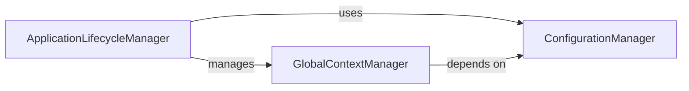

## Component Details

This graph describes the core application management subsystem of the `mcp-agent` application. It encompasses the initialization, execution, and graceful shutdown of the application, along with the crucial tasks of loading, managing, and providing access to application settings and sensitive information (secrets). The main flow involves the ApplicationLifecycleManager orchestrating the application's lifecycle, utilizing the ConfigurationManager for settings and secrets, and managing the GlobalContextManager to provide a consistent shared state across the application.

### ConfigurationManager
This component is responsible for loading, parsing, and providing application settings and secrets. It handles finding configuration files in the file system and merging them.

**Related Classes/Methods**:

- <a href="https://github.com/lastmile-ai/mcp-agent/blob/master/src/mcp_agent/config.py#L359-L431" target="_blank" rel="noopener noreferrer">`mcp_agent.config.Settings` (359:431)</a>
- <a href="https://github.com/lastmile-ai/mcp-agent/blob/master/src/mcp_agent/config.py#L409-L411" target="_blank" rel="noopener noreferrer">`mcp_agent.config.Settings:find_config` (409:411)</a>
- <a href="https://github.com/lastmile-ai/mcp-agent/blob/master/src/mcp_agent/config.py#L414-L416" target="_blank" rel="noopener noreferrer">`mcp_agent.config.Settings:find_secrets` (414:416)</a>
- <a href="https://github.com/lastmile-ai/mcp-agent/blob/master/src/mcp_agent/config.py#L419-L431" target="_blank" rel="noopener noreferrer">`mcp_agent.config.Settings._find_config` (419:431)</a>
- <a href="https://github.com/lastmile-ai/mcp-agent/blob/master/src/mcp_agent/config.py#L438-L502" target="_blank" rel="noopener noreferrer">`mcp_agent.config:get_settings` (438:502)</a>

### ApplicationLifecycleManager
This component manages the overall lifecycle of the MCP Agent application, including its initialization, execution, and cleanup. It acts as the main orchestrator.

**Related Classes/Methods**:

- <a href="https://github.com/lastmile-ai/mcp-agent/blob/master/src/mcp_agent/app.py#L34-L505" target="_blank" rel="noopener noreferrer">`mcp_agent.app.MCPApp` (34:505)</a>
- <a href="https://github.com/lastmile-ai/mcp-agent/blob/master/src/mcp_agent/app.py#L55-L117" target="_blank" rel="noopener noreferrer">`mcp_agent.app.MCPApp:__init__` (55:117)</a>
- <a href="https://github.com/lastmile-ai/mcp-agent/blob/master/src/mcp_agent/app.py#L170-L204" target="_blank" rel="noopener noreferrer">`mcp_agent.app.MCPApp:initialize` (170:204)</a>
- <a href="https://github.com/lastmile-ai/mcp-agent/blob/master/src/mcp_agent/app.py#L206-L227" target="_blank" rel="noopener noreferrer">`mcp_agent.app.MCPApp:cleanup` (206:227)</a>
- <a href="https://github.com/lastmile-ai/mcp-agent/blob/master/src/mcp_agent/app.py#L230-L246" target="_blank" rel="noopener noreferrer">`mcp_agent.app.MCPApp:run` (230:246)</a>
- <a href="https://github.com/lastmile-ai/mcp-agent/blob/master/src/mcp_agent/app.py#L452-L505" target="_blank" rel="noopener noreferrer">`mcp_agent.app.MCPApp:_register_global_workflow_tasks` (452:505)</a>

### GlobalContextManager
This component provides and manages a global application context that holds shared state, including configuration, executors, and various registries. It ensures that different parts of the application can access consistent global information.

**Related Classes/Methods**:

- <a href="https://github.com/lastmile-ai/mcp-agent/blob/master/src/mcp_agent/core/context.py#L50-L79" target="_blank" rel="noopener noreferrer">`mcp_agent.core.context.Context` (50:79)</a>
- <a href="https://github.com/lastmile-ai/mcp-agent/blob/master/src/mcp_agent/core/context.py#L153-L203" target="_blank" rel="noopener noreferrer">`mcp_agent.core.context:initialize_context` (153:203)</a>
- <a href="https://github.com/lastmile-ai/mcp-agent/blob/master/src/mcp_agent/core/context.py#L206-L212" target="_blank" rel="noopener noreferrer">`mcp_agent.core.context:cleanup_context` (206:212)</a>
- <a href="https://github.com/lastmile-ai/mcp-agent/blob/master/src/mcp_agent/core/context.py#L218-L241" target="_blank" rel="noopener noreferrer">`mcp_agent.core.context:get_current_context` (218:241)</a>
- <a href="https://github.com/lastmile-ai/mcp-agent/blob/master/src/mcp_agent/core/context.py#L244-L248" target="_blank" rel="noopener noreferrer">`mcp_agent.core.context:get_current_config` (244:248)</a>

### [FAQ](https://github.com/CodeBoarding/GeneratedOnBoardings/tree/main?tab=readme-ov-file#faq)