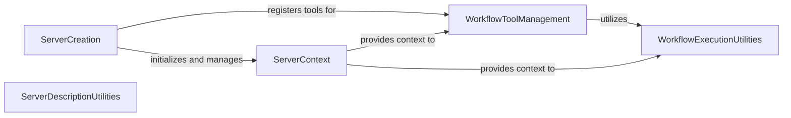

## Component Details

The MCP Agent Server component serves as the external interface for the `mcp-agent` application. Its primary purpose is to receive requests, facilitate workflow registration, and expose the application's functionalities as an MCP server. It manages the server's lifecycle, registers various workflow-related tools for interaction, and provides utilities for workflow execution and server description generation.

### ServerContext
The ServerContext component acts as the central context object for the MCP App server. It manages the FastMCP instance, active agents, and the workflow registry. It is responsible for initializing the appropriate workflow registry (in-memory or Temporal) based on the configured execution engine and provides methods for registering new workflows and accessing registered workflows and the workflow registry.

**Related Classes/Methods**:

- <a href="https://github.com/lastmile-ai/mcp-agent/blob/master/src/mcp_agent/server/app_server.py#L32-L81" target="_blank" rel="noopener noreferrer">`src.mcp_agent.server.app_server.ServerContext` (32:81)</a>
- <a href="https://github.com/lastmile-ai/mcp-agent/blob/master/src/mcp_agent/server/app_server.py#L35-L55" target="_blank" rel="noopener noreferrer">`src.mcp_agent.server.app_server.ServerContext:__init__` (35:55)</a>
- <a href="https://github.com/lastmile-ai/mcp-agent/blob/master/src/mcp_agent/server/app_server.py#L61-L66" target="_blank" rel="noopener noreferrer">`src.mcp_agent.server.app_server.ServerContext:register_workflow` (61:66)</a>

### ServerCreation
The ServerCreation component is responsible for setting up and configuring the FastMCP server for a given MCPApp instance. It defines the server's lifespan, registers core workflow management tools (list, run, get_status, resume, cancel), and ensures that workflow-specific tools are created and registered during server initialization.

**Related Classes/Methods**:

- <a href="https://github.com/lastmile-ai/mcp-agent/blob/master/src/mcp_agent/server/app_server.py#L84-L300" target="_blank" rel="noopener noreferrer">`src.mcp_agent.server.app_server.create_mcp_server_for_app` (84:300)</a>
- <a href="https://github.com/lastmile-ai/mcp-agent/blob/master/src/mcp_agent/server/app_server.py#L95-L112" target="_blank" rel="noopener noreferrer">`src.mcp_agent.server.app_server.app_specific_lifespan` (95:112)</a>

### WorkflowToolManagement
The WorkflowToolManagement component handles the creation and registration of tools related to workflows. This includes general tools for listing and managing workflow runs, as well as specific tools for running and getting the status of individual workflow types. It ensures that the MCP server exposes the necessary functionalities for interacting with workflows.

**Related Classes/Methods**:

- <a href="https://github.com/lastmile-ai/mcp-agent/blob/master/src/mcp_agent/server/app_server.py#L306-L316" target="_blank" rel="noopener noreferrer">`src.mcp_agent.server.app_server.create_workflow_tools` (306:316)</a>
- <a href="https://github.com/lastmile-ai/mcp-agent/blob/master/src/mcp_agent/server/app_server.py#L319-L357" target="_blank" rel="noopener noreferrer">`src.mcp_agent.server.app_server.create_workflow_specific_tools` (319:357)</a>
- <a href="https://github.com/lastmile-ai/mcp-agent/blob/master/src/mcp_agent/server/app_server.py#L129-L166" target="_blank" rel="noopener noreferrer">`src.mcp_agent.server.app_server.list_workflows` (129:166)</a>
- <a href="https://github.com/lastmile-ai/mcp-agent/blob/master/src/mcp_agent/server/app_server.py#L168-L190" target="_blank" rel="noopener noreferrer">`src.mcp_agent.server.app_server.list_workflow_runs` (168:190)</a>
- <a href="https://github.com/lastmile-ai/mcp-agent/blob/master/src/mcp_agent/server/app_server.py#L192-L212" target="_blank" rel="noopener noreferrer">`src.mcp_agent.server.app_server.run_workflow` (192:212)</a>
- <a href="https://github.com/lastmile-ai/mcp-agent/blob/master/src/mcp_agent/server/app_server.py#L214-L234" target="_blank" rel="noopener noreferrer">`src.mcp_agent.server.app_server.get_workflow_status` (214:234)</a>
- <a href="https://github.com/lastmile-ai/mcp-agent/blob/master/src/mcp_agent/server/app_server.py#L236-L279" target="_blank" rel="noopener noreferrer">`src.mcp_agent.server.app_server.resume_workflow` (236:279)</a>
- <a href="https://github.com/lastmile-ai/mcp-agent/blob/master/src/mcp_agent/server/app_server.py#L281-L299" target="_blank" rel="noopener noreferrer">`src.mcp_agent.server.app_server.cancel_workflow` (281:299)</a>

### WorkflowExecutionUtilities
The WorkflowExecutionUtilities component provides the core logic for executing and managing workflow instances. It includes functions for initiating workflow runs, retrieving their status, and handling workflow resumption and cancellation. These utilities interact directly with the workflow registry to perform their operations.

**Related Classes/Methods**:

- <a href="https://github.com/lastmile-ai/mcp-agent/blob/master/src/mcp_agent/server/app_server.py#L405-L438" target="_blank" rel="noopener noreferrer">`src.mcp_agent.server.app_server._workflow_run` (405:438)</a>
- <a href="https://github.com/lastmile-ai/mcp-agent/blob/master/src/mcp_agent/server/app_server.py#L441-L454" target="_blank" rel="noopener noreferrer">`src.mcp_agent.server.app_server._workflow_status` (441:454)</a>

### ServerDescriptionUtilities
The ServerDescriptionUtilities component is responsible for generating descriptions of the MCP servers. It retrieves server configurations from the ServerRegistry and formats them into a human-readable string, providing information about the server's name and description.

**Related Classes/Methods**:

- <a href="https://github.com/lastmile-ai/mcp-agent/blob/master/src/mcp_agent/server/app_server.py#L363-L382" target="_blank" rel="noopener noreferrer">`src.mcp_agent.server.app_server._get_server_descriptions` (363:382)</a>
- <a href="https://github.com/lastmile-ai/mcp-agent/blob/master/src/mcp_agent/server/app_server.py#L385-L399" target="_blank" rel="noopener noreferrer">`src.mcp_agent.server.app_server._get_server_descriptions_as_string` (385:399)</a>

### [FAQ](https://github.com/CodeBoarding/GeneratedOnBoardings/tree/main?tab=readme-ov-file#faq)