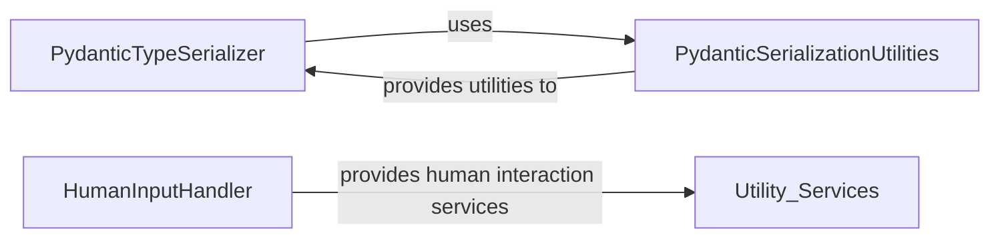

## Component Details

The Utility Services component provides foundational functionalities for data handling and user interaction within the system. It primarily focuses on the robust serialization and deserialization of Pydantic models, enabling structured data exchange, and manages human input processes, facilitating interactive workflows. This component ensures that complex data types can be reliably transformed for storage or transmission and that the system can effectively solicit and process user responses.

### PydanticTypeSerializer
This component is responsible for serializing and deserializing Pydantic model types. It handles various Python types, including basic types, generic types, enums, and custom Pydantic models, allowing them to be converted into a JSON-serializable dictionary and reconstructed back into their original type. This is crucial for transmitting model types between different processes or services, particularly for structured LLM outputs.

**Related Classes/Methods**:

- <a href="https://github.com/lastmile-ai/mcp-agent/blob/master/src/mcp_agent/utils/pydantic_type_serializer.py#L76-L809" target="_blank" rel="noopener noreferrer">`src.mcp_agent.utils.pydantic_type_serializer.PydanticTypeSerializer` (76:809)</a>
- <a href="https://github.com/lastmile-ai/mcp-agent/blob/master/src/mcp_agent/utils/pydantic_type_serializer.py#L112-L243" target="_blank" rel="noopener noreferrer">`src.mcp_agent.utils.pydantic_type_serializer.PydanticTypeSerializer:serialize_type` (112:243)</a>
- <a href="https://github.com/lastmile-ai/mcp-agent/blob/master/src/mcp_agent/utils/pydantic_type_serializer.py#L319-L345" target="_blank" rel="noopener noreferrer">`src.mcp_agent.utils.pydantic_type_serializer.PydanticTypeSerializer:_get_all_fields` (319:345)</a>
- <a href="https://github.com/lastmile-ai/mcp-agent/blob/master/src/mcp_agent/utils/pydantic_type_serializer.py#L348-L434" target="_blank" rel="noopener noreferrer">`src.mcp_agent.utils.pydantic_type_serializer.PydanticTypeSerializer:_serialize_fields` (348:434)</a>
- <a href="https://github.com/lastmile-ai/mcp-agent/blob/master/src/mcp_agent/utils/pydantic_type_serializer.py#L478-L623" target="_blank" rel="noopener noreferrer">`src.mcp_agent.utils.pydantic_type_serializer.PydanticTypeSerializer:deserialize_type` (478:623)</a>
- <a href="https://github.com/lastmile-ai/mcp-agent/blob/master/src/mcp_agent/utils/pydantic_type_serializer.py#L626-L783" target="_blank" rel="noopener noreferrer">`src.mcp_agent.utils.pydantic_type_serializer.PydanticTypeSerializer:reconstruct_model` (626:783)</a>
- <a href="https://github.com/lastmile-ai/mcp-agent/blob/master/src/mcp_agent/utils/pydantic_type_serializer.py#L786-L796" target="_blank" rel="noopener noreferrer">`src.mcp_agent.utils.pydantic_type_serializer.PydanticTypeSerializer:serialize_model_type` (786:796)</a>
- <a href="https://github.com/lastmile-ai/mcp-agent/blob/master/src/mcp_agent/utils/pydantic_type_serializer.py#L799-L809" target="_blank" rel="noopener noreferrer">`src.mcp_agent.utils.pydantic_type_serializer.PydanticTypeSerializer:deserialize_model_type` (799:809)</a>
- <a href="https://github.com/lastmile-ai/mcp-agent/blob/master/src/mcp_agent/utils/pydantic_type_serializer.py#L437-L475" target="_blank" rel="noopener noreferrer">`src.mcp_agent.utils.pydantic_type_serializer.PydanticTypeSerializer:_serialize_config` (437:475)</a>
- <a href="https://github.com/lastmile-ai/mcp-agent/blob/master/src/mcp_agent/utils/pydantic_type_serializer.py#L246-L316" target="_blank" rel="noopener noreferrer">`src.mcp_agent.utils.pydantic_type_serializer.PydanticTypeSerializer:_serialize_validators` (246:316)</a>
- <a href="https://github.com/lastmile-ai/mcp-agent/blob/master/src/mcp_agent/utils/pydantic_type_serializer.py#L87-L109" target="_blank" rel="noopener noreferrer">`src.mcp_agent.utils.pydantic_type_serializer.PydanticTypeSerializer:_get_type_origin_name` (87:109)</a>

### PydanticSerializationUtilities
This component provides utility functions for Pydantic type serialization, specifically for checking if an object is a PydanticUndefinedType instance and for making arbitrary values JSON-serializable. These functions are used by the PydanticTypeSerializer to handle special cases during serialization and deserialization of Pydantic models and instances.

**Related Classes/Methods**:

- <a href="https://github.com/lastmile-ai/mcp-agent/blob/master/src/mcp_agent/utils/pydantic_type_serializer.py#L52-L58" target="_blank" rel="noopener noreferrer">`src.mcp_agent.utils.pydantic_type_serializer:is_pydantic_undefined` (52:58)</a>
- <a href="https://github.com/lastmile-ai/mcp-agent/blob/master/src/mcp_agent/utils/pydantic_type_serializer.py#L61-L73" target="_blank" rel="noopener noreferrer">`src.mcp_agent.utils.pydantic_type_serializer:make_serializable` (61:73)</a>
- <a href="https://github.com/lastmile-ai/mcp-agent/blob/master/src/mcp_agent/utils/pydantic_type_serializer.py#L932-L943" target="_blank" rel="noopener noreferrer">`src.mcp_agent.utils.pydantic_type_serializer:serialize_model` (932:943)</a>
- <a href="https://github.com/lastmile-ai/mcp-agent/blob/master/src/mcp_agent/utils/pydantic_type_serializer.py#L946-L957" target="_blank" rel="noopener noreferrer">`src.mcp_agent.utils.pydantic_type_serializer:deserialize_model` (946:957)</a>

### HumanInputHandler
This component is responsible for managing interactions that require human input. It provides a callback mechanism to prompt the user for input and process their responses, typically through a console interface. This is essential for interactive agent workflows where user intervention or confirmation is needed.

**Related Classes/Methods**:

- <a href="https://github.com/lastmile-ai/mcp-agent/blob/master/src/mcp_agent/human_input/handler.py#L12-L47" target="_blank" rel="noopener noreferrer">`mcp_agent.human_input.handler:console_input_callback` (12:47)</a>

### [FAQ](https://github.com/CodeBoarding/GeneratedOnBoardings/tree/main?tab=readme-ov-file#faq)