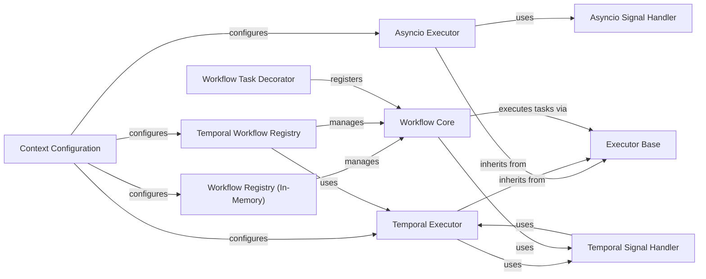

## Component Details

The Workflow Execution Engine is the central operational logic of the agent, orchestrating and managing the lifecycle of workflows. It provides mechanisms for task execution, workflow registration, and signal handling, supporting both in-memory and Temporal-based workflow paradigms. The engine abstracts the underlying execution environment, allowing workflows to be defined and executed consistently regardless of the chosen backend. It ensures proper state management, task concurrency, and inter-workflow communication, forming the backbone for complex agent behaviors.

### Executor Base
The abstract base class for different execution backends. It defines the common interface for executing tasks, managing execution context, and handling signals. Concrete implementations like AsyncioExecutor and TemporalExecutor extend this class.

**Related Classes/Methods**:

- <a href="https://github.com/lastmile-ai/mcp-agent/blob/master/src/mcp_agent/executor/executor.py#L52-L232" target="_blank" rel="noopener noreferrer">`mcp_agent.executor.executor.Executor` (52:232)</a>
- <a href="https://github.com/lastmile-ai/mcp-agent/blob/master/src/mcp_agent/executor/executor.py#L55-L73" target="_blank" rel="noopener noreferrer">`mcp_agent.executor.executor.Executor:__init__` (55:73)</a>
- <a href="https://github.com/lastmile-ai/mcp-agent/blob/master/src/mcp_agent/executor/executor.py#L76-L82" target="_blank" rel="noopener noreferrer">`mcp_agent.executor.executor.Executor:execution_context` (76:82)</a>
- <a href="https://github.com/lastmile-ai/mcp-agent/blob/master/src/mcp_agent/executor/executor.py#L85-L91" target="_blank" rel="noopener noreferrer">`mcp_agent.executor.executor.Executor:execute` (85:91)</a>
- <a href="https://github.com/lastmile-ai/mcp-agent/blob/master/src/mcp_agent/executor/executor.py#L94-L100" target="_blank" rel="noopener noreferrer">`mcp_agent.executor.executor.Executor:execute_many` (94:100)</a>
- <a href="https://github.com/lastmile-ai/mcp-agent/blob/master/src/mcp_agent/executor/executor.py#L103-L109" target="_blank" rel="noopener noreferrer">`mcp_agent.executor.executor.Executor:execute_streaming` (103:109)</a>
- <a href="https://github.com/lastmile-ai/mcp-agent/blob/master/src/mcp_agent/executor/executor.py#L111-L142" target="_blank" rel="noopener noreferrer">`mcp_agent.executor.executor.Executor:map` (111:142)</a>
- <a href="https://github.com/lastmile-ai/mcp-agent/blob/master/src/mcp_agent/executor/executor.py#L144-L149" target="_blank" rel="noopener noreferrer">`mcp_agent.executor.executor.Executor:validate_task` (144:149)</a>
- <a href="https://github.com/lastmile-ai/mcp-agent/blob/master/src/mcp_agent/executor/executor.py#L151-L176" target="_blank" rel="noopener noreferrer">`mcp_agent.executor.executor.Executor:signal` (151:176)</a>
- <a href="https://github.com/lastmile-ai/mcp-agent/blob/master/src/mcp_agent/executor/executor.py#L178-L213" target="_blank" rel="noopener noreferrer">`mcp_agent.executor.executor.Executor:wait_for_signal` (178:213)</a>
- <a href="https://github.com/lastmile-ai/mcp-agent/blob/master/src/mcp_agent/executor/executor.py#L215-L222" target="_blank" rel="noopener noreferrer">`mcp_agent.executor.executor.Executor:uuid` (215:222)</a>
- <a href="https://github.com/lastmile-ai/mcp-agent/blob/master/src/mcp_agent/executor/executor.py#L224-L232" target="_blank" rel="noopener noreferrer">`mcp_agent.executor.executor.Executor:random` (224:232)</a>

### Asyncio Executor
A concrete implementation of the Executor base class that uses Python's asyncio for concurrent task execution. It manages a semaphore for controlling the maximum number of concurrent activities and provides methods for executing single tasks, multiple tasks, and streaming task results.

**Related Classes/Methods**:

- <a href="https://github.com/lastmile-ai/mcp-agent/blob/master/src/mcp_agent/executor/executor.py#L235-L413" target="_blank" rel="noopener noreferrer">`mcp_agent.executor.executor.AsyncioExecutor` (235:413)</a>
- <a href="https://github.com/lastmile-ai/mcp-agent/blob/master/src/mcp_agent/executor/executor.py#L238-L250" target="_blank" rel="noopener noreferrer">`mcp_agent.executor.executor.AsyncioExecutor:__init__` (238:250)</a>
- <a href="https://github.com/lastmile-ai/mcp-agent/blob/master/src/mcp_agent/executor/executor.py#L252-L282" target="_blank" rel="noopener noreferrer">`mcp_agent.executor.executor.AsyncioExecutor:_execute_task` (252:282)</a>
- <a href="https://github.com/lastmile-ai/mcp-agent/blob/master/src/mcp_agent/executor/executor.py#L285-L308" target="_blank" rel="noopener noreferrer">`mcp_agent.executor.executor.AsyncioExecutor:execute` (285:308)</a>
- <a href="https://github.com/lastmile-ai/mcp-agent/blob/master/src/mcp_agent/executor/executor.py#L311-L339" target="_blank" rel="noopener noreferrer">`mcp_agent.executor.executor.AsyncioExecutor:execute_many` (311:339)</a>
- <a href="https://github.com/lastmile-ai/mcp-agent/blob/master/src/mcp_agent/executor/executor.py#L342-L379" target="_blank" rel="noopener noreferrer">`mcp_agent.executor.executor.AsyncioExecutor:execute_streaming` (342:379)</a>
- <a href="https://github.com/lastmile-ai/mcp-agent/blob/master/src/mcp_agent/executor/executor.py#L382-L392" target="_blank" rel="noopener noreferrer">`mcp_agent.executor.executor.AsyncioExecutor:signal` (382:392)</a>
- <a href="https://github.com/lastmile-ai/mcp-agent/blob/master/src/mcp_agent/executor/executor.py#L395-L413" target="_blank" rel="noopener noreferrer">`mcp_agent.executor.executor.AsyncioExecutor:wait_for_signal` (395:413)</a>

### Temporal Executor
A concrete implementation of the Executor base class that integrates with the Temporal workflow engine. It allows for the execution of tasks as Temporal activities and workflows, providing features like durable execution, retries, and fault tolerance.

**Related Classes/Methods**:

- `mcp_agent.executor.temporal.TemporalExecutor` (full file reference)
- `mcp_agent.executor.temporal.TemporalExecutor:__init__` (full file reference)
- `mcp_agent.executor.temporal.TemporalExecutor:_execute_task_as_async` (full file reference)
- `mcp_agent.executor.temporal.TemporalExecutor:_execute_task` (full file reference)
- `mcp_agent.executor.temporal.TemporalExecutor:execute` (full file reference)
- `mcp_agent.executor.temporal.TemporalExecutor:execute_many` (full file reference)
- `mcp_agent.executor.temporal.TemporalExecutor:execute_streaming` (full file reference)
- `mcp_agent.executor.temporal.TemporalExecutor:start_workflow` (full file reference)
- `mcp_agent.executor.temporal.TemporalExecutor:execute_workflow` (full file reference)
- `mcp_agent.executor.temporal.TemporalExecutor:terminate_workflow` (full file reference)
- `mcp_agent.executor.temporal.TemporalExecutor:uuid` (full file reference)
- `mcp_agent.executor.temporal.TemporalExecutor:random` (full file reference)
- `mcp_agent.executor.temporal:create_temporal_worker_for_app` (full file reference)

### Asyncio Signal Handler
Manages signals for asyncio-based executors. It allows for sending and waiting for signals within an asyncio environment, facilitating communication and synchronization between different parts of a workflow.

**Related Classes/Methods**:

- <a href="https://github.com/lastmile-ai/mcp-agent/blob/master/src/mcp_agent/executor/workflow_signal.py#L219-L297" target="_blank" rel="noopener noreferrer">`mcp_agent.executor.workflow_signal.AsyncioSignalHandler` (219:297)</a>
- <a href="https://github.com/lastmile-ai/mcp-agent/blob/master/src/mcp_agent/executor/workflow_signal.py#L224-L263" target="_blank" rel="noopener noreferrer">`mcp_agent.executor.workflow_signal.AsyncioSignalHandler:wait_for_signal` (224:263)</a>

### Temporal Signal Handler
Manages signals specifically for Temporal-based executors. It integrates with Temporal's signaling mechanisms to enable communication between workflows and external systems or other workflows.

**Related Classes/Methods**:

- <a href="https://github.com/lastmile-ai/mcp-agent/blob/master/src/mcp_agent/executor/temporal/workflow_signal.py#L74-L234" target="_blank" rel="noopener noreferrer">`mcp_agent.executor.temporal.workflow_signal.TemporalSignalHandler` (74:234)</a>
- <a href="https://github.com/lastmile-ai/mcp-agent/blob/master/src/mcp_agent/executor/temporal/workflow_signal.py#L83-L90" target="_blank" rel="noopener noreferrer">`mcp_agent.executor.temporal.workflow_signal.TemporalSignalHandler:__init__` (83:90)</a>
- <a href="https://github.com/lastmile-ai/mcp-agent/blob/master/src/mcp_agent/executor/temporal/workflow_signal.py#L197-L226" target="_blank" rel="noopener noreferrer">`mcp_agent.executor.temporal.workflow_signal.TemporalSignalHandler:signal` (197:226)</a>
- <a href="https://github.com/lastmile-ai/mcp-agent/blob/master/src/mcp_agent/executor/temporal/workflow_signal.py#L228-L234" target="_blank" rel="noopener noreferrer">`mcp_agent.executor.temporal.workflow_signal.TemporalSignalHandler:validate_signal` (228:234)</a>
- <a href="https://github.com/lastmile-ai/mcp-agent/blob/master/src/mcp_agent/executor/temporal/workflow_signal.py#L35-L46" target="_blank" rel="noopener noreferrer">`mcp_agent.executor.temporal.workflow_signal.SignalMailbox:push` (35:46)</a>
- <a href="https://github.com/lastmile-ai/mcp-agent/blob/master/src/mcp_agent/executor/temporal/workflow_signal.py#L48-L50" target="_blank" rel="noopener noreferrer">`mcp_agent.executor.temporal.workflow_signal.SignalMailbox:version` (48:50)</a>
- <a href="https://github.com/lastmile-ai/mcp-agent/blob/master/src/mcp_agent/executor/temporal/workflow_signal.py#L52-L71" target="_blank" rel="noopener noreferrer">`mcp_agent.executor.temporal.workflow_signal.SignalMailbox:value` (52:71)</a>

### Workflow Registry (In-Memory)
Provides an in-memory mechanism for registering, retrieving, and managing the status of workflows. It's suitable for simpler, short-lived workflows or testing environments where persistence is not required.

**Related Classes/Methods**:

- <a href="https://github.com/lastmile-ai/mcp-agent/blob/master/src/mcp_agent/executor/workflow_registry.py#L150-L264" target="_blank" rel="noopener noreferrer">`mcp_agent.executor.workflow_registry.InMemoryWorkflowRegistry` (150:264)</a>
- <a href="https://github.com/lastmile-ai/mcp-agent/blob/master/src/mcp_agent/executor/workflow_registry.py#L155-L160" target="_blank" rel="noopener noreferrer">`mcp_agent.executor.workflow_registry.InMemoryWorkflowRegistry:__init__` (155:160)</a>
- <a href="https://github.com/lastmile-ai/mcp-agent/blob/master/src/mcp_agent/executor/workflow_registry.py#L217-L231" target="_blank" rel="noopener noreferrer">`mcp_agent.executor.workflow_registry.InMemoryWorkflowRegistry:resume_workflow` (217:231)</a>
- <a href="https://github.com/lastmile-ai/mcp-agent/blob/master/src/mcp_agent/executor/workflow_registry.py#L233-L243" target="_blank" rel="noopener noreferrer">`mcp_agent.executor.workflow_registry.InMemoryWorkflowRegistry:cancel_workflow` (233:243)</a>
- <a href="https://github.com/lastmile-ai/mcp-agent/blob/master/src/mcp_agent/executor/workflow_registry.py#L245-L252" target="_blank" rel="noopener noreferrer">`mcp_agent.executor.workflow_registry.InMemoryWorkflowRegistry:get_workflow_status` (245:252)</a>

### Temporal Workflow Registry
Manages the registration and status of workflows within the Temporal system. It interacts with the Temporal client to start, cancel, resume, and query the status of Temporal workflows.

**Related Classes/Methods**:

- <a href="https://github.com/lastmile-ai/mcp-agent/blob/master/src/mcp_agent/executor/temporal/workflow_registry.py#L21-L249" target="_blank" rel="noopener noreferrer">`mcp_agent.executor.temporal.workflow_registry.TemporalWorkflowRegistry` (21:249)</a>
- <a href="https://github.com/lastmile-ai/mcp-agent/blob/master/src/mcp_agent/executor/temporal/workflow_registry.py#L27-L32" target="_blank" rel="noopener noreferrer">`mcp_agent.executor.temporal.workflow_registry.TemporalWorkflowRegistry:__init__` (27:32)</a>
- <a href="https://github.com/lastmile-ai/mcp-agent/blob/master/src/mcp_agent/executor/temporal/workflow_registry.py#L68-L104" target="_blank" rel="noopener noreferrer">`mcp_agent.executor.temporal.workflow_registry.TemporalWorkflowRegistry:resume_workflow` (68:104)</a>
- <a href="https://github.com/lastmile-ai/mcp-agent/blob/master/src/mcp_agent/executor/temporal/workflow_registry.py#L106-L135" target="_blank" rel="noopener noreferrer">`mcp_agent.executor.temporal.workflow_registry.TemporalWorkflowRegistry:cancel_workflow` (106:135)</a>
- <a href="https://github.com/lastmile-ai/mcp-agent/blob/master/src/mcp_agent/executor/temporal/workflow_registry.py#L137-L164" target="_blank" rel="noopener noreferrer">`mcp_agent.executor.temporal.workflow_registry.TemporalWorkflowRegistry:get_workflow_status` (137:164)</a>
- <a href="https://github.com/lastmile-ai/mcp-agent/blob/master/src/mcp_agent/executor/temporal/workflow_registry.py#L166-L181" target="_blank" rel="noopener noreferrer">`mcp_agent.executor.temporal.workflow_registry.TemporalWorkflowRegistry:list_workflow_statuses` (166:181)</a>

### Workflow Core
Encapsulates the core logic and lifecycle of a workflow, including initialization, execution, status updates, and cleanup. It provides methods for running workflows asynchronously and handling their state.

**Related Classes/Methods**:

- <a href="https://github.com/lastmile-ai/mcp-agent/blob/master/src/mcp_agent/executor/workflow.py#L62-L505" target="_blank" rel="noopener noreferrer">`mcp_agent.executor.workflow.Workflow` (62:505)</a>
- <a href="https://github.com/lastmile-ai/mcp-agent/blob/master/src/mcp_agent/executor/workflow.py#L76-L100" target="_blank" rel="noopener noreferrer">`mcp_agent.executor.workflow.Workflow:__init__` (76:100)</a>
- <a href="https://github.com/lastmile-ai/mcp-agent/blob/master/src/mcp_agent/executor/workflow.py#L126-L145" target="_blank" rel="noopener noreferrer">`mcp_agent.executor.workflow.Workflow:create` (126:145)</a>
- <a href="https://github.com/lastmile-ai/mcp-agent/blob/master/src/mcp_agent/executor/workflow.py#L161-L176" target="_blank" rel="noopener noreferrer">`mcp_agent.executor.workflow.Workflow:_cancel_task` (161:176)</a>
- <a href="https://github.com/lastmile-ai/mcp-agent/blob/master/src/mcp_agent/executor/workflow.py#L178-L292" target="_blank" rel="noopener noreferrer">`mcp_agent.executor.workflow.Workflow:run_async` (178:292)</a>
- <a href="https://github.com/lastmile-ai/mcp-agent/blob/master/src/mcp_agent/executor/workflow.py#L294-L329" target="_blank" rel="noopener noreferrer">`mcp_agent.executor.workflow.Workflow:resume` (294:329)</a>
- <a href="https://github.com/lastmile-ai/mcp-agent/blob/master/src/mcp_agent/executor/workflow.py#L498-L501" target="_blank" rel="noopener noreferrer">`mcp_agent.executor.workflow.Workflow:__aenter__` (498:501)</a>
- <a href="https://github.com/lastmile-ai/mcp-agent/blob/master/src/mcp_agent/executor/workflow.py#L503-L505" target="_blank" rel="noopener noreferrer">`mcp_agent.executor.workflow.Workflow:__aexit__` (503:505)</a>

### Context Configuration
Responsible for initializing and configuring the execution environment, including setting up the appropriate executor (Asyncio or Temporal) and workflow registry based on the application's context.

**Related Classes/Methods**:

- <a href="https://github.com/lastmile-ai/mcp-agent/blob/master/src/mcp_agent/core/context.py#L118-L133" target="_blank" rel="noopener noreferrer">`mcp_agent.core.context:configure_executor` (118:133)</a>
- <a href="https://github.com/lastmile-ai/mcp-agent/blob/master/src/mcp_agent/core/context.py#L136-L150" target="_blank" rel="noopener noreferrer">`mcp_agent.core.context:configure_workflow_registry` (136:150)</a>

### Workflow Task Decorator
A decorator used to register functions as workflow tasks, making them discoverable and executable by the workflow engine. It integrates with a global registry to manage available workflow tasks.

**Related Classes/Methods**:

- <a href="https://github.com/lastmile-ai/mcp-agent/blob/master/src/mcp_agent/executor/workflow_task.py#L36-L90" target="_blank" rel="noopener noreferrer">`mcp_agent.executor.workflow_task:workflow_task` (36:90)</a>

### [FAQ](https://github.com/CodeBoarding/GeneratedOnBoardings/tree/main?tab=readme-ov-file#faq)