```mermaid
graph LR
    Core_Application_Management["Core Application Management"]
    Logging_and_Observability["Logging and Observability"]
    Agent_Core_Communication["Agent Core & Communication"]
    Workflow_Execution_Engine["Workflow Execution Engine"]
    LLM_Embedding_Integration["Augmented LLM patterns"]
    AI_Workflow_Orchestration["AI Workflow Orchestration"]
    Application_Server["MCP Agent Server"]
    Utility_Services["Utility Services"]
    Core_Application_Management -- "configures" --> Logging_and_Observability
    Core_Application_Management -- "manages" --> Workflow_Execution_Engine
    Core_Application_Management -- "integrates with" --> Agent_Core_Communication
    Logging_and_Observability -- "provides services to" --> Core_Application_Management
    Logging_and_Observability -- "provides services to" --> Agent_Core_Communication
    Logging_and_Observability -- "provides services to" --> LLM_Embedding_Integration
    Agent_Core_Communication -- "interacts with" --> LLM_Embedding_Integration
    Agent_Core_Communication -- "executes tasks through" --> Workflow_Execution_Engine
    Agent_Core_Communication -- "exposes services to" --> Application_Server
    Workflow_Execution_Engine -- "executes tasks for" --> Agent_Core_Communication
    Workflow_Execution_Engine -- "registers workflows for" --> Application_Server
    Workflow_Execution_Engine -- "utilizes" --> Utility_Services
    LLM_Embedding_Integration -- "provides models to" --> Agent_Core_Communication
    LLM_Embedding_Integration -- "provides models to" --> AI_Workflow_Orchestration
    AI_Workflow_Orchestration -- "leverages" --> LLM_Embedding_Integration
    AI_Workflow_Orchestration -- "delegates tasks to" --> Agent_Core_Communication
    AI_Workflow_Orchestration -- "utilizes" --> Workflow_Execution_Engine
    Application_Server -- "registers workflows with" --> Workflow_Execution_Engine
    Application_Server -- "exposes services via" --> Agent_Core_Communication
    Utility_Services -- "provides data handling for" --> LLM_Embedding_Integration
    Utility_Services -- "handles human input for" --> Agent_Core_Communication
    Utility_Services -- "provides serialization for" --> Workflow_Execution_Engine
    click Core_Application_Management href "https://github.com/CodeBoarding/GeneratedOnBoardings/blob/main/mcp-agent-discussion/Core Application Management.md" "Details"
    click Logging_and_Observability href "https://github.com/CodeBoarding/GeneratedOnBoardings/blob/main/mcp-agent-discussion/Logging and Observability.md" "Details"
    click Agent_Core_Communication href "https://github.com/CodeBoarding/GeneratedOnBoardings/blob/main/mcp-agent-discussion/Agent Core & Communication.md" "Details"
    click Workflow_Execution_Engine href "https://github.com/CodeBoarding/GeneratedOnBoardings/blob/main/mcp-agent-discussion/Workflow Execution Engine.md" "Details"
    click LLM_Embedding_Integration href "https://github.com/CodeBoarding/GeneratedOnBoardings/blob/main/mcp-agent-discussion/Augmented LLM patterns" "Details"
    click AI_Workflow_Orchestration href "https://github.com/CodeBoarding/GeneratedOnBoardings/blob/main/mcp-agent-discussion/AI Workflow Orchestration.md" "Details"
    click Application_Server href "https://github.com/CodeBoarding/GeneratedOnBoardings/blob/main/mcp-agent-discussion/MCP Agent Server.md" "Details"
    click Utility_Services href "https://github.com/CodeBoarding/GeneratedOnBoardings/blob/main/mcp-agent-discussion/Utility Services.md" "Details"
```

## Component Details

The `mcp-agent` is a multi-agent system designed to orchestrate complex AI-driven workflows. It manages agent lifecycles, facilitates inter-agent communication, integrates with various Large Language Models and embedding models, and provides a robust workflow execution engine. The system also includes comprehensive logging and observability, an MCP Agent Server for external interaction, and utility services for data handling and human input.

### Core Application Management
This component is responsible for the overall lifecycle of the `mcp-agent` application, including its initialization, execution, and graceful shutdown. It also handles loading, managing, and providing access to application settings and sensitive information (secrets).

**Related Classes/Methods**:

- <a href="https://github.com/lastmile-ai/mcp-agent/blob/master/src/mcp_agent/app.py#L55-L117" target="_blank" rel="noopener noreferrer">`mcp-agent.src.mcp_agent.app.MCPApp:__init__` (55:117)</a>
- <a href="https://github.com/lastmile-ai/mcp-agent/blob/master/src/mcp_agent/app.py#L170-L204" target="_blank" rel="noopener noreferrer">`mcp-agent.src.mcp_agent.app.MCPApp:initialize` (170:204)</a>
- <a href="https://github.com/lastmile-ai/mcp-agent/blob/master/src/mcp_agent/app.py#L206-L227" target="_blank" rel="noopener noreferrer">`mcp-agent.src.mcp_agent.app.MCPApp:cleanup` (206:227)</a>
- <a href="https://github.com/lastmile-ai/mcp-agent/blob/master/src/mcp_agent/app.py#L230-L246" target="_blank" rel="noopener noreferrer">`mcp-agent.src.mcp_agent.app.MCPApp:run` (230:246)</a>
- <a href="https://github.com/lastmile-ai/mcp-agent/blob/master/src/mcp_agent/app.py#L452-L505" target="_blank" rel="noopener noreferrer">`mcp-agent.src.mcp_agent.app.MCPApp:_register_global_workflow_tasks` (452:505)</a>
- <a href="https://github.com/lastmile-ai/mcp-agent/blob/master/src/mcp_agent/core/context.py#L153-L203" target="_blank" rel="noopener noreferrer">`src.mcp_agent.core.context:initialize_context` (153:203)</a>
- <a href="https://github.com/lastmile-ai/mcp-agent/blob/master/src/mcp_agent/core/context.py#L206-L212" target="_blank" rel="noopener noreferrer">`src.mcp_agent.core.context:cleanup_context` (206:212)</a>
- <a href="https://github.com/lastmile-ai/mcp-agent/blob/master/src/mcp_agent/core/context.py#L218-L241" target="_blank" rel="noopener noreferrer">`src.mcp_agent.core.context:get_current_context` (218:241)</a>
- <a href="https://github.com/lastmile-ai/mcp-agent/blob/master/src/mcp_agent/core/context.py#L244-L248" target="_blank" rel="noopener noreferrer">`src.mcp_agent.core.context:get_current_config` (244:248)</a>
- <a href="https://github.com/lastmile-ai/mcp-agent/blob/master/src/mcp_agent/config.py#L409-L411" target="_blank" rel="noopener noreferrer">`mcp-agent.src.mcp_agent.config.Settings:find_config` (409:411)</a>
- <a href="https://github.com/lastmile-ai/mcp-agent/blob/master/src/mcp_agent/config.py#L414-L416" target="_blank" rel="noopener noreferrer">`mcp-agent.src.mcp_agent.config.Settings:find_secrets` (414:416)</a>
- <a href="https://github.com/lastmile-ai/mcp-agent/blob/master/src/mcp_agent/config.py#L438-L502" target="_blank" rel="noopener noreferrer">`mcp-agent.src.mcp_agent.config:get_settings` (438:502)</a>
- <a href="https://github.com/lastmile-ai/mcp-agent/blob/master/src/mcp_agent/config.py#L419-L431" target="_blank" rel="noopener noreferrer">`mcp-agent.src.mcp_agent.config.Settings._find_config` (419:431)</a>

### Logging and Observability
This component provides comprehensive logging capabilities for the application, allowing for structured event logging, console output, file logging, and HTTP transport. It also integrates with OpenTelemetry for distributed tracing and usage tracking.

**Related Classes/Methods**:

- <a href="https://github.com/lastmile-ai/mcp-agent/blob/master/src/mcp_agent/app.py#L164-L168" target="_blank" rel="noopener noreferrer">`mcp-agent.src.mcp_agent.app.MCPApp:logger` (164:168)</a>
- <a href="https://github.com/lastmile-ai/mcp-agent/blob/master/src/mcp_agent/tracing/telemetry.py#L27-L28" target="_blank" rel="noopener noreferrer">`src.mcp_agent.tracing.telemetry.TelemetryManager:__init__` (27:28)</a>
- <a href="https://github.com/lastmile-ai/mcp-agent/blob/master/src/mcp_agent/tracing/telemetry.py#L30-L83" target="_blank" rel="noopener noreferrer">`src.mcp_agent.tracing.telemetry.TelemetryManager:traced` (30:83)</a>
- <a href="https://github.com/lastmile-ai/mcp-agent/blob/master/src/mcp_agent/tracing/telemetry.py#L85-L90" target="_blank" rel="noopener noreferrer">`src.mcp_agent.tracing.telemetry.TelemetryManager:_record_args` (85:90)</a>
- <a href="https://github.com/lastmile-ai/mcp-agent/blob/master/src/mcp_agent/tracing/telemetry.py#L93-L113" target="_blank" rel="noopener noreferrer">`src.mcp_agent.tracing.telemetry:serialize_attribute` (93:113)</a>
- <a href="https://github.com/lastmile-ai/mcp-agent/blob/master/src/mcp_agent/tracing/telemetry.py#L116-L127" target="_blank" rel="noopener noreferrer">`src.mcp_agent.tracing.telemetry:serialize_attributes` (116:127)</a>
- <a href="https://github.com/lastmile-ai/mcp-agent/blob/master/src/mcp_agent/tracing/telemetry.py#L130-L137" target="_blank" rel="noopener noreferrer">`src.mcp_agent.tracing.telemetry:record_attribute` (130:137)</a>
- <a href="https://github.com/lastmile-ai/mcp-agent/blob/master/src/mcp_agent/tracing/telemetry.py#L140-L144" target="_blank" rel="noopener noreferrer">`src.mcp_agent.tracing.telemetry:record_attributes` (140:144)</a>
- <a href="https://github.com/lastmile-ai/mcp-agent/blob/master/src/mcp_agent/tracing/file_span_exporter.py#L19-L35" target="_blank" rel="noopener noreferrer">`src.mcp_agent.tracing.file_span_exporter.FileSpanExporter:__init__` (19:35)</a>
- <a href="https://github.com/lastmile-ai/mcp-agent/blob/master/src/mcp_agent/tracing/file_span_exporter.py#L55-L65" target="_blank" rel="noopener noreferrer">`src.mcp_agent.tracing.file_span_exporter.FileSpanExporter:export` (55:65)</a>
- <a href="https://github.com/lastmile-ai/mcp-agent/blob/master/src/mcp_agent/telemetry/usage_tracking.py#L7-L11" target="_blank" rel="noopener noreferrer">`mcp-agent.src.mcp_agent.telemetry.usage_tracking:send_usage_data` (7:11)</a>
- <a href="https://github.com/lastmile-ai/mcp-agent/blob/master/src/mcp_agent/logging/transport.py#L52-L54" target="_blank" rel="noopener noreferrer">`mcp-agent.src.mcp_agent.logging.transport.FilteredEventTransport:send_event` (52:54)</a>
- <a href="https://github.com/lastmile-ai/mcp-agent/blob/master/src/mcp_agent/logging/transport.py#L72-L81" target="_blank" rel="noopener noreferrer">`mcp-agent.src.mcp_agent.logging.transport.ConsoleTransport:__init__` (72:81)</a>
- <a href="https://github.com/lastmile-ai/mcp-agent/blob/master/src/mcp_agent/logging/transport.py#L83-L107" target="_blank" rel="noopener noreferrer">`mcp-agent.src.mcp_agent.logging.transport.ConsoleTransport:send_matched_event` (83:107)</a>
- <a href="https://github.com/lastmile-ai/mcp-agent/blob/master/src/mcp_agent/logging/transport.py#L113-L135" target="_blank" rel="noopener noreferrer">`mcp-agent.src.mcp_agent.logging.transport.FileTransport:__init__` (113:135)</a>
- <a href="https://github.com/lastmile-ai/mcp-agent/blob/master/src/mcp_agent/logging/transport.py#L137-L166" target="_blank" rel="noopener noreferrer">`mcp-agent.src.mcp_agent.logging.transport.FileTransport:send_matched_event` (137:166)</a>
- <a href="https://github.com/lastmile-ai/mcp-agent/blob/master/src/mcp_agent/logging/transport.py#L184-L201" target="_blank" rel="noopener noreferrer">`mcp-agent.src.mcp_agent.logging.transport.HTTPTransport:__init__` (184:201)</a>
- <a href="https://github.com/lastmile-ai/mcp-agent/blob/master/src/mcp_agent/logging/transport.py#L210-L216" target="_blank" rel="noopener noreferrer">`mcp-agent.src.mcp_agent.logging.transport.HTTPTransport:stop` (210:216)</a>
- <a href="https://github.com/lastmile-ai/mcp-agent/blob/master/src/mcp_agent/logging/transport.py#L218-L223" target="_blank" rel="noopener noreferrer">`mcp-agent.src.mcp_agent.logging.transport.HTTPTransport:send_matched_event` (218:223)</a>
- <a href="https://github.com/lastmile-ai/mcp-agent/blob/master/src/mcp_agent/logging/transport.py#L225-L260" target="_blank" rel="noopener noreferrer">`mcp-agent.src.mcp_agent.logging.transport.HTTPTransport:_flush` (225:260)</a>
- <a href="https://github.com/lastmile-ai/mcp-agent/blob/master/src/mcp_agent/logging/transport.py#L271-L275" target="_blank" rel="noopener noreferrer">`mcp-agent.src.mcp_agent.logging.transport.AsyncEventBus:__init__` (271:275)</a>
- <a href="https://github.com/lastmile-ai/mcp-agent/blob/master/src/mcp_agent/logging/transport.py#L290-L297" target="_blank" rel="noopener noreferrer">`mcp-agent.src.mcp_agent.logging.transport.AsyncEventBus:get` (290:297)</a>
- <a href="https://github.com/lastmile-ai/mcp-agent/blob/master/src/mcp_agent/logging/transport.py#L314-L327" target="_blank" rel="noopener noreferrer">`mcp-agent.src.mcp_agent.logging.transport.AsyncEventBus:start` (314:327)</a>
- <a href="https://github.com/lastmile-ai/mcp-agent/blob/master/src/mcp_agent/logging/transport.py#L377-L393" target="_blank" rel="noopener noreferrer">`mcp-agent.src.mcp_agent.logging.transport.AsyncEventBus:emit` (377:393)</a>
- <a href="https://github.com/lastmile-ai/mcp-agent/blob/master/src/mcp_agent/logging/transport.py#L476-L500" target="_blank" rel="noopener noreferrer">`mcp-agent.src.mcp_agent.logging.transport.MultiTransport:send_event` (476:500)</a>
- <a href="https://github.com/lastmile-ai/mcp-agent/blob/master/src/mcp_agent/logging/transport.py#L536-L587" target="_blank" rel="noopener noreferrer">`mcp-agent.src.mcp_agent.logging.transport:create_transport` (536:587)</a>
- <a href="https://github.com/lastmile-ai/mcp-agent/blob/master/src/mcp_agent/logging/events.py#L120-L123" target="_blank" rel="noopener noreferrer">`mcp-agent.src.mcp_agent.logging.events.SamplingFilter:matches` (120:123)</a>
- <a href="https://github.com/lastmile-ai/mcp-agent/blob/master/src/mcp_agent/logging/json_serializer.py#L53-L57" target="_blank" rel="noopener noreferrer">`mcp-agent.src.mcp_agent.logging.json_serializer.JSONSerializer:serialize` (53:57)</a>
- <a href="https://github.com/lastmile-ai/mcp-agent/blob/master/src/mcp_agent/logging/json_serializer.py#L64-L159" target="_blank" rel="noopener noreferrer">`mcp-agent.src.mcp_agent.logging.json_serializer.JSONSerializer:_serialize_object` (64:159)</a>
- <a href="https://github.com/lastmile-ai/mcp-agent/blob/master/src/mcp_agent/logging/json_serializer.py#L161-L163" target="_blank" rel="noopener noreferrer">`mcp-agent.src.mcp_agent.logging.json_serializer.JSONSerializer:__call__` (161:163)</a>
- <a href="https://github.com/lastmile-ai/mcp-agent/blob/master/src/mcp_agent/logging/listeners.py#L53-L55" target="_blank" rel="noopener noreferrer">`mcp-agent.src.mcp_agent.logging.listeners.FilteredListener:handle_event` (53:55)</a>
- <a href="https://github.com/lastmile-ai/mcp-agent/blob/master/src/mcp_agent/logging/listeners.py#L67-L78" target="_blank" rel="noopener noreferrer">`mcp-agent.src.mcp_agent.logging.listeners.LoggingListener:__init__` (67:78)</a>
- <a href="https://github.com/lastmile-ai/mcp-agent/blob/master/src/mcp_agent/logging/listeners.py#L125-L127" target="_blank" rel="noopener noreferrer">`mcp-agent.src.mcp_agent.logging.listeners.ProgressListener:start` (125:127)</a>
- <a href="https://github.com/lastmile-ai/mcp-agent/blob/master/src/mcp_agent/logging/listeners.py#L129-L131" target="_blank" rel="noopener noreferrer">`mcp-agent.src.mcp_agent.logging.listeners.ProgressListener:stop` (129:131)</a>
- <a href="https://github.com/lastmile-ai/mcp-agent/blob/master/src/mcp_agent/logging/listeners.py#L133-L139" target="_blank" rel="noopener noreferrer">`mcp-agent.src.mcp_agent.logging.listeners.ProgressListener:handle_event` (133:139)</a>
- <a href="https://github.com/lastmile-ai/mcp-agent/blob/master/src/mcp_agent/logging/listeners.py#L148-L166" target="_blank" rel="noopener noreferrer">`mcp-agent.src.mcp_agent.logging.listeners.BatchingListener:__init__` (148:166)</a>
- <a href="https://github.com/lastmile-ai/mcp-agent/blob/master/src/mcp_agent/logging/listeners.py#L168-L171" target="_blank" rel="noopener noreferrer">`mcp-agent.src.mcp_agent.logging.listeners.BatchingListener:start` (168:171)</a>
- <a href="https://github.com/lastmile-ai/mcp-agent/blob/master/src/mcp_agent/logging/listeners.py#L173-L185" target="_blank" rel="noopener noreferrer">`mcp-agent.src.mcp_agent.logging.listeners.BatchingListener:stop` (173:185)</a>
- <a href="https://github.com/lastmile-ai/mcp-agent/blob/master/src/mcp_agent/logging/listeners.py#L187-L199" target="_blank" rel="noopener noreferrer">`mcp-agent.src.mcp_agent.logging.listeners.BatchingListener:_periodic_flush` (187:199)</a>
- <a href="https://github.com/lastmile-ai/mcp-agent/blob/master/src/mcp_agent/logging/listeners.py#L201-L204" target="_blank" rel="noopener noreferrer">`mcp-agent.src.mcp_agent.logging.listeners.BatchingListener:handle_matched_event` (201:204)</a>
- <a href="https://github.com/lastmile-ai/mcp-agent/blob/master/src/mcp_agent/logging/listeners.py#L206-L213" target="_blank" rel="noopener noreferrer">`mcp-agent.src.mcp_agent.logging.listeners.BatchingListener:flush` (206:213)</a>
- <a href="https://github.com/lastmile-ai/mcp-agent/blob/master/src/mcp_agent/logging/logger.py#L34-L37" target="_blank" rel="noopener noreferrer">`mcp-agent.src.mcp_agent.logging.logger.Logger:__init__` (34:37)</a>
- <a href="https://github.com/lastmile-ai/mcp-agent/blob/master/src/mcp_agent/logging/logger.py#L49-L75" target="_blank" rel="noopener noreferrer">`mcp-agent.src.mcp_agent.logging.logger.Logger:_emit_event` (49:75)</a>
- <a href="https://github.com/lastmile-ai/mcp-agent/blob/master/src/mcp_agent/logging/logger.py#L77-L103" target="_blank" rel="noopener noreferrer">`mcp-agent.src.mcp_agent.logging.logger.Logger:event` (77:103)</a>
- <a href="https://github.com/lastmile-ai/mcp-agent/blob/master/src/mcp_agent/logging/logger.py#L105-L113" target="_blank" rel="noopener noreferrer">`mcp-agent.src.mcp_agent.logging.logger.Logger:debug` (105:113)</a>
- <a href="https://github.com/lastmile-ai/mcp-agent/blob/master/src/mcp_agent/logging/logger.py#L115-L123" target="_blank" rel="noopener noreferrer">`mcp-agent.src.mcp_agent.logging.logger.Logger:info` (115:123)</a>
- <a href="https://github.com/lastmile-ai/mcp-agent/blob/master/src/mcp_agent/logging/logger.py#L125-L133" target="_blank" rel="noopener noreferrer">`mcp-agent.src.mcp_agent.logging.logger.Logger:warning` (125:133)</a>
- <a href="https://github.com/lastmile-ai/mcp-agent/blob/master/src/mcp_agent/logging/logger.py#L135-L143" target="_blank" rel="noopener noreferrer">`mcp-agent.src.mcp_agent.logging.logger.Logger:error` (135:143)</a>
- <a href="https://github.com/lastmile-ai/mcp-agent/blob/master/src/mcp_agent/logging/logger.py#L145-L155" target="_blank" rel="noopener noreferrer">`mcp-agent.src.mcp_agent.logging.logger.Logger:progress` (145:155)</a>
- <a href="https://github.com/lastmile-ai/mcp-agent/blob/master/src/mcp_agent/logging/logger.py#L218-L260" target="_blank" rel="noopener noreferrer">`mcp-agent.src.mcp_agent.logging.logger.LoggingConfig:configure` (218:260)</a>
- <a href="https://github.com/lastmile-ai/mcp-agent/blob/master/src/mcp_agent/logging/logger.py#L263-L269" target="_blank" rel="noopener noreferrer">`mcp-agent.src.mcp_agent.logging.logger.LoggingConfig:shutdown` (263:269)</a>
- <a href="https://github.com/lastmile-ai/mcp-agent/blob/master/src/mcp_agent/logging/logger.py#L273-L279" target="_blank" rel="noopener noreferrer">`mcp-agent.src.mcp_agent.logging.logger.LoggingConfig:managed` (273:279)</a>
- <a href="https://github.com/lastmile-ai/mcp-agent/blob/master/src/mcp_agent/logging/logger.py#L286-L303" target="_blank" rel="noopener noreferrer">`mcp-agent.src.mcp_agent.logging.logger:get_logger` (286:303)</a>
- <a href="https://github.com/lastmile-ai/mcp-agent/blob/master/src/mcp_agent/logging/rich_progress.py#L58-L64" target="_blank" rel="noopener noreferrer">`mcp-agent.src.mcp_agent.logging.rich_progress.RichProgressDisplay:paused` (58:64)</a>
- <a href="https://github.com/lastmile-ai/mcp-agent/blob/master/src/mcp_agent/logging/rich_progress.py#L84-L136" target="_blank" rel="noopener noreferrer">`mcp-agent.src.mcp_agent.logging.rich_progress.RichProgressDisplay:update` (84:136)</a>
- <a href="https://github.com/lastmile-ai/mcp-agent/blob/master/src/mcp_agent/logging/event_progress.py#L47-L97" target="_blank" rel="noopener noreferrer">`mcp-agent.src.mcp_agent.logging.event_progress:convert_log_event` (47:97)</a>
- <a href="https://github.com/lastmile-ai/mcp-agent/blob/master/src/mcp_agent/core/context.py#L92-L107" target="_blank" rel="noopener noreferrer">`src.mcp_agent.core.context:configure_logger` (92:107)</a>

### Agent Core & Communication
This component provides the foundational structure for defining and managing agents within the system, handling their initialization, shutdown, capability discovery, and tool invocation. It also facilitates communication and interaction between different agents and servers within the MCP ecosystem, managing client sessions, server registration, connection management, and aggregation of capabilities.

**Related Classes/Methods**:

- <a href="https://github.com/lastmile-ai/mcp-agent/blob/master/src/mcp_agent/agents/agent.py#L128-L146" target="_blank" rel="noopener noreferrer">`mcp-agent.src.mcp_agent.agents.agent.Agent:model_post_init` (128:146)</a>
- <a href="https://github.com/lastmile-ai/mcp-agent/blob/master/src/mcp_agent/agents/agent.py#L148-L181" target="_blank" rel="noopener noreferrer">`mcp-agent.src.mcp_agent.agents.agent.Agent:attach_llm` (148:181)</a>
- <a href="https://github.com/lastmile-ai/mcp-agent/blob/master/src/mcp_agent/agents/agent.py#L183-L234" target="_blank" rel="noopener noreferrer">`mcp-agent.src.mcp_agent.agents.agent.Agent:initialize` (183:234)</a>
- <a href="https://github.com/lastmile-ai/mcp-agent/blob/master/src/mcp_agent/agents/agent.py#L236-L264" target="_blank" rel="noopener noreferrer">`mcp-agent.src.mcp_agent.agents.agent.Agent:shutdown` (236:264)</a>
- <a href="https://github.com/lastmile-ai/mcp-agent/blob/master/src/mcp_agent/agents/agent.py#L266-L271" target="_blank" rel="noopener noreferrer">`mcp-agent.src.mcp_agent.agents.agent.Agent:close` (266:271)</a>
- <a href="https://github.com/lastmile-ai/mcp-agent/blob/master/src/mcp_agent/agents/agent.py#L273-L275" target="_blank" rel="noopener noreferrer">`mcp-agent.src.mcp_agent.agents.agent.Agent:__aenter__` (273:275)</a>
- <a href="https://github.com/lastmile-ai/mcp-agent/blob/master/src/mcp_agent/agents/agent.py#L277-L278" target="_blank" rel="noopener noreferrer">`mcp-agent.src.mcp_agent.agents.agent.Agent:__aexit__` (277:278)</a>
- <a href="https://github.com/lastmile-ai/mcp-agent/blob/master/src/mcp_agent/agents/agent.py#L280-L334" target="_blank" rel="noopener noreferrer">`mcp-agent.src.mcp_agent.agents.agent.Agent:get_capabilities` (280:334)</a>
- <a href="https://github.com/lastmile-ai/mcp-agent/blob/master/src/mcp_agent/agents/agent.py#L336-L357" target="_blank" rel="noopener noreferrer">`mcp-agent.src.mcp_agent.agents.agent.Agent:get_server_session` (336:357)</a>
- <a href="https://github.com/lastmile-ai/mcp-agent/blob/master/src/mcp_agent/agents/agent.py#L359-L456" target="_blank" rel="noopener noreferrer">`mcp-agent.src.mcp_agent.agents.agent.Agent:list_tools` (359:456)</a>
- <a href="https://github.com/lastmile-ai/mcp-agent/blob/master/src/mcp_agent/agents/agent.py#L458-L500" target="_blank" rel="noopener noreferrer">`mcp-agent.src.mcp_agent.agents.agent.Agent:list_prompts` (458:500)</a>
- <a href="https://github.com/lastmile-ai/mcp-agent/blob/master/src/mcp_agent/agents/agent.py#L502-L545" target="_blank" rel="noopener noreferrer">`mcp-agent.src.mcp_agent.agents.agent.Agent:get_prompt` (502:545)</a>
- <a href="https://github.com/lastmile-ai/mcp-agent/blob/master/src/mcp_agent/agents/agent.py#L547-L645" target="_blank" rel="noopener noreferrer">`mcp-agent.src.mcp_agent.agents.agent.Agent:request_human_input` (547:645)</a>
- <a href="https://github.com/lastmile-ai/mcp-agent/blob/master/src/mcp_agent/agents/agent.py#L647-L716" target="_blank" rel="noopener noreferrer">`mcp-agent.src.mcp_agent.agents.agent.Agent:call_tool` (647:716)</a>
- <a href="https://github.com/lastmile-ai/mcp-agent/blob/master/src/mcp_agent/agents/agent.py#L718-L750" target="_blank" rel="noopener noreferrer">`mcp-agent.src.mcp_agent.agents.agent.Agent:_call_human_input_tool` (718:750)</a>
- <a href="https://github.com/lastmile-ai/mcp-agent/blob/master/src/mcp_agent/agents/agent.py#L866-L902" target="_blank" rel="noopener noreferrer">`mcp-agent.src.mcp_agent.agents.agent.AgentTasks:initialize_aggregator_task` (866:902)</a>
- `mcp-agent.src.mcp_agent.agents.agent.AgentTasks:get_server_session` (full file reference)
- <a href="https://github.com/lastmile-ai/mcp-agent/blob/master/src/mcp_agent/mcp/mcp_agent_client_session.py#L79-L113" target="_blank" rel="noopener noreferrer">`mcp-agent.src.mcp_agent.mcp.mcp_agent_client_session.MCPAgentClientSession:__init__` (79:113)</a>
- <a href="https://github.com/lastmile-ai/mcp-agent/blob/master/src/mcp_agent/mcp/mcp_agent_client_session.py#L139-L215" target="_blank" rel="noopener noreferrer">`mcp-agent.src.mcp_agent.mcp.mcp_agent_client_session.MCPAgentClientSession:send_request` (139:215)</a>
- <a href="https://github.com/lastmile-ai/mcp-agent/blob/master/src/mcp_agent/mcp/mcp_agent_client_session.py#L217-L259" target="_blank" rel="noopener noreferrer">`mcp-agent.src.mcp_agent.mcp.mcp_agent_client_session.MCPAgentClientSession:send_notification` (217:259)</a>
- <a href="https://github.com/lastmile-ai/mcp-agent/blob/master/src/mcp_agent/mcp/mcp_agent_client_session.py#L281-L316" target="_blank" rel="noopener noreferrer">`mcp-agent.src.mcp_agent.mcp.mcp_agent_client_session.MCPAgentClientSession:send_progress_notification` (281:316)</a>
- <a href="https://github.com/lastmile-ai/mcp-agent/blob/master/src/mcp_agent/mcp/mcp_server_registry.py#L65-L79" target="_blank" rel="noopener noreferrer">`mcp-agent.src.mcp_agent.mcp.mcp_server_registry.ServerRegistry:__init__` (65:79)</a>
- <a href="https://github.com/lastmile-ai/mcp-agent/blob/master/src/mcp_agent/mcp/mcp_server_registry.py#L81-L95" target="_blank" rel="noopener noreferrer">`mcp-agent.src.mcp_agent.mcp.mcp_server_registry.ServerRegistry:load_registry_from_file` (81:95)</a>
- <a href="https://github.com/lastmile-ai/mcp-agent/blob/master/src/mcp_agent/mcp/mcp_server_registry.py#L277-L330" target="_blank" rel="noopener noreferrer">`mcp-agent.src.mcp_agent.mcp.mcp_server_registry.ServerRegistry:initialize_server` (277:330)</a>
- <a href="https://github.com/lastmile-ai/mcp-agent/blob/master/src/mcp_agent/mcp/mcp_connection_manager.py#L222-L231" target="_blank" rel="noopener noreferrer">`mcp-agent.src.mcp_agent.mcp.mcp_connection_manager.MCPConnectionManager:__init__` (222:231)</a>
- <a href="https://github.com/lastmile-ai/mcp-agent/blob/master/src/mcp_agent/mcp/mcp_connection_manager.py#L242-L267" target="_blank" rel="noopener noreferrer">`mcp-agent.src.mcp_agent.mcp.mcp_connection_manager.MCPConnectionManager:__aexit__` (242:267)</a>
- <a href="https://github.com/lastmile-ai/mcp-agent/blob/master/src/mcp_agent/mcp/mcp_connection_manager.py#L269-L379" target="_blank" rel="noopener noreferrer">`mcp-agent.src.mcp_agent.mcp.mcp_connection_manager.MCPConnectionManager:launch_server` (269:379)</a>
- <a href="https://github.com/lastmile-ai/mcp-agent/blob/master/src/mcp_agent/mcp/mcp_connection_manager.py#L381-L425" target="_blank" rel="noopener noreferrer">`mcp-agent.src.mcp_agent.mcp.mcp_connection_manager.MCPConnectionManager:get_server` (381:425)</a>
- <a href="https://github.com/lastmile-ai/mcp-agent/blob/master/src/mcp_agent/mcp/mcp_connection_manager.py#L427-L439" target="_blank" rel="noopener noreferrer">`mcp-agent.src.mcp_agent.mcp.mcp_connection_manager.MCPConnectionManager:get_server_capabilities` (427:439)</a>
- <a href="https://github.com/lastmile-ai/mcp-agent/blob/master/src/mcp_agent/mcp/mcp_aggregator.py#L80-L82" target="_blank" rel="noopener noreferrer">`mcp-agent.src.mcp_agent.mcp.mcp_aggregator.MCPAggregator:__aenter__` (80:82)</a>
- <a href="https://github.com/lastmile-ai/mcp-agent/blob/master/src/mcp_agent/mcp/mcp_aggregator.py#L84-L85" target="_blank" rel="noopener noreferrer">`mcp-agent.src.mcp_agent.mcp.mcp_aggregator.MCPAggregator:__aexit__` (84:85)</a>
- <a href="https://github.com/lastmile-ai/mcp-agent/blob/master/src/mcp_agent/mcp/mcp_aggregator.py#L87-L125" target="_blank" rel="noopener noreferrer">`mcp-agent.src.mcp_agent.mcp.mcp_aggregator.MCPAggregator:__init__` (87:125)</a>
- <a href="https://github.com/lastmile-ai/mcp-agent/blob/master/src/mcp_agent/mcp/mcp_aggregator.py#L127-L173" target="_blank" rel="noopener noreferrer">`mcp-agent.src.mcp_agent.mcp.mcp_aggregator.MCPAggregator:initialize` (127:173)</a>
- <a href="https://github.com/lastmile-ai/mcp-agent/blob/master/src/mcp_agent/mcp/mcp_aggregator.py#L175-L256" target="_blank" rel="noopener noreferrer">`mcp-agent.src.mcp_agent.mcp.mcp_aggregator.MCPAggregator:close` (175:256)</a>
- <a href="https://github.com/lastmile-ai/mcp-agent/blob/master/src/mcp_agent/mcp/mcp_aggregator.py#L259-L301" target="_blank" rel="noopener noreferrer">`mcp-agent.src.mcp_agent.mcp.mcp_aggregator.MCPAggregator:create` (259:301)</a>
- <a href="https://github.com/lastmile-ai/mcp-agent/blob/master/src/mcp_agent/mcp/mcp_aggregator.py#L303-L376" target="_blank" rel="noopener noreferrer">`mcp-agent.src.mcp_agent.mcp.mcp_aggregator.MCPAggregator:load_server` (303:376)</a>
- <a href="https://github.com/lastmile-ai/mcp-agent/blob/master/src/mcp_agent/mcp/mcp_aggregator.py#L378-L433" target="_blank" rel="noopener noreferrer">`mcp-agent.src.mcp_agent.mcp.mcp_aggregator.MCPAggregator:load_servers` (378:433)</a>
- <a href="https://github.com/lastmile-ai/mcp-agent/blob/master/src/mcp_agent/mcp/mcp_aggregator.py#L435-L461" target="_blank" rel="noopener noreferrer">`mcp-agent.src.mcp_agent.mcp.mcp_aggregator.MCPAggregator:get_server` (435:461)</a>
- <a href="https://github.com/lastmile-ai/mcp-agent/blob/master/src/mcp_agent/mcp/mcp_aggregator.py#L463-L530" target="_blank" rel="noopener noreferrer">`mcp-agent.src.mcp_agent.mcp.mcp_aggregator.MCPAggregator:get_capabilities` (463:530)</a>
- <a href="https://github.com/lastmile-ai/mcp-agent/blob/master/src/mcp_agent/mcp/mcp_aggregator.py#L532-L543" target="_blank" rel="noopener noreferrer">`mcp-agent.src.mcp_agent.mcp.mcp_aggregator.MCPAggregator:refresh` (532:543)</a>
- <a href="https://github.com/lastmile-ai/mcp-agent/blob/master/src/mcp_agent/mcp/mcp_aggregator.py#L545-L557" target="_blank" rel="noopener noreferrer">`mcp-agent.src.mcp_agent.mcp.mcp_aggregator.MCPAggregator:list_servers` (545:557)</a>
- <a href="https://github.com/lastmile-ai/mcp-agent/blob/master/src/mcp_agent/mcp/mcp_aggregator.py#L559-L601" target="_blank" rel="noopener noreferrer">`mcp-agent.src.mcp_agent.mcp.mcp_aggregator.MCPAggregator:list_tools` (559:601)</a>
- <a href="https://github.com/lastmile-ai/mcp-agent/blob/master/src/mcp_agent/mcp/mcp_aggregator.py#L603-L743" target="_blank" rel="noopener noreferrer">`mcp-agent.src.mcp_agent.mcp.mcp_aggregator.MCPAggregator:call_tool` (603:743)</a>
- <a href="https://github.com/lastmile-ai/mcp-agent/blob/master/src/mcp_agent/mcp/mcp_aggregator.py#L745-L801" target="_blank" rel="noopener noreferrer">`mcp-agent.src.mcp_agent.mcp.mcp_aggregator.MCPAggregator:list_prompts` (745:801)</a>
- <a href="https://github.com/lastmile-ai/mcp-agent/blob/master/src/mcp_agent/mcp/mcp_aggregator.py#L803-L953" target="_blank" rel="noopener noreferrer">`mcp-agent.src.mcp_agent.mcp.mcp_aggregator.MCPAggregator:get_prompt` (803:953)</a>
- <a href="https://github.com/lastmile-ai/mcp-agent/blob/master/src/mcp_agent/mcp/mcp_aggregator.py#L955-L1000" target="_blank" rel="noopener noreferrer">`mcp-agent.src.mcp_agent.mcp.mcp_aggregator.MCPAggregator:_parse_capability_name` (955:1000)</a>
- `mcp-agent.src.mcp_agent.mcp.mcp_aggregator.MCPAggregator:_start_server` (full file reference)
- `mcp-agent.src.mcp_agent.mcp.mcp_aggregator.MCPAggregator:_fetch_tools` (full file reference)
- `mcp-agent.src.mcp_agent.mcp.mcp_aggregator.MCPAggregator:_fetch_prompts` (full file reference)
- `mcp-agent.src.mcp_agent.mcp.mcp_aggregator.MCPAggregator:_fetch_capabilities` (full file reference)
- `mcp-agent.src.mcp_agent.mcp.mcp_aggregator.MCPCompoundServer:__init__` (full file reference)
- `mcp-agent.src.mcp_agent.mcp.mcp_aggregator.MCPCompoundServer:_list_tools` (full file reference)
- `mcp-agent.src.mcp_agent.mcp.mcp_aggregator.MCPCompoundServer:_call_tool` (full file reference)
- `mcp-agent.src.mcp_agent.mcp.mcp_aggregator.MCPCompoundServer:_list_prompts` (full file reference)
- `mcp-agent.src.mcp_agent.mcp.mcp_aggregator.MCPCompoundServer:_get_prompt` (full file reference)

### Workflow Execution Engine
This component is the core of the agent's operational logic, responsible for managing and executing workflows. It includes functionalities for task execution, workflow registration, signal handling, and managing workflow states, supporting both in-memory and Temporal-based workflows.

**Related Classes/Methods**:

- <a href="https://github.com/lastmile-ai/mcp-agent/blob/master/src/mcp_agent/executor/workflow_signal.py#L224-L263" target="_blank" rel="noopener noreferrer">`mcp-agent.src.mcp_agent.executor.workflow_signal.AsyncioSignalHandler:wait_for_signal` (224:263)</a>
- <a href="https://github.com/lastmile-ai/mcp-agent/blob/master/src/mcp_agent/executor/workflow_registry.py#L155-L160" target="_blank" rel="noopener noreferrer">`mcp-agent.src.mcp_agent.executor.workflow_registry.InMemoryWorkflowRegistry:__init__` (155:160)</a>
- <a href="https://github.com/lastmile-ai/mcp-agent/blob/master/src/mcp_agent/executor/workflow_registry.py#L217-L231" target="_blank" rel="noopener noreferrer">`mcp-agent.src.mcp_agent.executor.workflow_registry.InMemoryWorkflowRegistry:resume_workflow` (217:231)</a>
- <a href="https://github.com/lastmile-ai/mcp-agent/blob/master/src/mcp_agent/executor/workflow_registry.py#L233-L243" target="_blank" rel="noopener noreferrer">`mcp-agent.src.mcp_agent.executor.workflow_registry.InMemoryWorkflowRegistry:cancel_workflow` (233:243)</a>
- <a href="https://github.com/lastmile-ai/mcp-agent/blob/master/src/mcp_agent/executor/workflow_registry.py#L245-L252" target="_blank" rel="noopener noreferrer">`mcp-agent.src.mcp_agent.executor.workflow_registry.InMemoryWorkflowRegistry:get_workflow_status` (245:252)</a>
- <a href="https://github.com/lastmile-ai/mcp-agent/blob/master/src/mcp_agent/executor/workflow.py#L76-L100" target="_blank" rel="noopener noreferrer">`mcp-agent.src.mcp_agent.executor.workflow.Workflow:__init__` (76:100)</a>
- <a href="https://github.com/lastmile-ai/mcp-agent/blob/master/src/mcp_agent/executor/workflow.py#L126-L145" target="_blank" rel="noopener noreferrer">`mcp-agent.src.mcp_agent.executor.workflow.Workflow:create` (126:145)</a>
- <a href="https://github.com/lastmile-ai/mcp-agent/blob/master/src/mcp_agent/executor/workflow.py#L161-L176" target="_blank" rel="noopener noreferrer">`mcp-agent.src.mcp_agent.executor.workflow.Workflow:_cancel_task` (161:176)</a>
- <a href="https://github.com/lastmile-ai/mcp-agent/blob/master/src/mcp_agent/executor/workflow.py#L178-L292" target="_blank" rel="noopener noreferrer">`mcp-agent.src.mcp_agent.executor.workflow.Workflow:run_async` (178:292)</a>
- <a href="https://github.com/lastmile-ai/mcp-agent/blob/master/src/mcp_agent/executor/workflow.py#L294-L329" target="_blank" rel="noopener noreferrer">`mcp-agent.src.mcp_agent.executor.workflow.Workflow:resume` (294:329)</a>
- <a href="https://github.com/lastmile-ai/mcp-agent/blob/master/src/mcp_agent/executor/workflow.py#L498-L501" target="_blank" rel="noopener noreferrer">`mcp-agent.src.mcp_agent.executor.workflow.Workflow:__aenter__` (498:501)</a>
- <a href="https://github.com/lastmile-ai/mcp-agent/blob/master/src/mcp_agent/executor/workflow.py#L503-L505" target="_blank" rel="noopener noreferrer">`mcp-agent.src.mcp_agent.executor.workflow.Workflow:__aexit__` (503:505)</a>
- <a href="https://github.com/lastmile-ai/mcp-agent/blob/master/src/mcp_agent/executor/workflow_task.py#L36-L90" target="_blank" rel="noopener noreferrer">`mcp-agent.src.mcp_agent.executor.workflow_task:workflow_task` (36:90)</a>
- <a href="https://github.com/lastmile-ai/mcp-agent/blob/master/src/mcp_agent/executor/executor.py#L55-L73" target="_blank" rel="noopener noreferrer">`mcp-agent.src.mcp_agent.executor.executor.Executor:__init__` (55:73)</a>
- <a href="https://github.com/lastmile-ai/mcp-agent/blob/master/src/mcp_agent/executor/executor.py#L111-L142" target="_blank" rel="noopener noreferrer">`mcp-agent.src.mcp_agent.executor.executor.Executor:map` (111:142)</a>
- <a href="https://github.com/lastmile-ai/mcp-agent/blob/master/src/mcp_agent/executor/executor.py#L238-L250" target="_blank" rel="noopener noreferrer">`mcp-agent.src.mcp_agent.executor.executor.AsyncioExecutor:__init__` (238:250)</a>
- <a href="https://github.com/lastmile-ai/mcp-agent/blob/master/src/mcp_agent/executor/executor.py#L252-L282" target="_blank" rel="noopener noreferrer">`mcp-agent.src.mcp_agent.executor.executor.AsyncioExecutor:_execute_task` (252:282)</a>
- <a href="https://github.com/lastmile-ai/mcp-agent/blob/master/src/mcp_agent/executor/executor.py#L285-L308" target="_blank" rel="noopener noreferrer">`mcp-agent.src.mcp_agent.executor.executor.AsyncioExecutor:execute` (285:308)</a>
- <a href="https://github.com/lastmile-ai/mcp-agent/blob/master/src/mcp_agent/executor/executor.py#L311-L339" target="_blank" rel="noopener noreferrer">`mcp-agent.src.mcp_agent.executor.executor.AsyncioExecutor:execute_many` (311:339)</a>
- <a href="https://github.com/lastmile-ai/mcp-agent/blob/master/src/mcp_agent/executor/executor.py#L342-L379" target="_blank" rel="noopener noreferrer">`mcp-agent.src.mcp_agent.executor.executor.AsyncioExecutor:execute_streaming` (342:379)</a>
- <a href="https://github.com/lastmile-ai/mcp-agent/blob/master/src/mcp_agent/executor/executor.py#L382-L392" target="_blank" rel="noopener noreferrer">`mcp-agent.src.mcp_agent.executor.executor.AsyncioExecutor:signal` (382:392)</a>
- <a href="https://github.com/lastmile-ai/mcp-agent/blob/master/src/mcp_agent/executor/executor.py#L395-L413" target="_blank" rel="noopener noreferrer">`mcp-agent.src.mcp_agent.executor.executor.AsyncioExecutor:wait_for_signal` (395:413)</a>
- <a href="https://github.com/lastmile-ai/mcp-agent/blob/master/src/mcp_agent/executor/temporal/workflow_signal.py#L35-L46" target="_blank" rel="noopener noreferrer">`mcp-agent.src.mcp_agent.executor.temporal.workflow_signal.SignalMailbox:push` (35:46)</a>
- <a href="https://github.com/lastmile-ai/mcp-agent/blob/master/src/mcp_agent/executor/temporal/workflow_signal.py#L48-L50" target="_blank" rel="noopener noreferrer">`mcp-agent.src.mcp_agent.executor.temporal.workflow_signal.SignalMailbox:version` (48:50)</a>
- <a href="https://github.com/lastmile-ai/mcp-agent/blob/master/src/mcp_agent/executor/temporal/workflow_signal.py#L52-L71" target="_blank" rel="noopener noreferrer">`mcp-agent.src.mcp_agent.executor.temporal.workflow_signal.SignalMailbox:value` (52:71)</a>
- <a href="https://github.com/lastmile-ai/mcp-agent/blob/master/src/mcp_agent/executor/temporal/workflow_signal.py#L83-L90" target="_blank" rel="noopener noreferrer">`mcp-agent.src.mcp_agent.executor.temporal.workflow_signal.TemporalSignalHandler:__init__` (83:90)</a>
- <a href="https://github.com/lastmile-ai/mcp-agent/blob/master/src/mcp_agent/executor/temporal/workflow_signal.py#L197-L226" target="_blank" rel="noopener noreferrer">`mcp-agent.src.mcp_agent.executor.temporal.workflow_signal.TemporalSignalHandler:signal` (197:226)</a>
- <a href="https://github.com/lastmile-ai/mcp-agent/blob/master/src/mcp_agent/executor/temporal/workflow_signal.py#L228-L234" target="_blank" rel="noopener noreferrer">`mcp-agent.src.mcp_agent.executor.temporal.workflow_signal.TemporalSignalHandler:validate_signal` (228:234)</a>
- <a href="https://github.com/lastmile-ai/mcp-agent/blob/master/src/mcp_agent/executor/temporal/workflow_registry.py#L27-L32" target="_blank" rel="noopener noreferrer">`mcp-agent.src.mcp_agent.executor.temporal.workflow_registry.TemporalWorkflowRegistry:__init__` (27:32)</a>
- <a href="https://github.com/lastmile-ai/mcp-agent/blob/master/src/mcp_agent/executor/temporal/workflow_registry.py#L68-L104" target="_blank" rel="noopener noreferrer">`mcp-agent.src.mcp_agent.executor.temporal.workflow_registry.TemporalWorkflowRegistry:resume_workflow` (68:104)</a>
- <a href="https://github.com/lastmile-ai/mcp-agent/blob/master/src/mcp_agent/executor/temporal/workflow_registry.py#L106-L135" target="_blank" rel="noopener noreferrer">`mcp-agent.src.mcp_agent.executor.temporal.workflow_registry.TemporalWorkflowRegistry:cancel_workflow` (106:135)</a>
- <a href="https://github.com/lastmile-ai/mcp-agent/blob/master/src/mcp_agent/executor/temporal/workflow_registry.py#L137-L164" target="_blank" rel="noopener noreferrer">`mcp-agent.src.mcp_agent.executor.temporal.workflow_registry.TemporalWorkflowRegistry:get_workflow_status` (137:164)</a>
- <a href="https://github.com/lastmile-ai/mcp-agent/blob/master/src/mcp_agent/executor/temporal/workflow_registry.py#L166-L181" target="_blank" rel="noopener noreferrer">`mcp-agent.src.mcp_agent.executor.temporal.workflow_registry.TemporalWorkflowRegistry:list_workflow_statuses` (166:181)</a>
- `mcp-agent.src.mcp_agent.executor.temporal.TemporalExecutor:__init__` (full file reference)
- `mcp-agent.src.mcp_agent.executor.temporal.TemporalExecutor:_execute_task_as_async` (full file reference)
- `mcp-agent.src.mcp_agent.executor.temporal.TemporalExecutor:_execute_task` (full file reference)
- `mcp-agent.src.mcp_agent.executor.temporal.TemporalExecutor:execute` (full file reference)
- `mcp-agent.src.mcp_agent.executor.temporal.TemporalExecutor:execute_many` (full file reference)
- `mcp-agent.src.mcp_agent.executor.temporal.TemporalExecutor:execute_streaming` (full file reference)
- `mcp-agent.src.mcp_agent.executor.temporal.TemporalExecutor:start_workflow` (full file reference)
- `mcp-agent.src.mcp_agent.executor.temporal.TemporalExecutor:execute_workflow` (full file reference)
- `mcp-agent.src.mcp_agent.executor.temporal.TemporalExecutor:terminate_workflow` (full file reference)
- `mcp-agent.src.mcp_agent.executor.temporal.TemporalExecutor:uuid` (full file reference)
- `mcp-agent.src.mcp_agent.executor.temporal.TemporalExecutor:random` (full file reference)
- `mcp-agent.src.mcp_agent.executor.temporal:create_temporal_worker_for_app` (full file reference)
- <a href="https://github.com/lastmile-ai/mcp-agent/blob/master/src/mcp_agent/core/context.py#L118-L133" target="_blank" rel="noopener noreferrer">`src.mcp_agent.core.context:configure_executor` (118:133)</a>
- <a href="https://github.com/lastmile-ai/mcp-agent/blob/master/src/mcp_agent/core/context.py#L136-L150" target="_blank" rel="noopener noreferrer">`src.mcp_agent.core.context:configure_workflow_registry` (136:150)</a>

### Augmented LLM patterns
This component provides a unified interface for interacting with various Large Language Models (LLMs) and embedding models from different providers (OpenAI, Anthropic, Azure, Google, Ollama, Bedrock). It handles message conversion, model selection, structured output generation, and augments LLM capabilities with tool calling and tracing. It also provides functionalities for generating vector embeddings from text.

**Related Classes/Methods**:

- <a href="https://github.com/lastmile-ai/mcp-agent/blob/master/src/mcp_agent/workflows/llm/llm_selector.py#L107-L129" target="_blank" rel="noopener noreferrer">`mcp-agent.src.mcp_agent.workflows.llm.llm_selector.ModelSelector:__init__` (107:129)</a>
- <a href="https://github.com/lastmile-ai/mcp-agent/blob/master/src/mcp_agent/workflows/llm/llm_selector.py#L131-L209" target="_blank" rel="noopener noreferrer">`mcp-agent.src.mcp_agent.workflows.llm.llm_selector.ModelSelector:select_best_model` (131:209)</a>
- <a href="https://github.com/lastmile-ai/mcp-agent/blob/master/src/mcp_agent/workflows/llm/llm_selector.py#L224-L239" target="_blank" rel="noopener noreferrer">`mcp-agent.src.mcp_agent.workflows.llm.llm_selector.ModelSelector:_check_model_hint` (224:239)</a>
- <a href="https://github.com/lastmile-ai/mcp-agent/blob/master/src/mcp_agent/workflows/llm/llm_selector.py#L260-L268" target="_blank" rel="noopener noreferrer">`mcp-agent.src.mcp_agent.workflows.llm.llm_selector.ModelSelector:_calculate_cost_score` (260:268)</a>
- <a href="https://github.com/lastmile-ai/mcp-agent/blob/master/src/mcp_agent/workflows/llm/llm_selector.py#L319-L346" target="_blank" rel="noopener noreferrer">`mcp-agent.src.mcp_agent.workflows.llm.llm_selector.ModelSelector:_calculate_max_scores` (319:346)</a>
- <a href="https://github.com/lastmile-ai/mcp-agent/blob/master/src/mcp_agent/workflows/llm/augmented_llm.py#L222-L275" target="_blank" rel="noopener noreferrer">`mcp-agent.src.mcp_agent.workflows.llm.augmented_llm.AugmentedLLM:__init__` (222:275)</a>
- <a href="https://github.com/lastmile-ai/mcp-agent/blob/master/src/mcp_agent/workflows/llm/augmented_llm.py#L302-L343" target="_blank" rel="noopener noreferrer">`mcp-agent.src.mcp_agent.workflows.llm.augmented_llm.AugmentedLLM:select_model` (302:343)</a>
- <a href="https://github.com/lastmile-ai/mcp-agent/blob/master/src/mcp_agent/workflows/llm/augmented_llm.py#L345-L366" target="_blank" rel="noopener noreferrer">`mcp-agent.src.mcp_agent.workflows.llm.augmented_llm.AugmentedLLM:get_request_params` (345:366)</a>
- <a href="https://github.com/lastmile-ai/mcp-agent/blob/master/src/mcp_agent/workflows/llm/augmented_llm.py#L406-L409" target="_blank" rel="noopener noreferrer">`mcp-agent.src.mcp_agent.workflows.llm.augmented_llm.AugmentedLLM:get_last_message_str` (406:409)</a>
- <a href="https://github.com/lastmile-ai/mcp-agent/blob/master/src/mcp_agent/workflows/llm/augmented_llm.py#L423-L501" target="_blank" rel="noopener noreferrer">`mcp-agent.src.mcp_agent.workflows.llm.augmented_llm.AugmentedLLM:call_tool` (423:501)</a>
- <a href="https://github.com/lastmile-ai/mcp-agent/blob/master/src/mcp_agent/workflows/llm/augmented_llm.py#L529-L572" target="_blank" rel="noopener noreferrer">`mcp-agent.src.mcp_agent.workflows.llm.augmented_llm.AugmentedLLM:annotate_span_with_request_params` (529:572)</a>
- <a href="https://github.com/lastmile-ai/mcp-agent/blob/master/src/mcp_agent/workflows/llm/augmented_llm.py#L574-L595" target="_blank" rel="noopener noreferrer">`mcp-agent.src.mcp_agent.workflows.llm.augmented_llm.AugmentedLLM:_annotate_span_for_generation_message` (574:595)</a>
- `mcp-agent.src.mcp_agent.workflows.llm.augmented_llm_openai.OpenAIAugmentedLLM:__init__` (full file reference)
- `mcp-agent.src.mcp_agent.workflows.llm.augmented_llm_openai.OpenAIAugmentedLLM:generate` (full file reference)
- `mcp-agent.src.mcp_agent.workflows.llm.augmented_llm_openai.OpenAIAugmentedLLM:generate_str` (full file reference)
- `mcp-agent.src.mcp_agent.workflows.llm.augmented_llm_openai.OpenAIAugmentedLLM:generate_structured` (full file reference)
- `mcp-agent.src.mcp_agent.workflows.llm.augmented_llm_openai.OpenAIAugmentedLLM:execute_tool_call` (full file reference)
- `mcp-agent.src.mcp_agent.workflows.llm.augmented_llm_openai.OpenAIAugmentedLLM:_annotate_span_for_completion_request` (full file reference)
- `mcp-agent.src.mcp_agent.workflows.llm.augmented_llm_openai.OpenAIAugmentedLLM:_annotate_span_for_completion_response` (full file reference)
- `mcp-agent.src.mcp_agent.workflows.llm.augmented_llm_openai.OpenAIAugmentedLLM:_extract_chat_completion_attributes_for_tracing` (full file reference)
- `mcp-agent.src.mcp_agent.workflows.llm.augmented_llm_openai.OpenAICompletionTasks:request_completion_task` (full file reference)
- `mcp-agent.src.mcp_agent.workflows.llm.augmented_llm_openai.OpenAICompletionTasks:request_structured_completion_task` (full file reference)
- `mcp-agent.src.mcp_agent.workflows.llm.augmented_llm_openai.MCPOpenAITypeConverter:from_mcp_message_param` (full file reference)
- `mcp-agent.src.mcp_agent.workflows.llm.augmented_llm_openai.MCPOpenAITypeConverter:to_mcp_message_param` (full file reference)
- `mcp-agent.src.mcp_agent.workflows.llm.augmented_llm_openai:openai_content_to_mcp_content` (full file reference)
- <a href="https://github.com/lastmile-ai/mcp-agent/blob/master/src/mcp_agent/workflows/llm/augmented_llm_ollama.py#L24-L34" target="_blank" rel="noopener noreferrer">`mcp-agent.src.mcp_agent.workflows.llm.augmented_llm_ollama.OllamaAugmentedLLM:__init__` (24:34)</a>
- <a href="https://github.com/lastmile-ai/mcp-agent/blob/master/src/mcp_agent/workflows/llm/augmented_llm_ollama.py#L36-L79" target="_blank" rel="noopener noreferrer">`mcp-agent.src.mcp_agent.workflows.llm.augmented_llm_ollama.OllamaAugmentedLLM:generate_structured` (36:79)</a>
- <a href="https://github.com/lastmile-ai/mcp-agent/blob/master/src/mcp_agent/workflows/llm/augmented_llm_ollama.py#L85-L121" target="_blank" rel="noopener noreferrer">`mcp-agent.src.mcp_agent.workflows.llm.augmented_llm_ollama.OllamaCompletionTasks:request_structured_completion_task` (85:121)</a>
- `mcp-agent.src.mcp_agent.workflows.llm.augmented_llm_anthropic.AnthropicAugmentedLLM:__init__` (full file reference)
- `mcp-agent.src.mcp_agent.workflows.llm.augmented_llm_anthropic.AnthropicAugmentedLLM:generate` (full file reference)
- `mcp-agent.src.mcp_agent.workflows.llm.augmented_llm_anthropic.AnthropicAugmentedLLM:generate_str` (full file reference)
- `mcp-agent.src.mcp_agent.workflows.llm.augmented_llm_anthropic.AnthropicAugmentedLLM:generate_structured` (full file reference)
- `mcp-agent.src.mcp_agent.workflows.llm.augmented_llm_anthropic.AnthropicAugmentedLLM:_annotate_span_for_completion_request` (full file reference)
- `mcp-agent.src.mcp_agent.workflows.llm.augmented_llm_anthropic.AnthropicAugmentedLLM:_annotate_span_for_completion_response` (full file reference)
- `mcp-agent.src.mcp_agent.workflows.llm.augmented_llm_anthropic.AnthropicCompletionTasks:request_completion_task` (full file reference)
- `mcp-agent.src.mcp_agent.workflows.llm.augmented_llm_anthropic.AnthropicCompletionTasks:request_structured_completion_task` (full file reference)
- `mcp-agent.src.mcp_agent.workflows.llm.augmented_llm_anthropic.AnthropicMCPTypeConverter:from_mcp_message_result` (full file reference)
- `mcp-agent.src.mcp_agent.workflows.llm.augmented_llm_anthropic.AnthropicMCPTypeConverter:to_mcp_message_result` (full file reference)
- `mcp-agent.src.mcp_agent.workflows.llm.augmented_llm_anthropic.AnthropicMCPTypeConverter:from_mcp_message_param` (full file reference)
- `mcp-agent.src.mcp_agent.workflows.llm.augmented_llm_anthropic.AnthropicMCPTypeConverter:to_mcp_message_param` (full file reference)
- `mcp-agent.src.mcp_agent.workflows.llm.augmented_llm_anthropic.AnthropicMCPTypeConverter:from_mcp_tool_result` (full file reference)
- `mcp-agent.src.mcp_agent.workflows.llm.augmented_llm_anthropic:anthropic_content_to_mcp_content` (full file reference)
- <a href="https://github.com/lastmile-ai/mcp-agent/blob/master/src/mcp_agent/workflows/llm/augmented_llm_azure.py#L88-L124" target="_blank" rel="noopener noreferrer">`mcp-agent.src.mcp_agent.workflows.llm.augmented_llm_azure.AzureAugmentedLLM:__init__` (88:124)</a>
- <a href="https://github.com/lastmile-ai/mcp-agent/blob/master/src/mcp_agent/workflows/llm/augmented_llm_azure.py#L126-L287" target="_blank" rel="noopener noreferrer">`mcp-agent.src.mcp_agent.workflows.llm.augmented_llm_azure.AzureAugmentedLLM:generate` (126:287)</a>
- <a href="https://github.com/lastmile-ai/mcp-agent/blob/master/src/mcp_agent/workflows/llm/augmented_llm_azure.py#L289-L320" target="_blank" rel="noopener noreferrer">`mcp-agent.src.mcp_agent.workflows.llm.augmented_llm_azure.AzureAugmentedLLM:generate_str` (289:320)</a>
- <a href="https://github.com/lastmile-ai/mcp-agent/blob/master/src/mcp_agent/workflows/llm/augmented_llm_azure.py#L322-L343" target="_blank" rel="noopener noreferrer">`mcp-agent.src.mcp_agent.workflows.llm.augmented_llm_azure.AzureAugmentedLLM:generate_structured` (322:343)</a>
- <a href="https://github.com/lastmile-ai/mcp-agent/blob/master/src/mcp_agent/workflows/llm/augmented_llm_azure.py#L356-L404" target="_blank" rel="noopener noreferrer">`mcp-agent.src.mcp_agent.workflows.llm.augmented_llm_azure.AzureAugmentedLLM:execute_tool_call` (356:404)</a>
- <a href="https://github.com/lastmile-ai/mcp-agent/blob/master/src/mcp_agent/workflows/llm/augmented_llm_azure.py#L455-L476" target="_blank" rel="noopener noreferrer">`mcp-agent.src.mcp_agent.workflows.llm.augmented_llm_azure.AzureAugmentedLLM:_annotate_span_for_completion_response` (455:476)</a>
- <a href="https://github.com/lastmile-ai/mcp-agent/blob/master/src/mcp_agent/workflows/llm/augmented_llm_azure.py#L553-L569" target="_blank" rel="noopener noreferrer">`mcp-agent.src.mcp_agent.workflows.llm.augmented_llm_azure.MCPAzureTypeConverter:from_mcp_message_param` (553:569)</a>
- <a href="https://github.com/lastmile-ai/mcp-agent/blob/master/src/mcp_agent/workflows/llm/augmented_llm_azure.py#L572-L615" target="_blank" rel="noopener noreferrer">`mcp-agent.src.mcp_agent.workflows.llm.augmented_llm_azure.MCPAzureTypeConverter:to_mcp_message_param` (572:615)</a>
- <a href="https://github.com/lastmile-ai/mcp-agent/blob/master/src/mcp_agent/workflows/llm/augmented_llm_azure.py#L668-L692" target="_blank" rel="noopener noreferrer">`mcp-agent.src.mcp_agent.workflows.llm.augmented_llm_azure:azure_content_to_mcp_content` (668:692)</a>
- <a href="https://github.com/lastmile-ai/mcp-agent/blob/master/src/mcp_agent/workflows/llm/augmented_llm_google.py#L45-L72" target="_blank" rel="noopener noreferrer">`mcp-agent.src.mcp_agent.workflows.llm.augmented_llm_google.GoogleAugmentedLLM:__init__` (45:72)</a>
- <a href="https://github.com/lastmile-ai/mcp-agent/blob/master/src/mcp_agent/workflows/llm/augmented_llm_google.py#L74-L199" target="_blank" rel="noopener noreferrer">`mcp-agent.src.mcp_agent.workflows.llm.augmented_llm_google.GoogleAugmentedLLM:generate` (74:199)</a>
- <a href="https://github.com/lastmile-ai/mcp-agent/blob/master/src/mcp_agent/workflows/llm/augmented_llm_google.py#L201-L227" target="_blank" rel="noopener noreferrer">`mcp-agent.src.mcp_agent.workflows.llm.augmented_llm_google.GoogleAugmentedLLM:generate_str` (201:227)</a>
- <a href="https://github.com/lastmile-ai/mcp-agent/blob/master/src/mcp_agent/workflows/llm/augmented_llm_google.py#L229-L268" target="_blank" rel="noopener noreferrer">`mcp-agent.src.mcp_agent.workflows.llm.augmented_llm_google.GoogleAugmentedLLM:generate_structured` (229:268)</a>
- <a href="https://github.com/lastmile-ai/mcp-agent/blob/master/src/mcp_agent/workflows/llm/augmented_llm_google.py#L275-L300" target="_blank" rel="noopener noreferrer">`mcp-agent.src.mcp_agent.workflows.llm.augmented_llm_google.GoogleAugmentedLLM:execute_tool_call` (275:300)</a>
- <a href="https://github.com/lastmile-ai/mcp-agent/blob/master/src/mcp_agent/workflows/llm/augmented_llm_google.py#L352-L391" target="_blank" rel="noopener noreferrer">`mcp-agent.src.mcp_agent.workflows.llm.augmented_llm_google.GoogleCompletionTasks:request_structured_completion_task` (352:391)</a>
- <a href="https://github.com/lastmile-ai/mcp-agent/blob/master/src/mcp_agent/workflows/llm/augmented_llm_google.py#L421-L433" target="_blank" rel="noopener noreferrer">`mcp-agent.src.mcp_agent.workflows.llm.augmented_llm_google.GoogleMCPTypeConverter:from_mcp_message_param` (421:433)</a>
- <a href="https://github.com/lastmile-ai/mcp-agent/blob/master/src/mcp_agent/workflows/llm/augmented_llm_google.py#L436-L451" target="_blank" rel="noopener noreferrer">`mcp-agent.src.mcp_agent.workflows.llm.augmented_llm_google.GoogleMCPTypeConverter:to_mcp_message_result` (436:451)</a>
- <a href="https://github.com/lastmile-ai/mcp-agent/blob/master/src/mcp_agent/workflows/llm/augmented_llm_google.py#L454-L487" target="_blank" rel="noopener noreferrer">`mcp-agent.src.mcp_agent.workflows.llm.augmented_llm_google.GoogleMCPTypeConverter:to_mcp_message_param` (454:487)</a>
- <a href="https://github.com/lastmile-ai/mcp-agent/blob/master/src/mcp_agent/workflows/llm/augmented_llm_google.py#L490-L509" target="_blank" rel="noopener noreferrer">`mcp-agent.src.mcp_agent.workflows.llm.augmented_llm_google.GoogleMCPTypeConverter:from_mcp_tool_result` (490:509)</a>
- <a href="https://github.com/lastmile-ai/mcp-agent/blob/master/src/mcp_agent/workflows/llm/augmented_llm_google.py#L512-L648" target="_blank" rel="noopener noreferrer">`mcp-agent.src.mcp_agent.workflows.llm.augmented_llm_google:transform_mcp_tool_schema` (512:648)</a>
- <a href="https://github.com/lastmile-ai/mcp-agent/blob/master/src/mcp_agent/workflows/llm/augmented_llm_google.py#L681-L722" target="_blank" rel="noopener noreferrer">`mcp-agent.src.mcp_agent.workflows.llm.augmented_llm_google:google_parts_to_mcp_content` (681:722)</a>
- <a href="https://github.com/lastmile-ai/mcp-agent/blob/master/src/mcp_agent/workflows/llm/augmented_llm_bedrock.py#L54-L88" target="_blank" rel="noopener noreferrer">`mcp-agent.src.mcp_agent.workflows.llm.augmented_llm_bedrock.BedrockAugmentedLLM:__init__` (54:88)</a>
- <a href="https://github.com/lastmile-ai/mcp-agent/blob/master/src/mcp_agent/workflows/llm/augmented_llm_bedrock.py#L90-L256" target="_blank" rel="noopener noreferrer">`mcp-agent.src.mcp_agent.workflows.llm.augmented_llm_bedrock.BedrockAugmentedLLM:generate` (90:256)</a>
- <a href="https://github.com/lastmile-ai/mcp-agent/blob/master/src/mcp_agent/workflows/llm/augmented_llm_bedrock.py#L258-L288" target="_blank" rel="noopener noreferrer">`mcp-agent.src.mcp_agent.workflows.llm.augmented_llm_bedrock.BedrockAugmentedLLM:generate_str` (258:288)</a>
- <a href="https://github.com/lastmile-ai/mcp-agent/blob/master/src/mcp_agent/workflows/llm/augmented_llm_bedrock.py#L290-L329" target="_blank" rel="noopener noreferrer">`mcp-agent.src.mcp_agent.workflows.llm.augmented_llm_bedrock.BedrockAugmentedLLM:generate_structured` (290:329)</a>
- <a href="https://github.com/lastmile-ai/mcp-agent/blob/master/src/mcp_agent/workflows/llm/augmented_llm_bedrock.py#L351-L353" target="_blank" rel="noopener noreferrer">`mcp-agent.src.mcp_agent.workflows.llm.augmented_llm_bedrock.BedrockAugmentedLLM:message_str` (351:353)</a>
- <a href="https://github.com/lastmile-ai/mcp-agent/blob/master/src/mcp_agent/workflows/llm/augmented_llm_bedrock.py#L399-L438" target="_blank" rel="noopener noreferrer">`mcp-agent.src.mcp_agent.workflows.llm.augmented_llm_bedrock.BedrockCompletionTasks:request_structured_completion_task` (399:438)</a>
- <a href="https://github.com/lastmile-ai/mcp-agent/blob/master/src/mcp_agent/workflows/llm/augmented_llm_bedrock.py#L449-L458" target="_blank" rel="noopener noreferrer">`mcp-agent.src.mcp_agent.workflows.llm.augmented_llm_bedrock.BedrockMCPTypeConverter:from_mcp_message_result` (449:458)</a>
- <a href="https://github.com/lastmile-ai/mcp-agent/blob/master/src/mcp_agent/workflows/llm/augmented_llm_bedrock.py#L461-L474" target="_blank" rel="noopener noreferrer">`mcp-agent.src.mcp_agent.workflows.llm.augmented_llm_bedrock.BedrockMCPTypeConverter:to_mcp_message_result` (461:474)</a>
- <a href="https://github.com/lastmile-ai/mcp-agent/blob/master/src/mcp_agent/workflows/llm/augmented_llm_bedrock.py#L477-L481" target="_blank" rel="noopener noreferrer">`mcp-agent.src.mcp_agent.workflows.llm.augmented_llm_bedrock.BedrockMCPTypeConverter:from_mcp_message_param` (477:481)</a>
- <a href="https://github.com/lastmile-ai/mcp-agent/blob/master/src/mcp_agent/workflows/llm/augmented_llm_bedrock.py#L484-L503" target="_blank" rel="noopener noreferrer">`mcp-agent.src.mcp_agent.workflows.llm.augmented_llm_bedrock.BedrockMCPTypeConverter:to_mcp_message_param` (484:503)</a>
- <a href="https://github.com/lastmile-ai/mcp-agent/blob/master/src/mcp_agent/workflows/embedding/embedding_openai.py#L22-L32" target="_blank" rel="noopener noreferrer">`mcp-agent.src.mcp_agent.workflows.embedding.embedding_openai.OpenAIEmbeddingModel:__init__` (22:32)</a>
- <a href="https://github.com/lastmile-ai/mcp-agent/blob/master/src/mcp_agent/workflows/embedding/embedding_openai.py#L34-L67" target="_blank" rel="noopener noreferrer">`mcp-agent.src.mcp_agent.workflows.embedding.embedding_openai.OpenAIEmbeddingModel:embed` (34:67)</a>
- <a href="https://github.com/lastmile-ai/mcp-agent/blob/master/src/mcp_agent/workflows/embedding/embedding_cohere.py#L22-L41" target="_blank" rel="noopener noreferrer">`mcp-agent.src.mcp_agent.workflows.embedding.embedding_cohere.CohereEmbeddingModel:__init__` (22:41)</a>
- <a href="https://github.com/lastmile-ai/mcp-agent/blob/master/src/mcp_agent/workflows/embedding/embedding_cohere.py#L43-L69" target="_blank" rel="noopener noreferrer">`mcp-agent.src.mcp_agent.workflows.embedding.embedding_cohere.CohereEmbeddingModel:embed` (43:69)</a>

### AI Workflow Orchestration
This component encompasses various AI-driven workflows, including orchestrating complex tasks by generating and executing multi-step plans, intelligently directing requests to appropriate agents/servers/functions, classifying user intents, enabling parallel execution of LLM calls, managing collaborative multi-agent interactions (swarms), and evaluating/optimizing LLM outputs.

**Related Classes/Methods**:

- <a href="https://github.com/lastmile-ai/mcp-agent/blob/master/src/mcp_agent/workflows/orchestrator/orchestrator.py#L63-L122" target="_blank" rel="noopener noreferrer">`mcp-agent.src.mcp_agent.workflows.orchestrator.orchestrator.Orchestrator:__init__` (63:122)</a>
- <a href="https://github.com/lastmile-ai/mcp-agent/blob/master/src/mcp_agent/workflows/orchestrator/orchestrator.py#L124-L185" target="_blank" rel="noopener noreferrer">`mcp-agent.src.mcp_agent.workflows.orchestrator.orchestrator.Orchestrator:generate` (124:185)</a>
- <a href="https://github.com/lastmile-ai/mcp-agent/blob/master/src/mcp_agent/workflows/orchestrator/orchestrator.py#L187-L213" target="_blank" rel="noopener noreferrer">`mcp-agent.src.mcp_agent.workflows.orchestrator.orchestrator.Orchestrator:generate_str` (187:213)</a>
- <a href="https://github.com/lastmile-ai/mcp-agent/blob/master/src/mcp_agent/workflows/orchestrator/orchestrator.py#L215-L258" target="_blank" rel="noopener noreferrer">`mcp-agent.src.mcp_agent.workflows.orchestrator.orchestrator.Orchestrator:generate_structured` (215:258)</a>
- <a href="https://github.com/lastmile-ai/mcp-agent/blob/master/src/mcp_agent/workflows/orchestrator/orchestrator.py#L260-L404" target="_blank" rel="noopener noreferrer">`mcp-agent.src.mcp_agent.workflows.orchestrator.orchestrator.Orchestrator:execute` (260:404)</a>
- <a href="https://github.com/lastmile-ai/mcp-agent/blob/master/src/mcp_agent/workflows/orchestrator/orchestrator.py#L406-L489" target="_blank" rel="noopener noreferrer">`mcp-agent.src.mcp_agent.workflows.orchestrator.orchestrator.Orchestrator:_execute_step` (406:489)</a>
- <a href="https://github.com/lastmile-ai/mcp-agent/blob/master/src/mcp_agent/workflows/orchestrator/orchestrator.py#L491-L520" target="_blank" rel="noopener noreferrer">`mcp-agent.src.mcp_agent.workflows.orchestrator.orchestrator.Orchestrator:_get_full_plan` (491:520)</a>
- <a href="https://github.com/lastmile-ai/mcp-agent/blob/master/src/mcp_agent/workflows/orchestrator/orchestrator.py#L522-L548" target="_blank" rel="noopener noreferrer">`mcp-agent.src.mcp_agent.workflows.orchestrator.orchestrator.Orchestrator:_get_next_step` (522:548)</a>
- <a href="https://github.com/lastmile-ai/mcp-agent/blob/master/src/mcp_agent/workflows/orchestrator/orchestrator.py#L563-L586" target="_blank" rel="noopener noreferrer">`mcp-agent.src.mcp_agent.workflows.orchestrator.orchestrator.Orchestrator:_format_agent_info` (563:586)</a>
- <a href="https://github.com/lastmile-ai/mcp-agent/blob/master/src/mcp_agent/workflows/orchestrator/orchestrator_models.py#L126-L135" target="_blank" rel="noopener noreferrer">`mcp-agent.src.mcp_agent.workflows.orchestrator.orchestrator_models:format_step_result` (126:135)</a>
- <a href="https://github.com/lastmile-ai/mcp-agent/blob/master/src/mcp_agent/workflows/orchestrator/orchestrator_models.py#L138-L154" target="_blank" rel="noopener noreferrer">`mcp-agent.src.mcp_agent.workflows.orchestrator.orchestrator_models:format_plan_result` (138:154)</a>
- <a href="https://github.com/lastmile-ai/mcp-agent/blob/master/src/mcp_agent/workflows/router/router_embedding.py#L51-L68" target="_blank" rel="noopener noreferrer">`mcp-agent.src.mcp_agent.workflows.router.router_embedding.EmbeddingRouter:__init__` (51:68)</a>
- <a href="https://github.com/lastmile-ai/mcp-agent/blob/master/src/mcp_agent/workflows/router/router_embedding.py#L71-L91" target="_blank" rel="noopener noreferrer">`mcp-agent.src.mcp_agent.workflows.router.router_embedding.EmbeddingRouter:create` (71:91)</a>
- <a href="https://github.com/lastmile-ai/mcp-agent/blob/master/src/mcp_agent/workflows/router/router_embedding.py#L93-L130" target="_blank" rel="noopener noreferrer">`mcp-agent.src.mcp_agent.workflows.router.router_embedding.EmbeddingRouter:initialize` (93:130)</a>
- <a href="https://github.com/lastmile-ai/mcp-agent/blob/master/src/mcp_agent/workflows/router/router_embedding.py#L132-L139" target="_blank" rel="noopener noreferrer">`mcp-agent.src.mcp_agent.workflows.router.router_embedding.EmbeddingRouter:route` (132:139)</a>
- <a href="https://github.com/lastmile-ai/mcp-agent/blob/master/src/mcp_agent/workflows/router/router_embedding.py#L141-L155" target="_blank" rel="noopener noreferrer">`mcp-agent.src.mcp_agent.workflows.router.router_embedding.EmbeddingRouter:route_to_server` (141:155)</a>
- <a href="https://github.com/lastmile-ai/mcp-agent/blob/master/src/mcp_agent/workflows/router/router_embedding.py#L157-L171" target="_blank" rel="noopener noreferrer">`mcp-agent.src.mcp_agent.workflows.router.router_embedding.EmbeddingRouter:route_to_agent` (157:171)</a>
- <a href="https://github.com/lastmile-ai/mcp-agent/blob/master/src/mcp_agent/workflows/router/router_embedding.py#L173-L187" target="_blank" rel="noopener noreferrer">`mcp-agent.src.mcp_agent.workflows.router.router_embedding.EmbeddingRouter:route_to_function` (173:187)</a>
- <a href="https://github.com/lastmile-ai/mcp-agent/blob/master/src/mcp_agent/workflows/router/router_embedding.py#L189-L231" target="_blank" rel="noopener noreferrer">`mcp-agent.src.mcp_agent.workflows.router.router_embedding.EmbeddingRouter:_route_with_embedding` (189:231)</a>
- <a href="https://github.com/lastmile-ai/mcp-agent/blob/master/src/mcp_agent/workflows/router/router_llm_anthropic.py#L23-L47" target="_blank" rel="noopener noreferrer">`mcp-agent.src.mcp_agent.workflows.router.router_llm_anthropic.AnthropicLLMRouter:__init__` (23:47)</a>
- <a href="https://github.com/lastmile-ai/mcp-agent/blob/master/src/mcp_agent/workflows/router/router_llm_anthropic.py#L50-L70" target="_blank" rel="noopener noreferrer">`mcp-agent.src.mcp_agent.workflows.router.router_llm_anthropic.AnthropicLLMRouter:create` (50:70)</a>
- <a href="https://github.com/lastmile-ai/mcp-agent/blob/master/src/mcp_agent/workflows/router/router_base.py#L93-L125" target="_blank" rel="noopener noreferrer">`mcp-agent.src.mcp_agent.workflows.router.router_base.Router:__init__` (93:125)</a>
- <a href="https://github.com/lastmile-ai/mcp-agent/blob/master/src/mcp_agent/workflows/router/router_base.py#L163-L191" target="_blank" rel="noopener noreferrer">`mcp-agent.src.mcp_agent.workflows.router.router_base.Router:initialize` (163:191)</a>
- <a href="https://github.com/lastmile-ai/mcp-agent/blob/master/src/mcp_agent/workflows/router/router_base.py#L193-L203" target="_blank" rel="noopener noreferrer">`mcp-agent.src.mcp_agent.workflows.router.router_base.Router:get_server_category` (193:203)</a>
- <a href="https://github.com/lastmile-ai/mcp-agent/blob/master/src/mcp_agent/workflows/router/router_base.py#L205-L218" target="_blank" rel="noopener noreferrer">`mcp-agent.src.mcp_agent.workflows.router.router_base.Router:get_agent_category` (205:218)</a>
- <a href="https://github.com/lastmile-ai/mcp-agent/blob/master/src/mcp_agent/workflows/router/router_base.py#L220-L227" target="_blank" rel="noopener noreferrer">`mcp-agent.src.mcp_agent.workflows.router.router_base.Router:get_function_category` (220:227)</a>
- <a href="https://github.com/lastmile-ai/mcp-agent/blob/master/src/mcp_agent/workflows/router/router_base.py#L229-L244" target="_blank" rel="noopener noreferrer">`mcp-agent.src.mcp_agent.workflows.router.router_base.Router:format_category` (229:244)</a>
- <a href="https://github.com/lastmile-ai/mcp-agent/blob/master/src/mcp_agent/workflows/router/router_base.py#L258-L262" target="_blank" rel="noopener noreferrer">`mcp-agent.src.mcp_agent.workflows.router.router_base.Router:_format_server_category` (258:262)</a>
- <a href="https://github.com/lastmile-ai/mcp-agent/blob/master/src/mcp_agent/workflows/router/router_embedding_cohere.py#L18-L36" target="_blank" rel="noopener noreferrer">`mcp-agent.src.mcp_agent.workflows.router.router_embedding_cohere.CohereEmbeddingRouter:__init__` (18:36)</a>
- <a href="https://github.com/lastmile-ai/mcp-agent/blob/master/src/mcp_agent/workflows/router/router_embedding_cohere.py#L39-L59" target="_blank" rel="noopener noreferrer">`mcp-agent.src.mcp_agent.workflows.router.router_embedding_cohere.CohereEmbeddingRouter:create` (39:59)</a>
- <a href="https://github.com/lastmile-ai/mcp-agent/blob/master/src/mcp_agent/workflows/router/router_llm_openai.py#L23-L47" target="_blank" rel="noopener noreferrer">`mcp-agent.src.mcp_agent.workflows.router.router_llm_openai.OpenAILLMRouter:__init__` (23:47)</a>
- <a href="https://github.com/lastmile-ai/mcp-agent/blob/master/src/mcp_agent/workflows/router/router_llm_openai.py#L50-L70" target="_blank" rel="noopener noreferrer">`mcp-agent.src.mcp_agent.workflows.router.router_llm_openai.OpenAILLMRouter:create` (50:70)</a>
- <a href="https://github.com/lastmile-ai/mcp-agent/blob/master/src/mcp_agent/workflows/router/router_llm.py#L87-L106" target="_blank" rel="noopener noreferrer">`mcp-agent.src.mcp_agent.workflows.router.router_llm.LLMRouter:__init__` (87:106)</a>
- <a href="https://github.com/lastmile-ai/mcp-agent/blob/master/src/mcp_agent/workflows/router/router_llm.py#L109-L131" target="_blank" rel="noopener noreferrer">`mcp-agent.src.mcp_agent.workflows.router.router_llm.LLMRouter:create` (109:131)</a>
- <a href="https://github.com/lastmile-ai/mcp-agent/blob/master/src/mcp_agent/workflows/router/router_llm.py#L133-L145" target="_blank" rel="noopener noreferrer">`mcp-agent.src.mcp_agent.workflows.router.router_llm.LLMRouter:route` (133:145)</a>
- <a href="https://github.com/lastmile-ai/mcp-agent/blob/master/src/mcp_agent/workflows/router/router_llm.py#L147-L167" target="_blank" rel="noopener noreferrer">`mcp-agent.src.mcp_agent.workflows.router.router_llm.LLMRouter:route_to_server` (147:167)</a>
- <a href="https://github.com/lastmile-ai/mcp-agent/blob/master/src/mcp_agent/workflows/router/router_llm.py#L169-L189" target="_blank" rel="noopener noreferrer">`mcp-agent.src.mcp_agent.workflows.router.router_llm.LLMRouter:route_to_agent` (169:189)</a>
- <a href="https://github.com/lastmile-ai/mcp-agent/blob/master/src/mcp_agent/workflows/router/router_llm.py#L191-L211" target="_blank" rel="noopener noreferrer">`mcp-agent.src.mcp_agent.workflows.router.router_llm.LLMRouter:route_to_function` (191:211)</a>
- <a href="https://github.com/lastmile-ai/mcp-agent/blob/master/src/mcp_agent/workflows/router/router_llm.py#L213-L302" target="_blank" rel="noopener noreferrer">`mcp-agent.src.mcp_agent.workflows.router.router_llm.LLMRouter:_route_with_llm` (213:302)</a>
- <a href="https://github.com/lastmile-ai/mcp-agent/blob/master/src/mcp_agent/workflows/router/router_llm.py#L347-L374" target="_blank" rel="noopener noreferrer">`mcp-agent.src.mcp_agent.workflows.router.router_llm.LLMRouter:_generate_context` (347:374)</a>
- <a href="https://github.com/lastmile-ai/mcp-agent/blob/master/src/mcp_agent/workflows/router/router_embedding_openai.py#L18-L36" target="_blank" rel="noopener noreferrer">`mcp-agent.src.mcp_agent.workflows.router.router_embedding_openai.OpenAIEmbeddingRouter:__init__` (18:36)</a>
- <a href="https://github.com/lastmile-ai/mcp-agent/blob/master/src/mcp_agent/workflows/router/router_embedding_openai.py#L39-L59" target="_blank" rel="noopener noreferrer">`mcp-agent.src.mcp_agent.workflows.router.router_embedding_openai.OpenAIEmbeddingRouter:create` (39:59)</a>
- <a href="https://github.com/lastmile-ai/mcp-agent/blob/master/src/mcp_agent/workflows/intent_classifier/intent_classifier_embedding_cohere.py#L18-L28" target="_blank" rel="noopener noreferrer">`mcp-agent.src.mcp_agent.workflows.intent_classifier.intent_classifier_embedding_cohere.CohereEmbeddingIntentClassifier:__init__` (18:28)</a>
- <a href="https://github.com/lastmile-ai/mcp-agent/blob/master/src/mcp_agent/workflows/intent_classifier/intent_classifier_embedding_cohere.py#L31-L45" target="_blank" rel="noopener noreferrer">`mcp-agent.src.mcp_agent.workflows.intent_classifier.intent_classifier_embedding_cohere.CohereEmbeddingIntentClassifier:create` (31:45)</a>
- <a href="https://github.com/lastmile-ai/mcp-agent/blob/master/src/mcp_agent/workflows/intent_classifier/intent_classifier_llm.py#L73-L83" target="_blank" rel="noopener noreferrer">`mcp-agent.src.mcp_agent.workflows.intent_classifier.intent_classifier_llm.LLMIntentClassifier:__init__` (73:83)</a>
- <a href="https://github.com/lastmile-ai/mcp-agent/blob/master/src/mcp_agent/workflows/intent_classifier/intent_classifier_llm.py#L86-L102" target="_blank" rel="noopener noreferrer">`mcp-agent.src.mcp_agent.workflows.intent_classifier.intent_classifier_llm.LLMIntentClassifier:create` (86:102)</a>
- <a href="https://github.com/lastmile-ai/mcp-agent/blob/master/src/mcp_agent/workflows/intent_classifier/intent_classifier_llm.py#L104-L189" target="_blank" rel="noopener noreferrer">`mcp-agent.src.mcp_agent.workflows.intent_classifier.intent_classifier_llm.LLMIntentClassifier:classify` (104:189)</a>
- <a href="https://github.com/lastmile-ai/mcp-agent/blob/master/src/mcp_agent/workflows/intent_classifier/intent_classifier_embedding_openai.py#L18-L28" target="_blank" rel="noopener noreferrer">`mcp-agent.src.mcp_agent.workflows.intent_classifier.intent_classifier_embedding_openai.OpenAIEmbeddingIntentClassifier:__init__` (18:28)</a>
- <a href="https://github.com/lastmile-ai/mcp-agent/blob/master/src/mcp_agent/workflows/intent_classifier/intent_classifier_embedding_openai.py#L31-L45" target="_blank" rel="noopener noreferrer">`mcp-agent.src.mcp_agent.workflows.intent_classifier.intent_classifier_embedding_openai.OpenAIEmbeddingIntentClassifier:create` (31:45)</a>
- <a href="https://github.com/lastmile-ai/mcp-agent/blob/master/src/mcp_agent/workflows/intent_classifier/intent_classifier_llm_openai.py#L24-L43" target="_blank" rel="noopener noreferrer">`mcp-agent.src.mcp_agent.workflows.intent_classifier.intent_classifier_llm_openai.OpenAILLMIntentClassifier:__init__` (24:43)</a>
- <a href="https://github.com/lastmile-ai/mcp-agent/blob/master/src/mcp_agent/workflows/intent_classifier/intent_classifier_llm_openai.py#L46-L66" target="_blank" rel="noopener noreferrer">`mcp-agent.src.mcp_agent.workflows.intent_classifier.intent_classifier_llm_openai.OpenAILLMIntentClassifier:create` (46:66)</a>
- <a href="https://github.com/lastmile-ai/mcp-agent/blob/master/src/mcp_agent/workflows/intent_classifier/intent_classifier_embedding.py#L45-L54" target="_blank" rel="noopener noreferrer">`mcp-agent.src.mcp_agent.workflows.intent_classifier.intent_classifier_embedding.EmbeddingIntentClassifier:__init__` (45:54)</a>
- <a href="https://github.com/lastmile-ai/mcp-agent/blob/master/src/mcp_agent/workflows/intent_classifier/intent_classifier_embedding.py#L57-L71" target="_blank" rel="noopener noreferrer">`mcp-agent.src.mcp_agent.workflows.intent_classifier.intent_classifier_embedding.EmbeddingIntentClassifier:create` (57:71)</a>
- <a href="https://github.com/lastmile-ai/mcp-agent/blob/master/src/mcp_agent/workflows/intent_classifier/intent_classifier_embedding.py#L73-L97" target="_blank" rel="noopener noreferrer">`mcp-agent.src.mcp_agent.workflows.intent_classifier.intent_classifier_embedding.EmbeddingIntentClassifier:initialize` (73:97)</a>
- <a href="https://github.com/lastmile-ai/mcp-agent/blob/master/src/mcp_agent/workflows/intent_classifier/intent_classifier_embedding.py#L99-L178" target="_blank" rel="noopener noreferrer">`mcp-agent.src.mcp_agent.workflows.intent_classifier.intent_classifier_embedding.EmbeddingIntentClassifier:classify` (99:178)</a>
- <a href="https://github.com/lastmile-ai/mcp-agent/blob/master/src/mcp_agent/workflows/intent_classifier/intent_classifier_llm_anthropic.py#L24-L43" target="_blank" rel="noopener noreferrer">`mcp-agent.src.mcp_agent.workflows.intent_classifier.intent_classifier_llm_anthropic.AnthropicLLMIntentClassifier:__init__` (24:43)</a>
- <a href="https://github.com/lastmile-ai/mcp-agent/blob/master/src/mcp_agent/workflows/intent_classifier/intent_classifier_llm_anthropic.py#L46-L66" target="_blank" rel="noopener noreferrer">`mcp-agent.src.mcp_agent.workflows.intent_classifier.intent_classifier_llm_anthropic.AnthropicLLMIntentClassifier:create` (46:66)</a>
- <a href="https://github.com/lastmile-ai/mcp-agent/blob/master/src/mcp_agent/workflows/intent_classifier/intent_classifier_base.py#L59-L67" target="_blank" rel="noopener noreferrer">`mcp-agent.src.mcp_agent.workflows.intent_classifier.intent_classifier_base.IntentClassifier:__init__` (59:67)</a>
- <a href="https://github.com/lastmile-ai/mcp-agent/blob/master/src/mcp_agent/workflows/parallel/fan_out.py#L32-L59" target="_blank" rel="noopener noreferrer">`mcp-agent.src.mcp_agent.workflows.parallel.fan_out.FanOut:__init__` (32:59)</a>
- <a href="https://github.com/lastmile-ai/mcp-agent/blob/master/src/mcp_agent/workflows/parallel/fan_out.py#L61-L115" target="_blank" rel="noopener noreferrer">`mcp-agent.src.mcp_agent.workflows.parallel.fan_out.FanOut:generate` (61:115)</a>
- <a href="https://github.com/lastmile-ai/mcp-agent/blob/master/src/mcp_agent/workflows/parallel/fan_out.py#L117-L170" target="_blank" rel="noopener noreferrer">`mcp-agent.src.mcp_agent.workflows.parallel.fan_out.FanOut:generate_str` (117:170)</a>
- <a href="https://github.com/lastmile-ai/mcp-agent/blob/master/src/mcp_agent/workflows/parallel/fan_out.py#L172-L225" target="_blank" rel="noopener noreferrer">`mcp-agent.src.mcp_agent.workflows.parallel.fan_out.FanOut:generate_structured` (172:225)</a>
- <a href="https://github.com/lastmile-ai/mcp-agent/blob/master/src/mcp_agent/workflows/parallel/parallel_llm.py#L53-L99" target="_blank" rel="noopener noreferrer">`mcp-agent.src.mcp_agent.workflows.parallel.parallel_llm.ParallelLLM:__init__` (53:99)</a>
- <a href="https://github.com/lastmile-ai/mcp-agent/blob/master/src/mcp_agent/workflows/parallel/parallel_llm.py#L101-L166" target="_blank" rel="noopener noreferrer">`mcp-agent.src.mcp_agent.workflows.parallel.parallel_llm.ParallelLLM:generate` (101:166)</a>
- <a href="https://github.com/lastmile-ai/mcp-agent/blob/master/src/mcp_agent/workflows/parallel/parallel_llm.py#L168-L216" target="_blank" rel="noopener noreferrer">`mcp-agent.src.mcp_agent.workflows.parallel.parallel_llm.ParallelLLM:generate_str` (168:216)</a>
- <a href="https://github.com/lastmile-ai/mcp-agent/blob/master/src/mcp_agent/workflows/parallel/parallel_llm.py#L218-L280" target="_blank" rel="noopener noreferrer">`mcp-agent.src.mcp_agent.workflows.parallel.parallel_llm.ParallelLLM:generate_structured` (218:280)</a>
- <a href="https://github.com/lastmile-ai/mcp-agent/blob/master/src/mcp_agent/workflows/parallel/fan_in.py#L42-L61" target="_blank" rel="noopener noreferrer">`mcp-agent.src.mcp_agent.workflows.parallel.fan_in.FanIn:__init__` (42:61)</a>
- <a href="https://github.com/lastmile-ai/mcp-agent/blob/master/src/mcp_agent/workflows/parallel/fan_in.py#L63-L107" target="_blank" rel="noopener noreferrer">`mcp-agent.src.mcp_agent.workflows.parallel.fan_in.FanIn:generate` (63:107)</a>
- <a href="https://github.com/lastmile-ai/mcp-agent/blob/master/src/mcp_agent/workflows/parallel/fan_in.py#L109-L144" target="_blank" rel="noopener noreferrer">`mcp-agent.src.mcp_agent.workflows.parallel.fan_in.FanIn:generate_str` (109:144)</a>
- <a href="https://github.com/lastmile-ai/mcp-agent/blob/master/src/mcp_agent/workflows/parallel/fan_in.py#L146-L198" target="_blank" rel="noopener noreferrer">`mcp-agent.src.mcp_agent.workflows.parallel.fan_in.FanIn:generate_structured` (146:198)</a>
- <a href="https://github.com/lastmile-ai/mcp-agent/blob/master/src/mcp_agent/workflows/parallel/fan_in.py#L200-L280" target="_blank" rel="noopener noreferrer">`mcp-agent.src.mcp_agent.workflows.parallel.fan_in.FanIn:aggregate_messages` (200:280)</a>
- <a href="https://github.com/lastmile-ai/mcp-agent/blob/master/src/mcp_agent/workflows/swarm/swarm.py#L50-L58" target="_blank" rel="noopener noreferrer">`mcp-agent.src.mcp_agent.workflows.swarm.swarm:create_agent_resource` (50:58)</a>
- <a href="https://github.com/lastmile-ai/mcp-agent/blob/master/src/mcp_agent/workflows/swarm/swarm.py#L61-L71" target="_blank" rel="noopener noreferrer">`mcp-agent.src.mcp_agent.workflows.swarm.swarm:create_agent_function_result_resource` (61:71)</a>
- <a href="https://github.com/lastmile-ai/mcp-agent/blob/master/src/mcp_agent/workflows/swarm/swarm.py#L113-L144" target="_blank" rel="noopener noreferrer">`mcp-agent.src.mcp_agent.workflows.swarm.swarm.SwarmAgent:call_tool` (113:144)</a>
- <a href="https://github.com/lastmile-ai/mcp-agent/blob/master/src/mcp_agent/workflows/swarm/swarm.py#L170-L178" target="_blank" rel="noopener noreferrer">`mcp-agent.src.mcp_agent.workflows.swarm.swarm:create_transfer_to_agent_tool` (170:178)</a>
- <a href="https://github.com/lastmile-ai/mcp-agent/blob/master/src/mcp_agent/workflows/swarm/swarm.py#L198-L216" target="_blank" rel="noopener noreferrer">`mcp-agent.src.mcp_agent.workflows.swarm.swarm.Swarm:__init__` (198:216)</a>
- <a href="https://github.com/lastmile-ai/mcp-agent/blob/master/src/mcp_agent/workflows/swarm/swarm.py#L227-L249" target="_blank" rel="noopener noreferrer">`mcp-agent.src.mcp_agent.workflows.swarm.swarm.Swarm:pre_tool_call` (227:249)</a>
- <a href="https://github.com/lastmile-ai/mcp-agent/blob/master/src/mcp_agent/workflows/swarm/swarm.py#L251-L277" target="_blank" rel="noopener noreferrer">`mcp-agent.src.mcp_agent.workflows.swarm.swarm.Swarm:post_tool_call` (251:277)</a>
- <a href="https://github.com/lastmile-ai/mcp-agent/blob/master/src/mcp_agent/workflows/swarm/swarm.py#L319-L320" target="_blank" rel="noopener noreferrer">`mcp-agent.src.mcp_agent.workflows.swarm.swarm.DoneAgent:__init__` (319:320)</a>
- <a href="https://github.com/lastmile-ai/mcp-agent/blob/master/src/mcp_agent/workflows/swarm/swarm_openai.py#L14-L41" target="_blank" rel="noopener noreferrer">`mcp-agent.src.mcp_agent.workflows.swarm.swarm_openai.OpenAISwarm:generate` (14:41)</a>
- <a href="https://github.com/lastmile-ai/mcp-agent/blob/master/src/mcp_agent/workflows/swarm/swarm_anthropic.py#L15-L42" target="_blank" rel="noopener noreferrer">`mcp-agent.src.mcp_agent.workflows.swarm.swarm_anthropic.AnthropicSwarm:generate` (15:42)</a>
- <a href="https://github.com/lastmile-ai/mcp-agent/blob/master/src/mcp_agent/workflows/evaluator_optimizer/evaluator_optimizer.py#L69-L155" target="_blank" rel="noopener noreferrer">`mcp-agent.src.mcp_agent.workflows.evaluator_optimizer.evaluator_optimizer.EvaluatorOptimizerLLM:__init__` (69:155)</a>
- <a href="https://github.com/lastmile-ai/mcp-agent/blob/master/src/mcp_agent/workflows/evaluator_optimizer/evaluator_optimizer.py#L157-L355" target="_blank" rel="noopener noreferrer">`mcp-agent.src.mcp_agent.workflows.evaluator_optimizer.evaluator_optimizer.EvaluatorOptimizerLLM:generate` (157:355)</a>
- <a href="https://github.com/lastmile-ai/mcp-agent/blob/master/src/mcp_agent/workflows/evaluator_optimizer/evaluator_optimizer.py#L357-L380" target="_blank" rel="noopener noreferrer">`mcp-agent.src.mcp_agent.workflows.evaluator_optimizer.evaluator_optimizer.EvaluatorOptimizerLLM:generate_str` (357:380)</a>
- <a href="https://github.com/lastmile-ai/mcp-agent/blob/master/src/mcp_agent/workflows/evaluator_optimizer/evaluator_optimizer.py#L382-L423" target="_blank" rel="noopener noreferrer">`mcp-agent.src.mcp_agent.workflows.evaluator_optimizer.evaluator_optimizer.EvaluatorOptimizerLLM:generate_structured` (382:423)</a>

### MCP Agent Server
This component provides the external interface for the `mcp-agent` application, allowing it to receive requests, register workflows, and expose its functionalities as an MCP server.

**Related Classes/Methods**:

- <a href="https://github.com/lastmile-ai/mcp-agent/blob/master/src/mcp_agent/server/app_server.py#L35-L55" target="_blank" rel="noopener noreferrer">`src.mcp_agent.server.app_server.ServerContext:__init__` (35:55)</a>
- <a href="https://github.com/lastmile-ai/mcp-agent/blob/master/src/mcp_agent/server/app_server.py#L61-L66" target="_blank" rel="noopener noreferrer">`src.mcp_agent.server.app_server.ServerContext:register_workflow` (61:66)</a>
- <a href="https://github.com/lastmile-ai/mcp-agent/blob/master/src/mcp_agent/server/app_server.py#L84-L300" target="_blank" rel="noopener noreferrer">`src.mcp_agent.server.app_server:create_mcp_server_for_app` (84:300)</a>
- <a href="https://github.com/lastmile-ai/mcp-agent/blob/master/src/mcp_agent/server/app_server.py#L306-L316" target="_blank" rel="noopener noreferrer">`src.mcp_agent.server.app_server:create_workflow_tools` (306:316)</a>
- <a href="https://github.com/lastmile-ai/mcp-agent/blob/master/src/mcp_agent/server/app_server.py#L319-L357" target="_blank" rel="noopener noreferrer">`src.mcp_agent.server.app_server:create_workflow_specific_tools` (319:357)</a>
- <a href="https://github.com/lastmile-ai/mcp-agent/blob/master/src/mcp_agent/server/app_server.py#L385-L399" target="_blank" rel="noopener noreferrer">`src.mcp_agent.server.app_server:_get_server_descriptions_as_string` (385:399)</a>

### Utility Services
This component provides general utility functionalities, including the serialization and deserialization of Pydantic models for data handling, and managing interactions that require human input, such as prompting the user and processing responses.

**Related Classes/Methods**:

- <a href="https://github.com/lastmile-ai/mcp-agent/blob/master/src/mcp_agent/utils/pydantic_type_serializer.py#L61-L73" target="_blank" rel="noopener noreferrer">`src.mcp_agent.utils.pydantic_type_serializer:make_serializable` (61:73)</a>
- <a href="https://github.com/lastmile-ai/mcp-agent/blob/master/src/mcp_agent/utils/pydantic_type_serializer.py#L112-L243" target="_blank" rel="noopener noreferrer">`src.mcp_agent.utils.pydantic_type_serializer.PydanticTypeSerializer:serialize_type` (112:243)</a>
- <a href="https://github.com/lastmile-ai/mcp-agent/blob/master/src/mcp_agent/utils/pydantic_type_serializer.py#L319-L345" target="_blank" rel="noopener noreferrer">`src.mcp_agent.utils.pydantic_type_serializer.PydanticTypeSerializer:_get_all_fields` (319:345)</a>
- <a href="https://github.com/lastmile-ai/mcp-agent/blob/master/src/mcp_agent/utils/pydantic_type_serializer.py#L348-L434" target="_blank" rel="noopener noreferrer">`src.mcp_agent.utils.pydantic_type_serializer.PydanticTypeSerializer:_serialize_fields` (348:434)</a>
- <a href="https://github.com/lastmile-ai/mcp-agent/blob/master/src/mcp_agent/utils/pydantic_type_serializer.py#L478-L623" target="_blank" rel="noopener noreferrer">`src.mcp_agent.utils.pydantic_type_serializer.PydanticTypeSerializer:deserialize_type` (478:623)</a>
- <a href="https://github.com/lastmile-ai/mcp-agent/blob/master/src/mcp_agent/utils/pydantic_type_serializer.py#L626-L783" target="_blank" rel="noopener noreferrer">`src.mcp_agent.utils.pydantic_type_serializer.PydanticTypeSerializer:reconstruct_model` (626:783)</a>
- <a href="https://github.com/lastmile-ai/mcp-agent/blob/master/src/mcp_agent/utils/pydantic_type_serializer.py#L786-L796" target="_blank" rel="noopener noreferrer">`src.mcp_agent.utils.pydantic_type_serializer.PydanticTypeSerializer:serialize_model_type` (786:796)</a>
- <a href="https://github.com/lastmile-ai/mcp-agent/blob/master/src/mcp_agent/utils/pydantic_type_serializer.py#L799-L809" target="_blank" rel="noopener noreferrer">`src.mcp_agent.utils.pydantic_type_serializer.PydanticTypeSerializer:deserialize_model_type` (799:809)</a>
- <a href="https://github.com/lastmile-ai/mcp-agent/blob/master/src/mcp_agent/utils/pydantic_type_serializer.py#L932-L943" target="_blank" rel="noopener noreferrer">`src.mcp_agent.utils.pydantic_type_serializer:serialize_model` (932:943)</a>
- <a href="https://github.com/lastmile-ai/mcp-agent/blob/master/src/mcp_agent/utils/pydantic_type_serializer.py#L946-L957" target="_blank" rel="noopener noreferrer">`src.mcp_agent.utils.pydantic_type_serializer:deserialize_model` (946:957)</a>
- <a href="https://github.com/lastmile-ai/mcp-agent/blob/master/src/mcp_agent/human_input/handler.py#L12-L47" target="_blank" rel="noopener noreferrer">`mcp-agent.src.mcp_agent.human_input.handler:console_input_callback` (12:47)</a>

### [FAQ](https://github.com/CodeBoarding/GeneratedOnBoardings/tree/main?tab=readme-ov-file#faq)