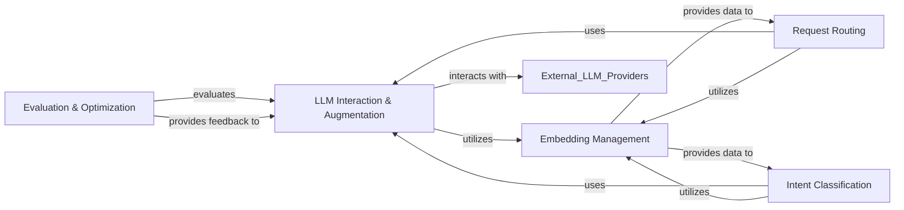

## Component Details

The AI & LLM Intelligence component serves as the central cognitive engine of the agent, orchestrating interactions with Large Language Models (LLMs) and enabling intelligent decision-making. It is logically segmented into five fundamental sub-components, each with a distinct responsibility, working in concert to provide a robust and adaptive intelligence layer.

### LLM Interaction & Augmentation
This component provides a standardized and augmented interface for interacting with various Large Language Models (LLMs) from different providers. It handles intelligent model selection, manages diverse request parameters, and converts content formats (e.g., multipart messages) to ensure compatibility with different LLM APIs. It abstracts away provider-specific complexities, offering a unified way to leverage LLM capabilities.

**Related Classes/Methods**:

- <a href="https://github.com/lastmile-ai/mcp-agent/blob/master/src/mcp_agent/workflows/llm/augmented_llm.py#L1-L1" target="_blank" rel="noopener noreferrer">`src/mcp_agent/workflows/llm/augmented_llm.py` (1:1)</a>
- <a href="https://github.com/lastmile-ai/mcp-agent/blob/master/src/mcp_agent/workflows/llm/llm_selector.py#L1-L1" target="_blank" rel="noopener noreferrer">`src/mcp_agent/workflows/llm/llm_selector.py` (1:1)</a>
- <a href="https://github.com/lastmile-ai/mcp-agent/blob/master/src/mcp_agent/workflows/llm/augmented_llm_anthropic.py#L1-L1" target="_blank" rel="noopener noreferrer">`src/mcp_agent/workflows/llm/augmented_llm_anthropic.py` (1:1)</a>
- <a href="https://github.com/lastmile-ai/mcp-agent/blob/master/src/mcp_agent/workflows/llm/augmented_llm_azure.py#L1-L1" target="_blank" rel="noopener noreferrer">`src/mcp_agent/workflows/llm/augmented_llm_azure.py` (1:1)</a>
- <a href="https://github.com/lastmile-ai/mcp-agent/blob/master/src/mcp_agent/workflows/llm/augmented_llm_bedrock.py#L1-L1" target="_blank" rel="noopener noreferrer">`src/mcp_agent/workflows/llm/augmented_llm_bedrock.py` (1:1)</a>
- <a href="https://github.com/lastmile-ai/mcp-agent/blob/master/src/mcp_agent/workflows/llm/augmented_llm_google.py#L1-L1" target="_blank" rel="noopener noreferrer">`src/mcp_agent/workflows/llm/augmented_llm_google.py` (1:1)</a>
- <a href="https://github.com/lastmile-ai/mcp-agent/blob/master/src/mcp_agent/workflows/llm/augmented_llm_ollama.py#L1-L1" target="_blank" rel="noopener noreferrer">`src/mcp_agent/workflows/llm/augmented_llm_ollama.py` (1:1)</a>
- <a href="https://github.com/lastmile-ai/mcp-agent/blob/master/src/mcp_agent/workflows/llm/augmented_llm_openai.py#L1-L1" target="_blank" rel="noopener noreferrer">`src/mcp_agent/workflows/llm/augmented_llm_openai.py` (1:1)</a>
- <a href="https://github.com/lastmile-ai/mcp-agent/blob/master/src/mcp_agent/workflows/llm/multipart_converter_anthropic.py#L1-L1" target="_blank" rel="noopener noreferrer">`src/mcp_agent/workflows/llm/multipart_converter_anthropic.py` (1:1)</a>
- <a href="https://github.com/lastmile-ai/mcp-agent/blob/master/src/mcp_agent/workflows/llm/multipart_converter_azure.py#L1-L1" target="_blank" rel="noopener noreferrer">`src/mcp_agent/workflows/llm/multipart_converter_azure.py` (1:1)</a>
- <a href="https://github.com/lastmile-ai/mcp-agent/blob/master/src/mcp_agent/workflows/llm/multipart_converter_bedrock.py#L1-L1" target="_blank" rel="noopener noreferrer">`src/mcp_agent/workflows/llm/multipart_converter_bedrock.py` (1:1)</a>
- <a href="https://github.com/lastmile-ai/mcp-agent/blob/master/src/mcp_agent/workflows/llm/multipart_converter_google.py#L1-L1" target="_blank" rel="noopener noreferrer">`src/mcp_agent/workflows/llm/multipart_converter_google.py` (1:1)</a>
- <a href="https://github.com/lastmile-ai/mcp-agent/blob/master/src/mcp_agent/workflows/llm/multipart_converter_openai.py#L1-L1" target="_blank" rel="noopener noreferrer">`src/mcp_agent/workflows/llm/multipart_converter_openai.py` (1:1)</a>

### Request Routing
This component is responsible for intelligently directing incoming requests or tasks to the most appropriate LLM, agent, or workflow. It employs various routing strategies, including those based on semantic similarity derived from embeddings and direct LLM-based decision-making, ensuring efficient task distribution.

**Related Classes/Methods**:

- <a href="https://github.com/lastmile-ai/mcp-agent/blob/master/src/mcp_agent/workflows/router/router_base.py#L1-L1" target="_blank" rel="noopener noreferrer">`src/mcp_agent/workflows/router/router_base.py` (1:1)</a>
- <a href="https://github.com/lastmile-ai/mcp-agent/blob/master/src/mcp_agent/workflows/router/router_embedding.py#L1-L1" target="_blank" rel="noopener noreferrer">`src/mcp_agent/workflows/router/router_embedding.py` (1:1)</a>
- <a href="https://github.com/lastmile-ai/mcp-agent/blob/master/src/mcp_agent/workflows/router/router_embedding_cohere.py#L1-L1" target="_blank" rel="noopener noreferrer">`src/mcp_agent/workflows/router/router_embedding_cohere.py` (1:1)</a>
- <a href="https://github.com/lastmile-ai/mcp-agent/blob/master/src/mcp_agent/workflows/router/router_embedding_openai.py#L1-L1" target="_blank" rel="noopener noreferrer">`src/mcp_agent/workflows/router/router_embedding_openai.py` (1:1)</a>
- <a href="https://github.com/lastmile-ai/mcp-agent/blob/master/src/mcp_agent/workflows/router/router_llm.py#L1-L1" target="_blank" rel="noopener noreferrer">`src/mcp_agent/workflows/router/router_llm.py` (1:1)</a>
- <a href="https://github.com/lastmile-ai/mcp-agent/blob/master/src/mcp_agent/workflows/router/router_llm_anthropic.py#L1-L1" target="_blank" rel="noopener noreferrer">`src/mcp_agent/workflows/router/router_llm_anthropic.py` (1:1)</a>
- <a href="https://github.com/lastmile-ai/mcp-agent/blob/master/src/mcp_agent/workflows/router/router_llm_openai.py#L1-L1" target="_blank" rel="noopener noreferrer">`src/mcp_agent/workflows/router/router_llm_openai.py` (1:1)</a>

### Intent Classification
This component analyzes user queries or system inputs to accurately determine the underlying user intent. It features a flexible architecture that supports both embedding-based methods (e.g., semantic similarity to known intents) and LLM-based methods (e.g., zero-shot or few-shot classification by an LLM) for robust and accurate intent recognition.

**Related Classes/Methods**:

- <a href="https://github.com/lastmile-ai/mcp-agent/blob/master/src/mcp_agent/workflows/intent_classifier/intent_classifier_base.py#L1-L1" target="_blank" rel="noopener noreferrer">`src/mcp_agent/workflows/intent_classifier/intent_classifier_base.py` (1:1)</a>
- <a href="https://github.com/lastmile-ai/mcp-agent/blob/master/src/mcp_agent/workflows/intent_classifier/intent_classifier_embedding.py#L1-L1" target="_blank" rel="noopener noreferrer">`src/mcp_agent/workflows/intent_classifier/intent_classifier_embedding.py` (1:1)</a>
- <a href="https://github.com/lastmile-ai/mcp-agent/blob/master/src/mcp_agent/workflows/intent_classifier/intent_classifier_embedding_cohere.py#L1-L1" target="_blank" rel="noopener noreferrer">`src/mcp_agent/workflows/intent_classifier/intent_classifier_embedding_cohere.py` (1:1)</a>
- <a href="https://github.com/lastmile-ai/mcp-agent/blob/master/src/mcp_agent/workflows/intent_classifier/intent_classifier_embedding_openai.py#L1-L1" target="_blank" rel="noopener noreferrer">`src/mcp_agent/workflows/intent_classifier/intent_classifier_embedding_openai.py` (1:1)</a>
- <a href="https://github.com/lastmile-ai/mcp-agent/blob/master/src/mcp_agent/workflows/intent_classifier/intent_classifier_llm.py#L1-L1" target="_blank" rel="noopener noreferrer">`src/mcp_agent/workflows/intent_classifier/intent_classifier_llm.py` (1:1)</a>
- <a href="https://github.com/lastmile-ai/mcp-agent/blob/master/src/mcp_agent/workflows/intent_classifier/intent_classifier_llm_anthropic.py#L1-L1" target="_blank" rel="noopener noreferrer">`src/mcp_agent/workflows/intent_classifier/intent_classifier_llm_anthropic.py` (1:1)</a>
- <a href="https://github.com/lastmile-ai/mcp-agent/blob/master/src/mcp_agent/workflows/intent_classifier/intent_classifier_llm_openai.py#L1-L1" target="_blank" rel="noopener noreferrer">`src/mcp_agent/workflows/intent_classifier/intent_classifier_llm_openai.py` (1:1)</a>

### Embedding Management
This component provides a standardized interface for generating vector embeddings from text using various embedding models and providers (e.g., OpenAI, Cohere). It centralizes the process of converting textual data into numerical representations, which are crucial for tasks like semantic search, similarity comparisons, routing, and intent classification.

**Related Classes/Methods**:

- <a href="https://github.com/lastmile-ai/mcp-agent/blob/master/src/mcp_agent/workflows/embedding/embedding_base.py#L1-L1" target="_blank" rel="noopener noreferrer">`src/mcp_agent/workflows/embedding/embedding_base.py` (1:1)</a>
- <a href="https://github.com/lastmile-ai/mcp-agent/blob/master/src/mcp_agent/workflows/embedding/embedding_openai.py#L1-L1" target="_blank" rel="noopener noreferrer">`src/mcp_agent/workflows/embedding/embedding_openai.py` (1:1)</a>
- <a href="https://github.com/lastmile-ai/mcp-agent/blob/master/src/mcp_agent/workflows/embedding/embedding_cohere.py#L1-L1" target="_blank" rel="noopener noreferrer">`src/mcp_agent/workflows/embedding/embedding_cohere.py` (1:1)</a>

### Evaluation & Optimization
This component is dedicated to assessing the quality, relevance, and effectiveness of responses generated by LLMs. It provides mechanisms for evaluating outputs against predefined criteria and potentially optimizing them through iterative refinement or feedback loops to continuously improve performance and accuracy.

**Related Classes/Methods**:

- <a href="https://github.com/lastmile-ai/mcp-agent/blob/master/src/mcp_agent/workflows/evaluator_optimizer/evaluator_optimizer.py#L1-L1" target="_blank" rel="noopener noreferrer">`src/mcp_agent/workflows/evaluator_optimizer/evaluator_optimizer.py` (1:1)</a>

### [FAQ](https://github.com/CodeBoarding/GeneratedOnBoardings/tree/main?tab=readme-ov-file#faq)