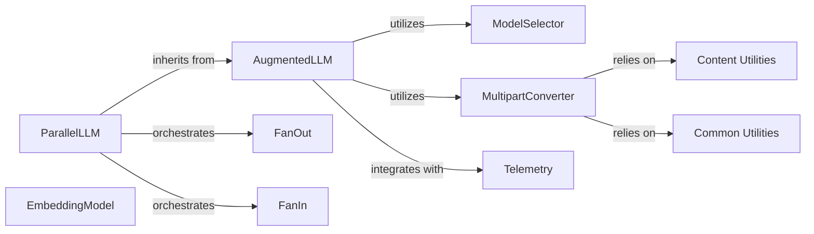

## Component Details

The AI Model Services component provides a unified, provider-agnostic interface for interacting with various Large Language Models (LLMs) and generating numerical text embeddings. It centralizes all AI model interactions, offering functionalities for intelligent model selection, message format conversion, and facilitating parallel LLM invocations (fan-out/fan-in patterns). This subsystem is fundamental because it abstracts away the complexities of integrating with diverse AI model providers, allowing the rest of the system to interact with LLMs and embedding models through a consistent API. This promotes modularity, simplifies development, and enables easy swapping or addition of new AI models without significant architectural changes.

### AugmentedLLM
This is the core abstract class for interacting with LLMs, providing a unified interface for generating text, structured outputs, and handling tool calls. Its concrete implementations (e.g., `OpenAIAugmentedLLM`, `AnthropicAugmentedLLM`) encapsulate the specifics of integrating with different LLM providers. It serves as the primary entry point for all LLM-based operations.

**Related Classes/Methods**:

- <a href="https://github.com/lastmile-ai/mcp-agent/blob/master/src/mcp_agent/workflows/llm/augmented_llm.py#L1-L9999" target="_blank" rel="noopener noreferrer">`mcp_agent/workflows/llm/augmented_llm.py` (1:9999)</a>
- <a href="https://github.com/lastmile-ai/mcp-agent/blob/master/src/mcp_agent/workflows/llm/augmented_llm_openai.py#L1-L9999" target="_blank" rel="noopener noreferrer">`mcp_agent/workflows/llm/augmented_llm_openai.py` (1:9999)</a>
- <a href="https://github.com/lastmile-ai/mcp-agent/blob/master/src/mcp_agent/workflows/llm/augmented_llm_anthropic.py#L1-L9999" target="_blank" rel="noopener noreferrer">`mcp_agent/workflows/llm/augmented_llm_anthropic.py` (1:9999)</a>
- <a href="https://github.com/lastmile-ai/mcp-agent/blob/master/src/mcp_agent/workflows/llm/augmented_llm_google.py#L1-L9999" target="_blank" rel="noopener noreferrer">`mcp_agent/workflows/llm/augmented_llm_google.py` (1:9999)</a>
- <a href="https://github.com/lastmile-ai/mcp-agent/blob/master/src/mcp_agent/workflows/llm/augmented_llm_azure.py#L1-L9999" target="_blank" rel="noopener noreferrer">`mcp_agent/workflows/llm/augmented_llm_azure.py` (1:9999)</a>
- <a href="https://github.com/lastmile-ai/mcp-agent/blob/master/src/mcp_agent/workflows/llm/augmented_llm_bedrock.py#L1-L9999" target="_blank" rel="noopener noreferrer">`mcp_agent/workflows/llm/augmented_llm_bedrock.py` (1:9999)</a>
- <a href="https://github.com/lastmile-ai/mcp-agent/blob/master/src/mcp_agent/workflows/llm/augmented_llm_ollama.py#L1-L9999" target="_blank" rel="noopener noreferrer">`mcp_agent/workflows/llm/augmented_llm_ollama.py` (1:9999)</a>

### ModelSelector
Responsible for dynamically selecting the most appropriate LLM model based on criteria such as cost, speed, intelligence, and user-provided hints. It ensures that the agent uses the optimal model for a given task, optimizing performance and resource usage.

**Related Classes/Methods**:

- <a href="https://github.com/lastmile-ai/mcp-agent/blob/master/src/mcp_agent/workflows/llm/llm_selector.py#L1-L9999" target="_blank" rel="noopener noreferrer">`mcp_agent/workflows/llm/llm_selector.py` (1:9999)</a>

### MultipartConverter
These classes handle the conversion of internal, standardized message formats to the specific multipart message formats required by different LLM providers. This is crucial for supporting rich content types (text, images, resources) across various models, ensuring compatibility and flexibility.

**Related Classes/Methods**:

- <a href="https://github.com/lastmile-ai/mcp-agent/blob/master/src/mcp_agent/workflows/llm/augmented_llm.py#L1-L9999" target="_blank" rel="noopener noreferrer">`mcp_agent/workflows/llm/augmented_llm.py` (1:9999)</a>
- <a href="https://github.com/lastmile-ai/mcp-agent/blob/master/src/mcp_agent/workflows/llm/multipart_converter_openai.py#L1-L9999" target="_blank" rel="noopener noreferrer">`mcp_agent/workflows/llm/multipart_converter_openai.py` (1:9999)</a>
- <a href="https://github.com/lastmile-ai/mcp-agent/blob/master/src/mcp_agent/workflows/llm/multipart_converter_anthropic.py#L1-L9999" target="_blank" rel="noopener noreferrer">`mcp_agent/workflows/llm/multipart_converter_anthropic.py` (1:9999)</a>
- <a href="https://github.com/lastmile-ai/mcp-agent/blob/master/src/mcp_agent/workflows/llm/multipart_converter_google.py#L1-L9999" target="_blank" rel="noopener noreferrer">`mcp_agent/workflows/llm/multipart_converter_google.py` (1:9999)</a>
- <a href="https://github.com/lastmile-ai/mcp-agent/blob/master/src/mcp_agent/workflows/llm/multipart_converter_azure.py#L1-L9999" target="_blank" rel="noopener noreferrer">`mcp_agent/workflows/llm/multipart_converter_azure.py` (1:9999)</a>
- <a href="https://github.com/lastmile-ai/mcp-agent/blob/master/src/mcp_agent/workflows/llm/multipart_converter_bedrock.py#L1-L9999" target="_blank" rel="noopener noreferrer">`mcp_agent/workflows/llm/multipart_converter_bedrock.py` (1:9999)</a>

### ParallelLLM
This component enables the execution of LLM calls in parallel. It orchestrates the fan-out of requests to multiple LLMs and the subsequent fan-in of their responses, allowing for concurrent processing and aggregation of results, significantly improving throughput for certain tasks.

**Related Classes/Methods**:

- <a href="https://github.com/lastmile-ai/mcp-agent/blob/master/src/mcp_agent/workflows/parallel/parallel_llm.py#L1-L9999" target="_blank" rel="noopener noreferrer">`mcp_agent/workflows/parallel/parallel_llm.py` (1:9999)</a>

### FanOut
A sub-component of `ParallelLLM` responsible for distributing a single LLM request to multiple underlying LLM instances or providers. It initiates parallel generation tasks, acting as the dispatcher in a fan-out/fan-in pattern.

**Related Classes/Methods**:

- <a href="https://github.com/lastmile-ai/mcp-agent/blob/master/src/mcp_agent/workflows/parallel/fan_out.py#L1-L9999" target="_blank" rel="noopener noreferrer">`mcp_agent/workflows/parallel/fan_out.py` (1:9999)</a>

### FanIn
A sub-component of `ParallelLLM` responsible for aggregating and consolidating responses from multiple parallel LLM calls. It processes the results from the `FanOut` stage and combines them into a coherent output, completing the fan-out/fan-in pattern.

**Related Classes/Methods**:

- <a href="https://github.com/lastmile-ai/mcp-agent/blob/master/src/mcp_agent/workflows/parallel/fan_in.py#L1-L9999" target="_blank" rel="noopener noreferrer">`mcp_agent/workflows/parallel/fan_in.py` (1:9999)</a>

### EmbeddingModel
Provides an interface for generating numerical embeddings from text using different embedding model providers (e.g., `OpenAIEmbeddingModel`, `CohereEmbeddingModel`). This is essential for tasks like semantic search, similarity comparisons, and RAG (Retrieval Augmented Generation), enabling the system to understand and process textual data semantically.

**Related Classes/Methods**:

- <a href="https://github.com/lastmile-ai/mcp-agent/blob/master/src/mcp_agent/workflows/embedding/embedding_base.py#L1-L9999" target="_blank" rel="noopener noreferrer">`mcp_agent/workflows/embedding/embedding_base.py` (1:9999)</a>
- <a href="https://github.com/lastmile-ai/mcp-agent/blob/master/src/mcp_agent/workflows/embedding/embedding_openai.py#L1-L9999" target="_blank" rel="noopener noreferrer">`mcp_agent/workflows/embedding/embedding_openai.py` (1:9999)</a>
- <a href="https://github.com/lastmile-ai/mcp-agent/blob/master/src/mcp_agent/workflows/embedding/embedding_cohere.py#L1-L9999" target="_blank" rel="noopener noreferrer">`mcp_agent/workflows/embedding/embedding_cohere.py` (1:9999)</a>

### Telemetry
This module provides cross-cutting concerns for tracing and observability. It includes functions to instrument LLM interactions and capture valuable debugging and performance data, as well as usage tracking. This is crucial for monitoring the health and efficiency of AI model interactions.

**Related Classes/Methods**:

- <a href="https://github.com/lastmile-ai/mcp-agent/blob/master/src/mcp_agent/tracing/telemetry.py#L1-L9999" target="_blank" rel="noopener noreferrer">`mcp_agent/tracing/telemetry.py` (1:9999)</a>
- <a href="https://github.com/lastmile-ai/mcp-agent/blob/master/src/mcp_agent/telemetry/usage_tracking.py#L1-L9999" target="_blank" rel="noopener noreferrer">`mcp_agent/telemetry/usage_tracking.py` (1:9999)</a>

### Common Utilities
A collection of general-purpose utility functions used across various components for data manipulation, serialization, and type handling. These utilities provide foundational support for data consistency and processing within the AI model services.

**Related Classes/Methods**:

- <a href="https://github.com/lastmile-ai/mcp-agent/blob/master/src/mcp_agent/utils/common.py#L1-L9999" target="_blank" rel="noopener noreferrer">`mcp_agent/utils/common.py` (1:9999)</a>

### Content Utilities
Provides helper functions for working with different content types (text, image, resource) within messages. This enables the system to handle multimodal inputs and outputs, which is increasingly important for advanced LLM interactions.

**Related Classes/Methods**:

- <a href="https://github.com/lastmile-ai/mcp-agent/blob/master/src/mcp_agent/utils/content_utils.py#L1-L9999" target="_blank" rel="noopener noreferrer">`mcp_agent/utils/content_utils.py` (1:9999)</a>

### [FAQ](https://github.com/CodeBoarding/GeneratedOnBoardings/tree/main?tab=readme-ov-file#faq)