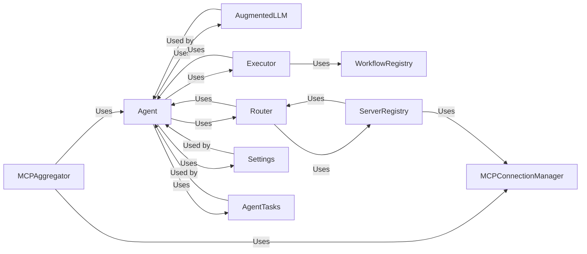

## Details

One paragraph explaining the functionality which is represented by this graph. What the main flow is and what is its purpose.

### Agent [[Expand]](./Agent.md)
The base class for all agents. It manages the agent's lifecycle, including initialization, tool management, prompt creation, and interaction with the AugmentedLLM and MCP. It orchestrates the agent's capabilities and resources.

**Related Classes/Methods**: _None_

### AugmentedLLM
An abstract interface for interacting with Large Language Models (LLMs). It provides a consistent way to access different LLM providers (OpenAI, Anthropic, Azure, etc.).

**Related Classes/Methods**: _None_

### Router
An abstract base class for routers, which determine the appropriate agent or server to handle a request.

**Related Classes/Methods**: _None_

### Executor [[Expand]](./Executor.md)
Abstract base class for executors, which manage the execution of tasks.

**Related Classes/Methods**: _None_

### WorkflowRegistry
Manages the registration and retrieval of workflows.

**Related Classes/Methods**: _None_

### MCPAggregator
Aggregates multiple MCP servers into a single endpoint.

**Related Classes/Methods**: _None_

### MCPConnectionManager
Manages connections to MCP servers.

**Related Classes/Methods**: _None_

### ServerRegistry
Keeps track of available MCP servers.

**Related Classes/Methods**: _None_

### Settings
Manages the configuration settings for the agent.

**Related Classes/Methods**: _None_

### AgentTasks
Encapsulates asynchronous tasks related to agent functionality, such as initializing the aggregator.

**Related Classes/Methods**: _None_

### [FAQ](https://github.com/CodeBoarding/GeneratedOnBoardings/tree/main?tab=readme-ov-file#faq)