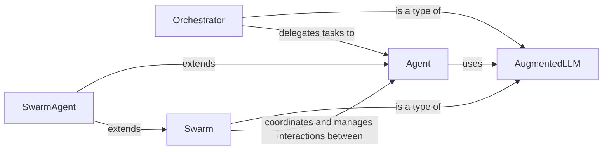

## Component Details

Abstract Components Overview and Component Relationships

### Agent
The foundational intelligent entity within the system. It represents a single autonomous unit capable of performing tasks, interacting with LLMs, and utilizing tools. It serves as the base class for more specialized agents.

**Related Classes/Methods**:

- <a href="https://github.com/lastmile-ai/mcp-agent/blob/master/src/mcp_agent/agents/agent.py#L56-L928" target="_blank" rel="noopener noreferrer">`src.mcp_agent.agents.agent.Agent` (56:928)</a>

### AugmentedLLM
This component provides the essential capabilities for interacting with Large Language Models (LLMs) and calling external tools. It serves as a foundational abstraction for any component that needs to leverage LLM intelligence and external functionalities.

**Related Classes/Methods**:

- <a href="https://github.com/lastmile-ai/mcp-agent/blob/master/src/mcp_agent/workflows/llm/augmented_llm.py#L218-L668" target="_blank" rel="noopener noreferrer">`src.mcp_agent.workflows.llm.augmented_llm.AugmentedLLM` (218:668)</a>

### Orchestrator
A specialized `AugmentedLLM` that focuses on high-level planning, task decomposition, and sequencing. It acts as a conductor for complex workflows, breaking down large goals into manageable steps and delegating tasks.

**Related Classes/Methods**:

- <a href="https://github.com/lastmile-ai/mcp-agent/blob/master/src/mcp_agent/workflows/orchestrator/orchestrator.py#L45-L585" target="_blank" rel="noopener noreferrer">`src.mcp_agent.workflows.orchestrator.orchestrator.Orchestrator` (45:585)</a>

### Swarm
Another specialized `AugmentedLLM` designed for managing and facilitating collaborative interactions among multiple agents. It enables the coordination and communication necessary for multi-agent workflows, allowing agents to work together towards a common objective.

**Related Classes/Methods**:

- <a href="https://github.com/lastmile-ai/mcp-agent/blob/master/src/mcp_agent/workflows/swarm/swarm.py#L189-L310" target="_blank" rel="noopener noreferrer">`src.mcp_agent.workflows.swarm.swarm.Swarm` (189:310)</a>

### SwarmAgent
A concrete implementation of an `Agent` that is also a `Swarm`. This dual inheritance highlights its role in both participating in and potentially leading swarm-based operations, acting as an individual agent within a collaborative context.

**Related Classes/Methods**:

- <a href="https://github.com/lastmile-ai/mcp-agent/blob/master/src/mcp_agent/workflows/swarm/swarm.py#L73-L143" target="_blank" rel="noopener noreferrer">`src.mcp_agent.workflows.swarm.swarm.SwarmAgent` (73:143)</a>

### [FAQ](https://github.com/CodeBoarding/GeneratedOnBoardings/tree/main?tab=readme-ov-file#faq)