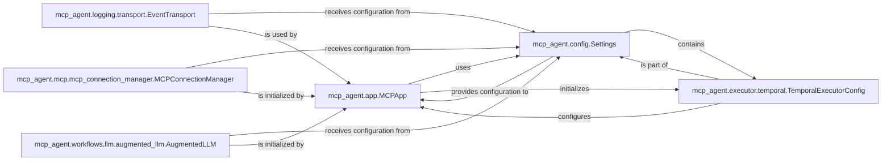

## Component Details

This component serves as the foundational layer of the `mcp_agent` application, orchestrating its startup, context initialization, and the comprehensive management of global configurations and sensitive secrets. It ensures that the application operates with the correct settings and that all core services are properly configured from the outset.

### mcp_agent.app.MCPApp
The central orchestrator of the application, responsible for initializing the application context, loading configurations, and setting up core services like logging, Multi-Cloud Platform (MCP) communication, and Large Language Model (LLM) selection. It acts as the primary entry point for the application's lifecycle.

**Related Classes/Methods**:

- <a href="https://github.com/lastmile-ai/mcp-agent/blob/master/src/mcp_agent/app.py#L33-L504" target="_blank" rel="noopener noreferrer">`mcp_agent.app.MCPApp` (33:504)</a>

### mcp_agent.config.Settings
The primary configuration object for the entire application. It aggregates and manages all application-wide settings, including general parameters, sensitive credentials, and specific configurations for various external services (e.g., LLMs, Temporal, MCP). It ensures a centralized and structured approach to configuration management.

**Related Classes/Methods**:

- <a href="https://github.com/lastmile-ai/mcp-agent/blob/master/src/mcp_agent/config.py#L1-L1" target="_blank" rel="noopener noreferrer">`mcp_agent.config.Settings` (1:1)</a>

### mcp_agent.executor.temporal.TemporalExecutorConfig
A specialized configuration class that defines settings specifically for the Temporal workflow engine. It provides detailed parameters for Temporal client setup, worker registration, and workflow execution, inheriting from the broader `TemporalSettings` within `mcp_agent.config.Settings`.

**Related Classes/Methods**:

- `mcp_agent.executor.temporal.TemporalExecutorConfig` (1:1)

### mcp_agent.logging.transport.EventTransport
The abstract base class for all event transport mechanisms within the logging subsystem. It defines the interface for sending log events to various destinations (e.g., console, file, HTTP endpoints), ensuring a consistent logging approach across the application for observability and debugging.

**Related Classes/Methods**:

- <a href="https://github.com/lastmile-ai/mcp-agent/blob/master/src/mcp_agent/logging/transport.py#L1-L1" target="_blank" rel="noopener noreferrer">`mcp_agent.logging.transport.EventTransport` (1:1)</a>

### mcp_agent.mcp.mcp_connection_manager.MCPConnectionManager
Manages the lifecycle and details of connections to the Multi-Cloud Platform (MCP). It is responsible for establishing, maintaining, and closing connections, ensuring secure and reliable communication with external MCP services based on provided configurations.

**Related Classes/Methods**:

- <a href="https://github.com/lastmile-ai/mcp-agent/blob/master/src/mcp_agent/mcp/mcp_connection_manager.py#L1-L1" target="_blank" rel="noopener noreferrer">`mcp_agent.mcp.mcp_connection_manager.MCPConnectionManager` (1:1)</a>

### mcp_agent.workflows.llm.augmented_llm.AugmentedLLM
The foundational abstract class for all augmented Large Language Model (LLM) implementations within the application. It defines the common interface and base functionalities for interacting with various LLM providers, abstracting away provider-specific details and enabling consistent LLM usage across workflows.

**Related Classes/Methods**:

- <a href="https://github.com/lastmile-ai/mcp-agent/blob/master/src/mcp_agent/workflows/llm/augmented_llm.py#L218-L668" target="_blank" rel="noopener noreferrer">`mcp_agent.workflows.llm.augmented_llm.AugmentedLLM` (218:668)</a>

### [FAQ](https://github.com/CodeBoarding/GeneratedOnBoardings/tree/main?tab=readme-ov-file#faq)