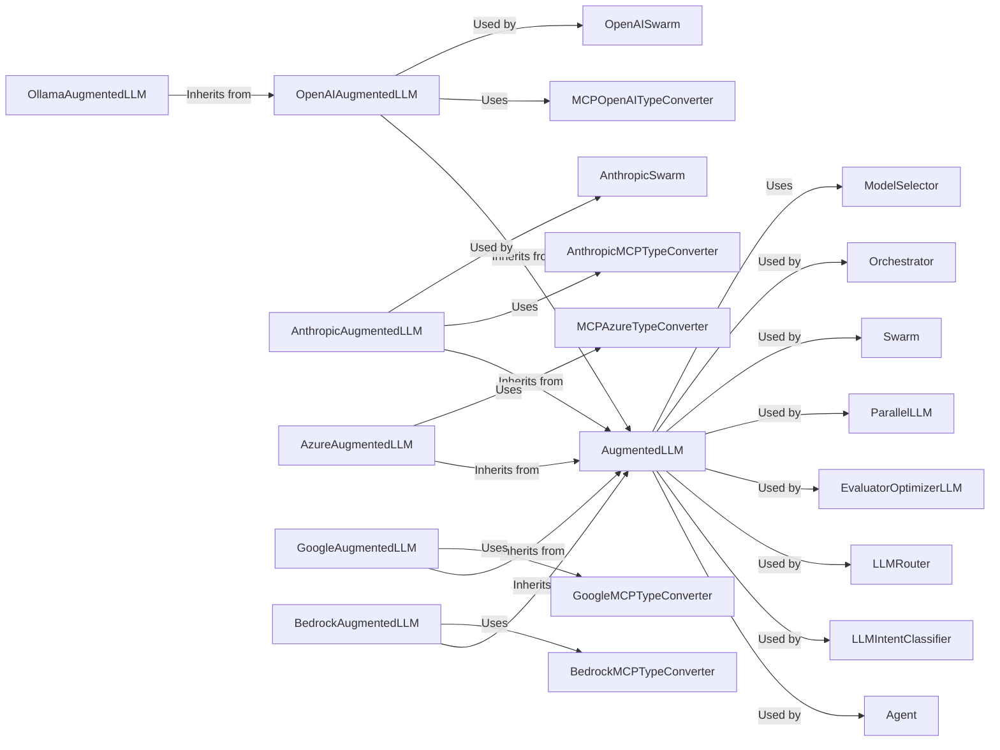

## Details

One paragraph explaining the functionality which is represented by this graph. What the main flow is and what is its purpose.

### AugmentedLLM
This is the abstract base class (or protocol) that defines the interface for interacting with different LLM providers. It outlines methods for prompt formatting, making requests to LLMs, and handling responses. It acts as a facade, allowing the agent to interact with various LLMs in a consistent manner.

**Related Classes/Methods**: _None_

### OpenAIAugmentedLLM
A concrete implementation of `AugmentedLLM` specifically for interacting with OpenAI models. It handles OpenAI-specific authentication, request formatting, and response parsing.

**Related Classes/Methods**: _None_

### AnthropicAugmentedLLM
A concrete implementation of `AugmentedLLM` for interacting with Anthropic's models. It manages Anthropic-specific API interactions.

**Related Classes/Methods**: _None_

### AzureAugmentedLLM
Implements `AugmentedLLM` for Azure's LLM services.

**Related Classes/Methods**: _None_

### GoogleAugmentedLLM
Implements `AugmentedLLM` for Google's LLM services (e.g., Vertex AI).

**Related Classes/Methods**: _None_

### BedrockAugmentedLLM
Implements `AugmentedLLM` for Amazon Bedrock.

**Related Classes/Methods**: _None_

### OllamaAugmentedLLM
Implements `AugmentedLLM`. It inherits from `OpenAIAugmentedLLM`.

**Related Classes/Methods**: _None_

### ModelSelector
This component selects the most appropriate LLM based on metrics like cost, latency, and benchmarks.

**Related Classes/Methods**: _None_

### MCPOpenAITypeConverter
These components handle the conversion between the MCP's internal data types and the specific data types required by each LLM provider's API.

**Related Classes/Methods**: _None_

### AnthropicMCPTypeConverter
These components handle the conversion between the MCP's internal data types and the specific data types required by each LLM provider's API.

**Related Classes/Methods**: _None_

### MCPAzureTypeConverter
These components handle the conversion between the MCP's internal data types and the specific data types required by each LLM provider's API.

**Related Classes/Methods**: _None_

### GoogleMCPTypeConverter
These components handle the conversion between the MCP's internal data types and the specific data types required by each LLM provider's API.

**Related Classes/Methods**: _None_

### BedrockMCPTypeConverter
These components handle the conversion between the MCP's internal data types and the specific data types required by each LLM provider's API.

**Related Classes/Methods**: _None_

### [FAQ](https://github.com/CodeBoarding/GeneratedOnBoardings/tree/main?tab=readme-ov-file#faq)