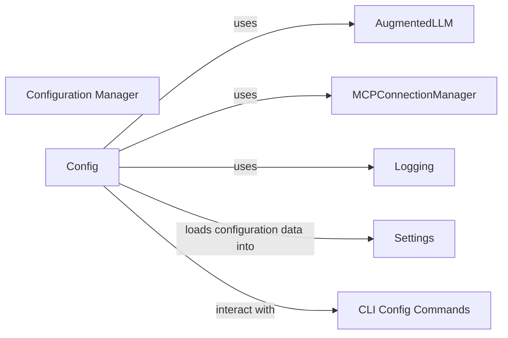

## Details

Configuration Manager component analysis

### Configuration Manager [[Expand]](./Configuration_Manager.md)
Loads and manages application settings, secrets, and provider-specific configurations. It handles reading configuration files (likely YAML), parsing them, and making the settings available to other components. This includes settings for LLM providers (OpenAI, Anthropic, etc.), MCP connections, and other application-level configurations.

**Related Classes/Methods**: _None_

### Config
The central class/module responsible for loading, parsing, and providing access to configuration settings.

**Related Classes/Methods**: _None_

### Settings
Pydantic models defined within config.py or in separate files that represent the structure of the configuration data. These models enforce type safety and validation.

**Related Classes/Methods**: _None_

### CLI Config Commands
Provides command-line interface for interacting with the configuration, such as viewing or validating settings.

**Related Classes/Methods**: _None_

### AugmentedLLM
Retrieves provider-specific settings (API keys, model names, etc.).

**Related Classes/Methods**: _None_

### MCPConnectionManager
Retrieves connection details for MCP servers.

**Related Classes/Methods**: _None_

### Logging
Configures logging levels and destinations.

**Related Classes/Methods**: _None_

### [FAQ](https://github.com/CodeBoarding/GeneratedOnBoardings/tree/main?tab=readme-ov-file#faq)