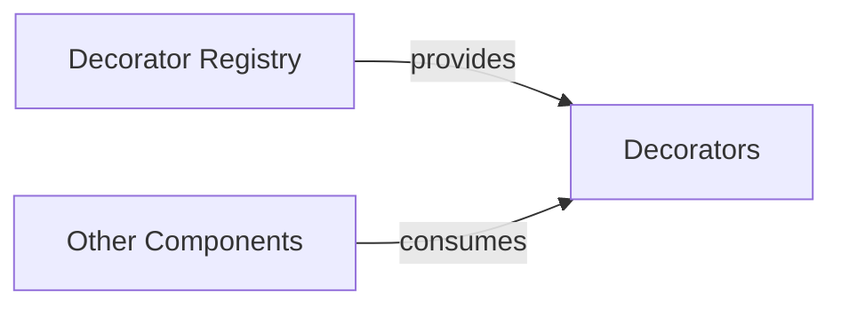

## Component Details

Overview of the Decorator Management system, focusing on the Decorator Registry component and its role in providing decorators to other system components.

### Decorator Registry
The Decorator Registry component, implemented by the DecoratorRegistry class, serves as a centralized repository for managing and retrieving various types of decorators. These decorators can be applied to different aspects of workflows, including workflow definitions, workflow runs, workflow tasks, and workflow signals. Its primary purpose is to enable the injection of cross-cutting concerns (e.g., logging, retry mechanisms, authentication) into the execution flow without altering the core business logic. This promotes modularity, reusability, and a clean separation of concerns within the system.

**Related Classes/Methods**:

- <a href="https://github.com/lastmile-ai/mcp-agent/blob/master/src/mcp_agent/executor/decorator_registry.py#L0-L0" target="_blank" rel="noopener noreferrer">`mcp_agent.executor.decorator_registry.DecoratorRegistry` (0:0)</a>

### Decorators
An abstract representation of the various types of decorators managed and provided by the Decorator Registry.

**Related Classes/Methods**: _None_

### Other Components
A generic representation of other components within the mcp-agent system that consume or retrieve decorators from the Decorator Registry.

**Related Classes/Methods**: _None_

### [FAQ](https://github.com/CodeBoarding/GeneratedOnBoardings/tree/main?tab=readme-ov-file#faq)