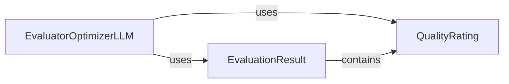

## Component Details

This component implements a sophisticated feedback loop where an "optimizer" (an LLM or agent) generates responses, and an "evaluator" (another LLM or agent) assesses their quality against predefined criteria. The core purpose is to continuously improve the generated outputs by iteratively refining them based on the evaluator's feedback until a satisfactory quality threshold is met or a maximum number of refinement attempts is reached. This mechanism is vital for tasks requiring high accuracy, relevance, or adherence to specific guidelines.

### EvaluatorOptimizerLLM
This is the primary class and the orchestrator of the entire evaluation and optimization workflow. It manages the iterative interaction between the response-generating `optimizer` (which can be an `Agent` or `AugmentedLLM`) and the feedback-providing `evaluator` (also an `Agent`, `AugmentedLLM`, or a string representing evaluation criteria). Its core responsibility is to drive the refinement loop, delegating generation and evaluation tasks, and deciding whether to continue iterating based on the `EvaluationResult` until a `min_rating` is achieved or `max_refinements` are exhausted. It inherits from `AugmentedLLM`, enabling it to manage and interact with other LLM-based components.

**Related Classes/Methods**:

- `EvaluatorOptimizerLLM` (1:1)

### QualityRating
An enumeration (`Enum`) that defines a standardized set of discrete quality levels (e.g., `POOR`, `FAIR`, `GOOD`, `EXCELLENT`). This component provides a consistent and quantifiable vocabulary for the `evaluator` to rate the quality of generated responses, which is essential for programmatic assessment, setting performance thresholds, and guiding the `EvaluatorOptimizerLLM`'s decision-making process.

**Related Classes/Methods**:

- `QualityRating` (1:1)

### EvaluationResult
A Pydantic BaseModel that serves as a structured container for the outcome of an evaluation step. It encapsulates critical information including the `rating` (a `QualityRating`), detailed textual `feedback`, a boolean flag `needs_improvement` indicating whether further refinement is required, and a list of `focus_areas` to guide subsequent optimization efforts. This structured output is vital for the `EvaluatorOptimizerLLM` to make informed decisions about continuing or stopping the refinement loop and providing actionable guidance to the optimizer.

**Related Classes/Methods**:

- `EvaluationResult` (1:1)

### [FAQ](https://github.com/CodeBoarding/GeneratedOnBoardings/tree/main?tab=readme-ov-file#faq)