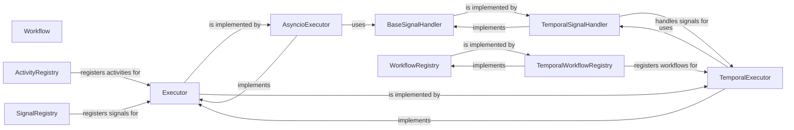

## Component Details

The `Execution & Workflow Engine` component is fundamental to the project as it provides the core infrastructure for defining, executing, and managing tasks and complex workflows. It abstracts away the underlying execution environment, allowing for flexible deployment across different backends (e.g., local asyncio for development/testing, Temporal for production-grade distributed and fault-tolerant operations). This abstraction is crucial for building robust and scalable agentic behaviors.

### Executor
Defines the abstract interface for executing workflows. It serves as the contract for different execution backends, ensuring a consistent way to initiate and manage workflow processes.

**Related Classes/Methods**:

- <a href="https://github.com/lastmile-ai/mcp-agent/blob/master/src/mcp_agent/executor/executor.py#L51-L231" target="_blank" rel="noopener noreferrer">`Executor` (51:231)</a>

### AsyncioExecutor
A concrete implementation of the `Executor` interface that leverages Python's `asyncio` for local, in-memory workflow execution. It is suitable for simpler, non-distributed scenarios and rapid prototyping.

**Related Classes/Methods**:

- `AsyncioExecutor` (1:1)

### TemporalExecutor
A robust implementation of the `Executor` interface that integrates with the Temporal.io platform. It provides capabilities for fault-tolerant, scalable, and durable distributed workflow execution, essential for production environments.

**Related Classes/Methods**:

- `TemporalExecutor` (1:1)

### Workflow
Represents a workflow definition, encapsulating the business logic and state of a running process. It interacts with the chosen executor to manage its lifecycle, including task execution and state transitions.

**Related Classes/Methods**:

- <a href="https://github.com/lastmile-ai/mcp-agent/blob/master/src/mcp_agent/executor/workflow.py#L61-L510" target="_blank" rel="noopener noreferrer">`Workflow` (61:510)</a>

### ActivityRegistry
A central registry responsible for storing and retrieving callable activities (tasks) that can be invoked and executed within a workflow by an executor. It enables dynamic discovery of available operations.

**Related Classes/Methods**:

- `ActivityRegistry` (1:1)

### SignalRegistry
Manages the registration and handling of workflow signals, enabling external communication and event-driven interactions with running workflows. It allows external systems to influence workflow execution.

**Related Classes/Methods**:

- <a href="https://github.com/lastmile-ai/mcp-agent/blob/master/src/mcp_agent/executor/signal_registry.py#L3-L29" target="_blank" rel="noopener noreferrer">`SignalRegistry` (3:29)</a>

### BaseSignalHandler
Defines the abstract interface for handling signals within the workflow execution environment. It provides a common contract for different signal handling mechanisms, ensuring extensibility.

**Related Classes/Methods**:

- `BaseSignalHandler` (1:1)

### TemporalSignalHandler
A concrete implementation of `BaseSignalHandler` specifically designed for handling signals within the Temporal workflow environment. It integrates with Temporal's native signal mechanisms.

**Related Classes/Methods**:

- `TemporalSignalHandler` (1:1)

### WorkflowRegistry
Defines the abstract interface for registering and retrieving workflow definitions. It allows executors to discover and instantiate the correct workflow logic based on a given identifier.

**Related Classes/Methods**:

- <a href="https://github.com/lastmile-ai/mcp-agent/blob/master/src/mcp_agent/executor/workflow_registry.py#L19-L146" target="_blank" rel="noopener noreferrer">`WorkflowRegistry` (19:146)</a>

### TemporalWorkflowRegistry
A concrete implementation of `WorkflowRegistry` tailored for the Temporal.io platform. It manages the registration and retrieval of Temporal workflow definitions, ensuring they are discoverable by the Temporal worker.

**Related Classes/Methods**:

- `TemporalWorkflowRegistry` (1:1)

### [FAQ](https://github.com/CodeBoarding/GeneratedOnBoardings/tree/main?tab=readme-ov-file#faq)