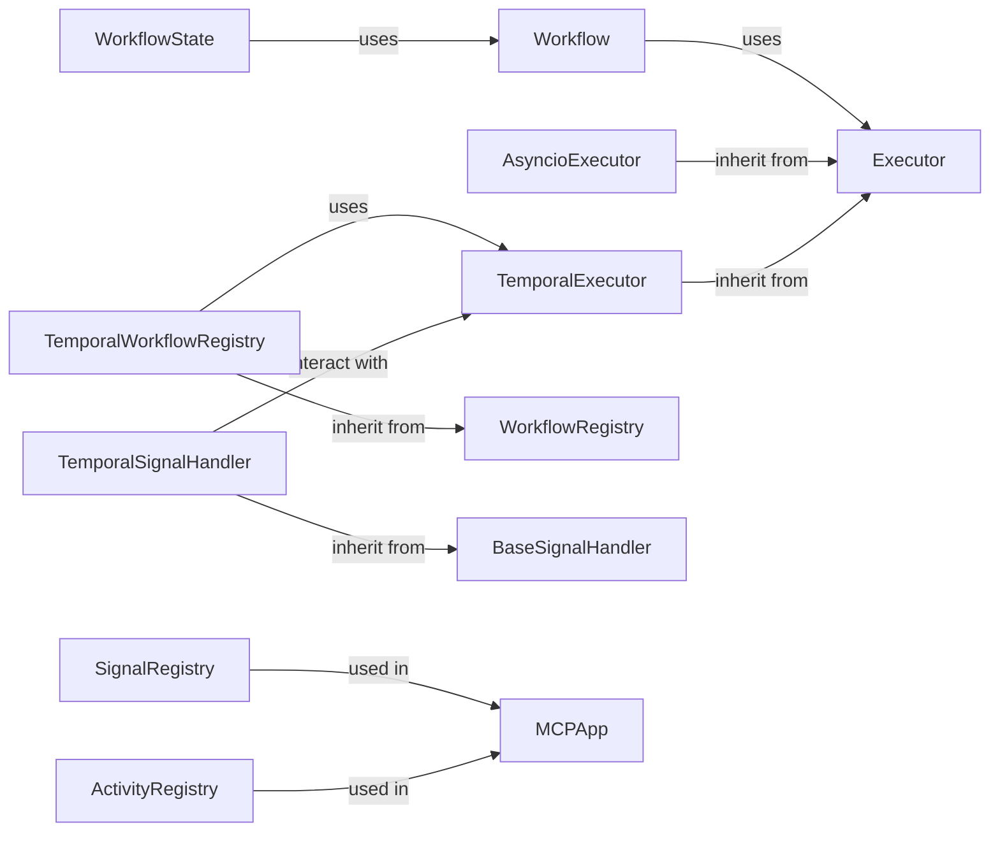

## Details

These components are fundamental because they provide the core infrastructure for executing workflows within the `mcp_agent` framework. The `Executor` abstraction allows for different execution environments, while the `Workflow` component defines the unit of work. The registries enable dynamic workflow discovery and signal handling provides external control and monitoring capabilities. The separation of concerns between abstract base classes and concrete implementations promotes modularity and maintainability, aligning with the project's architectural bias. The use of Temporal for durable execution addresses the need for fault tolerance and reliability in long-running workflows.

### Executor [[Expand]](./Executor.md)
Abstract base class defining the interface for executing workflows. It likely handles the lifecycle of a workflow, including starting, monitoring, and stopping it.

**Related Classes/Methods**: _None_

### AsyncioExecutor
Concrete executor implementation using `asyncio` for non-durable, asynchronous task execution.

**Related Classes/Methods**: _None_

### TemporalExecutor
Concrete executor implementation using Temporal for durable and reliable workflow execution.

**Related Classes/Methods**: _None_

### Workflow
Represents a unit of work, encapsulating the steps and data flow of a task.

**Related Classes/Methods**: _None_

### WorkflowRegistry
Manages the registration and retrieval of workflows, allowing the executor to discover and execute available workflows.

**Related Classes/Methods**: _None_

### TemporalWorkflowRegistry
Specialized registry for Temporal workflows.

**Related Classes/Methods**: _None_

### BaseSignalHandler
Abstract base class for handling signals sent to workflows. Signals can be used to interrupt, modify, or monitor workflows.

**Related Classes/Methods**: _None_

### TemporalSignalHandler
Concrete signal handler implementation for Temporal workflows.

**Related Classes/Methods**: _None_

### SignalRegistry
Registry for signals.

**Related Classes/Methods**: _None_

### ActivityRegistry
Registry for activities.

**Related Classes/Methods**: _None_

### [FAQ](https://github.com/CodeBoarding/GeneratedOnBoardings/tree/main?tab=readme-ov-file#faq)