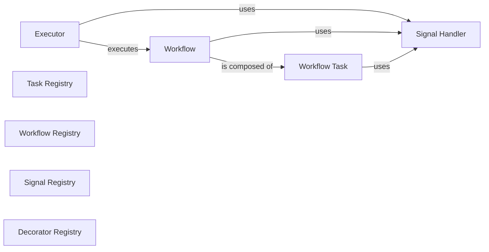

## Component Details

One paragraph explaining the functionality which is represented by this graph. What the main flow is and what is its purpose.

### Executor
The primary orchestrator that initiates, manages, and executes tasks and workflows. It dispatches tasks to appropriate handlers and oversees their lifecycle, leveraging a `Signal Handler` for inter-component communication.

**Related Classes/Methods**:

- <a href="https://github.com/lastmile-ai/mcp-agent/blob/master/src/mcp_agent/executor/executor.py#L51-L231" target="_blank" rel="noopener noreferrer">`mcp_agent.executor.executor:Executor` (51:231)</a>

### Task Registry
Manages the registration and retrieval of various tasks (activities) that can be executed. It acts as a central repository for task definitions, typically used by higher-level components to prepare tasks for execution.

**Related Classes/Methods**:

- <a href="https://github.com/lastmile-ai/mcp-agent/blob/master/src/mcp_agent/executor/task_registry.py#L1-L1" target="_blank" rel="noopener noreferrer">`mcp_agent.executor.task_registry:ActivityRegistry` (1:1)</a>

### Workflow Registry
Manages the registration and retrieval of defined workflow instances. It provides a central place to register, look up, and manage workflow instances, potentially across different execution backends.

**Related Classes/Methods**:

- <a href="https://github.com/lastmile-ai/mcp-agent/blob/master/src/mcp_agent/executor/workflow_registry.py#L19-L146" target="_blank" rel="noopener noreferrer">`mcp_agent.executor.workflow_registry:WorkflowRegistry` (19:146)</a>
- <a href="https://github.com/lastmile-ai/mcp-agent/blob/master/src/mcp_agent/executor/workflow_registry.py#L149-L263" target="_blank" rel="noopener noreferrer">`mcp_agent.executor.workflow_registry:InMemoryWorkflowRegistry` (149:263)</a>
- <a href="https://github.com/lastmile-ai/mcp-agent/blob/master/src/mcp_agent/executor/temporal/workflow_registry.py#L20-L248" target="_blank" rel="noopener noreferrer">`mcp_agent.executor.temporal.workflow_registry:TemporalWorkflowRegistry` (20:248)</a>

### Workflow
Represents a sequence of interconnected tasks designed to achieve a specific objective. It defines the flow and dependencies between individual tasks.

**Related Classes/Methods**:

- <a href="https://github.com/lastmile-ai/mcp-agent/blob/master/src/mcp_agent/executor/workflow.py#L61-L510" target="_blank" rel="noopener noreferrer">`mcp_agent.executor.workflow:Workflow` (61:510)</a>

### Workflow Task
Represents an individual step or unit of work within a larger workflow. It encapsulates the details of a specific task to be executed as part of a workflow.

**Related Classes/Methods**:

- <a href="https://github.com/lastmile-ai/mcp-agent/blob/master/src/mcp_agent/executor/workflow_task.py#L1-L1" target="_blank" rel="noopener noreferrer">`mcp_agent.executor.workflow_task:WorkflowTask` (1:1)</a>

### Signal Registry
A generic registry for callable functions that can act as signal handlers. It provides a mechanism to register and retrieve these handlers by name, separate from the active signal communication bus.

**Related Classes/Methods**:

- <a href="https://github.com/lastmile-ai/mcp-agent/blob/master/src/mcp_agent/executor/signal_registry.py#L3-L29" target="_blank" rel="noopener noreferrer">`mcp_agent.executor.signal_registry:SignalRegistry` (3:29)</a>

### Signal Handler
Provides the core mechanism for sending and waiting for signals within the execution environment. It defines the interface and concrete implementations for signal communication, allowing workflows and tasks to react to external events.

**Related Classes/Methods**:

- <a href="https://github.com/lastmile-ai/mcp-agent/blob/master/src/mcp_agent/executor/workflow_signal.py#L12-L47" target="_blank" rel="noopener noreferrer">`mcp_agent.executor.workflow_signal:Signal` (12:47)</a>
- <a href="https://github.com/lastmile-ai/mcp-agent/blob/master/src/mcp_agent/executor/workflow_signal.py#L61-L84" target="_blank" rel="noopener noreferrer">`mcp_agent.executor.workflow_signal:SignalHandler` (61:84)</a>
- <a href="https://github.com/lastmile-ai/mcp-agent/blob/master/src/mcp_agent/executor/workflow_signal.py#L97-L156" target="_blank" rel="noopener noreferrer">`mcp_agent.executor.workflow_signal:BaseSignalHandler` (97:156)</a>
- <a href="https://github.com/lastmile-ai/mcp-agent/blob/master/src/mcp_agent/executor/workflow_signal.py#L159-L215" target="_blank" rel="noopener noreferrer">`mcp_agent.executor.workflow_signal:ConsoleSignalHandler` (159:215)</a>
- <a href="https://github.com/lastmile-ai/mcp-agent/blob/master/src/mcp_agent/executor/temporal/workflow_signal.py#L73-L233" target="_blank" rel="noopener noreferrer">`mcp_agent.executor.temporal.workflow_signal:TemporalSignalHandler` (73:233)</a>
- <a href="https://github.com/lastmile-ai/mcp-agent/blob/master/src/mcp_agent/executor/temporal/workflow_signal.py#L25-L70" target="_blank" rel="noopener noreferrer">`mcp_agent.executor.temporal.workflow_signal:SignalMailbox` (25:70)</a>

### Decorator Registry
Manages the registration and retrieval of decorators that can modify or enhance the behavior of workflow definitions, workflow runs, workflow tasks, and workflow signals, typically based on the executor backend. These decorators are applied during the definition phase.

**Related Classes/Methods**:

- <a href="https://github.com/lastmile-ai/mcp-agent/blob/master/src/mcp_agent/executor/decorator_registry.py#L1-L1" target="_blank" rel="noopener noreferrer">`mcp_agent.executor.decorator_registry:DecoratorRegistry` (1:1)</a>

### [FAQ](https://github.com/CodeBoarding/GeneratedOnBoardings/tree/main?tab=readme-ov-file#faq)