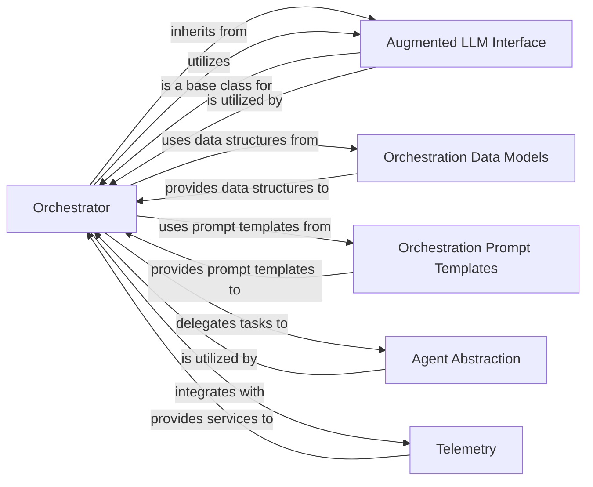

## Component Details

The High-Level Workflow Orchestration subsystem, centered around the Orchestrator class, is designed to manage and execute complex, multi-step tasks by dynamically planning, delegating, and synthesizing results from various intelligent agents. This component is crucial for handling scenarios where the exact sequence of operations cannot be predetermined, requiring adaptive decision-making and coordination.

### Orchestrator
The central control unit of the high-level workflow orchestration. The Orchestrator class is responsible for generating, executing, and managing multi-step plans. It dynamically breaks down complex tasks, delegates them to worker LLMs or agents, and synthesizes their results in a loop until the task is complete. It supports both "full" planning (generating the entire plan upfront) and "iterative" planning (planning the next step dynamically).

**Related Classes/Methods**:

- <a href="https://github.com/lastmile-ai/mcp-agent/blob/master/src/mcp_agent/workflows/orchestrator/orchestrator.py#L45-L585" target="_blank" rel="noopener noreferrer">`Orchestrator` (45:585)</a>

### Orchestration Data Models
This component defines the essential data structures that represent the state and flow of the orchestration process. These include PlanResult, Plan, StepResult, TaskWithResult, NextStep, Step, Task, ServerTask, and AgentTask. These models ensure a consistent and structured representation of the workflow's components and their outcomes, facilitating data exchange and processing within the orchestrator.

**Related Classes/Methods**:

- `Orchestration Data Models` (1:1)

### Orchestration Prompt Templates
This component houses the predefined prompt templates (FULL_PLAN_PROMPT_TEMPLATE, ITERATIVE_PLAN_PROMPT_TEMPLATE, SYNTHESIZE_PLAN_PROMPT_TEMPLATE, TASK_PROMPT_TEMPLATE, PLAN_RESULT_TEMPLATE, STEP_RESULT_TEMPLATE, TASK_RESULT_TEMPLATE) that guide the Orchestrator's interactions with underlying Language Models. These templates are crucial for instructing the LLMs on how to generate plans, define tasks, and synthesize results effectively.

**Related Classes/Methods**:

- `Orchestration Prompt Templates` (1:1)

### Augmented LLM Interface
Provides a standardized interface (AugmentedLLM) for interacting with Language Models. The Orchestrator itself inherits from this interface, and it also utilizes other AugmentedLLM instances for specialized roles like planning and synthesizing. It encapsulates common LLM interaction patterns, including request parameter handling and tracing annotation.

**Related Classes/Methods**:

- `AugmentedLLM` (1:1)

### Agent Abstraction
Represents an intelligent agent (Agent) within the system, capable of performing specific tasks or actions. These agents are the "workers" to whom the Orchestrator delegates subtasks, enabling the execution of the planned steps. The Orchestrator maintains a registry of these available agents.

**Related Classes/Methods**:

- <a href="https://github.com/lastmile-ai/mcp-agent/blob/master/src/mcp_agent/agents/agent.py#L56-L928" target="_blank" rel="noopener noreferrer">`Agent` (56:928)</a>

### Telemetry
This component provides tracing and observability capabilities for the entire workflow, primarily through the get_tracer function. It allows for the monitoring and debugging of the orchestration process, including LLM interactions, plan generation, and task execution, by instrumenting the code with spans and attributes.

**Related Classes/Methods**:

- `get_tracer` (1:1)

### [FAQ](https://github.com/CodeBoarding/GeneratedOnBoardings/tree/main?tab=readme-ov-file#faq)